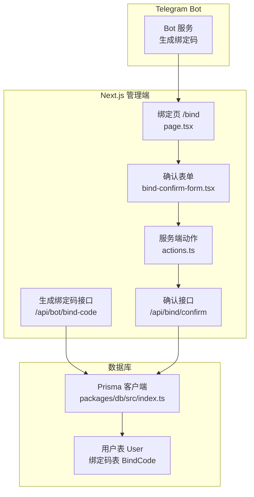
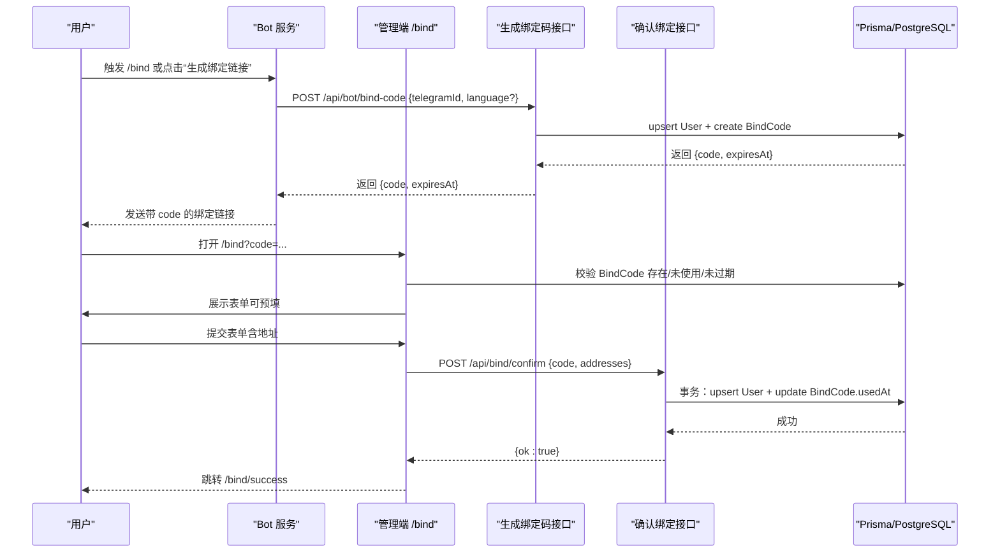
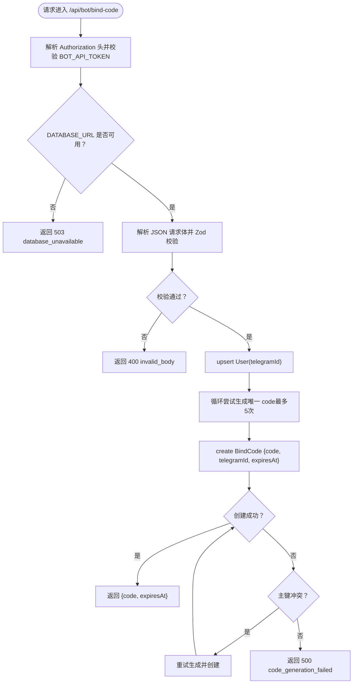
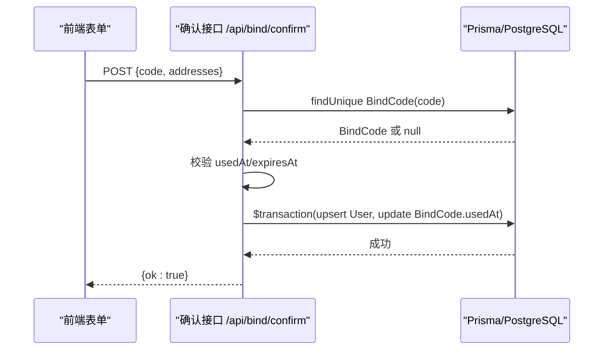
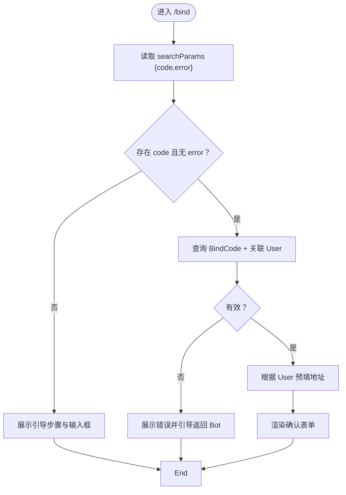
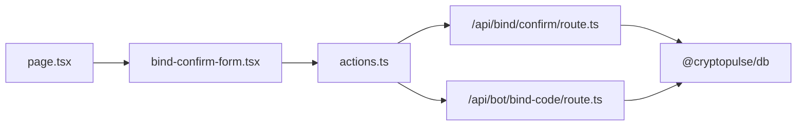

# 用户绑定系统

<cite>
**本文引用的文件**
- [apps/admin/app/api/bot/bind-code/route.ts](file://apps/admin/app/api/bot/bind-code/route.ts)
- [apps/admin/app/api/bind/confirm/route.ts](file://apps/admin/app/api/bind/confirm/route.ts)
- [apps/admin/app/bind/actions.ts](file://apps/admin/app/bind/actions.ts)
- [apps/admin/app/bind/page.tsx](file://apps/admin/app/bind/page.tsx)
- [apps/admin/app/bind/bind-confirm-form.tsx](file://apps/admin/app/bind/bind-confirm-form.tsx)
- [apps/admin/app/bind/success/page.tsx](file://apps/admin/app/bind/success/page.tsx)
- [packages/db/src/index.ts](file://packages/db/src/index.ts)
- [apps/admin/e2e/bind.e2e.spec.ts](file://apps/admin/e2e/bind.e2e.spec.ts)
- [test/bind-code.test.ts](file://test/bind-code.test.ts)
- [test/bind-confirm.test.ts](file://test/bind-confirm.test.ts)
- [README.md](file://README.md)
</cite>

## 目录
1. [简介](#简介)
2. [项目结构](#项目结构)
3. [核心组件](#核心组件)
4. [架构总览](#架构总览)
5. [详细组件分析](#详细组件分析)
6. [依赖关系分析](#依赖关系分析)
7. [性能考量](#性能考量)
8. [故障排查指南](#故障排查指南)
9. [结论](#结论)
10. [附录](#附录)

## 简介
本文件为用户绑定系统的完整技术文档，覆盖绑定码生成机制、绑定确认流程与安全验证机制，详解绑定 API 的实现细节（包括绑定码生命周期管理、地址验证规则与用户记录创建）、绑定页面前端实现（表单验证、用户交互与错误处理）、绑定流程全生命周期、配置项与返回值格式、错误处理策略与安全最佳实践，并提供可复用的使用场景与示例路径。

## 项目结构
绑定系统由“Bot 侧生成绑定码”和“管理端绑定页确认绑定”两部分组成，前后端通过 REST API 协作，数据持久化使用 Prisma + PostgreSQL。

图表来源
- [apps/admin/app/bind/page.tsx](file://apps/admin/app/bind/page.tsx#L30-L125)
- [apps/admin/app/bind/bind-confirm-form.tsx](file://apps/admin/app/bind/bind-confirm-form.tsx#L18-L170)
- [apps/admin/app/bind/actions.ts](file://apps/admin/app/bind/actions.ts#L21-L88)
- [apps/admin/app/api/bind/confirm/route.ts](file://apps/admin/app/api/bind/confirm/route.ts#L21-L89)
- [apps/admin/app/api/bot/bind-code/route.ts](file://apps/admin/app/api/bot/bind-code/route.ts#L34-L103)
- [packages/db/src/index.ts](file://packages/db/src/index.ts#L1-L13)

章节来源
- [README.md](file://README.md#L59-L65)

## 核心组件
- 绑定码生成接口：由 Bot 侧调用，生成唯一绑定码并写入数据库，设置过期时间。
- 绑定确认接口：接收绑定码与钱包地址，校验状态后原子性更新用户记录并标记绑定码已使用。
- 绑定页前端：展示引导步骤、表单、实时校验与错误提示，支持复制绑定码与高级地址（Safe/Funder）。
- 服务端动作：在客户端提交表单时进行服务端校验与事务处理，失败时重定向并携带错误参数。
- 数据层：统一通过 Prisma 访问 PostgreSQL，确保一致性与可维护性。

章节来源
- [apps/admin/app/api/bot/bind-code/route.ts](file://apps/admin/app/api/bot/bind-code/route.ts#L34-L103)
- [apps/admin/app/api/bind/confirm/route.ts](file://apps/admin/app/api/bind/confirm/route.ts#L21-L89)
- [apps/admin/app/bind/actions.ts](file://apps/admin/app/bind/actions.ts#L21-L88)
- [apps/admin/app/bind/page.tsx](file://apps/admin/app/bind/page.tsx#L30-L125)
- [apps/admin/app/bind/bind-confirm-form.tsx](file://apps/admin/app/bind/bind-confirm-form.tsx#L18-L170)
- [packages/db/src/index.ts](file://packages/db/src/index.ts#L1-L13)

## 架构总览
下图展示从 Bot 生成绑定码到用户在管理端完成绑定的端到端流程。

图表来源
- [apps/admin/app/api/bot/bind-code/route.ts](file://apps/admin/app/api/bot/bind-code/route.ts#L34-L103)
- [apps/admin/app/bind/page.tsx](file://apps/admin/app/bind/page.tsx#L39-L66)
- [apps/admin/app/bind/bind-confirm-form.tsx](file://apps/admin/app/bind/bind-confirm-form.tsx#L66-L169)
- [apps/admin/app/bind/actions.ts](file://apps/admin/app/bind/actions.ts#L21-L88)
- [apps/admin/app/api/bind/confirm/route.ts](file://apps/admin/app/api/bind/confirm/route.ts#L21-L89)

## 详细组件分析

### 绑定码生成机制
- 接口路径：/api/bot/bind-code
- 请求体字段
  - telegramId: 正整数，用户标识
  - language: 可选，语言偏好
- 安全与鉴权
  - 支持 Bearer Token 鉴权，若未配置 BOT_API_TOKEN 且处于生产环境则拒绝请求
- 绑定码生成
  - 使用安全随机源生成长度为 10 的验证码（字母数字，剔除易混淆字符）
  - 有效期：当前时间 + 10 分钟
  - 写入 BindCode 表，若主键冲突最多重试 5 次
- 返回值
  - 200：{ code, expiresAt }
  - 400：invalid_json 或 invalid_body
  - 401：unauthorized
  - 500：server_error 或 code_generation_failed
  - 503：database_unavailable 或 prisma_unavailable

图表来源
- [apps/admin/app/api/bot/bind-code/route.ts](file://apps/admin/app/api/bot/bind-code/route.ts#L34-L103)

章节来源
- [apps/admin/app/api/bot/bind-code/route.ts](file://apps/admin/app/api/bot/bind-code/route.ts#L7-L103)
- [test/bind-code.test.ts](file://test/bind-code.test.ts#L27-L86)

### 绑定确认流程与安全验证
- 接口路径：/api/bind/confirm
- 请求体字段
  - code: 必填，绑定码
  - polymarketAddress: 可选，以 0x 开头的 42 字符十六进制地址（EOA）
  - safeAddress: 可选，同上（Safe）
  - funderAddress: 可选，同上（Funder）
- 安全与校验
  - 校验 DATABASE_URL 与 Prisma 就绪
  - Zod 校验请求体
  - 查询 BindCode：存在性、未使用、未过期
  - 事务：同时 upsert User 与 update BindCode.usedAt
- 返回值
  - 200：{ ok: true }
  - 400：invalid_json、invalid_body
  - 404：code_not_found
  - 409：code_used
  - 410：code_expired
  - 500：server_error

图表来源
- [apps/admin/app/api/bind/confirm/route.ts](file://apps/admin/app/api/bind/confirm/route.ts#L21-L89)

章节来源
- [apps/admin/app/api/bind/confirm/route.ts](file://apps/admin/app/api/bind/confirm/route.ts#L14-L89)
- [test/bind-confirm.test.ts](file://test/bind-confirm.test.ts#L33-L83)

### 绑定页面前端实现
- 页面逻辑
  - 读取 URL 参数 code 与 error，进行基础校验与错误文案映射
  - 若有 code 且无错误：查询 BindCode 并根据用户是否存在预填地址
  - 无 code：展示引导步骤与输入框，支持手动输入绑定码
- 表单验证
  - 实时校验地址格式（0x 开头 + 40 位十六进制），支持留空
  - 错误高亮与提示文案
  - 高级选项折叠显示 Safe/Funder 地址
- 用户交互
  - 复制绑定码按钮
  - 提交按钮禁用态（存在错误或正在提交）
  - 提交后跳转成功页
- 错误处理
  - 友好错误提示与引导返回 Bot

图表来源
- [apps/admin/app/bind/page.tsx](file://apps/admin/app/bind/page.tsx#L30-L125)
- [apps/admin/app/bind/bind-confirm-form.tsx](file://apps/admin/app/bind/bind-confirm-form.tsx#L18-L170)

章节来源
- [apps/admin/app/bind/page.tsx](file://apps/admin/app/bind/page.tsx#L9-L28)
- [apps/admin/app/bind/bind-confirm-form.tsx](file://apps/admin/app/bind/bind-confirm-form.tsx#L39-L53)

### 服务端动作（Server Action）
- 作用
  - 在客户端提交表单时进行服务端校验与事务处理
  - 失败时重定向并携带错误参数，保持用户体验一致
- 校验与流程
  - Zod 校验表单数据
  - 查询 BindCode 并校验状态
  - 事务更新用户与绑定码
  - 成功后重定向至成功页

章节来源
- [apps/admin/app/bind/actions.ts](file://apps/admin/app/bind/actions.ts#L14-L88)

### 绑定成功页
- 展示成功提示与下一步操作指引
- 提供返回 Bot 与首页的快捷入口

章节来源
- [apps/admin/app/bind/success/page.tsx](file://apps/admin/app/bind/success/page.tsx#L5-L35)

## 依赖关系分析
- 组件耦合
  - 绑定页与确认表单为 UI 层，依赖服务端动作与 API
  - 服务端动作与 API 共享校验与事务逻辑，降低重复
  - 数据访问集中于 Prisma 客户端，避免跨模块分散
- 外部依赖
  - Next.js 路由与 Server Actions
  - Zod 进行请求体与地址格式校验
  - Prisma/PostgreSQL 作为数据存储

图表来源
- [apps/admin/app/bind/page.tsx](file://apps/admin/app/bind/page.tsx#L1-L7)
- [apps/admin/app/bind/bind-confirm-form.tsx](file://apps/admin/app/bind/bind-confirm-form.tsx#L1-L8)
- [apps/admin/app/bind/actions.ts](file://apps/admin/app/bind/actions.ts#L1-L5)
- [apps/admin/app/api/bind/confirm/route.ts](file://apps/admin/app/api/bind/confirm/route.ts#L1-L5)
- [apps/admin/app/api/bot/bind-code/route.ts](file://apps/admin/app/api/bot/bind-code/route.ts#L1-L5)
- [packages/db/src/index.ts](file://packages/db/src/index.ts#L1-L13)

## 性能考量
- 绑定码生成
  - 随机生成采用安全随机源，冲突概率低；最多 5 次重试，避免无限循环
- 绑定确认
  - 使用数据库事务保证用户记录与绑定码状态的一致性，减少竞态
- 校验与查询
  - 请求体与地址格式在服务端与前端双重校验，减少无效请求
- 数据访问
  - 通过全局 Prisma 客户端访问，避免重复实例化带来的资源浪费

## 故障排查指南
- 常见错误与定位
  - invalid_json/invalid_body：检查请求体格式与必填字段
  - unauthorized：确认 Authorization 头与 BOT_API_TOKEN 配置
  - database_unavailable/prisma_unavailable：检查 DATABASE_URL 与 Prisma 初始化
  - code_not_found/code_used/code_expired：核对绑定码状态与过期时间
  - server_error：查看服务端日志与数据库连接
- 前端错误提示
  - 页面根据 URL 参数显示对应错误文案，便于快速定位问题
- 测试参考
  - E2E 与单元测试覆盖了典型场景与边界条件，可作为排障对照

章节来源
- [apps/admin/app/bind/page.tsx](file://apps/admin/app/bind/page.tsx#L9-L28)
- [apps/admin/e2e/bind.e2e.spec.ts](file://apps/admin/e2e/bind.e2e.spec.ts#L12-L72)
- [test/bind-code.test.ts](file://test/bind-code.test.ts#L27-L86)
- [test/bind-confirm.test.ts](file://test/bind-confirm.test.ts#L33-L110)

## 结论
该绑定系统通过 Bot 生成绑定码、管理端确认绑定的方式，实现了安全、可追溯的用户身份绑定流程。系统在接口层面严格校验、在事务层面保证一致性，并在前端提供友好的交互与错误提示。配合完善的测试与错误处理策略，具备良好的可维护性与扩展性。

## 附录

### 绑定码生命周期管理
- 生成：Bot 调用 /api/bot/bind-code 创建 BindCode，有效期 10 分钟
- 使用：用户在管理端提交 /api/bind/confirm 完成绑定，标记 usedAt
- 过期：超过有效期视为不可用
- 重复使用：已使用的绑定码禁止再次使用

章节来源
- [apps/admin/app/api/bot/bind-code/route.ts](file://apps/admin/app/api/bot/bind-code/route.ts#L81-L97)
- [apps/admin/app/api/bind/confirm/route.ts](file://apps/admin/app/api/bind/confirm/route.ts#L48-L62)

### 地址验证规则
- 格式：0x 开头 + 40 位十六进制字符（EOA/Safe/Funder）
- 可选：允许留空，表示解绑当前账户
- 前端即时校验与服务端二次校验

章节来源
- [apps/admin/app/bind/bind-confirm-form.tsx](file://apps/admin/app/bind/bind-confirm-form.tsx#L46-L52)
- [apps/admin/app/bind/actions.ts](file://apps/admin/app/bind/actions.ts#L7-L12)
- [apps/admin/app/api/bind/confirm/route.ts](file://apps/admin/app/api/bind/confirm/route.ts#L7-L12)

### 用户记录创建与更新
- 首次绑定：upsert User 创建记录（telegramId + language）
- 更新绑定：upsert User 更新钱包地址字段
- 解绑：提交空地址将清空对应字段

章节来源
- [apps/admin/app/api/bot/bind-code/route.ts](file://apps/admin/app/api/bot/bind-code/route.ts#L72-L79)
- [apps/admin/app/api/bind/confirm/route.ts](file://apps/admin/app/api/bind/confirm/route.ts#L64-L78)

### 绑定流程完整生命周期
- Bot 生成绑定码并下发给用户
- 用户打开绑定页，自动校验绑定码状态
- 用户填写地址并提交
- 服务端校验与事务更新，标记绑定码已使用
- 跳转成功页并提示下一步

章节来源
- [README.md](file://README.md#L59-L65)
- [apps/admin/app/bind/page.tsx](file://apps/admin/app/bind/page.tsx#L39-L66)
- [apps/admin/app/bind/bind-confirm-form.tsx](file://apps/admin/app/bind/bind-confirm-form.tsx#L66-L169)
- [apps/admin/app/bind/actions.ts](file://apps/admin/app/bind/actions.ts#L21-L88)
- [apps/admin/app/bind/success/page.tsx](file://apps/admin/app/bind/success/page.tsx#L5-L35)

### 配置选项与环境变量
- DATABASE_URL：数据库连接字符串
- BOT_API_TOKEN：Bot 侧绑定码生成接口的 Bearer Token
- NEXT_PUBLIC_BOT_USERNAME：Bot 用户名，用于页面中的快捷链接
- NODE_ENV：生产环境校验令牌是否必需

章节来源
- [apps/admin/app/api/bot/bind-code/route.ts](file://apps/admin/app/api/bot/bind-code/route.ts#L35-L44)
- [apps/admin/app/bind/success/page.tsx](file://apps/admin/app/bind/success/page.tsx#L6-L7)

### 返回值格式
- /api/bot/bind-code
  - 成功：{ code, expiresAt }
  - 失败：{ error: "invalid_json"|"invalid_body"|"unauthorized"|"database_unavailable"|"prisma_unavailable"|"code_generation_failed"|"server_error" }
- /api/bind/confirm
  - 成功：{ ok: true }
  - 失败：{ error: "invalid_json"|"invalid_body"|"code_not_found"|"code_used"|"code_expired"|"server_error" }

章节来源
- [apps/admin/app/api/bot/bind-code/route.ts](file://apps/admin/app/api/bot/bind-code/route.ts#L54-L102)
- [apps/admin/app/api/bind/confirm/route.ts](file://apps/admin/app/api/bind/confirm/route.ts#L37-L88)

### 使用场景示例
- 场景一：Bot 生成绑定码并下发
  - 调用 /api/bot/bind-code，得到 { code, expiresAt }
- 场景二：用户在绑定页提交地址
  - 前端表单填写地址并提交
  - 服务端动作或 API 校验并更新用户记录
- 场景三：绑定成功后的后续操作
  - 用户返回 Bot，发送 /start 或 /bind 刷新菜单

章节来源
- [apps/admin/app/api/bot/bind-code/route.ts](file://apps/admin/app/api/bot/bind-code/route.ts#L93-L93)
- [apps/admin/app/bind/success/page.tsx](file://apps/admin/app/bind/success/page.tsx#L18-L23)