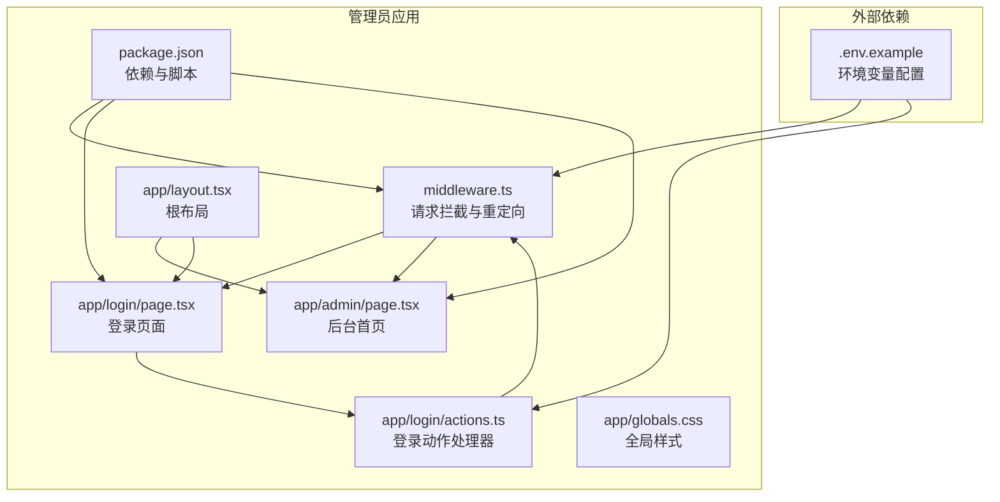
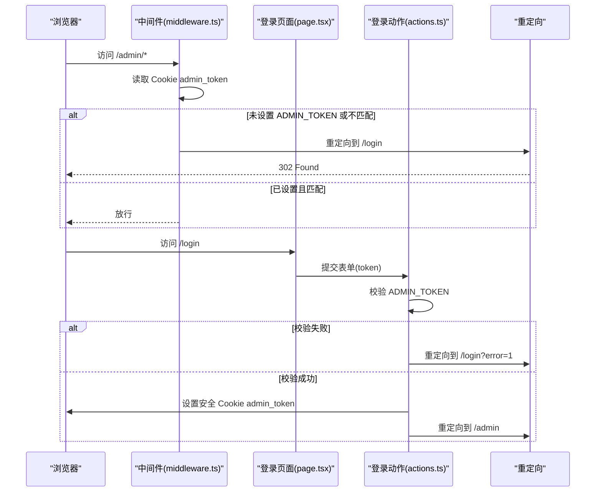
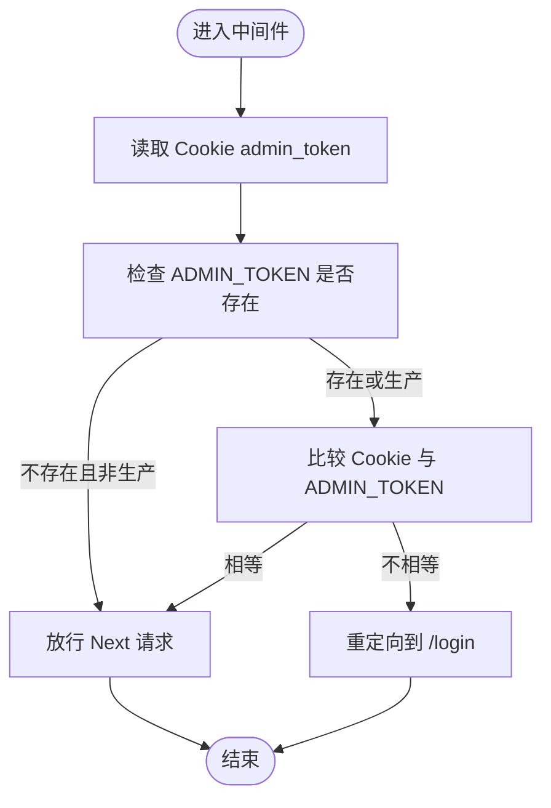
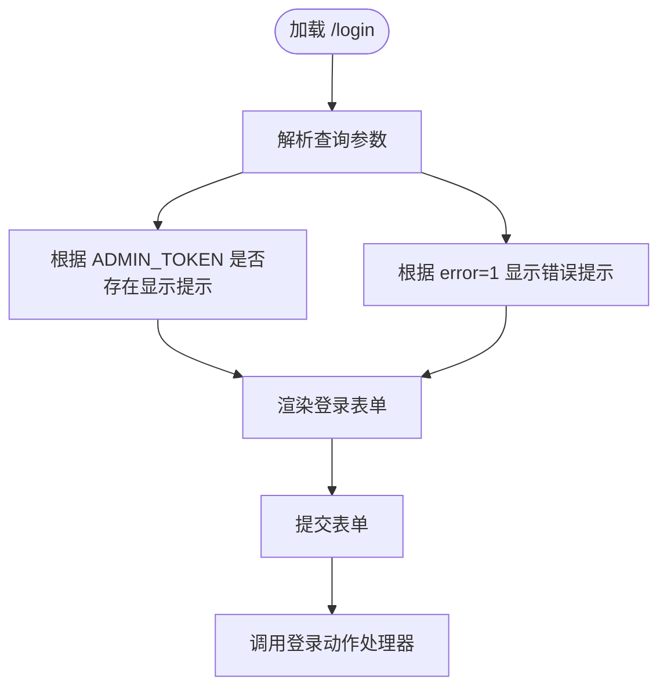
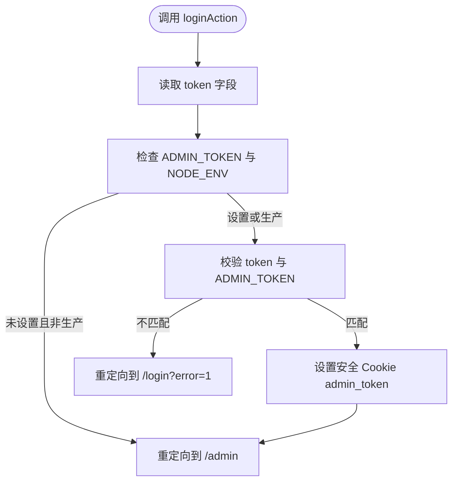
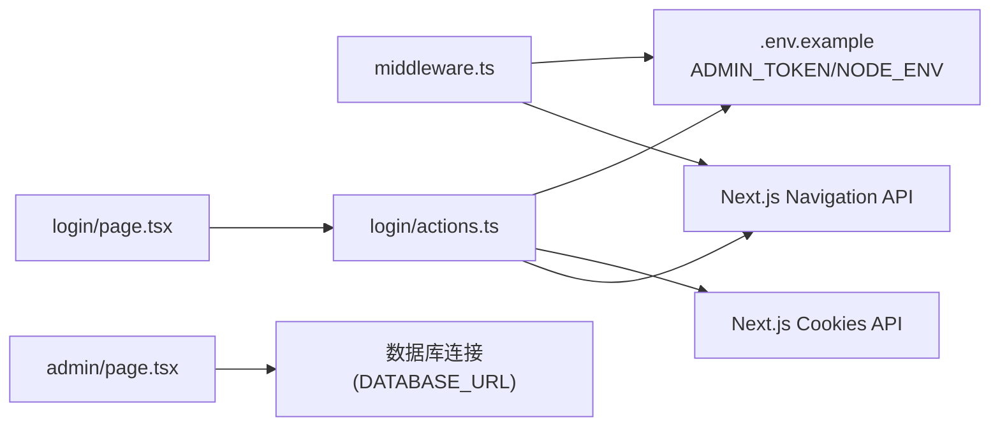

# 用户认证系统

<cite>
**本文档引用的文件**
- [apps/admin/middleware.ts](file://apps/admin/middleware.ts)
- [apps/admin/app/login/actions.ts](file://apps/admin/app/login/actions.ts)
- [apps/admin/app/login/page.tsx](file://apps/admin/app/login/page.tsx)
- [apps/admin/app/admin/page.tsx](file://apps/admin/app/admin/page.tsx)
- [apps/admin/app/layout.tsx](file://apps/admin/app/layout.tsx)
- [apps/admin/app/globals.css](file://apps/admin/app/globals.css)
- [apps/admin/package.json](file://apps/admin/package.json)
- [.env.example](file://.env.example)
</cite>

## 目录
1. [简介](#简介)
2. [项目结构](#项目结构)
3. [核心组件](#核心组件)
4. [架构总览](#架构总览)
5. [详细组件分析](#详细组件分析)
6. [依赖关系分析](#依赖关系分析)
7. [性能考量](#性能考量)
8. [故障排除指南](#故障排除指南)
9. [结论](#结论)
10. [附录](#附录)

## 简介
本文件为用户认证系统的详细技术文档，聚焦于管理员登录认证机制，涵盖身份验证流程、会话管理、权限控制、前端登录页面实现、中间件认证逻辑、认证状态维护、配置选项及安全最佳实践。该系统采用基于环境变量的静态令牌认证模式，通过 Next.js 中间件进行请求拦截与重定向，使用 Cookie 存储会话令牌，并在生产环境强制启用安全传输。

## 项目结构
管理员认证相关的核心文件集中在 `apps/admin` 应用中，主要由以下模块组成：
- 中间件：负责拦截受保护路径并校验会话令牌
- 登录页面：提供管理员登录入口，包含表单与错误提示
- 登录动作处理器：接收表单数据，验证令牌并写入安全 Cookie
- 后台首页：受保护内容的入口页面
- 根布局与样式：全局样式与页面元数据
- 环境配置：包含 ADMIN_TOKEN、NODE_ENV 等关键配置项

**图表来源**
- [apps/admin/middleware.ts](file://apps/admin/middleware.ts#L1-L22)
- [apps/admin/app/login/page.tsx](file://apps/admin/app/login/page.tsx#L1-L43)
- [apps/admin/app/login/actions.ts](file://apps/admin/app/login/actions.ts#L1-L28)
- [apps/admin/app/admin/page.tsx](file://apps/admin/app/admin/page.tsx#L1-L47)
- [apps/admin/app/layout.tsx](file://apps/admin/app/layout.tsx#L1-L24)
- [apps/admin/app/globals.css](file://apps/admin/app/globals.css#L1-L5)
- [apps/admin/package.json](file://apps/admin/package.json#L1-L42)
- [.env.example](file://.env.example#L1-L43)

**章节来源**
- [apps/admin/middleware.ts](file://apps/admin/middleware.ts#L1-L22)
- [apps/admin/app/login/actions.ts](file://apps/admin/app/login/actions.ts#L1-L28)
- [apps/admin/app/login/page.tsx](file://apps/admin/app/login/page.tsx#L1-L43)
- [apps/admin/app/admin/page.tsx](file://apps/admin/app/admin/page.tsx#L1-L47)
- [apps/admin/app/layout.tsx](file://apps/admin/app/layout.tsx#L1-L24)
- [apps/admin/app/globals.css](file://apps/admin/app/globals.css#L1-L5)
- [apps/admin/package.json](file://apps/admin/package.json#L1-L42)
- [.env.example](file://.env.example#L1-L43)

## 核心组件
- 中间件认证：读取请求中的 Cookie 并与环境变量 ADMIN_TOKEN 比较，若不匹配则重定向至登录页；开发环境且未设置 ADMIN_TOKEN 时放行
- 登录页面：渲染登录表单，显示环境提示与错误信息，提交至登录动作处理器
- 登录动作处理器：从表单获取令牌，与 ADMIN_TOKEN 对比，成功则设置安全 Cookie 并重定向至后台首页
- 受保护页面：后台首页仅在通过中间件认证后可见
- 全局布局与样式：统一页面基础样式与元数据

**章节来源**
- [apps/admin/middleware.ts](file://apps/admin/middleware.ts#L3-L17)
- [apps/admin/app/login/actions.ts](file://apps/admin/app/login/actions.ts#L6-L27)
- [apps/admin/app/login/page.tsx](file://apps/admin/app/login/page.tsx#L6-L42)
- [apps/admin/app/admin/page.tsx](file://apps/admin/app/admin/page.tsx#L1-L47)
- [apps/admin/app/layout.tsx](file://apps/admin/app/layout.tsx#L10-L22)

## 架构总览
下图展示了管理员登录认证的整体流程：客户端访问受保护路径触发中间件，若缺少有效令牌则被重定向到登录页；管理员提交登录表单后，服务端验证令牌并将令牌写入安全 Cookie，随后重定向到后台首页。

**图表来源**
- [apps/admin/middleware.ts](file://apps/admin/middleware.ts#L3-L17)
- [apps/admin/app/login/page.tsx](file://apps/admin/app/login/page.tsx#L6-L42)
- [apps/admin/app/login/actions.ts](file://apps/admin/app/login/actions.ts#L6-L27)

## 详细组件分析

### 中间件认证逻辑
- 功能职责：拦截所有以 `/admin` 开头的请求，读取 Cookie 中的 `admin_token`，并与环境变量 `ADMIN_TOKEN` 比较
- 特殊处理：当未设置 `ADMIN_TOKEN` 且运行环境非生产时，放行所有请求；否则若令牌缺失或不匹配，重定向到 `/login`
- 匹配规则：仅对 `/admin/:path*` 生效

**图表来源**
- [apps/admin/middleware.ts](file://apps/admin/middleware.ts#L3-L17)

**章节来源**
- [apps/admin/middleware.ts](file://apps/admin/middleware.ts#L3-L17)

### 登录页面前端实现
- 页面结构：标题、提示信息、错误提示区域与登录表单
- 错误处理：根据查询参数 `error=1` 显示“口令不正确”的错误提示
- 环境提示：当未设置 `ADMIN_TOKEN` 时，在开发环境下提示可直接访问后台
- 表单行为：使用 `action` 指向登录动作处理器，输入类型为密码，提交后触发服务端逻辑

**图表来源**
- [apps/admin/app/login/page.tsx](file://apps/admin/app/login/page.tsx#L6-L42)

**章节来源**
- [apps/admin/app/login/page.tsx](file://apps/admin/app/login/page.tsx#L6-L42)

### 登录动作处理器
- 输入处理：从表单数据中提取 `token` 字段
- 环境判断：若未设置 `ADMIN_TOKEN` 且运行环境非生产，则直接重定向到 `/admin`
- 令牌校验：若 `ADMIN_TOKEN` 不存在或与提交的 `token` 不一致，则重定向到 `/login?error=1`
- 会话写入：成功后通过 `cookies()` 设置名为 `admin_token` 的 Cookie，属性包括：
  - httpOnly：防止 XSS
  - sameSite：限制跨站请求携带 Cookie
  - path：作用域为根路径
  - secure：仅在生产环境启用 HTTPS 传输
- 成功后重定向到 `/admin`

**图表来源**
- [apps/admin/app/login/actions.ts](file://apps/admin/app/login/actions.ts#L6-L27)

**章节来源**
- [apps/admin/app/login/actions.ts](file://apps/admin/app/login/actions.ts#L6-L27)

### 受保护页面（后台首页）
- 内容：展示用户统计与黑名单统计（在数据库可用时）
- 访问条件：仅在通过中间件认证后可见
- 数据源：按需导入数据库客户端，统计用户数量与黑名单数量

**章节来源**
- [apps/admin/app/admin/page.tsx](file://apps/admin/app/admin/page.tsx#L1-L47)

### 根布局与样式
- 布局：定义页面元数据与根 HTML 结构
- 样式：引入 Tailwind CSS 基础、组件与工具类样式

**章节来源**
- [apps/admin/app/layout.tsx](file://apps/admin/app/layout.tsx#L5-L22)
- [apps/admin/app/globals.css](file://apps/admin/app/globals.css#L1-L5)

## 依赖关系分析
- 运行时依赖：Next.js、React、Tailwind CSS、Zod（用于其他功能，此处不涉及）
- 关键外部接口：
  - Next.js Cookies API：用于读取与设置 Cookie
  - Next.js Navigation API：用于服务端重定向
  - Next.js Middleware API：用于请求拦截与重定向
- 环境变量：
  - ADMIN_TOKEN：管理员令牌
  - NODE_ENV：运行环境，影响是否强制令牌校验
  - DATABASE_URL：数据库连接（与认证无直接关系，但影响后台页面数据）

**图表来源**
- [apps/admin/middleware.ts](file://apps/admin/middleware.ts#L3-L17)
- [apps/admin/app/login/actions.ts](file://apps/admin/app/login/actions.ts#L3-L4)
- [apps/admin/app/login/page.tsx](file://apps/admin/app/login/page.tsx#L1-L2)
- [apps/admin/app/admin/page.tsx](file://apps/admin/app/admin/page.tsx#L5-L14)
- [.env.example](file://.env.example#L15-L16)

**章节来源**
- [apps/admin/package.json](file://apps/admin/package.json#L13-L25)
- [apps/admin/middleware.ts](file://apps/admin/middleware.ts#L3-L17)
- [apps/admin/app/login/actions.ts](file://apps/admin/app/login/actions.ts#L3-L4)
- [apps/admin/app/login/page.tsx](file://apps/admin/app/login/page.tsx#L1-L2)
- [apps/admin/app/admin/page.tsx](file://apps/admin/app/admin/page.tsx#L5-L14)
- [.env.example](file://.env.example#L15-L16)

## 性能考量
- 中间件开销：每次访问 `/admin/*` 均需读取 Cookie 并进行字符串比较，属于常量时间操作，开销极低
- 登录动作：仅在首次登录时写入 Cookie，后续请求由中间件快速判断
- 重定向：服务端重定向为轻量级操作，不会产生额外数据库或网络开销
- 建议：避免在中间件中执行复杂逻辑；保持令牌长度适中，减少比较成本

## 故障排除指南
- 登录后仍被重定向到登录页
  - 检查是否设置了 `ADMIN_TOKEN`
  - 确认 Cookie 是否正确写入且未被浏览器阻止
  - 在生产环境确保使用 HTTPS，以便 Cookie 的 `secure` 属性生效
- 开发环境下无法访问后台
  - 若未设置 `ADMIN_TOKEN`，系统会在非生产环境放行；若设置了但不匹配，仍会被重定向
- 登录失败提示“口令不正确”
  - 确认提交的令牌与 `ADMIN_TOKEN` 完全一致（区分大小写）
- 页面样式异常
  - 确认 Tailwind CSS 已正确构建与引入

**章节来源**
- [apps/admin/middleware.ts](file://apps/admin/middleware.ts#L7-L14)
- [apps/admin/app/login/actions.ts](file://apps/admin/app/login/actions.ts#L10-L16)
- [apps/admin/app/login/page.tsx](file://apps/admin/app/login/page.tsx#L22-L32)

## 结论
该认证系统采用简洁可靠的静态令牌机制：通过中间件统一拦截与校验，结合服务端动作处理器完成登录与会话写入。其设计具备良好的可维护性与安全性（如 Cookie 安全属性），适合单管理员场景。对于更复杂的多用户、多角色需求，建议扩展为基于会话或 JWT 的标准认证方案。

## 附录

### 配置选项说明
- ADMIN_TOKEN
  - 类型：字符串
  - 用途：管理员登录令牌
  - 默认值：未设置
  - 影响：未设置时在非生产环境放行；设置后必须匹配才可通过中间件
- NODE_ENV
  - 类型：字符串
  - 用途：运行环境标识
  - 默认值：development
  - 影响：生产环境强制令牌校验，开发环境可放行
- DATABASE_URL
  - 类型：字符串
  - 用途：数据库连接字符串
  - 默认值：未设置
  - 影响：后台页面数据统计依赖此配置

**章节来源**
- [.env.example](file://.env.example#L2-L16)
- [apps/admin/middleware.ts](file://apps/admin/middleware.ts#L7-L14)
- [apps/admin/app/login/actions.ts](file://apps/admin/app/login/actions.ts#L10-L12)
- [apps/admin/app/admin/page.tsx](file://apps/admin/app/admin/page.tsx#L5-L14)

### 安全最佳实践
- 强制生产环境使用 HTTPS，确保 Cookie 的 `secure` 属性生效
- 使用强随机令牌并定期轮换
- 限制 Cookie 的 `sameSite` 与 `httpOnly` 属性，降低 CSRF 与 XSS 风险
- 在生产环境始终设置 `ADMIN_TOKEN`，避免意外放行
- 对敏感路由增加速率限制与日志审计