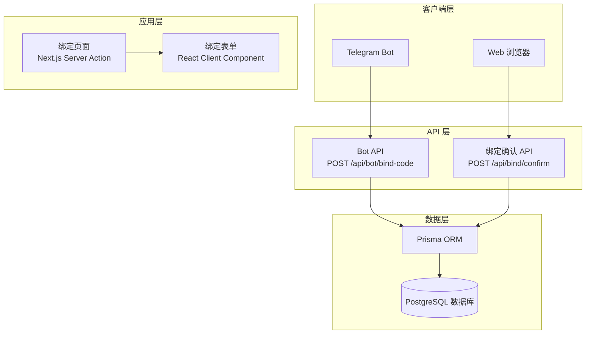
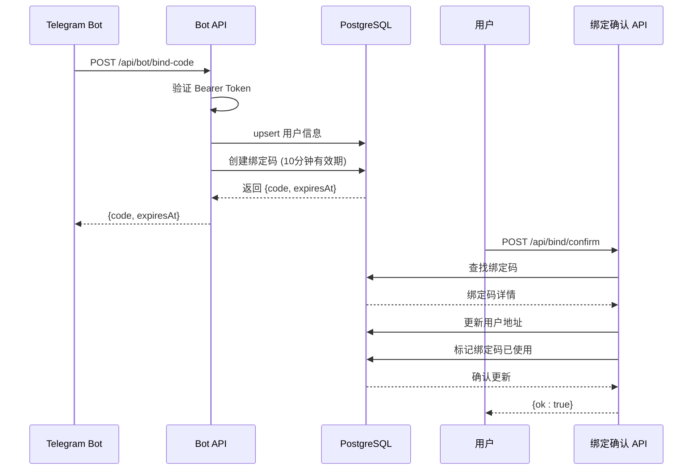
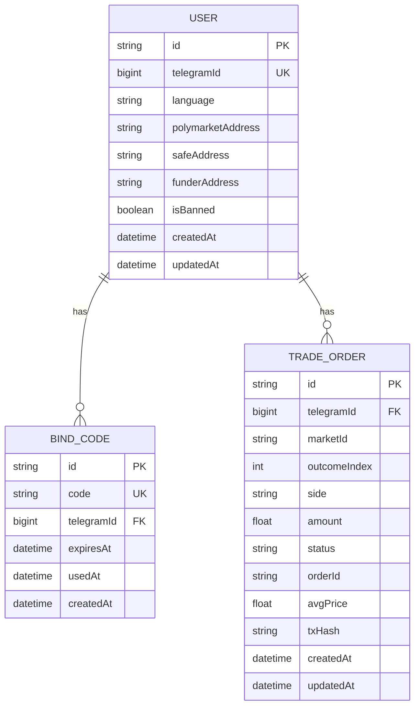
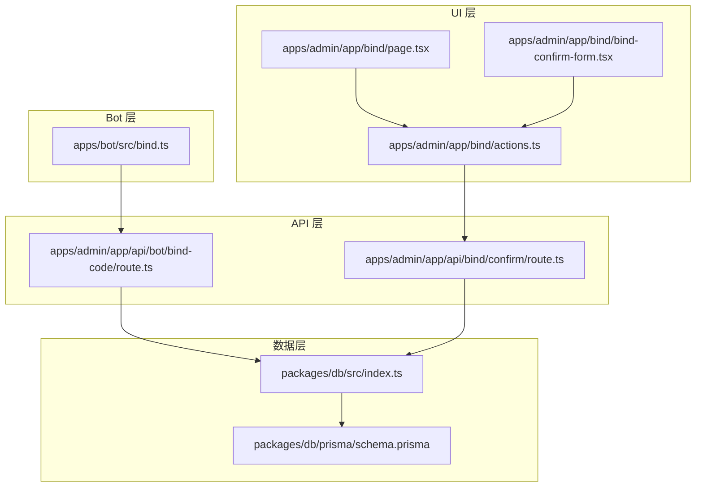

# 绑定 API 参考

<cite>
**本文档引用的文件**
- [apps/admin/app/api/bind/confirm/route.ts](file://apps/admin/app/api/bind/confirm/route.ts)
- [apps/admin/app/api/bot/bind-code/route.ts](file://apps/admin/app/api/bot/bind-code/route.ts)
- [apps/admin/app/bind/actions.ts](file://apps/admin/app/bind/actions.ts)
- [apps/admin/app/bind/page.tsx](file://apps/admin/app/bind/page.tsx)
- [apps/admin/app/bind/bind-confirm-form.tsx](file://apps/admin/app/bind/bind-confirm-form.tsx)
- [apps/bot/src/bind.ts](file://apps/bot/src/bind.ts)
- [packages/db/prisma/schema.prisma](file://packages/db/prisma/schema.prisma)
- [packages/db/src/index.ts](file://packages/db/src/index.ts)
- [test/bind-confirm.test.ts](file://test/bind-confirm.test.ts)
- [test/bind-code.test.ts](file://test/bind-code.test.ts)
- [.env.example](file://.env.example)
</cite>

## 目录
1. [简介](#简介)
2. [项目结构](#项目结构)
3. [核心组件](#核心组件)
4. [架构概览](#架构概览)
5. [详细组件分析](#详细组件分析)
6. [依赖关系分析](#依赖关系分析)
7. [性能考虑](#性能考虑)
8. [故障排除指南](#故障排除指南)
9. [结论](#结论)
10. [附录](#附录)

## 简介
本文档提供了 Polymarket CryptoPulse 绑定系统的完整 API 参考文档。该系统允许用户通过 Telegram Bot 生成绑定码，然后在 Web 界面中完成账户绑定过程。系统支持多种钱包地址绑定，包括 Polymarket EOA 地址、Safe 地址和 Funder 地址。

## 项目结构
绑定 API 系统由三个主要部分组成：
- **Bot API**: 为 Telegram Bot 提供绑定码生成服务
- **Admin Web**: 提供用户界面进行绑定确认
- **数据库层**: 使用 Prisma ORM 管理用户和绑定码数据



**图表来源**
- [apps/admin/app/api/bot/bind-code/route.ts](file://apps/admin/app/api/bot/bind-code/route.ts#L34-L103)
- [apps/admin/app/api/bind/confirm/route.ts](file://apps/admin/app/api/bind/confirm/route.ts#L21-L89)
- [apps/admin/app/bind/actions.ts](file://apps/admin/app/bind/actions.ts#L21-L88)

**章节来源**
- [apps/admin/app/api/bot/bind-code/route.ts](file://apps/admin/app/api/bot/bind-code/route.ts#L1-L105)
- [apps/admin/app/api/bind/confirm/route.ts](file://apps/admin/app/api/bind/confirm/route.ts#L1-L91)
- [apps/admin/app/bind/actions.ts](file://apps/admin/app/bind/actions.ts#L1-L90)

## 核心组件
绑定系统包含以下核心组件：

### 数据模型
系统使用 Prisma 定义了三个核心数据模型：
- **User**: 存储用户信息和钱包地址
- **BindCode**: 存储绑定码及其元数据
- **TradeOrder**: 存储交易订单信息

### API 接口
系统提供两个主要的 REST API 接口：
- **Bot API**: 生成绑定码
- **绑定确认 API**: 完成账户绑定

**章节来源**
- [packages/db/prisma/schema.prisma](file://packages/db/prisma/schema.prisma#L10-L34)
- [apps/admin/app/api/bot/bind-code/route.ts](file://apps/admin/app/api/bot/bind-code/route.ts#L34-L103)
- [apps/admin/app/api/bind/confirm/route.ts](file://apps/admin/app/api/bind/confirm/route.ts#L21-L89)

## 架构概览
绑定系统采用分层架构设计，确保安全性、可扩展性和易维护性。



**图表来源**
- [apps/admin/app/api/bot/bind-code/route.ts](file://apps/admin/app/api/bot/bind-code/route.ts#L34-L103)
- [apps/admin/app/api/bind/confirm/route.ts](file://apps/admin/app/api/bind/confirm/route.ts#L21-L89)

## 详细组件分析

### Bot 绑定码生成 API

#### API 规范
- **HTTP 方法**: POST
- **URL 模式**: `/api/bot/bind-code`
- **认证方式**: Bearer Token
- **请求头**: `Content-Type: application/json`
- **授权头**: `Authorization: Bearer {BOT_API_TOKEN}`

#### 请求参数
| 参数名 | 类型 | 必填 | 描述 | 格式要求 |
|--------|------|------|------|----------|
| telegramId | number | 是 | Telegram 用户 ID | 正整数 |
| language | string | 否 | 用户语言偏好 | 最短长度 1 |

#### 响应格式
成功的响应返回 JSON 对象：
```json
{
  "code": "字符串",
  "expiresAt": "ISO8601 时间戳"
}
```

#### 错误码
| 状态码 | 错误类型 | 描述 |
|--------|----------|------|
| 400 | invalid_json | 请求体不是有效的 JSON |
| 400 | invalid_body | 请求参数验证失败 |
| 401 | unauthorized | 认证失败或未提供令牌 |
| 404 | code_not_found | 绑定码不存在 |
| 409 | code_used | 绑定码已被使用 |
| 410 | code_expired | 绑定码已过期 |
| 500 | server_error | 服务器内部错误 |
| 500 | code_generation_failed | 绑定码生成失败 |
| 503 | database_unavailable | 数据库不可用 |
| 503 | prisma_unavailable | Prisma 客户端不可用 |

#### 请求示例
```bash
curl -X POST https://your-domain.com/api/bot/bind-code \
  -H "Content-Type: application/json" \
  -H "Authorization: Bearer YOUR_BOT_API_TOKEN" \
  -d '{
    "telegramId": 123456789,
    "language": "zh-CN"
  }'
```

#### 响应示例
```json
{
  "code": "ABC123DEF4",
  "expiresAt": "2024-01-15T10:30:00.000Z"
}
```

**章节来源**
- [apps/admin/app/api/bot/bind-code/route.ts](file://apps/admin/app/api/bot/bind-code/route.ts#L34-L103)
- [apps/bot/src/bind.ts](file://apps/bot/src/bind.ts#L3-L30)

### 绑定确认 API

#### API 规范
- **HTTP 方法**: POST
- **URL 模式**: `/api/bind/confirm`
- **认证方式**: 无（但需要有效绑定码）
- **请求头**: `Content-Type: application/json`

#### 请求参数
| 参数名 | 类型 | 必填 | 描述 | 格式要求 |
|--------|------|------|------|----------|
| code | string | 是 | 绑定码 | 非空字符串 |
| polymarketAddress | string | 否 | Polymarket EOA 地址 | 0x 开头的40位十六进制 |
| safeAddress | string | 否 | Safe 地址 | 0x 开头的40位十六进制 |
| funderAddress | string | 否 | Funder 地址 | 0x 开头的40位十六进制 |

#### 地址格式验证规则
所有钱包地址必须满足以下格式要求：
- 以 `0x` 开头
- 后跟 40 个十六进制字符（a-f, A-F, 0-9）
- 可选参数允许为空字符串

#### 响应格式
成功的响应返回：
```json
{
  "ok": true
}
```

#### 错误码
| 状态码 | 错误类型 | 描述 |
|--------|----------|------|
| 400 | invalid_json | 请求体不是有效的 JSON |
| 400 | invalid_body | 请求参数验证失败 |
| 404 | code_not_found | 绑定码不存在 |
| 409 | code_used | 绑定码已被使用 |
| 410 | code_expired | 绑定码已过期 |
| 500 | server_error | 服务器内部错误 |
| 503 | database_unavailable | 数据库不可用 |
| 503 | prisma_unavailable | Prisma 客户端不可用 |

#### 请求示例
```bash
curl -X POST https://your-domain.com/api/bind/confirm \
  -H "Content-Type: application/json" \
  -d '{
    "code": "ABC123DEF4",
    "polymarketAddress": "0x742d35Cc6634C0532925a3b844Bc454e4438f44e",
    "safeAddress": "",
    "funderAddress": ""
  }'
```

#### 响应示例
```json
{
  "ok": true
}
```

**章节来源**
- [apps/admin/app/api/bind/confirm/route.ts](file://apps/admin/app/api/bind/confirm/route.ts#L21-L89)
- [apps/admin/app/bind/actions.ts](file://apps/admin/app/bind/actions.ts#L21-L88)

### Web 界面组件

#### 绑定页面 (BindPage)
提供用户友好的绑定界面，包含：
- 绑定码输入功能
- 错误状态显示
- 自动验证和提示

#### 绑定确认表单 (BindConfirmForm)
提供交互式表单，包含：
- 实时地址格式验证
- 高级选项（Safe/Funder 地址）
- 提交状态反馈

**章节来源**
- [apps/admin/app/bind/page.tsx](file://apps/admin/app/bind/page.tsx#L30-L125)
- [apps/admin/app/bind/bind-confirm-form.tsx](file://apps/admin/app/bind/bind-confirm-form.tsx#L18-L172)

## 依赖关系分析

### 数据模型关系


**图表来源**
- [packages/db/prisma/schema.prisma](file://packages/db/prisma/schema.prisma#L10-L54)

### 组件依赖图


**图表来源**
- [apps/bot/src/bind.ts](file://apps/bot/src/bind.ts#L1-L39)
- [apps/admin/app/api/bot/bind-code/route.ts](file://apps/admin/app/api/bot/bind-code/route.ts#L1-L105)
- [apps/admin/app/api/bind/confirm/route.ts](file://apps/admin/app/api/bind/confirm/route.ts#L1-L91)
- [apps/admin/app/bind/actions.ts](file://apps/admin/app/bind/actions.ts#L1-L90)

**章节来源**
- [packages/db/prisma/schema.prisma](file://packages/db/prisma/schema.prisma#L1-L55)
- [packages/db/src/index.ts](file://packages/db/src/index.ts#L1-L12)

## 性能考虑
- **数据库连接池**: Prisma 客户端自动管理连接池
- **事务处理**: 绑定确认使用数据库事务确保数据一致性
- **缓存策略**: 用户信息可通过 Prisma 缓存机制优化查询
- **并发控制**: 绑定码生成包含冲突检测和重试机制
- **内存管理**: 使用 `crypto.getRandomValues` 生成随机绑定码

## 故障排除指南

### 常见错误及解决方案

#### 认证失败 (401 Unauthorized)
- **原因**: BOT_API_TOKEN 配置错误或缺失
- **解决方案**: 检查 `.env` 文件中的 `BOT_API_TOKEN` 设置

#### 数据库连接问题 (503 Service Unavailable)
- **原因**: `DATABASE_URL` 未正确配置
- **解决方案**: 确保 PostgreSQL 连接字符串正确配置

#### 绑定码验证失败
- **原因**: 绑定码不存在、已使用或已过期
- **解决方案**: 重新生成绑定码或检查绑定码状态

#### 地址格式错误
- **原因**: 钱包地址不符合 0x 开头的 40 位十六进制格式
- **解决方案**: 确保地址格式正确，可留空表示解绑

**章节来源**
- [apps/admin/app/api/bot/bind-code/route.ts](file://apps/admin/app/api/bot/bind-code/route.ts#L34-L44)
- [apps/admin/app/api/bind/confirm/route.ts](file://apps/admin/app/api/bind/confirm/route.ts#L52-L62)
- [apps/admin/app/bind/bind-confirm-form.tsx](file://apps/admin/app/bind/bind-confirm-form.tsx#L39-L53)

## 结论
绑定 API 系统提供了完整的账户绑定解决方案，具有以下特点：
- **安全性**: 通过 Bearer Token 和绑定码双重验证
- **可靠性**: 数据库事务确保操作原子性
- **用户体验**: 实时验证和友好的错误提示
- **可扩展性**: 清晰的分层架构便于功能扩展

## 附录

### 环境变量配置
| 变量名 | 必填 | 默认值 | 描述 |
|--------|------|--------|------|
| DATABASE_URL | 是 | 无 | PostgreSQL 连接字符串 |
| BOT_API_TOKEN | 是 | 无 | Bot API 访问令牌 |
| NODE_ENV | 否 | development | 应用运行环境 |
| API_BASE_URL | 否 | http://localhost:3000 | API 基础 URL |

### 版本信息
- **系统版本**: 1.0.0
- **数据库版本**: Prisma 6.3.1
- **Next.js 版本**: 14.x

### 安全最佳实践
- 始终使用 HTTPS 传输敏感数据
- 定期轮换 BOT_API_TOKEN
- 监控 API 使用情况和异常访问
- 实施适当的日志记录和审计
- 定期备份数据库

**章节来源**
- [.env.example](file://.env.example#L1-L43)
- [packages/db/prisma/schema.prisma](file://packages/db/prisma/schema.prisma#L1-L8)