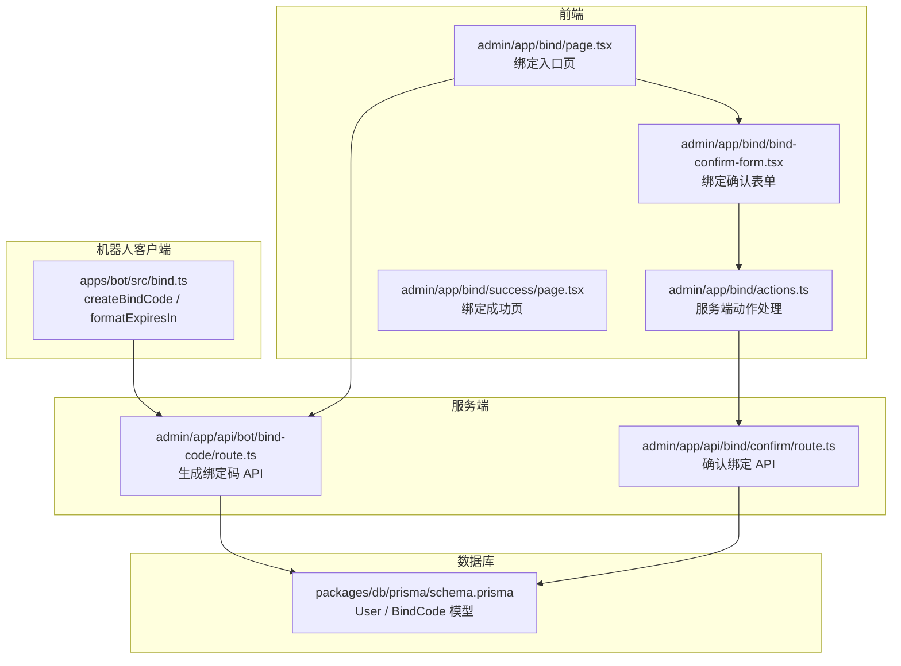
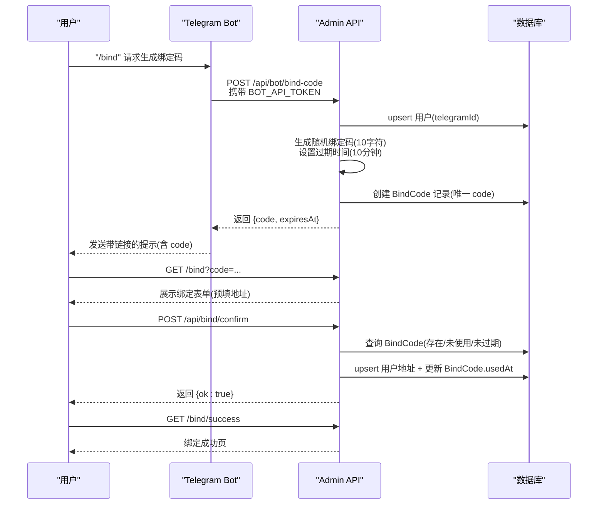
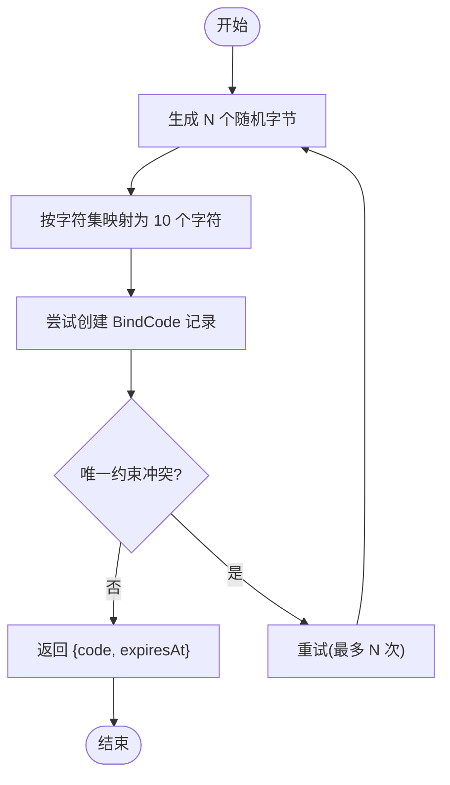
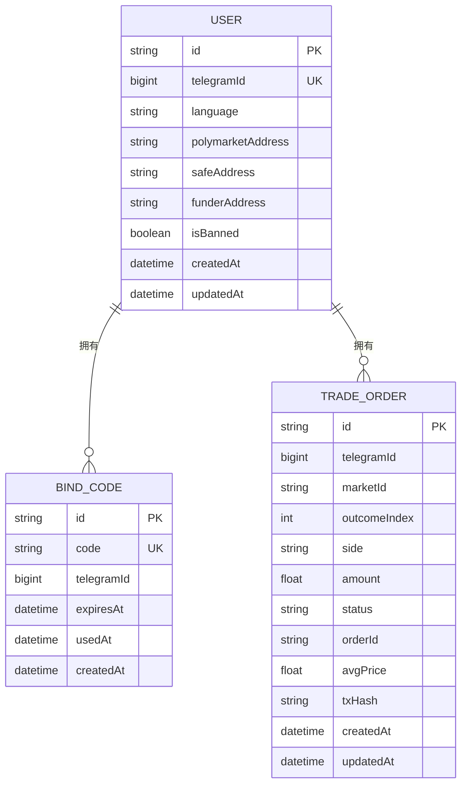
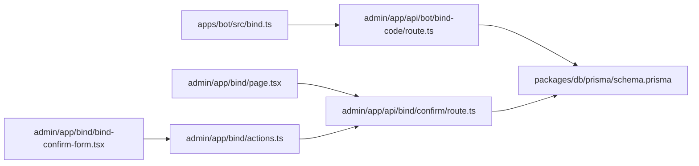

# 绑定码生成机制

<cite>
**本文引用的文件**
- [apps/admin/app/api/bot/bind-code/route.ts](file://apps/admin/app/api/bot/bind-code/route.ts)
- [apps/admin/app/api/bind/confirm/route.ts](file://apps/admin/app/api/bind/confirm/route.ts)
- [apps/admin/app/bind/actions.ts](file://apps/admin/app/bind/actions.ts)
- [apps/admin/app/bind/page.tsx](file://apps/admin/app/bind/page.tsx)
- [apps/admin/app/bind/bind-confirm-form.tsx](file://apps/admin/app/bind/bind-confirm-form.tsx)
- [apps/admin/app/bind/success/page.tsx](file://apps/admin/app/bind/success/page.tsx)
- [apps/bot/src/bind.ts](file://apps/bot/src/bind.ts)
- [packages/db/prisma/schema.prisma](file://packages/db/prisma/schema.prisma)
- [.env.example](file://.env.example)
- [test/bind-code.test.ts](file://test/bind-code.test.ts)
- [test/bind-confirm.test.ts](file://test/bind-confirm.test.ts)
- [test/bot-bind.test.ts](file://test/bot-bind.test.ts)
</cite>

## 目录
1. [简介](#简介)
2. [项目结构](#项目结构)
3. [核心组件](#核心组件)
4. [架构总览](#架构总览)
5. [详细组件分析](#详细组件分析)
6. [依赖关系分析](#依赖关系分析)
7. [性能考量](#性能考量)
8. [故障排查指南](#故障排查指南)
9. [结论](#结论)
10. [附录](#附录)

## 简介
本技术文档围绕“绑定码生成机制”展开，系统性阐述绑定码的生成算法、唯一性保障、安全随机数来源、数据结构设计、生命周期管理、与用户 Telegram ID 的关联方式、数据库存储策略，以及配置参数、重试机制与错误处理。同时提供端到端流程图与关键实现路径，帮助开发者快速理解与扩展该功能。

## 项目结构
绑定码相关能力由前端页面、服务端 API、机器人客户端与数据库模式共同组成：
- 前端页面负责引导用户输入或粘贴绑定码，并提交绑定信息
- 服务端 API 提供绑定码生成与确认接口
- 机器人客户端封装调用生成接口与有效期提示
- 数据库模式定义用户与绑定码的模型及约束

图表来源
- [apps/admin/app/bind/page.tsx](file://apps/admin/app/bind/page.tsx#L30-L125)
- [apps/admin/app/bind/bind-confirm-form.tsx](file://apps/admin/app/bind/bind-confirm-form.tsx#L18-L170)
- [apps/admin/app/bind/actions.ts](file://apps/admin/app/bind/actions.ts#L21-L88)
- [apps/admin/app/bind/success/page.tsx](file://apps/admin/app/bind/success/page.tsx#L5-L35)
- [apps/admin/app/api/bot/bind-code/route.ts](file://apps/admin/app/api/bot/bind-code/route.ts#L34-L103)
- [apps/admin/app/api/bind/confirm/route.ts](file://apps/admin/app/api/bind/confirm/route.ts#L21-L89)
- [apps/bot/src/bind.ts](file://apps/bot/src/bind.ts#L3-L39)
- [packages/db/prisma/schema.prisma](file://packages/db/prisma/schema.prisma#L10-L34)

章节来源
- [apps/admin/app/bind/page.tsx](file://apps/admin/app/bind/page.tsx#L30-L125)
- [apps/admin/app/bind/bind-confirm-form.tsx](file://apps/admin/app/bind/bind-confirm-form.tsx#L18-L170)
- [apps/admin/app/bind/actions.ts](file://apps/admin/app/bind/actions.ts#L21-L88)
- [apps/admin/app/bind/success/page.tsx](file://apps/admin/app/bind/success/page.tsx#L5-L35)
- [apps/admin/app/api/bot/bind-code/route.ts](file://apps/admin/app/api/bot/bind-code/route.ts#L34-L103)
- [apps/admin/app/api/bind/confirm/route.ts](file://apps/admin/app/api/bind/confirm/route.ts#L21-L89)
- [apps/bot/src/bind.ts](file://apps/bot/src/bind.ts#L3-L39)
- [packages/db/prisma/schema.prisma](file://packages/db/prisma/schema.prisma#L10-L34)

## 核心组件
- 绑定码生成 API：接收 Telegram ID，创建用户记录，生成唯一绑定码，设置过期时间，返回绑定码与过期时间
- 绑定确认 API：校验绑定码存在性、未使用、未过期，原子性更新用户地址并标记绑定码已使用
- 机器人客户端：封装生成请求、鉴权头、响应解析与有效期提示
- 前端绑定页与表单：展示步骤、错误提示、输入校验与提交动作
- 数据库模式：User 与 BindCode 模型，外键与唯一约束

章节来源
- [apps/admin/app/api/bot/bind-code/route.ts](file://apps/admin/app/api/bot/bind-code/route.ts#L34-L103)
- [apps/admin/app/api/bind/confirm/route.ts](file://apps/admin/app/api/bind/confirm/route.ts#L21-L89)
- [apps/bot/src/bind.ts](file://apps/bot/src/bind.ts#L3-L39)
- [apps/admin/app/bind/page.tsx](file://apps/admin/app/bind/page.tsx#L30-L125)
- [apps/admin/app/bind/bind-confirm-form.tsx](file://apps/admin/app/bind/bind-confirm-form.tsx#L18-L170)
- [packages/db/prisma/schema.prisma](file://packages/db/prisma/schema.prisma#L10-L34)

## 架构总览
下图展示了从 Telegram Bot 到 Web 端完成绑定的端到端流程。

图表来源
- [apps/bot/src/bind.ts](file://apps/bot/src/bind.ts#L3-L39)
- [apps/admin/app/api/bot/bind-code/route.ts](file://apps/admin/app/api/bot/bind-code/route.ts#L34-L103)
- [apps/admin/app/bind/page.tsx](file://apps/admin/app/bind/page.tsx#L30-L125)
- [apps/admin/app/api/bind/confirm/route.ts](file://apps/admin/app/api/bind/confirm/route.ts#L21-L89)
- [apps/admin/app/bind/success/page.tsx](file://apps/admin/app/bind/success/page.tsx#L5-L35)

## 详细组件分析

### 绑定码生成算法与唯一性保证
- 随机数来源：使用浏览器/Node 环境的加密安全随机源生成字节数组
- 字符集：限定于大写字母与数字（剔除易混淆字符），确保人类可读与输入友好
- 长度：固定 10 个字符
- 唯一性：数据库层对 code 字段建立唯一索引；服务端采用 upsert 创建用户后循环尝试生成绑定码，最多重试若干次，捕获唯一约束冲突后自动换码
- 过期时间：生成时设置 10 分钟有效期，过期即不可用

图表来源
- [apps/admin/app/api/bot/bind-code/route.ts](file://apps/admin/app/api/bot/bind-code/route.ts#L18-L26)
- [apps/admin/app/api/bot/bind-code/route.ts](file://apps/admin/app/api/bot/bind-code/route.ts#L83-L97)
- [packages/db/prisma/schema.prisma](file://packages/db/prisma/schema.prisma#L25-L34)

章节来源
- [apps/admin/app/api/bot/bind-code/route.ts](file://apps/admin/app/api/bot/bind-code/route.ts#L18-L26)
- [apps/admin/app/api/bot/bind-code/route.ts](file://apps/admin/app/api/bot/bind-code/route.ts#L83-L97)
- [packages/db/prisma/schema.prisma](file://packages/db/prisma/schema.prisma#L25-L34)
- [test/bind-code.test.ts](file://test/bind-code.test.ts#L64-L86)

### 绑定码数据结构设计
- 模型字段
  - code：字符串，唯一，作为绑定码主键
  - telegramId：BigInt，绑定码关联的 Telegram ID
  - expiresAt：DateTime，过期时间
  - usedAt：DateTime 可空，标记绑定码被使用的时间
  - createdAt：默认当前时间
- 关联关系
  - BindCode 与 User 通过 telegramId 外键关联，删除用户时级联删除绑定码
- 约束与索引
  - code 唯一
  - telegramId 唯一（User 模型）
  - 交易订单模型对 telegramId 和 createdAt 建有索引，便于查询

图表来源
- [packages/db/prisma/schema.prisma](file://packages/db/prisma/schema.prisma#L10-L54)

章节来源
- [packages/db/prisma/schema.prisma](file://packages/db/prisma/schema.prisma#L10-L54)

### 生命周期管理
- 创建时间：createdAt 默认为当前时间
- 过期时间：生成时设置 10 分钟后到期
- 使用状态：首次确认绑定成功后，将 usedAt 写入当前时间，后续再次使用将返回“已使用”
- 清理策略：过期未使用不会自动清理，可在后台任务中定期清理 expiredAt 之前的记录（建议）

章节来源
- [apps/admin/app/api/bot/bind-code/route.ts](file://apps/admin/app/api/bot/bind-code/route.ts#L81-L82)
- [apps/admin/app/api/bind/confirm/route.ts](file://apps/admin/app/api/bind/confirm/route.ts#L56-L62)
- [packages/db/prisma/schema.prisma](file://packages/db/prisma/schema.prisma#L25-L34)

### 与 Telegram ID 的关联机制与数据库存储
- 生成阶段：若用户不存在则 upsert 创建用户，确保 telegramId 唯一
- 存储阶段：绑定码记录保存 telegramId，用于后续绑定确认时定位用户
- 确认阶段：原子事务内 upsert 用户地址并更新绑定码 usedAt，保证一致性

章节来源
- [apps/admin/app/api/bot/bind-code/route.ts](file://apps/admin/app/api/bot/bind-code/route.ts#L72-L79)
- [apps/admin/app/api/bind/confirm/route.ts](file://apps/admin/app/api/bind/confirm/route.ts#L64-L83)
- [packages/db/prisma/schema.prisma](file://packages/db/prisma/schema.prisma#L10-L34)

### 完整生成与确认流程（代码示例路径）
- 生成绑定码
  - 请求路径：POST /api/bot/bind-code
  - 参数：telegramId（正整数）、language（可选）
  - 返回：{ code, expiresAt }
  - 示例参考：[apps/admin/app/api/bot/bind-code/route.ts](file://apps/admin/app/api/bot/bind-code/route.ts#L34-L103)
- 机器人客户端调用
  - 函数：createBindCode
  - 行为：构造 Bearer Token、发送 JSON、解析响应、抛错处理
  - 示例参考：[apps/bot/src/bind.ts](file://apps/bot/src/bind.ts#L3-L30)
- 绑定确认
  - 请求路径：POST /api/bind/confirm
  - 参数：code、polymarketAddress、safeAddress、funderAddress（可空）
  - 行为：校验 code 存在/未使用/未过期 → 原子更新用户地址与绑定码 usedAt
  - 示例参考：[apps/admin/app/api/bind/confirm/route.ts](file://apps/admin/app/api/bind/confirm/route.ts#L21-L89)
- 前端绑定页与表单
  - 页面：/bind（支持带 code 查询参数）
  - 表单：输入钱包地址（可为空表示解绑）
  - 示例参考：[apps/admin/app/bind/page.tsx](file://apps/admin/app/bind/page.tsx#L30-L125)，[apps/admin/app/bind/bind-confirm-form.tsx](file://apps/admin/app/bind/bind-confirm-form.tsx#L18-L170)

章节来源
- [apps/admin/app/api/bot/bind-code/route.ts](file://apps/admin/app/api/bot/bind-code/route.ts#L34-L103)
- [apps/bot/src/bind.ts](file://apps/bot/src/bind.ts#L3-L30)
- [apps/admin/app/api/bind/confirm/route.ts](file://apps/admin/app/api/bind/confirm/route.ts#L21-L89)
- [apps/admin/app/bind/page.tsx](file://apps/admin/app/bind/page.tsx#L30-L125)
- [apps/admin/app/bind/bind-confirm-form.tsx](file://apps/admin/app/bind/bind-confirm-form.tsx#L18-L170)

### 配置参数与环境变量
- BOT_API_TOKEN：用于保护绑定码生成接口的 Bearer Token
- DATABASE_URL：PostgreSQL 连接串，用于 Prisma 客户端连接
- NODE_ENV：生产环境未配置 BOT_API_TOKEN 将拒绝访问
- API_BASE_URL/WEB_BASE_URL：前端与机器人调用的基础 URL
- NEXT_PUBLIC_BOT_USERNAME：用于引导用户回到 Telegram Bot 的用户名

章节来源
- [apps/admin/app/api/bot/bind-code/route.ts](file://apps/admin/app/api/bot/bind-code/route.ts#L35-L44)
- [.env.example](file://.env.example#L8-L13)
- [apps/bot/src/bind.ts](file://apps/bot/src/bind.ts#L16-L20)

### 错误处理与重试机制
- 生成接口
  - 鉴权失败：401 unauthorized
  - 数据库不可用：503 database_unavailable
  - JSON 解析失败：400 invalid_json
  - 请求体校验失败：400 invalid_body
  - Prisma 不可用：503 prisma_unavailable
  - 唯一约束冲突：自动重试（最多若干次），最终失败返回 500 code_generation_failed
- 确认接口
  - code 不存在：404 code_not_found
  - 已使用：409 code_used
  - 已过期：410 code_expired
  - 服务器错误：500 server_error

章节来源
- [apps/admin/app/api/bot/bind-code/route.ts](file://apps/admin/app/api/bot/bind-code/route.ts#L38-L44)
- [apps/admin/app/api/bot/bind-code/route.ts](file://apps/admin/app/api/bot/bind-code/route.ts#L46-L48)
- [apps/admin/app/api/bot/bind-code/route.ts](file://apps/admin/app/api/bot/bind-code/route.ts#L50-L55)
- [apps/admin/app/api/bot/bind-code/route.ts](file://apps/admin/app/api/bot/bind-code/route.ts#L57-L60)
- [apps/admin/app/api/bot/bind-code/route.ts](file://apps/admin/app/api/bot/bind-code/route.ts#L66-L69)
- [apps/admin/app/api/bot/bind-code/route.ts](file://apps/admin/app/api/bot/bind-code/route.ts#L94-L96)
- [apps/admin/app/api/bot/bind-code/route.ts](file://apps/admin/app/api/bot/bind-code/route.ts#L99-L102)
- [apps/admin/app/api/bind/confirm/route.ts](file://apps/admin/app/api/bind/confirm/route.ts#L21-L31)
- [apps/admin/app/api/bind/confirm/route.ts](file://apps/admin/app/api/bind/confirm/route.ts#L33-L38)
- [apps/admin/app/api/bind/confirm/route.ts](file://apps/admin/app/api/bind/confirm/route.ts#L40-L43)
- [apps/admin/app/api/bind/confirm/route.ts](file://apps/admin/app/api/bind/confirm/route.ts#L52-L62)
- [apps/admin/app/api/bind/confirm/route.ts](file://apps/admin/app/api/bind/confirm/route.ts#L86-L88)

### 安全考虑与最佳实践
- 随机数安全性：使用加密安全的随机源，避免伪随机
- 字符集选择：剔除易混淆字符，降低 OCR/键盘输入错误
- 唯一性与重试：数据库唯一约束 + 服务端重试，确保高成功率
- 过期控制：短有效期（10 分钟）降低泄露风险
- 接口鉴权：生产环境必须配置 BOT_API_TOKEN，否则直接拒绝
- 传输安全：建议仅在 HTTPS 环境部署，避免中间人攻击
- 输入校验：前端与后端均进行地址格式校验，防止脏数据进入
- 事务一致性：绑定确认使用事务，保证用户地址与绑定码状态一致

章节来源
- [apps/admin/app/api/bot/bind-code/route.ts](file://apps/admin/app/api/bot/bind-code/route.ts#L18-L26)
- [apps/admin/app/api/bot/bind-code/route.ts](file://apps/admin/app/api/bot/bind-code/route.ts#L38-L44)
- [apps/admin/app/api/bind/confirm/route.ts](file://apps/admin/app/api/bind/confirm/route.ts#L64-L83)
- [apps/admin/app/bind/bind-confirm-form.tsx](file://apps/admin/app/bind/bind-confirm-form.tsx#L39-L53)

## 依赖关系分析
- 绑定码生成 API 依赖 Prisma 客户端与数据库
- 绑定确认 API 同样依赖 Prisma 客户端与数据库
- 机器人客户端依赖 Admin API 与环境变量
- 前端页面依赖 Prisma 客户端与路由参数

图表来源
- [apps/bot/src/bind.ts](file://apps/bot/src/bind.ts#L3-L39)
- [apps/admin/app/api/bot/bind-code/route.ts](file://apps/admin/app/api/bot/bind-code/route.ts#L64-L69)
- [apps/admin/app/api/bind/confirm/route.ts](file://apps/admin/app/api/bind/confirm/route.ts#L26-L31)
- [apps/admin/app/bind/page.tsx](file://apps/admin/app/bind/page.tsx#L4-L6)
- [apps/admin/app/bind/bind-confirm-form.tsx](file://apps/admin/app/bind/bind-confirm-form.tsx#L1-L4)
- [apps/admin/app/bind/actions.ts](file://apps/admin/app/bind/actions.ts#L1-L5)
- [packages/db/prisma/schema.prisma](file://packages/db/prisma/schema.prisma#L10-L34)

章节来源
- [apps/bot/src/bind.ts](file://apps/bot/src/bind.ts#L3-L39)
- [apps/admin/app/api/bot/bind-code/route.ts](file://apps/admin/app/api/bot/bind-code/route.ts#L64-L69)
- [apps/admin/app/api/bind/confirm/route.ts](file://apps/admin/app/api/bind/confirm/route.ts#L26-L31)
- [apps/admin/app/bind/page.tsx](file://apps/admin/app/bind/page.tsx#L4-L6)
- [apps/admin/app/bind/bind-confirm-form.tsx](file://apps/admin/app/bind/bind-confirm-form.tsx#L1-L4)
- [apps/admin/app/bind/actions.ts](file://apps/admin/app/bind/actions.ts#L1-L5)
- [packages/db/prisma/schema.prisma](file://packages/db/prisma/schema.prisma#L10-L34)

## 性能考量
- 绑定码生成：O(1) 随机生成 + O(1) 数据库插入（唯一索引）
- 绑定确认：O(1) 查询 + O(1) upsert + O(1) 更新，整体 O(1)
- 重试次数：服务端最多重试若干次，避免无限循环
- 建议：为频繁查询的 code 建立索引（若业务需要），但当前 schema 已有唯一索引满足需求

## 故障排查指南
- 生成接口
  - 401：检查 BOT_API_TOKEN 是否正确配置与传递
  - 503 数据库不可用：检查 DATABASE_URL
  - 400 JSON/请求体错误：检查请求体格式与必填字段
  - 500 code_generation_failed：唯一约束冲突过多或数据库异常
- 确认接口
  - 404：确认 code 是否正确，是否已被使用或过期
  - 409：该绑定码已被使用
  - 410：绑定码已过期
  - 500：服务器内部错误，检查日志与数据库连接

章节来源
- [apps/admin/app/api/bot/bind-code/route.ts](file://apps/admin/app/api/bot/bind-code/route.ts#L38-L44)
- [apps/admin/app/api/bot/bind-code/route.ts](file://apps/admin/app/api/bot/bind-code/route.ts#L46-L48)
- [apps/admin/app/api/bot/bind-code/route.ts](file://apps/admin/app/api/bot/bind-code/route.ts#L50-L55)
- [apps/admin/app/api/bot/bind-code/route.ts](file://apps/admin/app/api/bot/bind-code/route.ts#L99-L102)
- [apps/admin/app/api/bind/confirm/route.ts](file://apps/admin/app/api/bind/confirm/route.ts#L52-L62)
- [apps/admin/app/api/bind/confirm/route.ts](file://apps/admin/app/api/bind/confirm/route.ts#L86-L88)

## 结论
绑定码生成机制通过加密安全随机数、严格的唯一性与过期控制、完善的错误处理与鉴权策略，实现了安全可靠的用户身份绑定流程。结合前端表单与机器人客户端，形成从 Telegram 到 Web 端的一体化体验。建议在生产环境中启用 HTTPS、合理设置过期时间与重试上限，并定期清理过期记录以维持系统健康。

## 附录
- 测试覆盖点
  - 生成接口鉴权失败与生产环境保护
  - 生成接口成功返回 code 与 expiresAt，并落库
  - 确认接口 code 不存在、已使用、已过期与成功绑定场景
  - 机器人客户端解析响应与错误抛出行为

章节来源
- [test/bind-code.test.ts](file://test/bind-code.test.ts#L27-L86)
- [test/bind-confirm.test.ts](file://test/bind-confirm.test.ts#L33-L111)
- [test/bot-bind.test.ts](file://test/bot-bind.test.ts#L10-L46)