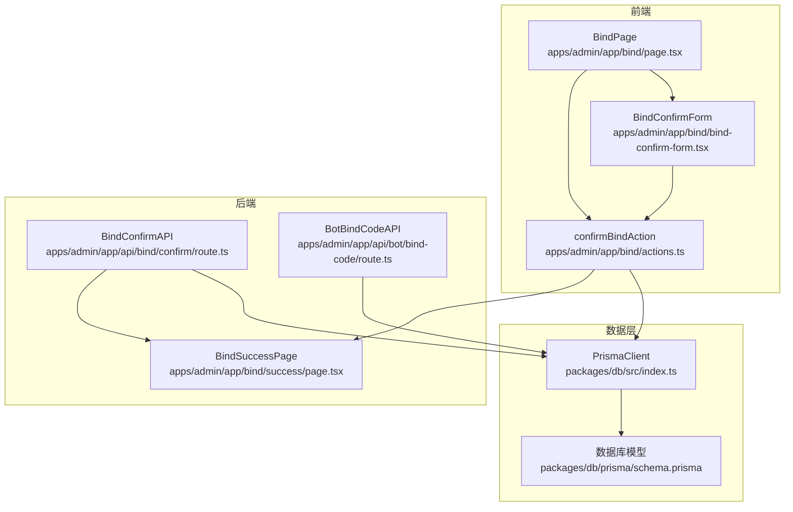
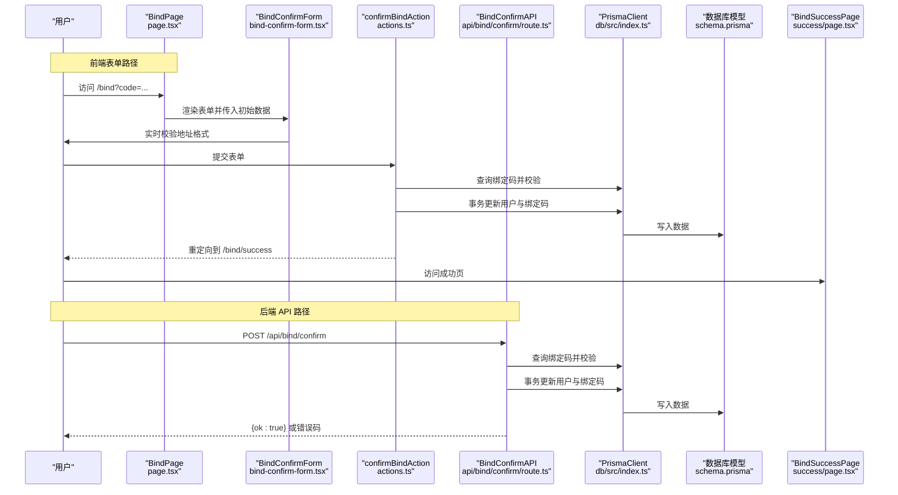
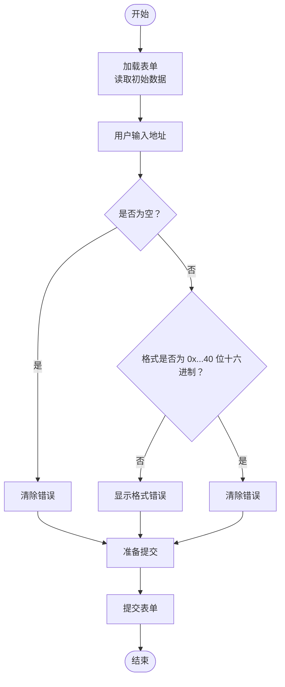
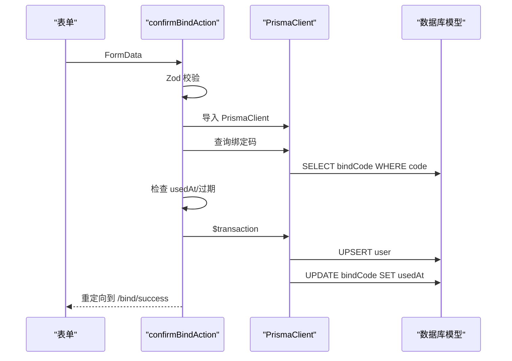
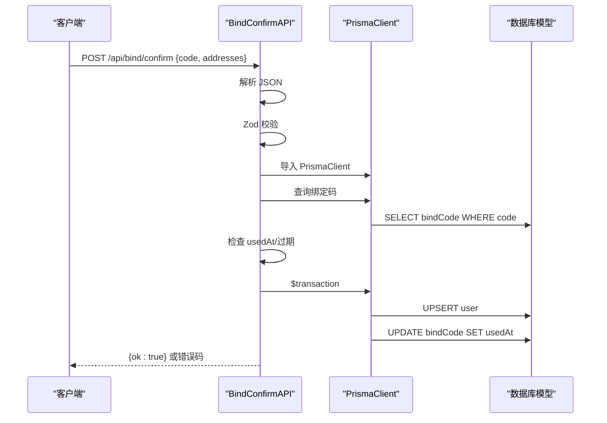
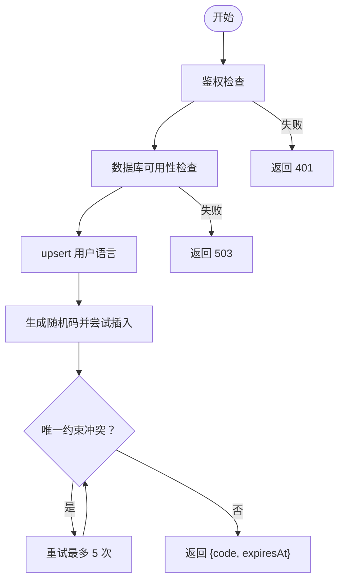
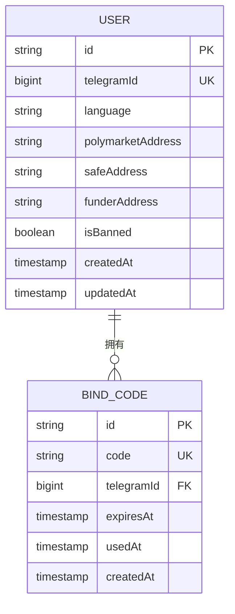
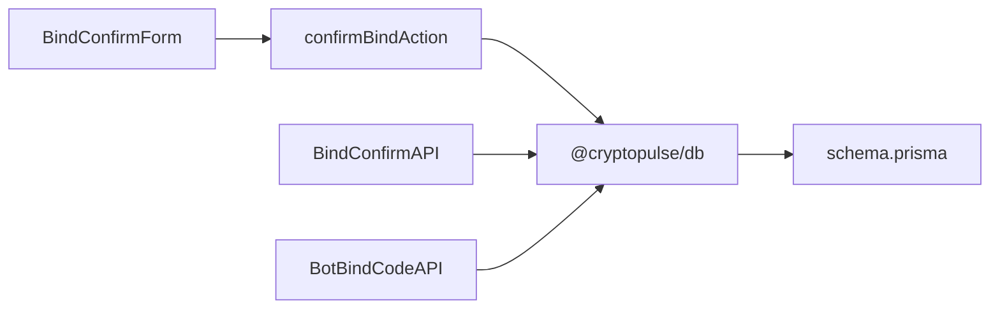

# 绑定确认流程

<cite>
**本文引用的文件列表**
- [apps/admin/app/bind/actions.ts](file://apps/admin/app/bind/actions.ts)
- [apps/admin/app/bind/bind-confirm-form.tsx](file://apps/admin/app/bind/bind-confirm-form.tsx)
- [apps/admin/app/api/bind/confirm/route.ts](file://apps/admin/app/api/bind/confirm/route.ts)
- [apps/admin/app/bind/page.tsx](file://apps/admin/app/bind/page.tsx)
- [apps/admin/app/api/bot/bind-code/route.ts](file://apps/admin/app/api/bot/bind-code/route.ts)
- [apps/admin/app/bind/success/page.tsx](file://apps/admin/app/bind/success/page.tsx)
- [apps/admin/e2e/bind.e2e.spec.ts](file://apps/admin/e2e/bind.e2e.spec.ts)
- [test/bind-confirm.test.ts](file://test/bind-confirm.test.ts)
- [packages/db/src/index.ts](file://packages/db/src/index.ts)
- [packages/db/prisma/schema.prisma](file://packages/db/prisma/schema.prisma)
- [apps/bot/src/bind.ts](file://apps/bot/src/bind.ts)
</cite>

## 目录
1. [简介](#简介)
2. [项目结构](#项目结构)
3. [核心组件](#核心组件)
4. [架构总览](#架构总览)
5. [详细组件分析](#详细组件分析)
6. [依赖关系分析](#依赖关系分析)
7. [性能考量](#性能考量)
8. [故障排查指南](#故障排查指南)
9. [结论](#结论)
10. [附录](#附录)

## 简介
本技术文档围绕“绑定确认流程”展开，覆盖从用户提交确认信息到最终绑定成功的完整链路。文档重点包括：
- 前端表单验证机制：地址格式校验、必填字段检查与实时反馈
- 后端确认逻辑：绑定码验证、用户信息更新与事务处理
- 安全机制：绑定码有效性检查、重复使用防护、过期时间验证
- 绑定确认 API 的请求参数、响应格式与错误码定义
- 代码示例路径与使用场景演示
- 常见问题与解决方案

## 项目结构
该功能由前端页面、服务端动作、API 接口与数据库模型共同组成，采用 Next.js App Router 架构，前后端职责清晰分离：
- 前端页面负责展示与交互，表单实时校验与错误提示
- 服务端动作负责 SSR/SSG 场景下的表单提交与重定向
- API 接口负责纯后端调用场景的确认逻辑
- 数据库模型定义用户与绑定码的数据结构

图表来源
- [apps/admin/app/bind/page.tsx](file://apps/admin/app/bind/page.tsx#L30-L125)
- [apps/admin/app/bind/bind-confirm-form.tsx](file://apps/admin/app/bind/bind-confirm-form.tsx#L18-L170)
- [apps/admin/app/bind/actions.ts](file://apps/admin/app/bind/actions.ts#L21-L88)
- [apps/admin/app/api/bind/confirm/route.ts](file://apps/admin/app/api/bind/confirm/route.ts#L21-L89)
- [apps/admin/app/api/bot/bind-code/route.ts](file://apps/admin/app/api/bot/bind-code/route.ts#L34-L103)
- [apps/admin/app/bind/success/page.tsx](file://apps/admin/app/bind/success/page.tsx#L5-L36)
- [packages/db/src/index.ts](file://packages/db/src/index.ts#L1-L13)
- [packages/db/prisma/schema.prisma](file://packages/db/prisma/schema.prisma#L10-L34)

章节来源
- [apps/admin/app/bind/page.tsx](file://apps/admin/app/bind/page.tsx#L30-L125)
- [apps/admin/app/bind/bind-confirm-form.tsx](file://apps/admin/app/bind/bind-confirm-form.tsx#L18-L170)
- [apps/admin/app/bind/actions.ts](file://apps/admin/app/bind/actions.ts#L21-L88)
- [apps/admin/app/api/bind/confirm/route.ts](file://apps/admin/app/api/bind/confirm/route.ts#L21-L89)
- [apps/admin/app/api/bot/bind-code/route.ts](file://apps/admin/app/api/bot/bind-code/route.ts#L34-L103)
- [apps/admin/app/bind/success/page.tsx](file://apps/admin/app/bind/success/page.tsx#L5-L36)
- [packages/db/src/index.ts](file://packages/db/src/index.ts#L1-L13)
- [packages/db/prisma/schema.prisma](file://packages/db/prisma/schema.prisma#L10-L34)

## 核心组件
- 绑定确认页面与表单
  - 页面负责根据查询参数显示不同内容，支持错误提示与初始数据填充
  - 表单提供实时地址格式校验与错误提示，支持高级选项（Safe/Proxy）
- 服务端动作
  - 对表单数据进行严格校验，执行绑定码有效性检查与事务更新
  - 通过重定向引导用户至成功页或错误页
- 绑定确认 API
  - 提供纯后端调用接口，返回标准化错误码与成功响应
- 绑定码生成 API
  - 由 Bot 调用生成绑定码，包含鉴权、唯一性保证与过期时间
- 数据模型
  - 用户模型包含多种钱包地址字段；绑定码模型记录绑定码、过期与使用状态

章节来源
- [apps/admin/app/bind/page.tsx](file://apps/admin/app/bind/page.tsx#L30-L125)
- [apps/admin/app/bind/bind-confirm-form.tsx](file://apps/admin/app/bind/bind-confirm-form.tsx#L18-L170)
- [apps/admin/app/bind/actions.ts](file://apps/admin/app/bind/actions.ts#L21-L88)
- [apps/admin/app/api/bind/confirm/route.ts](file://apps/admin/app/api/bind/confirm/route.ts#L21-L89)
- [apps/admin/app/api/bot/bind-code/route.ts](file://apps/admin/app/api/bot/bind-code/route.ts#L34-L103)
- [packages/db/prisma/schema.prisma](file://packages/db/prisma/schema.prisma#L10-L34)

## 架构总览
绑定确认流程分为两条路径：前端表单提交路径与后端 API 调用路径。两者共享相同的业务规则与安全检查，但交互方式不同。

图表来源
- [apps/admin/app/bind/page.tsx](file://apps/admin/app/bind/page.tsx#L30-L125)
- [apps/admin/app/bind/bind-confirm-form.tsx](file://apps/admin/app/bind/bind-confirm-form.tsx#L18-L170)
- [apps/admin/app/bind/actions.ts](file://apps/admin/app/bind/actions.ts#L21-L88)
- [apps/admin/app/api/bind/confirm/route.ts](file://apps/admin/app/api/bind/confirm/route.ts#L21-L89)
- [packages/db/src/index.ts](file://packages/db/src/index.ts#L1-L13)
- [packages/db/prisma/schema.prisma](file://packages/db/prisma/schema.prisma#L10-L34)
- [apps/admin/app/bind/success/page.tsx](file://apps/admin/app/bind/success/page.tsx#L5-L36)

## 详细组件分析

### 前端表单验证与交互
- 地址格式验证
  - 使用正则表达式匹配以 0x 开头的 40 位十六进制字符串
  - 支持留空，留空时不触发错误
- 必填字段检查
  - 绑定码为只读字段，不可为空
  - 地址字段可留空，留空时提交按钮启用
- 实时反馈
  - 输入变化时即时校验并显示错误信息
  - 错误样式高亮，帮助用户快速定位问题
- 高级选项
  - 可展开显示 Safe 与 Funder 地址输入框
  - 三类地址均可独立留空，提交后将清空对应字段

图表来源
- [apps/admin/app/bind/bind-confirm-form.tsx](file://apps/admin/app/bind/bind-confirm-form.tsx#L39-L59)

章节来源
- [apps/admin/app/bind/bind-confirm-form.tsx](file://apps/admin/app/bind/bind-confirm-form.tsx#L18-L170)

### 服务端动作 confirmBindAction
- 数据校验
  - 使用 Zod 对绑定码与三类地址进行严格校验
  - 若输入非法，重定向到 /bind 并携带错误参数
- 数据库可用性检查
  - 检查 DATABASE_URL 是否存在
  - 动态导入 PrismaClient，若失败则重定向到错误页
- 绑定码有效性检查
  - 查找绑定码是否存在
  - 检查是否已被使用
  - 检查是否已过期
- 事务处理
  - 使用 upsert 更新用户地址（可留空清空）
  - 更新绑定码的 usedAt 字段
  - 任一步骤失败回滚事务
- 结果处理
  - 成功后重定向到 /bind/success
  - 失败时重定向到 /bind 并携带错误参数

图表来源
- [apps/admin/app/bind/actions.ts](file://apps/admin/app/bind/actions.ts#L21-L88)
- [packages/db/src/index.ts](file://packages/db/src/index.ts#L1-L13)
- [packages/db/prisma/schema.prisma](file://packages/db/prisma/schema.prisma#L10-L34)

章节来源
- [apps/admin/app/bind/actions.ts](file://apps/admin/app/bind/actions.ts#L21-L88)

### 绑定确认 API POST /api/bind/confirm
- 请求体校验
  - 使用 Zod 校验 code 与三类地址
  - 非法 JSON 或请求体结构错误返回 400
- 数据库可用性检查
  - DATABASE_URL 不存在返回 503
  - PrismaClient 导入失败返回 503
- 绑定码有效性检查
  - 不存在返回 404
  - 已使用返回 409
  - 已过期返回 410
- 事务处理
  - upsert 用户地址
  - 更新绑定码 usedAt
- 成功响应
  - 返回 { ok: true }

图表来源
- [apps/admin/app/api/bind/confirm/route.ts](file://apps/admin/app/api/bind/confirm/route.ts#L21-L89)
- [packages/db/src/index.ts](file://packages/db/src/index.ts#L1-L13)
- [packages/db/prisma/schema.prisma](file://packages/db/prisma/schema.prisma#L10-L34)

章节来源
- [apps/admin/app/api/bind/confirm/route.ts](file://apps/admin/app/api/bind/confirm/route.ts#L21-L89)

### 绑定码生成 API POST /api/bot/bind-code
- 鉴权
  - 生产环境要求 BOT_API_TOKEN，否则返回 401
  - Bearer Token 匹配失败返回 401
- 数据库可用性检查
  - DATABASE_URL 不存在返回 503
  - PrismaClient 导入失败返回 503
- 用户初始化
  - upsert 用户语言字段
- 绑定码生成
  - 生成 10 位随机码（字母数字，剔除易混淆字符）
  - 尝试插入数据库，唯一约束冲突重试最多 5 次
  - 成功返回 { code, expiresAt }
- 过期时间
  - 默认 10 分钟有效

图表来源
- [apps/admin/app/api/bot/bind-code/route.ts](file://apps/admin/app/api/bot/bind-code/route.ts#L34-L103)

章节来源
- [apps/admin/app/api/bot/bind-code/route.ts](file://apps/admin/app/api/bot/bind-code/route.ts#L34-L103)

### 数据模型与关系
- User 模型
  - 主键：id
  - 唯一索引：telegramId
  - 字段：polymarketAddress、safeAddress、funderAddress（可空）
- BindCode 模型
  - 主键：id
  - 唯一索引：code
  - 字段：code、telegramId、expiresAt、usedAt（可空）
  - 关系：外键指向 User.telegramId（级联删除）

图表来源
- [packages/db/prisma/schema.prisma](file://packages/db/prisma/schema.prisma#L10-L34)

章节来源
- [packages/db/prisma/schema.prisma](file://packages/db/prisma/schema.prisma#L10-L34)

## 依赖关系分析
- 组件耦合
  - 前端表单与服务端动作紧密耦合于同一页面，便于统一校验与错误处理
  - API 层与数据库层通过 PrismaClient 解耦，便于测试与替换
- 外部依赖
  - Prisma Client：数据库访问
  - Zod：请求体与表单数据校验
  - Next.js：路由与重定向
- 循环依赖
  - 未发现循环依赖，模块边界清晰

图表来源
- [apps/admin/app/bind/bind-confirm-form.tsx](file://apps/admin/app/bind/bind-confirm-form.tsx#L18-L170)
- [apps/admin/app/bind/actions.ts](file://apps/admin/app/bind/actions.ts#L21-L88)
- [apps/admin/app/api/bind/confirm/route.ts](file://apps/admin/app/api/bind/confirm/route.ts#L21-L89)
- [apps/admin/app/api/bot/bind-code/route.ts](file://apps/admin/app/api/bot/bind-code/route.ts#L34-L103)
- [packages/db/src/index.ts](file://packages/db/src/index.ts#L1-L13)
- [packages/db/prisma/schema.prisma](file://packages/db/prisma/schema.prisma#L10-L34)

章节来源
- [apps/admin/app/bind/bind-confirm-form.tsx](file://apps/admin/app/bind/bind-confirm-form.tsx#L18-L170)
- [apps/admin/app/bind/actions.ts](file://apps/admin/app/bind/actions.ts#L21-L88)
- [apps/admin/app/api/bind/confirm/route.ts](file://apps/admin/app/api/bind/confirm/route.ts#L21-L89)
- [apps/admin/app/api/bot/bind-code/route.ts](file://apps/admin/app/api/bot/bind-code/route.ts#L34-L103)
- [packages/db/src/index.ts](file://packages/db/src/index.ts#L1-L13)
- [packages/db/prisma/schema.prisma](file://packages/db/prisma/schema.prisma#L10-L34)

## 性能考量
- 校验与查询
  - 前端实时校验仅做正则匹配，开销极低
  - 服务端与 API 均进行数据库查询与事务，应确保数据库连接池与索引优化
- 事务一致性
  - 使用 $transaction 保证用户更新与绑定码标记的一致性，避免竞态条件
- 并发控制
  - 绑定码生成时通过唯一约束与重试策略保证唯一性，减少并发冲突
- 缓存与日志
  - Prisma 初始化在全局作用域缓存实例，减少重复初始化成本

## 故障排查指南
- 常见错误与处理
  - invalid_input：地址格式不正确或为空，前端表单会提示具体格式要求
  - database_unavailable：未配置 DATABASE_URL，检查环境变量
  - prisma_unavailable：Prisma 未生成或导入失败，执行 prisma generate
  - code_not_found：绑定码不存在，检查链接是否完整
  - code_used：绑定码已被使用，需要重新生成
  - code_expired：绑定码已过期，回到 Bot 重新生成
  - server_error：服务器内部错误，查看日志并重试
- API 错误码对照
  - 400：invalid_json 或 invalid_body
  - 401：unauthorized（鉴权失败）
  - 404：code_not_found
  - 409：code_used
  - 410：code_expired
  - 500：server_error
  - 503：database_unavailable 或 prisma_unavailable
- 测试参考
  - 端到端测试覆盖了无码展示、无效地址提示与成功跳转
  - 单元测试覆盖了绑定码不存在、成功绑定与重复使用等场景

章节来源
- [apps/admin/app/bind/page.tsx](file://apps/admin/app/bind/page.tsx#L9-L28)
- [apps/admin/app/api/bind/confirm/route.ts](file://apps/admin/app/api/bind/confirm/route.ts#L21-L89)
- [apps/admin/e2e/bind.e2e.spec.ts](file://apps/admin/e2e/bind.e2e.spec.ts#L12-L72)
- [test/bind-confirm.test.ts](file://test/bind-confirm.test.ts#L33-L111)

## 结论
绑定确认流程通过严格的前后端校验、完善的错误提示与事务保障，实现了安全可靠的用户身份绑定。前端表单提供良好的用户体验，后端 API 支持 Bot 等外部系统集成。整体设计遵循最小权限与幂等原则，具备良好的扩展性与可维护性。

## 附录

### 绑定确认 API 规范
- 方法与路径
  - POST /api/bind/confirm
- 请求体参数
  - code: string（必填，非空）
  - polymarketAddress: string（可选，0x 开头的 40 位十六进制）
  - safeAddress: string（可选，0x 开头的 40 位十六进制）
  - funderAddress: string（可选，0x 开头的 40 位十六进制）
- 成功响应
  - { ok: true }
- 错误码
  - 400: invalid_json 或 invalid_body
  - 404: code_not_found
  - 409: code_used
  - 410: code_expired
  - 500: server_error
  - 503: database_unavailable 或 prisma_unavailable

章节来源
- [apps/admin/app/api/bind/confirm/route.ts](file://apps/admin/app/api/bind/confirm/route.ts#L14-L89)

### 绑定码生成 API 规范
- 方法与路径
  - POST /api/bot/bind-code
- 请求头
  - Authorization: Bearer <BOT_API_TOKEN>（生产环境必须）
- 请求体参数
  - telegramId: number（必填，正整数）
  - language: string（可选）
- 成功响应
  - { code: string, expiresAt: string（ISO 8601） }
- 错误码
  - 400: invalid_json 或 invalid_body
  - 401: unauthorized
  - 500: code_generation_failed 或 server_error
  - 503: database_unavailable 或 prisma_unavailable

章节来源
- [apps/admin/app/api/bot/bind-code/route.ts](file://apps/admin/app/api/bot/bind-code/route.ts#L7-L103)

### 使用场景示例
- 场景一：用户通过 Bot 获取绑定码并完成绑定
  - Bot 调用绑定码生成 API，得到 code 与 expiresAt
  - Bot 将链接发送给用户，用户访问 /bind?code=...
  - 用户在表单中填写地址并提交，成功后跳转到成功页
- 场景二：外部系统直接调用 API 完成绑定
  - 外部系统构造请求体，调用 /api/bind/confirm
  - 服务器返回 { ok: true } 或相应错误码

章节来源
- [apps/bot/src/bind.ts](file://apps/bot/src/bind.ts#L3-L30)
- [apps/admin/app/bind/page.tsx](file://apps/admin/app/bind/page.tsx#L94-L122)
- [apps/admin/app/api/bind/confirm/route.ts](file://apps/admin/app/api/bind/confirm/route.ts#L21-L89)