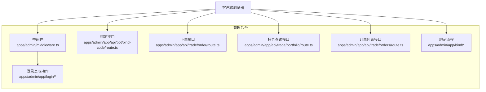
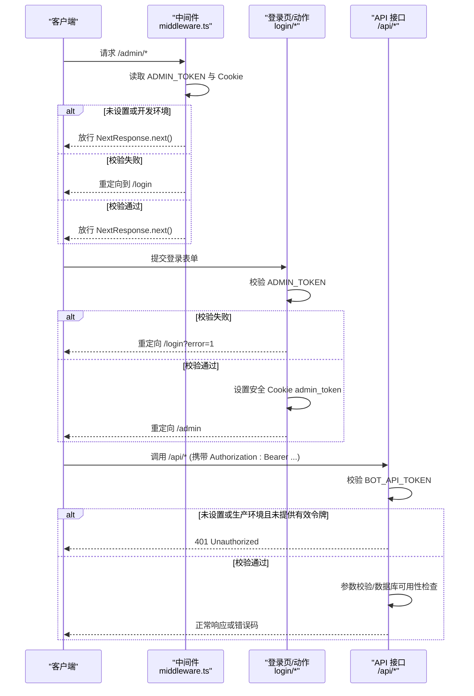
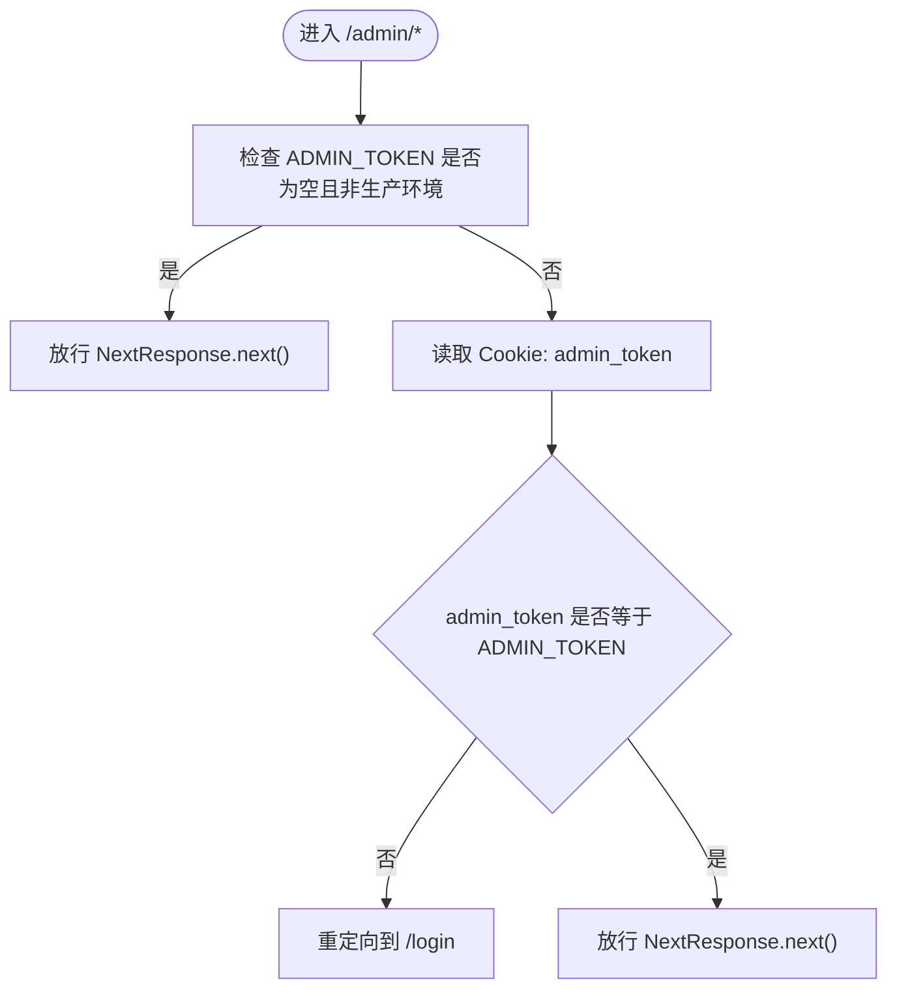
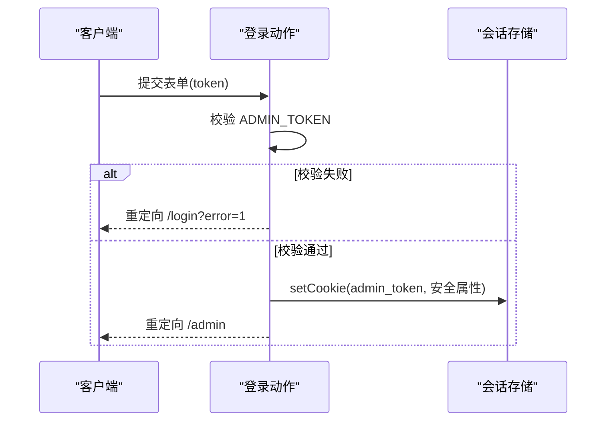
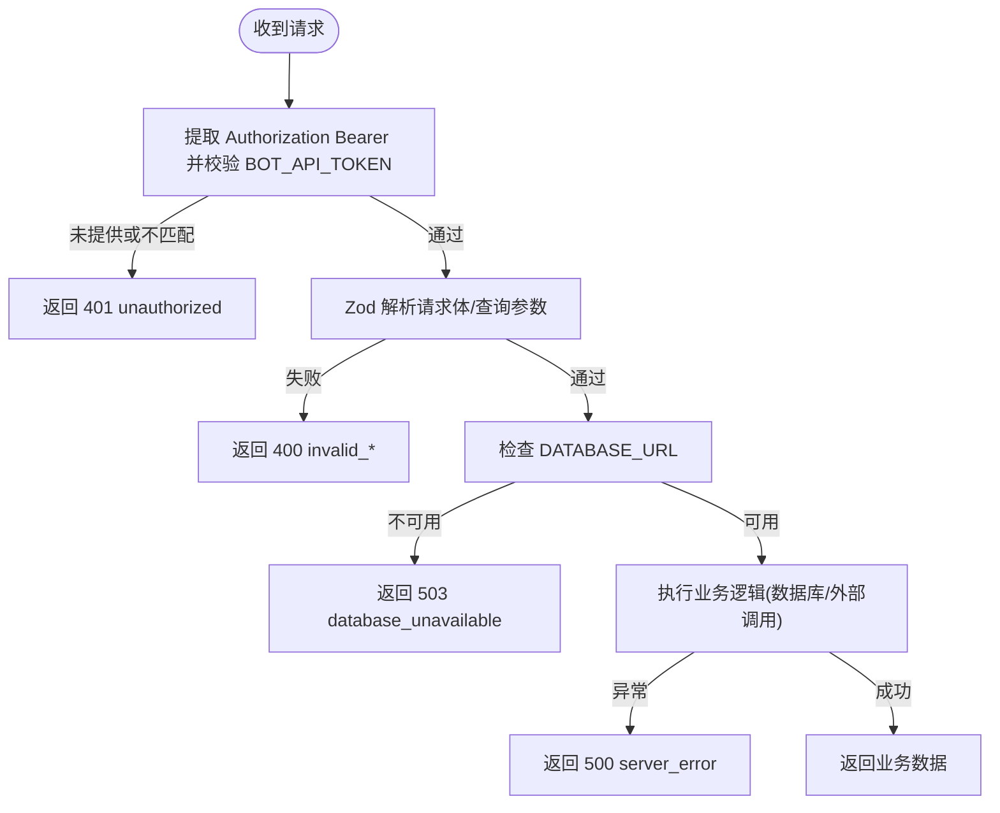
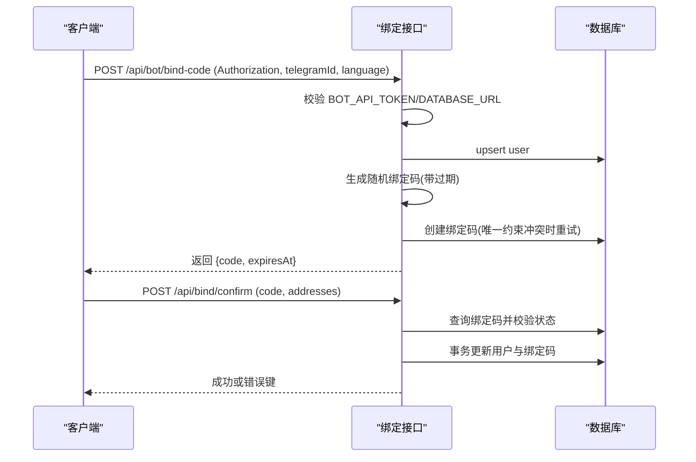
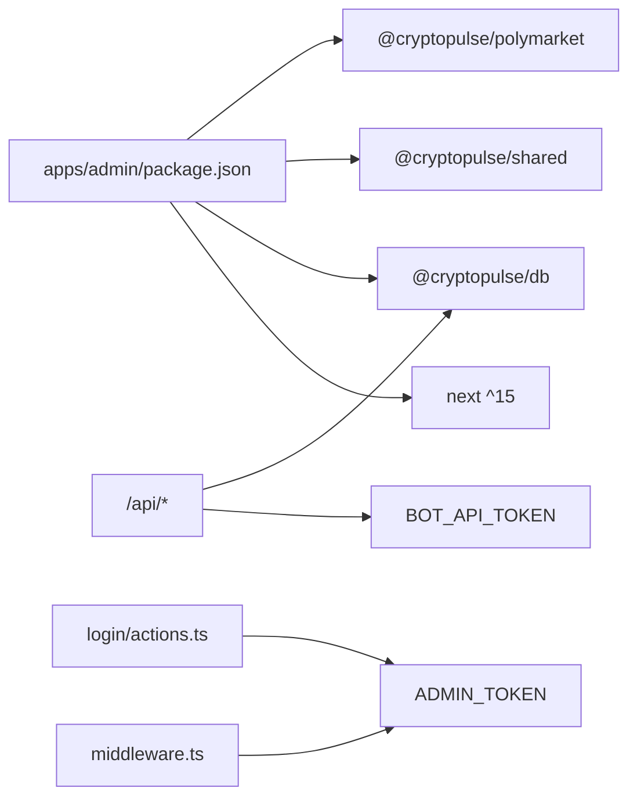

# 中间件与安全

<cite>
**本文引用的文件**
- [apps/admin/middleware.ts](file://apps/admin/middleware.ts)
- [apps/admin/app/login/actions.ts](file://apps/admin/app/login/actions.ts)
- [apps/admin/app/login/page.tsx](file://apps/admin/app/login/page.tsx)
- [apps/admin/app/api/bot/bind-code/route.ts](file://apps/admin/app/api/bot/bind-code/route.ts)
- [apps/admin/app/api/trade/order/route.ts](file://apps/admin/app/api/trade/order/route.ts)
- [apps/admin/app/api/trade/portfolio/route.ts](file://apps/admin/app/api/trade/portfolio/route.ts)
- [apps/admin/app/api/trade/orders/route.ts](file://apps/admin/app/api/trade/orders/route.ts)
- [apps/admin/app/bind/actions.ts](file://apps/admin/app/bind/actions.ts)
- [apps/admin/app/api/bind/confirm/route.ts](file://apps/admin/app/api/bind/confirm/route.ts)
- [apps/admin/next.config.ts](file://apps/admin/next.config.ts)
- [apps/admin/package.json](file://apps/admin/package.json)
- [apps/admin/app/bind/page.tsx](file://apps/admin/app/bind/page.tsx)
- [packages/polymarket/src/index.ts](file://packages/polymarket/src/index.ts)
- [packages/shared/src/index.ts](file://packages/shared/src/index.ts)
- [packages/db/src/index.ts](file://packages/db/src/index.ts)
- [specs/cryptopulse/requirements.md](file://specs/cryptopulse/requirements.md)
- [README.md](file://README.md)
</cite>

## 目录
1. [简介](#简介)
2. [项目结构](#项目结构)
3. [核心组件](#核心组件)
4. [架构总览](#架构总览)
5. [详细组件分析](#详细组件分析)
6. [依赖关系分析](#依赖关系分析)
7. [性能考虑](#性能考虑)
8. [故障排查指南](#故障排查指南)
9. [结论](#结论)
10. [附录](#附录)

## 简介
本文件面向中间件与安全系统，聚焦于以下目标：
- 中间件的配置与执行顺序：请求拦截、响应处理、错误捕获
- 路由保护机制：身份验证检查、权限验证、访问控制
- 安全策略实施：认证令牌、Cookie 安全属性、CORS/HSTS/CSP 的现状与建议
- 中间件链式调用与异常处理机制
- 性能优化与监控方法
- 常见安全威胁的防护措施与最佳实践

本项目采用 Next.js App Router 与中间件进行路径级保护，结合 API 层的 Bearer Token 校验与数据库访问控制，形成从入口到业务接口的多层安全防线。

## 项目结构
管理后台应用位于 apps/admin，核心安全相关模块包括：
- 中间件：对 /admin 路径进行保护
- 登录页面与动作：设置安全 Cookie 并重定向
- API 路由：统一的 Bearer Token 校验与错误处理
- 绑定流程：基于一次性验证码的绑定页与确认接口
- Next 配置：实验性功能与打包优化

图表来源
- [apps/admin/middleware.ts](file://apps/admin/middleware.ts#L1-L22)
- [apps/admin/app/login/actions.ts](file://apps/admin/app/login/actions.ts#L1-L28)
- [apps/admin/app/api/bot/bind-code/route.ts](file://apps/admin/app/api/bot/bind-code/route.ts#L1-L105)
- [apps/admin/app/api/trade/order/route.ts](file://apps/admin/app/api/trade/order/route.ts#L1-L94)
- [apps/admin/app/api/trade/portfolio/route.ts](file://apps/admin/app/api/trade/portfolio/route.ts#L1-L44)
- [apps/admin/app/api/trade/orders/route.ts](file://apps/admin/app/api/trade/orders/route.ts#L1-L44)
- [apps/admin/app/bind/actions.ts](file://apps/admin/app/bind/actions.ts#L1-L90)

章节来源
- [apps/admin/middleware.ts](file://apps/admin/middleware.ts#L1-L22)
- [apps/admin/next.config.ts](file://apps/admin/next.config.ts#L1-L30)
- [apps/admin/package.json](file://apps/admin/package.json#L1-L42)

## 核心组件
- 中间件：对 /admin 路径进行保护，校验环境变量与 Cookie，必要时重定向至登录页
- 登录流程：表单提交后校验 ADMIN_TOKEN，设置安全 Cookie 并重定向
- API 接口：统一 Bearer Token 校验、参数校验、数据库可用性检查与错误处理
- 绑定流程：绑定码一次性使用、过期控制、事务写入与状态反馈
- Next 配置：实验性功能与打包优化，提升开发体验与构建稳定性

章节来源
- [apps/admin/middleware.ts](file://apps/admin/middleware.ts#L1-L22)
- [apps/admin/app/login/actions.ts](file://apps/admin/app/login/actions.ts#L1-L28)
- [apps/admin/app/api/bot/bind-code/route.ts](file://apps/admin/app/api/bot/bind-code/route.ts#L1-L105)
- [apps/admin/app/api/trade/order/route.ts](file://apps/admin/app/api/trade/order/route.ts#L1-L94)
- [apps/admin/app/bind/actions.ts](file://apps/admin/app/bind/actions.ts#L1-L90)
- [apps/admin/next.config.ts](file://apps/admin/next.config.ts#L1-L30)

## 架构总览
下图展示了从客户端到中间件、登录与 API 的整体交互与保护链路：

图表来源
- [apps/admin/middleware.ts](file://apps/admin/middleware.ts#L1-L22)
- [apps/admin/app/login/actions.ts](file://apps/admin/app/login/actions.ts#L1-L28)
- [apps/admin/app/api/bot/bind-code/route.ts](file://apps/admin/app/api/bot/bind-code/route.ts#L1-L105)
- [apps/admin/app/api/trade/order/route.ts](file://apps/admin/app/api/trade/order/route.ts#L1-L94)

## 详细组件分析

### 中间件与路由保护
- 匹配规则：仅对 /admin 路径生效
- 校验逻辑：
  - 若未设置 ADMIN_TOKEN 且非生产环境，放行
  - 否则要求 Cookie 中存在与 ADMIN_TOKEN 一致的 admin_token
  - 失败时重定向至 /login
  - 成功时放行
- 环境差异：开发环境可免密访问，生产环境必须设置 ADMIN_TOKEN

图表来源
- [apps/admin/middleware.ts](file://apps/admin/middleware.ts#L1-L22)

章节来源
- [apps/admin/middleware.ts](file://apps/admin/middleware.ts#L1-L22)
- [README.md](file://README.md#L49-L50)

### 登录流程与 Cookie 安全
- 表单提交后，服务端校验 ADMIN_TOKEN
- 校验通过后设置安全 Cookie：
  - httpOnly: 防止 XSS 读取
  - sameSite: lax，平衡跨站请求与 CSRF 防护
  - path: /
  - secure: 生产环境启用，强制 HTTPS
- 重定向至 /admin

图表来源
- [apps/admin/app/login/actions.ts](file://apps/admin/app/login/actions.ts#L1-L28)
- [apps/admin/app/login/page.tsx](file://apps/admin/app/login/page.tsx#L1-L44)

章节来源
- [apps/admin/app/login/actions.ts](file://apps/admin/app/login/actions.ts#L1-L28)
- [apps/admin/app/login/page.tsx](file://apps/admin/app/login/page.tsx#L1-L44)

### API 接口安全与错误处理
- 统一 Bearer Token 校验：
  - 优先使用 BOT_API_TOKEN 环境变量
  - 若未设置且处于生产环境，则拒绝访问
- 参数校验：使用 Zod 对请求体/查询参数进行严格解析
- 数据库可用性检查：在访问数据库前检查 DATABASE_URL
- 错误处理：明确的状态码与错误键，便于前端识别与用户提示
- 日志与可观测性：关键错误记录到控制台，便于排查

图表来源
- [apps/admin/app/api/bot/bind-code/route.ts](file://apps/admin/app/api/bot/bind-code/route.ts#L1-L105)
- [apps/admin/app/api/trade/order/route.ts](file://apps/admin/app/api/trade/order/route.ts#L1-L94)
- [apps/admin/app/api/trade/portfolio/route.ts](file://apps/admin/app/api/trade/portfolio/route.ts#L1-L44)
- [apps/admin/app/api/trade/orders/route.ts](file://apps/admin/app/api/trade/orders/route.ts#L1-L44)

章节来源
- [apps/admin/app/api/bot/bind-code/route.ts](file://apps/admin/app/api/bot/bind-code/route.ts#L1-L105)
- [apps/admin/app/api/trade/order/route.ts](file://apps/admin/app/api/trade/order/route.ts#L1-L94)
- [apps/admin/app/api/trade/portfolio/route.ts](file://apps/admin/app/api/trade/portfolio/route.ts#L1-L44)
- [apps/admin/app/api/trade/orders/route.ts](file://apps/admin/app/api/trade/orders/route.ts#L1-L44)

### 绑定流程与一次性验证码
- 绑定码生成：随机字符串，带过期时间，尝试多次插入以避免唯一约束冲突
- 绑定确认：校验绑定码是否存在、是否已使用、是否过期，使用事务更新用户与绑定码状态
- 错误处理：针对不同场景返回明确错误键，引导用户重试或联系支持

图表来源
- [apps/admin/app/api/bot/bind-code/route.ts](file://apps/admin/app/api/bot/bind-code/route.ts#L1-L105)
- [apps/admin/app/api/bind/confirm/route.ts](file://apps/admin/app/api/bind/confirm/route.ts#L1-L52)
- [apps/admin/app/bind/actions.ts](file://apps/admin/app/bind/actions.ts#L1-L90)
- [apps/admin/app/bind/page.tsx](file://apps/admin/app/bind/page.tsx#L37-L82)

章节来源
- [apps/admin/app/api/bot/bind-code/route.ts](file://apps/admin/app/api/bot/bind-code/route.ts#L1-L105)
- [apps/admin/app/api/bind/confirm/route.ts](file://apps/admin/app/api/bind/confirm/route.ts#L1-L52)
- [apps/admin/app/bind/actions.ts](file://apps/admin/app/bind/actions.ts#L1-L90)
- [apps/admin/app/bind/page.tsx](file://apps/admin/app/bind/page.tsx#L37-L82)

## 依赖关系分析
- 应用依赖 Next.js 15，启用 serverActions 与打包优化
- 业务包：
  - @cryptopulse/db：数据库访问
  - @cryptopulse/shared：共享工具
  - @cryptopulse/polymarket：市场相关能力
- 中间件与登录依赖环境变量 ADMIN_TOKEN 控制访问
- API 接口依赖 BOT_API_TOKEN 进行授权

图表来源
- [apps/admin/package.json](file://apps/admin/package.json#L1-L42)
- [apps/admin/middleware.ts](file://apps/admin/middleware.ts#L1-L22)
- [apps/admin/app/login/actions.ts](file://apps/admin/app/login/actions.ts#L1-L28)
- [apps/admin/app/api/bot/bind-code/route.ts](file://apps/admin/app/api/bot/bind-code/route.ts#L1-L105)

章节来源
- [apps/admin/package.json](file://apps/admin/package.json#L1-L42)
- [apps/admin/next.config.ts](file://apps/admin/next.config.ts#L1-L30)

## 性能考虑
- 中间件轻量：仅读取环境变量与 Cookie，避免昂贵操作
- API 接口：
  - 使用 Zod 快速参数校验，减少后续分支判断成本
  - 数据库访问前进行可用性检查，避免无效连接
  - 绑定码生成采用有限次重试，降低冲突概率
- 开发体验：
  - 启用 serverActions 与 webpack watch 优化，减少无关文件监听
- 建议：
  - 对热点 API 引入缓存（如只读查询）
  - 对外部依赖增加超时与重试策略
  - 使用结构化日志与指标上报，定位性能瓶颈

章节来源
- [apps/admin/next.config.ts](file://apps/admin/next.config.ts#L1-L30)
- [apps/admin/app/api/trade/portfolio/route.ts](file://apps/admin/app/api/trade/portfolio/route.ts#L1-L44)
- [apps/admin/app/api/trade/orders/route.ts](file://apps/admin/app/api/trade/orders/route.ts#L1-L44)
- [specs/cryptopulse/requirements.md](file://specs/cryptopulse/requirements.md#L123-L132)

## 故障排查指南
- 中间件重定向到 /login
  - 检查 ADMIN_TOKEN 是否设置，开发环境可免密但需确保 NODE_ENV 正确
  - 清除浏览器 Cookie 或更换会话，确认 admin_token 是否正确
- 登录失败
  - 校验 ADMIN_TOKEN 是否与提交一致
  - 查看 /login?error=1 的提示，确认是否因令牌不正确
- API 401 Unauthorized
  - 确认 Authorization: Bearer 头是否正确传递
  - 检查 BOT_API_TOKEN 是否设置且与请求一致
- API 503 数据库不可用
  - 检查 DATABASE_URL 是否配置
  - 确认数据库可达性与连接池状态
- 绑定码问题
  - 校验绑定码是否存在、是否已使用、是否过期
  - 关注唯一约束冲突导致的重试逻辑

章节来源
- [apps/admin/middleware.ts](file://apps/admin/middleware.ts#L1-L22)
- [apps/admin/app/login/actions.ts](file://apps/admin/app/login/actions.ts#L1-L28)
- [apps/admin/app/api/bot/bind-code/route.ts](file://apps/admin/app/api/bot/bind-code/route.ts#L1-L105)
- [apps/admin/app/api/bind/confirm/route.ts](file://apps/admin/app/api/bind/confirm/route.ts#L1-L52)
- [apps/admin/app/bind/actions.ts](file://apps/admin/app/bind/actions.ts#L1-L90)

## 结论
本项目通过中间件与登录流程实现了对管理后台的路径级保护，配合 API 层的 Bearer Token 校验与严格的参数/数据库检查，形成了清晰的访问控制与错误处理机制。建议在现有基础上补充 CORS/HSTS/CSP 等通用安全策略，并引入缓存与可观测性方案以进一步提升性能与稳定性。

## 附录

### 安全策略建议（现状与增强）
- CORS：在网关或反向代理层统一配置，限制来源与方法
- HSTS：在生产环境启用，提升 HTTPS 安全性
- CSP：定义脚本与资源加载白名单，降低注入风险
- 速率限制：对登录与绑定接口增加限流，缓解暴力破解
- 审计日志：记录关键操作与异常事件，便于追踪与取证

### 最佳实践
- 环境变量管理：敏感信息集中管理，避免硬编码
- 最小权限原则：API 令牌仅授予必要接口
- 输入验证：始终使用 Zod 等强类型校验
- 错误信息：避免泄露内部细节，统一错误键与用户提示
- 传输安全：生产环境强制 HTTPS，Cookie 启用 Secure 与 SameSite