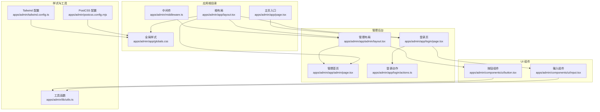
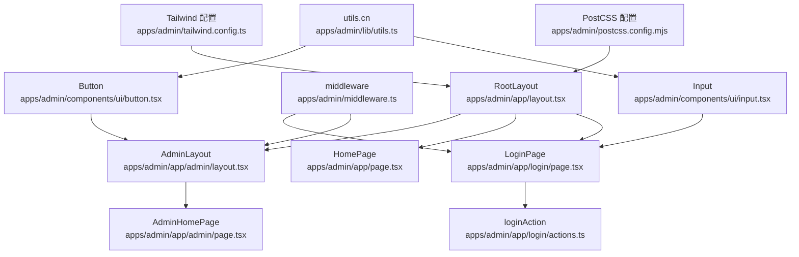
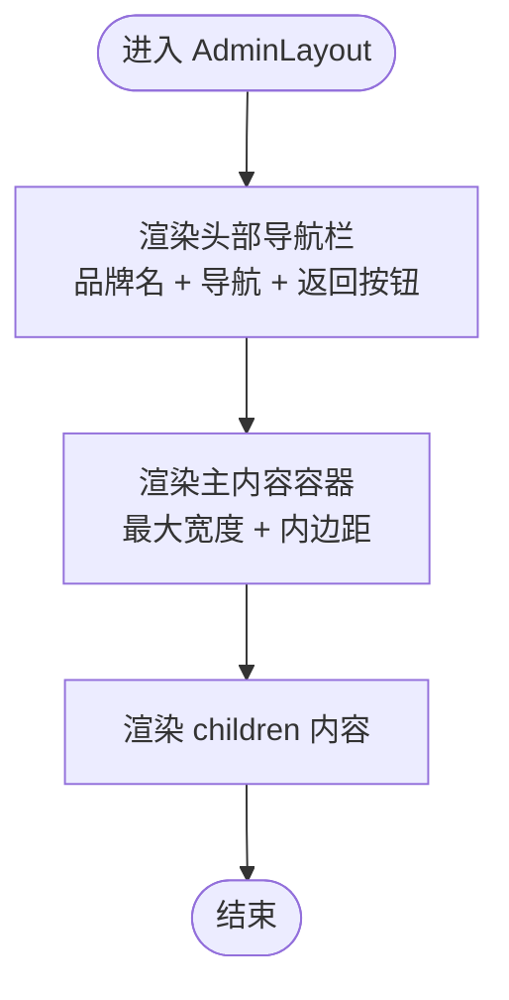
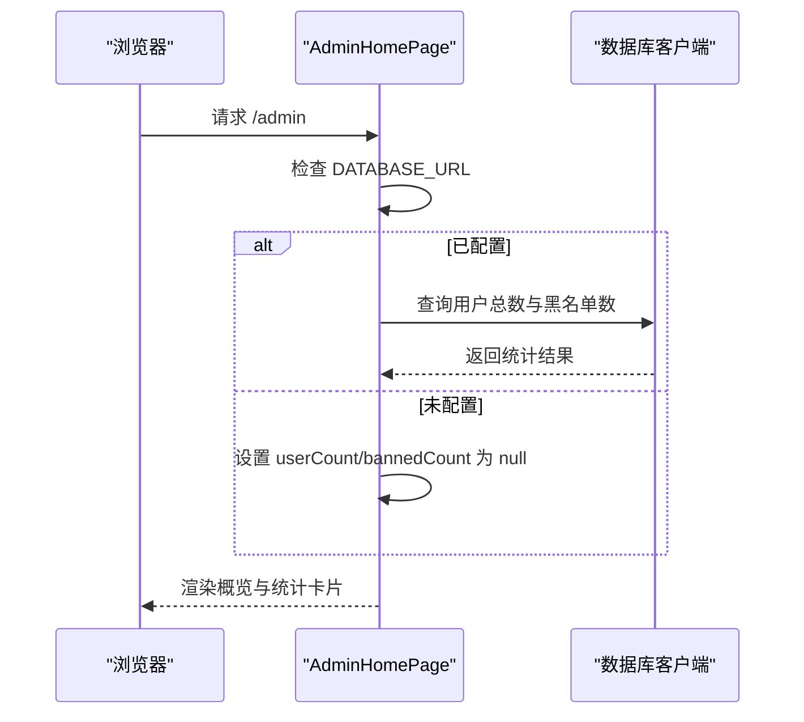
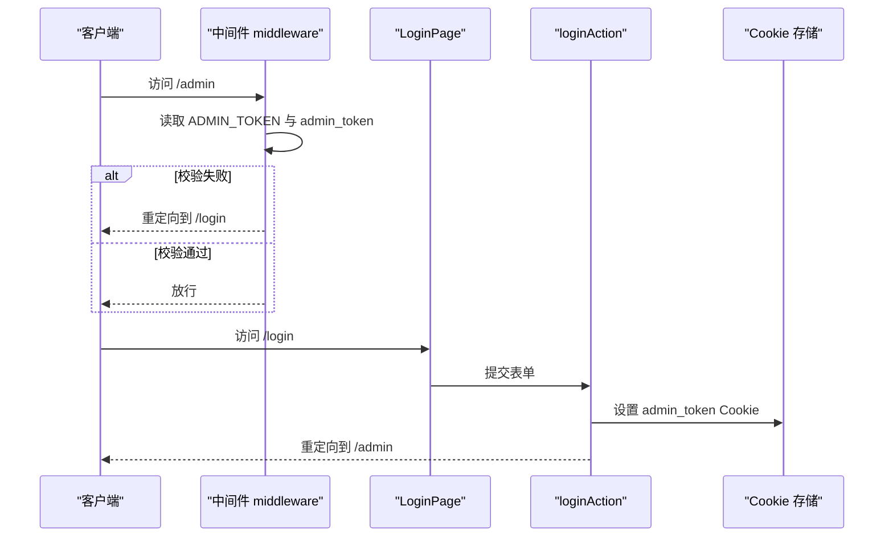
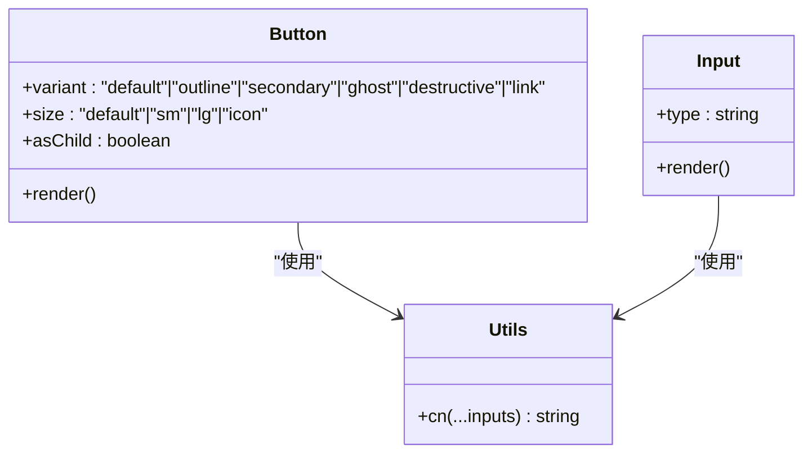
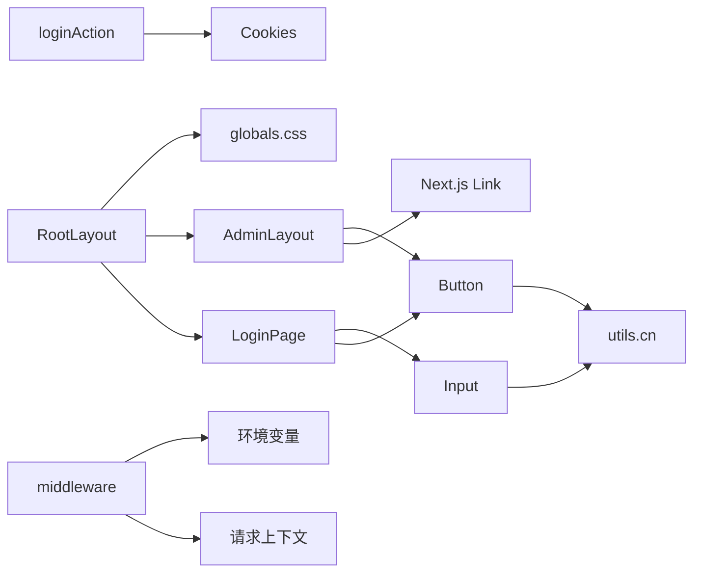

# 后台布局与导航

<cite>
**本文引用的文件**
- [apps/admin/app/layout.tsx](file://apps/admin/app/layout.tsx)
- [apps/admin/app/admin/layout.tsx](file://apps/admin/app/admin/layout.tsx)
- [apps/admin/app/page.tsx](file://apps/admin/app/page.tsx)
- [apps/admin/app/admin/page.tsx](file://apps/admin/app/admin/page.tsx)
- [apps/admin/middleware.ts](file://apps/admin/middleware.ts)
- [apps/admin/components/ui/button.tsx](file://apps/admin/components/ui/button.tsx)
- [apps/admin/components/ui/input.tsx](file://apps/admin/components/ui/input.tsx)
- [apps/admin/lib/utils.ts](file://apps/admin/lib/utils.ts)
- [apps/admin/app/globals.css](file://apps/admin/app/globals.css)
- [apps/admin/tailwind.config.ts](file://apps/admin/tailwind.config.ts)
- [apps/admin/postcss.config.mjs](file://apps/admin/postcss.config.mjs)
- [apps/admin/app/login/page.tsx](file://apps/admin/app/login/page.tsx)
- [apps/admin/app/login/actions.ts](file://apps/admin/app/login/actions.ts)
- [apps/admin/app/api/bot/bind-code/route.ts](file://apps/admin/app/api/bot/bind-code/route.ts)
- [apps/admin/app/api/bind/confirm/route.ts](file://apps/admin/app/api/bind/confirm/route.ts)
</cite>

## 目录
1. [简介](#简介)
2. [项目结构](#项目结构)
3. [核心组件](#核心组件)
4. [架构总览](#架构总览)
5. [详细组件分析](#详细组件分析)
6. [依赖关系分析](#依赖关系分析)
7. [性能考虑](#性能考虑)
8. [故障排查指南](#故障排查指南)
9. [结论](#结论)
10. [附录](#附录)

## 简介
本文件面向管理后台的布局与导航系统，系统基于 Next.js App Router 构建，采用分层布局设计：根布局负责全局元数据与基础样式，管理后台布局负责头部导航、返回按钮与主内容区，登录流程通过中间件与服务端动作完成鉴权与会话持久化。导航菜单目前以静态链接为主，支持活动态切换与返回入口；页面容器采用最大宽度约束与内边距，确保在桌面与移动设备上的良好可读性。

## 项目结构
管理后台布局相关的核心文件分布如下：
- 根布局与全局样式：apps/admin/app/layout.tsx、apps/admin/app/globals.css
- 管理后台布局与首页：apps/admin/app/admin/layout.tsx、apps/admin/app/admin/page.tsx
- 主页入口与登录页：apps/admin/app/page.tsx、apps/admin/app/login/page.tsx、apps/admin/app/login/actions.ts
- 中间件：apps/admin/middleware.ts
- UI 组件：apps/admin/components/ui/button.tsx、apps/admin/components/ui/input.tsx
- 工具函数与样式配置：apps/admin/lib/utils.ts、apps/admin/tailwind.config.ts、apps/admin/postcss.config.mjs
- API 路由示例：apps/admin/app/api/bot/bind-code/route.ts、apps/admin/app/api/bind/confirm/route.ts

图表来源
- [apps/admin/app/layout.tsx](file://apps/admin/app/layout.tsx#L1-L24)
- [apps/admin/app/globals.css](file://apps/admin/app/globals.css#L1-L5)
- [apps/admin/app/page.tsx](file://apps/admin/app/page.tsx#L1-L21)
- [apps/admin/middleware.ts](file://apps/admin/middleware.ts#L1-L23)
- [apps/admin/app/admin/layout.tsx](file://apps/admin/app/admin/layout.tsx#L1-L28)
- [apps/admin/app/admin/page.tsx](file://apps/admin/app/admin/page.tsx#L1-L47)
- [apps/admin/app/login/page.tsx](file://apps/admin/app/login/page.tsx#L1-L44)
- [apps/admin/app/login/actions.ts](file://apps/admin/app/login/actions.ts#L1-L29)
- [apps/admin/components/ui/button.tsx](file://apps/admin/components/ui/button.tsx#L1-L57)
- [apps/admin/components/ui/input.tsx](file://apps/admin/components/ui/input.tsx#L1-L27)
- [apps/admin/lib/utils.ts](file://apps/admin/lib/utils.ts#L1-L8)
- [apps/admin/tailwind.config.ts](file://apps/admin/tailwind.config.ts#L1-L14)
- [apps/admin/postcss.config.mjs](file://apps/admin/postcss.config.mjs#L1-L7)

章节来源
- [apps/admin/app/layout.tsx](file://apps/admin/app/layout.tsx#L1-L24)
- [apps/admin/app/admin/layout.tsx](file://apps/admin/app/admin/layout.tsx#L1-L28)
- [apps/admin/app/page.tsx](file://apps/admin/app/page.tsx#L1-L21)
- [apps/admin/app/admin/page.tsx](file://apps/admin/app/admin/page.tsx#L1-L47)
- [apps/admin/middleware.ts](file://apps/admin/middleware.ts#L1-L23)
- [apps/admin/app/login/page.tsx](file://apps/admin/app/login/page.tsx#L1-L44)
- [apps/admin/app/login/actions.ts](file://apps/admin/app/login/actions.ts#L1-L29)
- [apps/admin/components/ui/button.tsx](file://apps/admin/components/ui/button.tsx#L1-L57)
- [apps/admin/components/ui/input.tsx](file://apps/admin/components/ui/input.tsx#L1-L27)
- [apps/admin/lib/utils.ts](file://apps/admin/lib/utils.ts#L1-L8)
- [apps/admin/app/globals.css](file://apps/admin/app/globals.css#L1-L5)
- [apps/admin/tailwind.config.ts](file://apps/admin/tailwind.config.ts#L1-L14)
- [apps/admin/postcss.config.mjs](file://apps/admin/postcss.config.mjs#L1-L7)

## 核心组件
- 根布局 RootLayout：设置全局元数据与基础 HTML 结构，承载所有页面的根节点，提供最小高度与基础字体与抗锯齿样式。
- 管理后台布局 AdminLayout：定义头部导航区域（品牌名、主导航、返回按钮）与主内容区容器，使用最大宽度与内边距约束内容宽度，保证在大屏与小屏的可读性。
- 登录页 LoginPage：展示登录表单与错误提示，结合服务端动作处理登录逻辑。
- 中间件 middleware：拦截 /admin 路径，校验管理员令牌与 Cookie，未通过则重定向至登录页。
- UI 组件 Button 与 Input：提供变体与尺寸控制，支持透传属性与作为子元素渲染，便于与 Next.js Link 组合使用。

章节来源
- [apps/admin/app/layout.tsx](file://apps/admin/app/layout.tsx#L1-L24)
- [apps/admin/app/admin/layout.tsx](file://apps/admin/app/admin/layout.tsx#L1-L28)
- [apps/admin/app/login/page.tsx](file://apps/admin/app/login/page.tsx#L1-L44)
- [apps/admin/middleware.ts](file://apps/admin/middleware.ts#L1-L23)
- [apps/admin/components/ui/button.tsx](file://apps/admin/components/ui/button.tsx#L1-L57)
- [apps/admin/components/ui/input.tsx](file://apps/admin/components/ui/input.tsx#L1-L27)

## 架构总览
管理后台采用“根布局 + 页面布局 + 页面内容”的分层结构。根布局负责全局样式与元数据；管理后台布局负责导航与容器；登录流程通过中间件与服务端动作完成鉴权与 Cookie 设置；UI 组件通过变体系统与工具函数实现样式合并与复用。

图表来源
- [apps/admin/app/layout.tsx](file://apps/admin/app/layout.tsx#L1-L24)
- [apps/admin/app/admin/layout.tsx](file://apps/admin/app/admin/layout.tsx#L1-L28)
- [apps/admin/app/page.tsx](file://apps/admin/app/page.tsx#L1-L21)
- [apps/admin/app/admin/page.tsx](file://apps/admin/app/admin/page.tsx#L1-L47)
- [apps/admin/app/login/page.tsx](file://apps/admin/app/login/page.tsx#L1-L44)
- [apps/admin/app/login/actions.ts](file://apps/admin/app/login/actions.ts#L1-L29)
- [apps/admin/middleware.ts](file://apps/admin/middleware.ts#L1-L23)
- [apps/admin/components/ui/button.tsx](file://apps/admin/components/ui/button.tsx#L1-L57)
- [apps/admin/components/ui/input.tsx](file://apps/admin/components/ui/input.tsx#L1-L27)
- [apps/admin/lib/utils.ts](file://apps/admin/lib/utils.ts#L1-L8)
- [apps/admin/tailwind.config.ts](file://apps/admin/tailwind.config.ts#L1-L14)
- [apps/admin/postcss.config.mjs](file://apps/admin/postcss.config.mjs#L1-L7)

## 详细组件分析

### 根布局 RootLayout
- 职责：设置页面元数据（标题、描述），注入全局样式，提供最小视口高度与基础字体与抗锯齿。
- 设计要点：使用 HTML 语言属性与基础背景色与文字色，确保默认主题一致；全局样式通过 Tailwind 指令引入，保证按需构建。
- 复杂度：O(1)，无状态组件，仅负责结构与样式注入。

章节来源
- [apps/admin/app/layout.tsx](file://apps/admin/app/layout.tsx#L1-L24)
- [apps/admin/app/globals.css](file://apps/admin/app/globals.css#L1-L5)

### 管理后台布局 AdminLayout
- 职责：提供头部导航栏（品牌名、主导航、返回按钮）、主内容区容器，约束最大宽度与内边距。
- 导航菜单：包含品牌链接与“概览”导航项，返回按钮使用 Button 组件与 Link 组合，保持一致的交互与样式。
- 活动状态管理：当前实现中导航项为静态链接，未内置活动态高亮逻辑；可通过在路由变化时动态计算或使用客户端状态扩展。
- 响应式设计：使用 Flex 布局与最大宽度约束，在不同屏幕尺寸下保持内容居中与可读性；按钮尺寸通过变体控制。
- Props 传递与 Children 渲染：接收 children 并在主内容区渲染，遵循 React 的组合模式；Button 支持 asChild 将其渲染为 Link。

图表来源
- [apps/admin/app/admin/layout.tsx](file://apps/admin/app/admin/layout.tsx#L1-L28)
- [apps/admin/components/ui/button.tsx](file://apps/admin/components/ui/button.tsx#L1-L57)

章节来源
- [apps/admin/app/admin/layout.tsx](file://apps/admin/app/admin/layout.tsx#L1-L28)
- [apps/admin/components/ui/button.tsx](file://apps/admin/components/ui/button.tsx#L1-L57)

### 管理后台首页 AdminHomePage
- 职责：展示概览信息与统计数据，从数据库读取用户数与黑名单用户数，若数据库不可用则显示占位提示。
- 数据加载：通过动态导入数据库客户端进行查询，异常时回退为 null 并渲染占位信息。
- 布局：使用网格布局展示卡片式统计信息，响应式适配小屏设备。

图表来源
- [apps/admin/app/admin/page.tsx](file://apps/admin/app/admin/page.tsx#L1-L47)

章节来源
- [apps/admin/app/admin/page.tsx](file://apps/admin/app/admin/page.tsx#L1-L47)

### 登录流程与中间件
- 中间件 middleware：拦截 /admin 路径，读取环境变量与 Cookie，若未通过校验则重定向至 /login。
- 登录页 LoginPage：展示登录表单与错误提示，根据环境变量决定是否提示未设置管理员令牌。
- 登录动作 loginAction：服务端动作接收表单数据，校验令牌后设置 HttpOnly Cookie 并重定向至 /admin。

图表来源
- [apps/admin/middleware.ts](file://apps/admin/middleware.ts#L1-L23)
- [apps/admin/app/login/page.tsx](file://apps/admin/app/login/page.tsx#L1-L44)
- [apps/admin/app/login/actions.ts](file://apps/admin/app/login/actions.ts#L1-L29)

章节来源
- [apps/admin/middleware.ts](file://apps/admin/middleware.ts#L1-L23)
- [apps/admin/app/login/page.tsx](file://apps/admin/app/login/page.tsx#L1-L44)
- [apps/admin/app/login/actions.ts](file://apps/admin/app/login/actions.ts#L1-L29)

### UI 组件 Button 与 Input
- Button：通过变体系统提供多种外观与尺寸，支持 asChild 将其渲染为 Link 或其他元素，便于与 Next.js 路由集成。
- Input：提供基础输入样式与焦点状态，支持透传属性，便于在表单中使用。
- 样式合并：通过工具函数合并类名，确保 Tailwind 与自定义样式的兼容性。

图表来源
- [apps/admin/components/ui/button.tsx](file://apps/admin/components/ui/button.tsx#L1-L57)
- [apps/admin/components/ui/input.tsx](file://apps/admin/components/ui/input.tsx#L1-L27)
- [apps/admin/lib/utils.ts](file://apps/admin/lib/utils.ts#L1-L8)

章节来源
- [apps/admin/components/ui/button.tsx](file://apps/admin/components/ui/button.tsx#L1-L57)
- [apps/admin/components/ui/input.tsx](file://apps/admin/components/ui/input.tsx#L1-L27)
- [apps/admin/lib/utils.ts](file://apps/admin/lib/utils.ts#L1-L8)

### 页面布局组件设计模式
- Header、Main Content、Footer 组织方式：AdminLayout 将头部与主内容区分离，Footer 可按需扩展；通过最大宽度与内边距约束内容宽度，保证在桌面与移动设备上的可读性。
- Props 传递与 Children 渲染：AdminLayout 接收 children 并在主内容区渲染，遵循 React 组合模式；Button 支持 asChild，可将其渲染为 Link，实现导航与按钮的统一。
- 自定义选项与主题配置：通过 Tailwind 配置与 PostCSS 插件链，支持暗色模式与内容扫描路径；工具函数用于类名合并，便于扩展主题变体。

章节来源
- [apps/admin/app/admin/layout.tsx](file://apps/admin/app/admin/layout.tsx#L1-L28)
- [apps/admin/tailwind.config.ts](file://apps/admin/tailwind.config.ts#L1-L14)
- [apps/admin/postcss.config.mjs](file://apps/admin/postcss.config.mjs#L1-L7)
- [apps/admin/lib/utils.ts](file://apps/admin/lib/utils.ts#L1-L8)

### 导航菜单实现与活动状态管理
- 链接路由配置：使用 Next.js Link 组件包裹导航项与返回按钮，确保客户端路由跳转与预取优化。
- 活动状态管理：当前实现为静态链接，未内置活动态高亮；可通过客户端路由状态或服务端渲染时的路径匹配扩展。
- 响应式设计：使用 Flex 布局与最大宽度约束，确保在小屏设备上导航项的可读性与点击面积。

章节来源
- [apps/admin/app/admin/layout.tsx](file://apps/admin/app/admin/layout.tsx#L1-L28)

### 移动端适配与无障碍访问
- 移动端适配：通过最大宽度与内边距约束内容宽度，使用 Flex 布局在窄屏下自动换行；按钮尺寸通过变体控制，确保触摸目标大小。
- 无障碍访问：Next.js Link 与原生 HTML 元素具备基础可访问性；建议为导航项添加语义化标签与键盘可达性，按钮与输入框提供清晰的焦点状态与提示文本。

章节来源
- [apps/admin/app/admin/layout.tsx](file://apps/admin/app/admin/layout.tsx#L1-L28)
- [apps/admin/components/ui/button.tsx](file://apps/admin/components/ui/button.tsx#L1-L57)
- [apps/admin/components/ui/input.tsx](file://apps/admin/components/ui/input.tsx#L1-L27)

## 依赖关系分析
- 组件耦合：AdminLayout 依赖 Button 组件与 Next.js Link；LoginPage 依赖 Input 与 Button；loginAction 依赖 Cookie 与重定向；middleware 依赖环境变量与请求上下文。
- 外部依赖：Next.js App Router、Tailwind CSS、class-variance-authority、Radix UI Slot、Zod（API 路由参数校验）。
- 样式依赖：全局样式通过 Tailwind 指令引入，工具函数负责类名合并，确保样式一致性与可维护性。

图表来源
- [apps/admin/app/admin/layout.tsx](file://apps/admin/app/admin/layout.tsx#L1-L28)
- [apps/admin/components/ui/button.tsx](file://apps/admin/components/ui/button.tsx#L1-L57)
- [apps/admin/components/ui/input.tsx](file://apps/admin/components/ui/input.tsx#L1-L27)
- [apps/admin/app/login/actions.ts](file://apps/admin/app/login/actions.ts#L1-L29)
- [apps/admin/middleware.ts](file://apps/admin/middleware.ts#L1-L23)
- [apps/admin/app/layout.tsx](file://apps/admin/app/layout.tsx#L1-L24)
- [apps/admin/app/globals.css](file://apps/admin/app/globals.css#L1-L5)
- [apps/admin/lib/utils.ts](file://apps/admin/lib/utils.ts#L1-L8)

章节来源
- [apps/admin/app/admin/layout.tsx](file://apps/admin/app/admin/layout.tsx#L1-L28)
- [apps/admin/components/ui/button.tsx](file://apps/admin/components/ui/button.tsx#L1-L57)
- [apps/admin/components/ui/input.tsx](file://apps/admin/components/ui/input.tsx#L1-L27)
- [apps/admin/app/login/actions.ts](file://apps/admin/app/login/actions.ts#L1-L29)
- [apps/admin/middleware.ts](file://apps/admin/middleware.ts#L1-L23)
- [apps/admin/app/layout.tsx](file://apps/admin/app/layout.tsx#L1-L24)
- [apps/admin/app/globals.css](file://apps/admin/app/globals.css#L1-L5)
- [apps/admin/lib/utils.ts](file://apps/admin/lib/utils.ts#L1-L8)

## 性能考虑
- 样式按需构建：通过 Tailwind 指令与内容扫描路径，确保仅打包实际使用的样式，减少包体积。
- 组件复用：Button 与 Input 通过变体系统与工具函数实现复用，降低重复样式定义。
- 动态导入：管理首页在存在数据库配置时才进行数据查询，避免不必要的 I/O 开销。
- 中间件放行：在未设置管理员令牌且非生产环境时直接放行，减少不必要的鉴权检查。

## 故障排查指南
- 登录失败：检查 ADMIN_TOKEN 是否正确设置，确认 Cookie 是否被设置为 HttpOnly 且路径正确；查看登录页错误提示与服务端动作返回的状态码。
- 访问 /admin 被重定向：确认中间件是否生效，检查 admin_token Cookie 是否存在且与 ADMIN_TOKEN 匹配。
- 样式异常：确认 Tailwind 配置与 PostCSS 插件链是否正确，检查全局样式是否被正确引入。
- 导航不生效：确认 Next.js Link 的路由配置与 asChild 使用是否正确，检查 Button 的 variant 与 size 是否符合预期。

章节来源
- [apps/admin/app/login/actions.ts](file://apps/admin/app/login/actions.ts#L1-L29)
- [apps/admin/middleware.ts](file://apps/admin/middleware.ts#L1-L23)
- [apps/admin/tailwind.config.ts](file://apps/admin/tailwind.config.ts#L1-L14)
- [apps/admin/postcss.config.mjs](file://apps/admin/postcss.config.mjs#L1-L7)
- [apps/admin/components/ui/button.tsx](file://apps/admin/components/ui/button.tsx#L1-L57)

## 结论
该管理后台布局与导航系统采用清晰的分层结构与组件化设计，根布局负责全局样式与元数据，管理后台布局提供头部导航与主内容容器，登录流程通过中间件与服务端动作完成鉴权与会话持久化。UI 组件通过变体系统与工具函数实现样式复用与扩展。当前导航菜单为静态链接，活动状态可通过客户端状态或路由匹配扩展；移动端适配与无障碍访问建议进一步增强语义化与键盘可达性。

## 附录
- API 路由示例：机器人绑定验证码生成与确认接口展示了服务端动作、参数校验与数据库操作的典型流程，可作为扩展导航与页面功能的参考。

章节来源
- [apps/admin/app/api/bot/bind-code/route.ts](file://apps/admin/app/api/bot/bind-code/route.ts#L1-L105)
- [apps/admin/app/api/bind/confirm/route.ts](file://apps/admin/app/api/bind/confirm/route.ts#L1-L91)