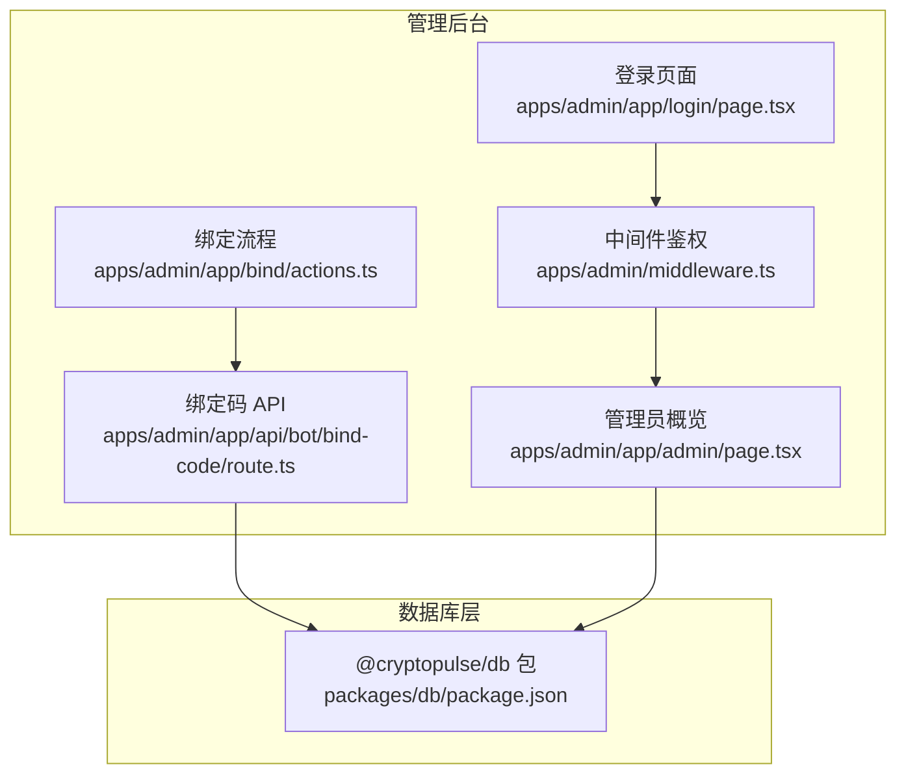
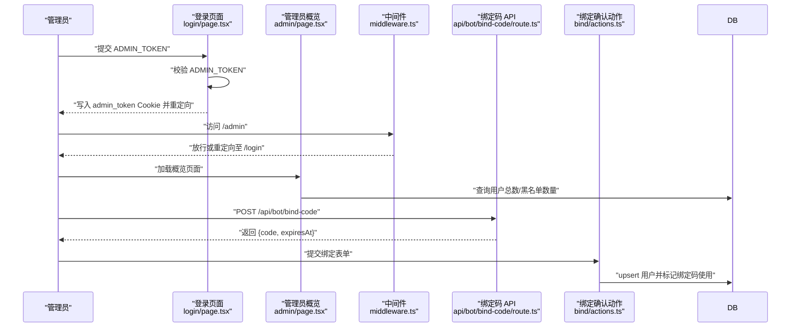
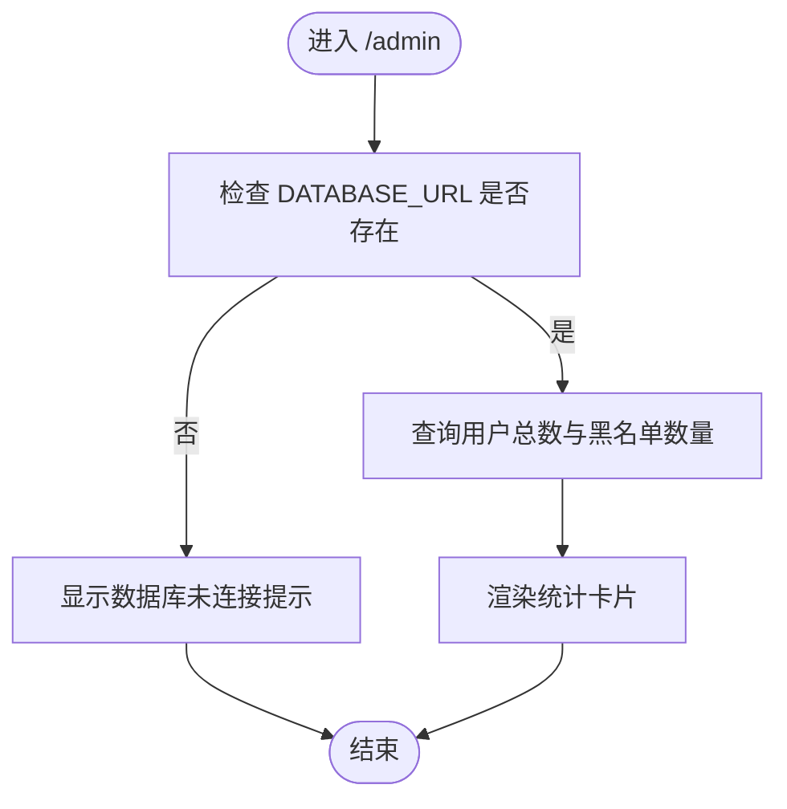
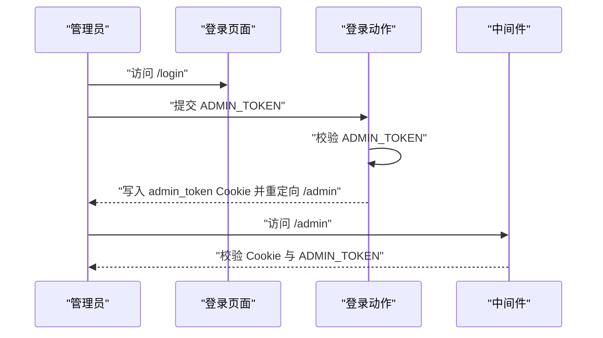
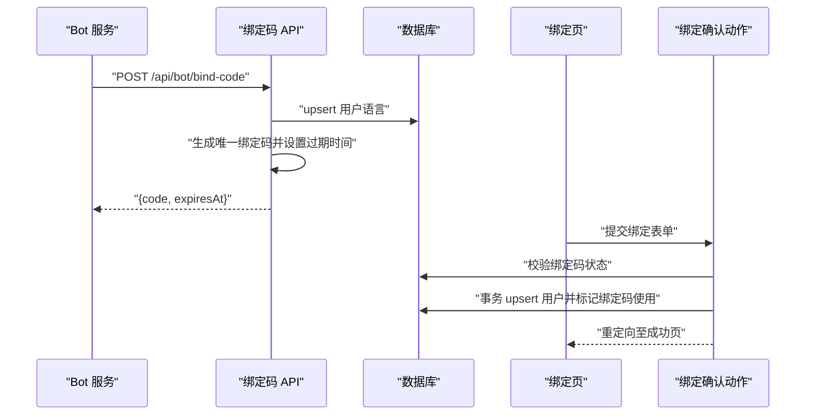
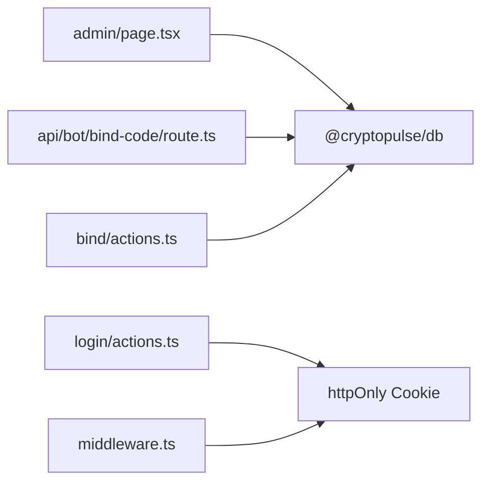

# 用户管理功能

<cite>
**本文档引用的文件**
- [apps/admin/app/admin/page.tsx](file://apps/admin/app/admin/page.tsx)
- [apps/admin/app/admin/layout.tsx](file://apps/admin/app/admin/layout.tsx)
- [apps/admin/app/login/actions.ts](file://apps/admin/app/login/actions.ts)
- [apps/admin/app/login/page.tsx](file://apps/admin/app/login/page.tsx)
- [apps/admin/middleware.ts](file://apps/admin/middleware.ts)
- [apps/admin/app/api/bot/bind-code/route.ts](file://apps/admin/app/api/bot/bind-code/route.ts)
- [apps/admin/app/bind/actions.ts](file://apps/admin/app/bind/actions.ts)
- [apps/admin/components/ui/button.tsx](file://apps/admin/components/ui/button.tsx)
- [apps/admin/components/ui/input.tsx](file://apps/admin/components/ui/input.tsx)
- [packages/db/package.json](file://packages/db/package.json)
</cite>

## 目录
1. [简介](#简介)
2. [项目结构](#项目结构)
3. [核心组件](#核心组件)
4. [架构总览](#架构总览)
5. [详细组件分析](#详细组件分析)
6. [依赖关系分析](#依赖关系分析)
7. [性能考虑](#性能考虑)
8. [故障排除指南](#故障排除指南)
9. [结论](#结论)

## 简介
本文件面向 Polymarket 管理后台中的用户管理功能，聚焦于用户列表页面的设计与实现、用户状态管理（激活/禁用）、绑定状态查看与权限分配、批量操作与状态更新、数据获取与更新机制（API 调用、缓存策略与实时同步）、交互设计与用户体验优化，以及用户数据的安全存储与隐私保护。  
当前仓库中已实现的功能主要围绕“用户概览统计”、“管理员登录鉴权”、“Bot 绑定码发放与确认绑定”等基础能力，尚未包含完整的用户列表页面、搜索过滤、分页显示与批量操作等高级功能。本文将基于现有代码进行系统化梳理，并给出可扩展的实现建议。

## 项目结构
管理后台采用 Next.js App Router 架构，核心入口位于 apps/admin，包含以下与用户管理密切相关的模块：
- 管理员概览页面：展示用户总数与黑名单用户数量
- 管理员登录与鉴权：基于环境变量 ADMIN_TOKEN 的登录流程与中间件保护
- Bot 绑定流程：通过 API 发放绑定码，前端表单确认绑定并更新用户信息
- UI 组件：按钮与输入框等基础组件

**图表来源**
- [apps/admin/app/admin/page.tsx](file://apps/admin/app/admin/page.tsx#L1-L47)
- [apps/admin/app/login/page.tsx](file://apps/admin/app/login/page.tsx#L1-L44)
- [apps/admin/middleware.ts](file://apps/admin/middleware.ts#L1-L23)
- [apps/admin/app/bind/actions.ts](file://apps/admin/app/bind/actions.ts#L1-L90)
- [apps/admin/app/api/bot/bind-code/route.ts](file://apps/admin/app/api/bot/bind-code/route.ts#L1-L105)
- [packages/db/package.json](file://packages/db/package.json#L1-L22)

**章节来源**
- [apps/admin/app/admin/page.tsx](file://apps/admin/app/admin/page.tsx#L1-L47)
- [apps/admin/app/admin/layout.tsx](file://apps/admin/app/admin/layout.tsx#L1-L28)
- [apps/admin/app/login/actions.ts](file://apps/admin/app/login/actions.ts#L1-L29)
- [apps/admin/app/login/page.tsx](file://apps/admin/app/login/page.tsx#L1-L44)
- [apps/admin/middleware.ts](file://apps/admin/middleware.ts#L1-L23)
- [apps/admin/app/bind/actions.ts](file://apps/admin/app/bind/actions.ts#L1-L90)
- [apps/admin/app/api/bot/bind-code/route.ts](file://apps/admin/app/api/bot/bind-code/route.ts#L1-L105)
- [packages/db/package.json](file://packages/db/package.json#L1-L22)

## 核心组件
- 管理员概览页面：读取数据库统计信息并展示用户总数与黑名单用户数量，支持数据库不可用时的降级提示。
- 管理员登录与鉴权：通过环境变量 ADMIN_TOKEN 进行口令校验，登录成功后写入 httpOnly Cookie，中间件拦截未授权访问。
- Bot 绑定流程：Bot 侧请求绑定码，管理后台发放唯一绑定码并设置过期时间；用户在绑定页提交地址信息，服务端校验并完成用户信息更新与绑定码标记使用。
- UI 组件：统一的按钮与输入框组件，提供一致的交互风格与可访问性。

**章节来源**
- [apps/admin/app/admin/page.tsx](file://apps/admin/app/admin/page.tsx#L1-L47)
- [apps/admin/app/login/actions.ts](file://apps/admin/app/login/actions.ts#L1-L29)
- [apps/admin/app/login/page.tsx](file://apps/admin/app/login/page.tsx#L1-L44)
- [apps/admin/middleware.ts](file://apps/admin/middleware.ts#L1-L23)
- [apps/admin/app/bind/actions.ts](file://apps/admin/app/bind/actions.ts#L1-L90)
- [apps/admin/app/api/bot/bind-code/route.ts](file://apps/admin/app/api/bot/bind-code/route.ts#L1-L105)
- [apps/admin/components/ui/button.tsx](file://apps/admin/components/ui/button.tsx#L1-L57)
- [apps/admin/components/ui/input.tsx](file://apps/admin/components/ui/input.tsx)

## 架构总览
下图展示了用户管理相关的关键交互路径：管理员登录 → 中间件鉴权 → 概览页面读取数据库 → Bot 绑定码发放与用户绑定。

**图表来源**
- [apps/admin/app/login/page.tsx](file://apps/admin/app/login/page.tsx#L1-L44)
- [apps/admin/app/login/actions.ts](file://apps/admin/app/login/actions.ts#L1-L29)
- [apps/admin/middleware.ts](file://apps/admin/middleware.ts#L1-L23)
- [apps/admin/app/admin/page.tsx](file://apps/admin/app/admin/page.tsx#L1-L47)
- [apps/admin/app/api/bot/bind-code/route.ts](file://apps/admin/app/api/bot/bind-code/route.ts#L1-L105)
- [apps/admin/app/bind/actions.ts](file://apps/admin/app/bind/actions.ts#L1-L90)

## 详细组件分析

### 管理员概览页面
- 功能概述：在数据库可用时读取用户总数与黑名单用户数量，并以卡片形式展示；当 DATABASE_URL 未配置或连接失败时，展示降级提示。
- 关键点：
  - 异步加载统计信息，避免阻塞首屏渲染
  - 对数据库异常进行兜底处理，确保页面稳定
  - 响应式布局，适配移动端与桌面端

**图表来源**
- [apps/admin/app/admin/page.tsx](file://apps/admin/app/admin/page.tsx#L1-L47)

**章节来源**
- [apps/admin/app/admin/page.tsx](file://apps/admin/app/admin/page.tsx#L1-L47)

### 管理员登录与鉴权
- 登录流程：表单提交 ADMIN_TOKEN，校验通过后写入 httpOnly Cookie，重定向至 /admin。
- 鉴权中间件：拦截 /admin 及其子路径，若未设置 ADMIN_TOKEN 且非生产环境则放行；否则校验 Cookie 与环境变量是否匹配，不匹配则重定向至 /login。
- 安全要点：
  - 使用 httpOnly Cookie 存储令牌，降低 XSS 风险
  - 生产环境强制要求 ADMIN_TOKEN，防止匿名访问

**图表来源**
- [apps/admin/app/login/page.tsx](file://apps/admin/app/login/page.tsx#L1-L44)
- [apps/admin/app/login/actions.ts](file://apps/admin/app/login/actions.ts#L1-L29)
- [apps/admin/middleware.ts](file://apps/admin/middleware.ts#L1-L23)

**章节来源**
- [apps/admin/app/login/actions.ts](file://apps/admin/app/login/actions.ts#L1-L29)
- [apps/admin/app/login/page.tsx](file://apps/admin/app/login/page.tsx#L1-L44)
- [apps/admin/middleware.ts](file://apps/admin/middleware.ts#L1-L23)

### Bot 绑定码发放与用户绑定
- 绑定码发放 API：
  - 校验 Authorization 头与 BOT_API_TOKEN
  - upsert 用户语言信息
  - 循环生成唯一绑定码，设置 10 分钟过期时间
  - 返回 {code, expiresAt}
- 绑定确认动作：
  - 使用 Zod 校验表单参数（包含多个以太坊地址格式）
  - 校验数据库可用性与 Prisma 可用性
  - 查询绑定码是否存在、是否已使用、是否过期
  - 使用事务 upsert 用户并标记绑定码使用
  - 失败时根据错误类型重定向并携带错误参数

**图表来源**
- [apps/admin/app/api/bot/bind-code/route.ts](file://apps/admin/app/api/bot/bind-code/route.ts#L1-L105)
- [apps/admin/app/bind/actions.ts](file://apps/admin/app/bind/actions.ts#L1-L90)

**章节来源**
- [apps/admin/app/api/bot/bind-code/route.ts](file://apps/admin/app/api/bot/bind-code/route.ts#L1-L105)
- [apps/admin/app/bind/actions.ts](file://apps/admin/app/bind/actions.ts#L1-L90)

### UI 组件与交互设计
- 按钮组件：提供多种变体与尺寸，支持作为 HTML button 或自定义元素容器，保证一致的视觉与交互体验。
- 输入组件：提供基础输入样式，配合表单使用。
- 交互优化建议：
  - 在登录页对未设置 ADMIN_TOKEN 的情况进行明确提示
  - 在绑定页对无效输入与服务器错误进行清晰反馈
  - 在概览页对数据库不可用场景提供可读性强的降级提示

**章节来源**
- [apps/admin/components/ui/button.tsx](file://apps/admin/components/ui/button.tsx#L1-L57)
- [apps/admin/components/ui/input.tsx](file://apps/admin/components/ui/input.tsx)

## 依赖关系分析
- 管理后台依赖 @cryptopulse/db 提供的 Prisma 客户端进行数据库访问。
- 绑定码 API 与绑定确认动作均依赖 Prisma 进行 upsert 与事务操作。
- 中间件依赖环境变量 ADMIN_TOKEN 与 Cookie 进行鉴权控制。

**图表来源**
- [apps/admin/app/admin/page.tsx](file://apps/admin/app/admin/page.tsx#L1-L47)
- [apps/admin/app/login/actions.ts](file://apps/admin/app/login/actions.ts#L1-L29)
- [apps/admin/middleware.ts](file://apps/admin/middleware.ts#L1-L23)
- [apps/admin/app/api/bot/bind-code/route.ts](file://apps/admin/app/api/bot/bind-code/route.ts#L1-L105)
- [apps/admin/app/bind/actions.ts](file://apps/admin/app/bind/actions.ts#L1-L90)
- [packages/db/package.json](file://packages/db/package.json#L1-L22)

**章节来源**
- [packages/db/package.json](file://packages/db/package.json#L1-L22)
- [apps/admin/app/admin/page.tsx](file://apps/admin/app/admin/page.tsx#L1-L47)
- [apps/admin/app/api/bot/bind-code/route.ts](file://apps/admin/app/api/bot/bind-code/route.ts#L1-L105)
- [apps/admin/app/bind/actions.ts](file://apps/admin/app/bind/actions.ts#L1-L90)
- [apps/admin/app/login/actions.ts](file://apps/admin/app/login/actions.ts#L1-L29)
- [apps/admin/middleware.ts](file://apps/admin/middleware.ts#L1-L23)

## 性能考虑
- 数据库访问：
  - 概览页面仅进行计数查询，复杂度 O(n) 与表规模线性相关；可通过数据库索引优化 count 查询。
- API 安全与稳定性：
  - 绑定码发放 API 对 JSON 解析与 Prisma 错误进行显式处理，避免未知异常导致服务崩溃。
- 缓存策略：
  - 当前未实现客户端或服务端缓存；可在概览页面引入短期缓存（如 Redis）以减少重复查询。
- 实时同步：
  - 当前未实现 WebSocket 或长轮询；如需实时展示用户变化，可引入实时推送机制。

## 故障排除指南
- 登录失败：
  - 检查 ADMIN_TOKEN 是否正确设置；确认 Cookie 是否被写入且未被浏览器阻止。
- 数据库不可用：
  - 确认 DATABASE_URL 是否配置；检查数据库连通性与 Prisma 版本兼容性。
- 绑定码发放失败：
  - 校验 Authorization 头与 BOT_API_TOKEN；确认数据库可用与 Prisma 可用；检查唯一约束冲突处理逻辑。
- 绑定确认失败：
  - 检查绑定码是否过期或已被使用；确认地址格式是否符合以太坊地址规范；查看服务端错误日志定位问题。

**章节来源**
- [apps/admin/app/login/actions.ts](file://apps/admin/app/login/actions.ts#L1-L29)
- [apps/admin/middleware.ts](file://apps/admin/middleware.ts#L1-L23)
- [apps/admin/app/api/bot/bind-code/route.ts](file://apps/admin/app/api/bot/bind-code/route.ts#L1-L105)
- [apps/admin/app/bind/actions.ts](file://apps/admin/app/bind/actions.ts#L1-L90)

## 结论
当前用户管理功能已具备基础的管理员登录鉴权、用户概览统计与 Bot 绑定流程。为进一步完善用户管理体验，建议在现有基础上扩展用户列表页面（含搜索过滤与分页）、实现用户状态（激活/禁用）与权限分配、提供批量操作与数据导出能力，并引入缓存与实时同步机制以提升性能与用户体验。同时，持续强化安全与隐私保护措施，确保敏感数据的合规处理。