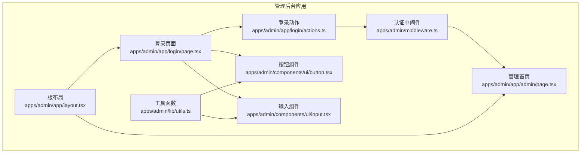
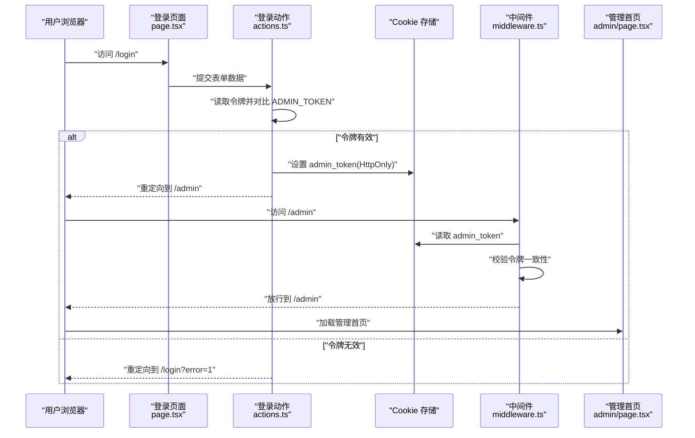
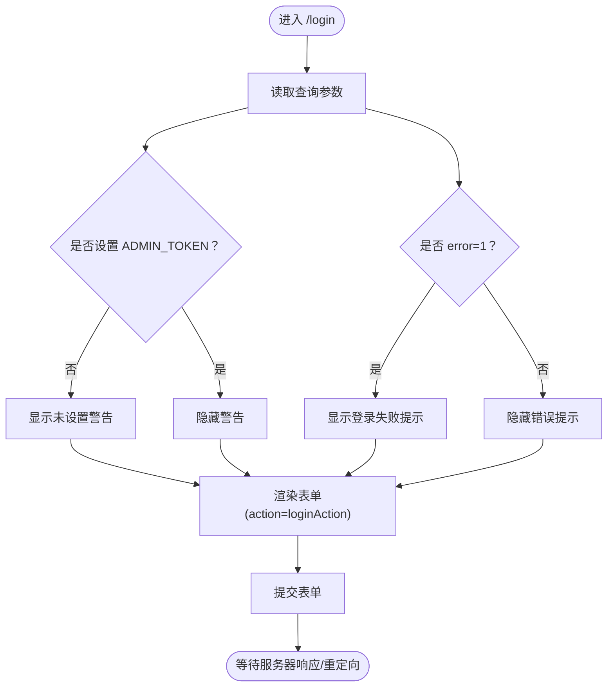
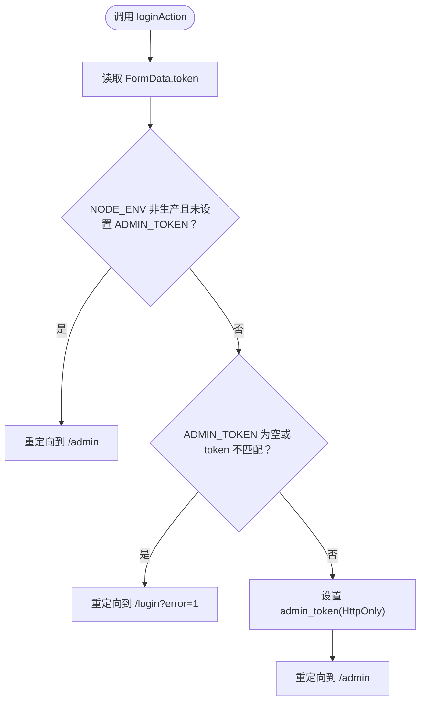
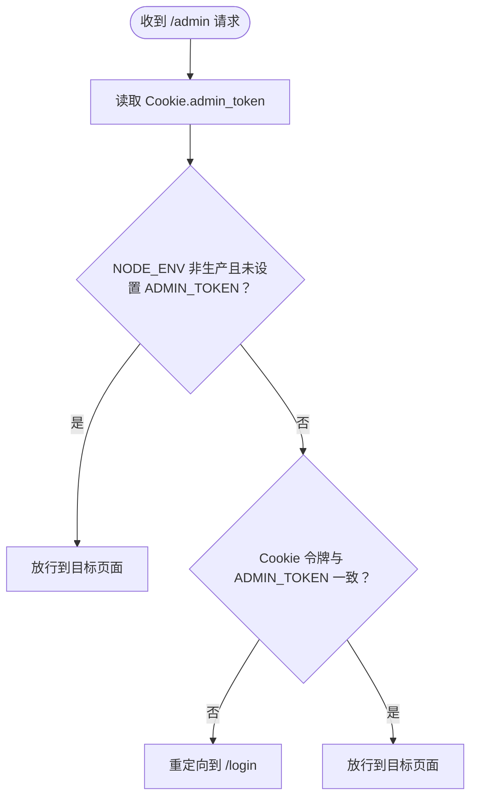
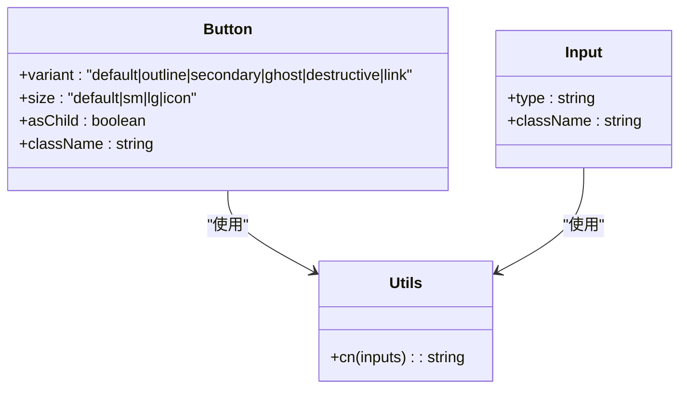
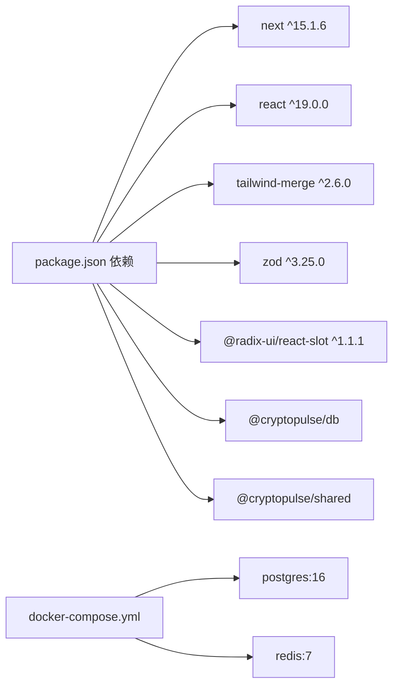

# 登录认证系统

<cite>
**本文档引用的文件**
- [apps/admin/app/login/actions.ts](file://apps/admin/app/login/actions.ts)
- [apps/admin/app/login/page.tsx](file://apps/admin/app/login/page.tsx)
- [apps/admin/middleware.ts](file://apps/admin/middleware.ts)
- [apps/admin/components/ui/button.tsx](file://apps/admin/components/ui/button.tsx)
- [apps/admin/components/ui/input.tsx](file://apps/admin/components/ui/input.tsx)
- [apps/admin/lib/utils.ts](file://apps/admin/lib/utils.ts)
- [apps/admin/app/layout.tsx](file://apps/admin/app/layout.tsx)
- [apps/admin/package.json](file://apps/admin/package.json)
- [apps/admin/app/admin/page.tsx](file://apps/admin/app/admin/page.tsx)
- [apps/admin/app/api/trade/orders/route.ts](file://apps/admin/app/api/trade/orders/route.ts)
- [.env.example](file://.env.example)
- [README.md](file://README.md)
- [docker-compose.yml](file://docker-compose.yml)
</cite>

## 目录
1. [简介](#简介)
2. [项目结构](#项目结构)
3. [核心组件](#核心组件)
4. [架构总览](#架构总览)
5. [详细组件分析](#详细组件分析)
6. [依赖关系分析](#依赖关系分析)
7. [性能考虑](#性能考虑)
8. [故障排除指南](#故障排除指南)
9. [结论](#结论)
10. [附录](#附录)

## 简介
本文件为登录认证系统的全面技术文档，覆盖用户登录流程、服务器端验证与错误处理、会话管理机制、认证中间件配置与使用方法，以及密码安全、CSRF 防护与暴力破解防护等安全策略。系统采用 Next.js App Router 的 Server Action 与中间件进行认证控制，通过环境变量 ADMIN_TOKEN 实现简单而有效的管理员登录保护。

## 项目结构
登录认证系统位于管理后台应用中，主要由以下模块组成：
- 登录页面与动作：负责渲染登录表单、处理用户输入与提交、执行登录逻辑与会话设置
- 中间件：拦截受保护路径，校验 Cookie 中的会话令牌
- UI 组件：按钮与输入框组件，提供一致的交互与样式
- 工具函数：通用类名合并工具
- 布局与元数据：根布局与站点元信息
- 环境配置：管理员令牌与数据库连接等关键配置

**图表来源**
- [apps/admin/app/login/page.tsx](file://apps/admin/app/login/page.tsx#L1-L44)
- [apps/admin/app/login/actions.ts](file://apps/admin/app/login/actions.ts#L1-L29)
- [apps/admin/middleware.ts](file://apps/admin/middleware.ts#L1-L23)
- [apps/admin/components/ui/button.tsx](file://apps/admin/components/ui/button.tsx#L1-L57)
- [apps/admin/components/ui/input.tsx](file://apps/admin/components/ui/input.tsx#L1-L27)
- [apps/admin/lib/utils.ts](file://apps/admin/lib/utils.ts#L1-L8)
- [apps/admin/app/layout.tsx](file://apps/admin/app/layout.tsx#L1-L24)
- [apps/admin/app/admin/page.tsx](file://apps/admin/app/admin/page.tsx#L1-L46)

**章节来源**
- [apps/admin/app/login/page.tsx](file://apps/admin/app/login/page.tsx#L1-L44)
- [apps/admin/app/login/actions.ts](file://apps/admin/app/login/actions.ts#L1-L29)
- [apps/admin/middleware.ts](file://apps/admin/middleware.ts#L1-L23)
- [apps/admin/components/ui/button.tsx](file://apps/admin/components/ui/button.tsx#L1-L57)
- [apps/admin/components/ui/input.tsx](file://apps/admin/components/ui/input.tsx#L1-L27)
- [apps/admin/lib/utils.ts](file://apps/admin/lib/utils.ts#L1-L8)
- [apps/admin/app/layout.tsx](file://apps/admin/app/layout.tsx#L1-L24)
- [apps/admin/app/admin/page.tsx](file://apps/admin/app/admin/page.tsx#L1-L46)

## 核心组件
- 登录页面组件：渲染标题、提示信息、错误反馈与登录表单，使用 Server Action 处理提交
- 登录动作函数：从请求体读取令牌，与环境变量 ADMIN_TOKEN 对比，成功则设置 HttpOnly Cookie 并重定向
- 认证中间件：拦截 /admin 路径，校验 Cookie 中的 admin_token 与 ADMIN_TOKEN 是否一致
- UI 组件：按钮与输入框，提供一致的样式与交互行为
- 工具函数：类名合并工具，用于组合 Tailwind 样式
- 根布局：定义站点元信息与全局样式

**章节来源**
- [apps/admin/app/login/page.tsx](file://apps/admin/app/login/page.tsx#L1-L44)
- [apps/admin/app/login/actions.ts](file://apps/admin/app/login/actions.ts#L1-L29)
- [apps/admin/middleware.ts](file://apps/admin/middleware.ts#L1-L23)
- [apps/admin/components/ui/button.tsx](file://apps/admin/components/ui/button.tsx#L1-L57)
- [apps/admin/components/ui/input.tsx](file://apps/admin/components/ui/input.tsx#L1-L27)
- [apps/admin/lib/utils.ts](file://apps/admin/lib/utils.ts#L1-L8)
- [apps/admin/app/layout.tsx](file://apps/admin/app/layout.tsx#L1-L24)

## 架构总览
登录认证系统采用“前端表单 + 服务器端动作 + 中间件保护”的架构模式：
- 用户在登录页面输入令牌并提交
- 服务器端动作函数验证令牌并与环境变量比较
- 验证通过后设置 HttpOnly Cookie，随后重定向到受保护页面
- 中间件拦截受保护路由，检查 Cookie 有效性，无效则重定向到登录页

**图表来源**
- [apps/admin/app/login/page.tsx](file://apps/admin/app/login/page.tsx#L1-L44)
- [apps/admin/app/login/actions.ts](file://apps/admin/app/login/actions.ts#L1-L29)
- [apps/admin/middleware.ts](file://apps/admin/middleware.ts#L1-L23)
- [apps/admin/app/admin/page.tsx](file://apps/admin/app/admin/page.tsx#L1-L46)

## 详细组件分析

### 登录页面组件分析
- 渲染逻辑：根据查询参数显示错误提示，根据环境变量 ADMIN_TOKEN 显示未设置警告
- 表单元素：使用自定义输入组件与按钮组件，表单 action 指向登录动作函数
- 错误反馈：当查询参数 error=1 时显示红色错误提示

**图表来源**
- [apps/admin/app/login/page.tsx](file://apps/admin/app/login/page.tsx#L1-L44)

**章节来源**
- [apps/admin/app/login/page.tsx](file://apps/admin/app/login/page.tsx#L1-L44)

### 登录动作函数分析
- 输入处理：从 FormData 中提取 token 字段
- 环境判断：在非生产环境且未设置 ADMIN_TOKEN 时直接重定向到 /admin
- 令牌校验：若未设置 ADMIN_TOKEN 或 token 不匹配，则重定向到 /login?error=1
- 会话设置：通过 cookies.set 设置 admin_token，配置 httpOnly、sameSite、path、secure
- 成功重定向：重定向到 /admin

**图表来源**
- [apps/admin/app/login/actions.ts](file://apps/admin/app/login/actions.ts#L1-L29)

**章节来源**
- [apps/admin/app/login/actions.ts](file://apps/admin/app/login/actions.ts#L1-L29)

### 认证中间件分析
- 请求拦截：匹配 /admin 路径的所有请求
- 令牌读取：从请求 Cookie 中读取 admin_token
- 环境判断：在非生产环境且未设置 ADMIN_TOKEN 时放行
- 校验逻辑：若未设置 ADMIN_TOKEN 或 Cookie 令牌不匹配，重定向到 /login
- 放行逻辑：校验通过则继续请求

**图表来源**
- [apps/admin/middleware.ts](file://apps/admin/middleware.ts#L1-L23)

**章节来源**
- [apps/admin/middleware.ts](file://apps/admin/middleware.ts#L1-L23)

### UI 组件实现
- 按钮组件：支持多种变体与尺寸，使用类名合并工具统一样式
- 输入组件：提供基础输入样式与焦点状态，适配密码输入场景
- 工具函数：cn 函数用于合并多个类名，确保样式优先级正确

**图表来源**
- [apps/admin/components/ui/button.tsx](file://apps/admin/components/ui/button.tsx#L1-L57)
- [apps/admin/components/ui/input.tsx](file://apps/admin/components/ui/input.tsx#L1-L27)
- [apps/admin/lib/utils.ts](file://apps/admin/lib/utils.ts#L1-L8)

**章节来源**
- [apps/admin/components/ui/button.tsx](file://apps/admin/components/ui/button.tsx#L1-L57)
- [apps/admin/components/ui/input.tsx](file://apps/admin/components/ui/input.tsx#L1-L27)
- [apps/admin/lib/utils.ts](file://apps/admin/lib/utils.ts#L1-L8)

### 会话管理机制
- Cookie 设置：登录成功后设置 admin_token，启用 httpOnly 防止 XSS 读取，设置 sameSite 为 lax，path 为根路径，secure 依据 NODE_ENV 判断
- 过期时间：未显式设置过期时间，默认随浏览器会话结束
- 安全配置：httpOnly 降低客户端脚本风险；secure 仅在生产环境启用 HTTPS 传输

**章节来源**
- [apps/admin/app/login/actions.ts](file://apps/admin/app/login/actions.ts#L18-L27)

### 认证中间件配置与使用
- 匹配规则：仅对 /admin 路径下的请求生效
- 校验逻辑：读取 Cookie 并与环境变量 ADMIN_TOKEN 比较
- 重定向策略：校验失败时自动跳转到登录页

**章节来源**
- [apps/admin/middleware.ts](file://apps/admin/middleware.ts#L19-L22)

### 密码安全、CSRF 防护与暴力破解防护
- 密码安全：令牌以明文形式存储于环境变量 ADMIN_TOKEN，建议在生产环境使用强随机令牌并通过安全渠道注入
- CSRF 防护：当前实现未集成 CSRF Token，建议在后续版本引入 CSRF Token 与 SameSite Cookie 策略强化
- 暴力破解防护：当前未实现速率限制或账户锁定机制，建议增加基于 IP 或会话的防爆破策略（如限制尝试次数、临时封禁）

**章节来源**
- [.env.example](file://.env.example#L15-L16)
- [README.md](file://README.md#L49-L50)

## 依赖关系分析
- 应用依赖：Next.js 15、React 19、Tailwind CSS、Zod（用于其他功能）、Radix UI Slot
- 关键运行时：Node.js 20+、PostgreSQL 14+（用于其他功能）、Redis 6+（用于其他功能）
- Docker Compose 提供本地数据库与缓存服务

**图表来源**
- [apps/admin/package.json](file://apps/admin/package.json#L13-L25)
- [docker-compose.yml](file://docker-compose.yml#L1-L23)

**章节来源**
- [apps/admin/package.json](file://apps/admin/package.json#L1-L42)
- [docker-compose.yml](file://docker-compose.yml#L1-L23)

## 性能考虑
- 服务器端动作：登录动作在服务器端执行，避免在客户端暴露敏感逻辑
- 中间件拦截：仅对 /admin 路径生效，减少不必要的拦截开销
- 样式合并：使用工具函数合并类名，避免重复样式计算
- 数据库访问：管理首页的数据查询在存在 DATABASE_URL 时才执行，否则显示占位信息

**章节来源**
- [apps/admin/app/admin/page.tsx](file://apps/admin/app/admin/page.tsx#L1-L46)

## 故障排除指南
- 登录失败：检查查询参数 error=1，确认 ADMIN_TOKEN 是否正确设置
- 无法访问 /admin：确认中间件是否正确匹配 /admin 路径，检查 Cookie 中 admin_token 是否存在且与 ADMIN_TOKEN 一致
- 环境变量问题：在非生产环境未设置 ADMIN_TOKEN 时可直接访问 /admin，生产环境必须设置
- 数据库连接：管理首页在未配置 DATABASE_URL 时显示占位信息，不影响登录流程

**章节来源**
- [apps/admin/app/login/page.tsx](file://apps/admin/app/login/page.tsx#L11-L32)
- [apps/admin/middleware.ts](file://apps/admin/middleware.ts#L7-L16)
- [apps/admin/app/admin/page.tsx](file://apps/admin/app/admin/page.tsx#L25-L29)
- [README.md](file://README.md#L49-L50)

## 结论
该登录认证系统通过简单的令牌机制与中间件保护实现了基本的管理员访问控制。服务器端动作与中间件配合，结合 HttpOnly Cookie 提升了安全性。建议后续增强 CSRF 防护与暴力破解防护，以进一步提升整体安全水平。

## 附录
- 环境变量示例：ADMIN_TOKEN、DATABASE_URL、REDIS_URL、TELEGRAM_BOT_TOKEN 等
- 运行说明：开发环境启动管理后台与本地数据库/缓存服务
- API 安全参考：其他 API 路由使用 Bearer Token 进行鉴权，可作为认证策略的补充参考

**章节来源**
- [.env.example](file://.env.example#L1-L43)
- [README.md](file://README.md#L1-L65)
- [apps/admin/app/api/trade/orders/route.ts](file://apps/admin/app/api/trade/orders/route.ts#L1-L44)