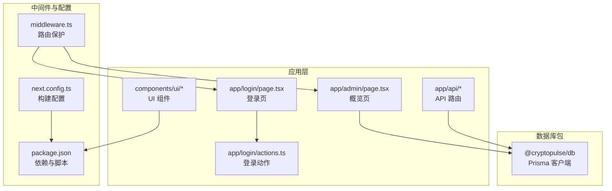
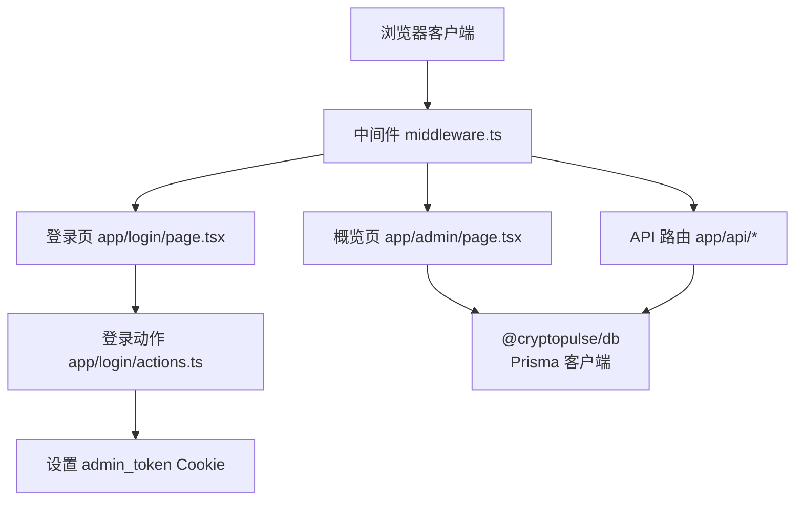
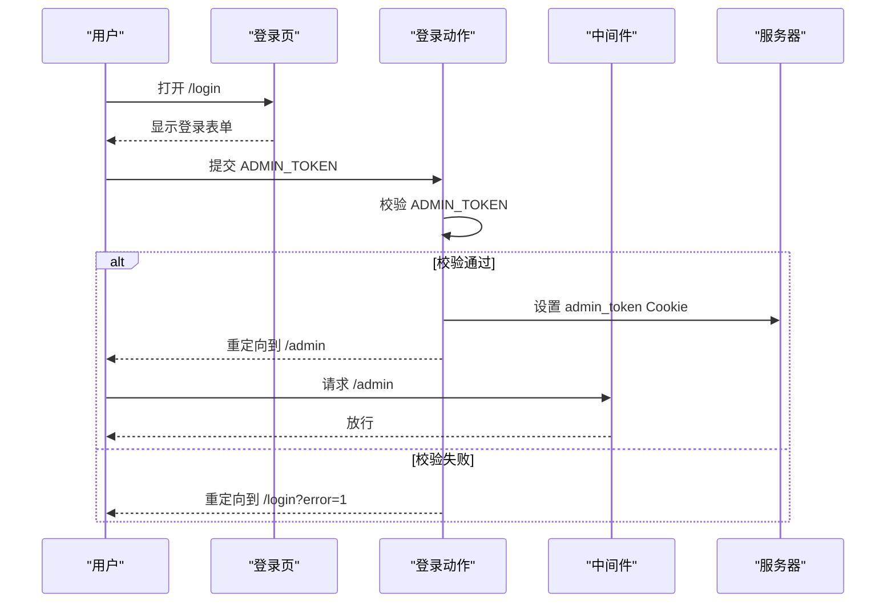
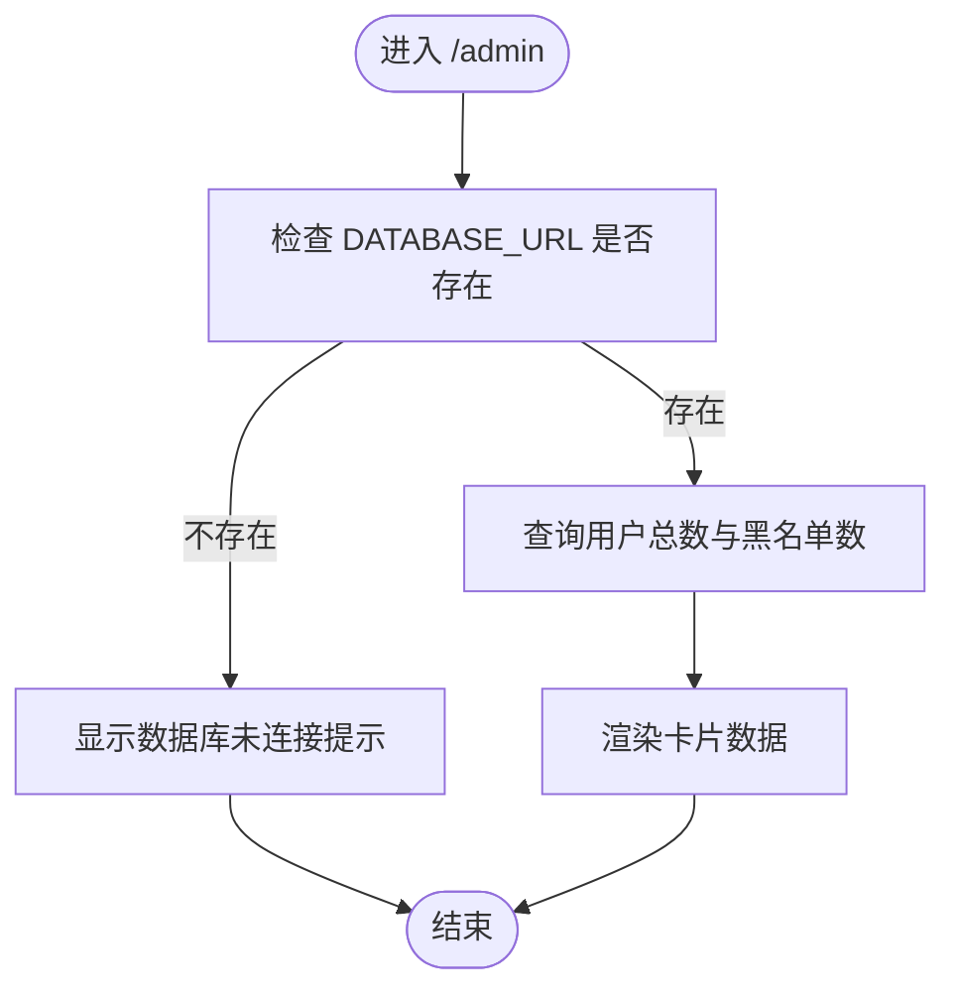
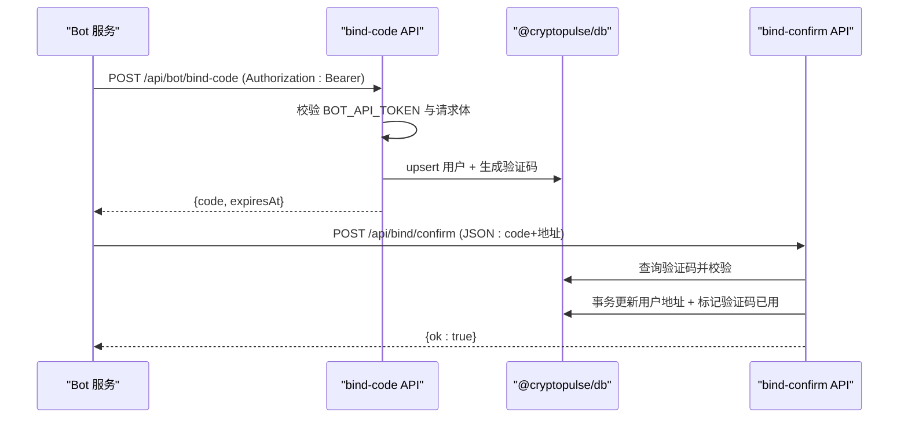
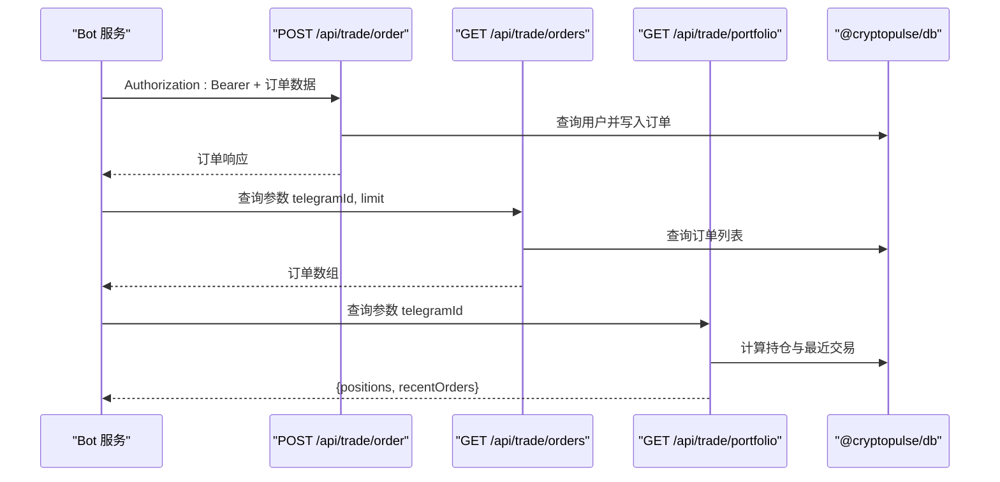
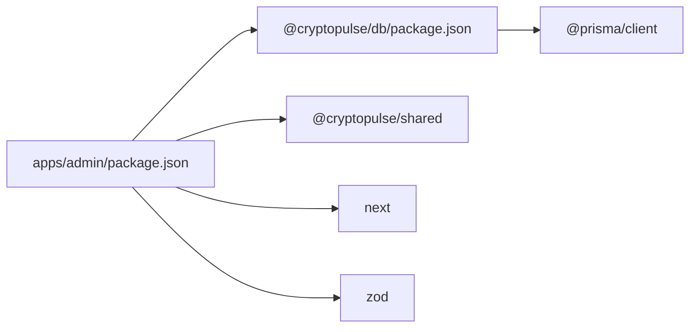

# 管理后台系统

<cite>
**本文引用的文件**
- [apps/admin/app/admin/page.tsx](file://apps/admin/app/admin/page.tsx)
- [apps/admin/app/layout.tsx](file://apps/admin/app/layout.tsx)
- [apps/admin/middleware.ts](file://apps/admin/middleware.ts)
- [apps/admin/package.json](file://apps/admin/package.json)
- [apps/admin/next.config.ts](file://apps/admin/next.config.ts)
- [apps/admin/app/login/page.tsx](file://apps/admin/app/login/page.tsx)
- [apps/admin/app/login/actions.ts](file://apps/admin/app/login/actions.ts)
- [apps/admin/app/api/bot/bind-code/route.ts](file://apps/admin/app/api/bot/bind-code/route.ts)
- [apps/admin/app/api/bind/confirm/route.ts](file://apps/admin/app/api/bind/confirm/route.ts)
- [apps/admin/app/api/trade/order/route.ts](file://apps/admin/app/api/trade/order/route.ts)
- [apps/admin/app/api/trade/orders/route.ts](file://apps/admin/app/api/trade/orders/route.ts)
- [apps/admin/app/api/trade/portfolio/route.ts](file://apps/admin/app/api/trade/portfolio/route.ts)
- [apps/admin/components/ui/button.tsx](file://apps/admin/components/ui/button.tsx)
- [apps/admin/components/ui/input.tsx](file://apps/admin/components/ui/input.tsx)
- [packages/db/package.json](file://packages/db/package.json)
</cite>

## 目录
1. [简介](#简介)
2. [项目结构](#项目结构)
3. [核心组件](#核心组件)
4. [架构总览](#架构总览)
5. [详细组件分析](#详细组件分析)
6. [依赖关系分析](#依赖关系分析)
7. [性能考虑](#性能考虑)
8. [故障排查指南](#故障排查指南)
9. [结论](#结论)
10. [附录](#附录)

## 简介
本文件为 CryptoPulse 管理后台系统的全面技术文档。系统基于 Next.js 15 构建，采用中间件进行路由保护，通过 API 路由与数据库交互，提供概览面板、用户绑定流程、交易下单与查询、以及登录认证等能力。系统支持通过环境变量控制安全策略与运行模式，具备基础的前端 UI 组件库。

## 项目结构
管理后台位于 apps/admin，采用 App Router 结构，核心目录如下：
- app：页面与 API 路由
  - admin：后台概览页
  - login：登录页与登录动作
  - api：对外 API（机器人绑定、交易相关）
- components/ui：基础 UI 组件（按钮、输入框）
- middleware.ts：全局中间件，保护 /admin 路由
- next.config.ts：Next.js 配置（打包与 Webpack Watch 忽略项）
- package.json：应用依赖与脚本

**图表来源**
- [apps/admin/app/admin/page.tsx](file://apps/admin/app/admin/page.tsx#L1-L47)
- [apps/admin/app/login/page.tsx](file://apps/admin/app/login/page.tsx#L1-L44)
- [apps/admin/app/login/actions.ts](file://apps/admin/app/login/actions.ts#L1-L29)
- [apps/admin/middleware.ts](file://apps/admin/middleware.ts#L1-L23)
- [apps/admin/next.config.ts](file://apps/admin/next.config.ts#L1-L30)
- [apps/admin/package.json](file://apps/admin/package.json#L1-L42)
- [packages/db/package.json](file://packages/db/package.json#L1-L22)

**章节来源**
- [apps/admin/app/admin/page.tsx](file://apps/admin/app/admin/page.tsx#L1-L47)
- [apps/admin/app/layout.tsx](file://apps/admin/app/layout.tsx#L1-L24)
- [apps/admin/middleware.ts](file://apps/admin/middleware.ts#L1-L23)
- [apps/admin/next.config.ts](file://apps/admin/next.config.ts#L1-L30)
- [apps/admin/package.json](file://apps/admin/package.json#L1-L42)

## 核心组件
- 概览页：展示用户总数与黑名单用户数量，支持数据库不可用时的降级提示。
- 登录页与登录动作：基于 ADMIN_TOKEN 的简单口令认证，成功后写入 httpOnly Cookie 并重定向至 /admin。
- 中间件：统一校验 admin_token，非生产环境且未配置 ADMIN_TOKEN 时放行，否则重定向至 /login。
- API 路由：
  - 机器人绑定验证码生成与确认
  - 交易下单、订单查询、持仓与最近交易查询
- UI 组件：按钮与输入框，支持变体与尺寸。

**章节来源**
- [apps/admin/app/admin/page.tsx](file://apps/admin/app/admin/page.tsx#L1-L47)
- [apps/admin/app/login/page.tsx](file://apps/admin/app/login/page.tsx#L1-L44)
- [apps/admin/app/login/actions.ts](file://apps/admin/app/login/actions.ts#L1-L29)
- [apps/admin/middleware.ts](file://apps/admin/middleware.ts#L1-L23)
- [apps/admin/components/ui/button.tsx](file://apps/admin/components/ui/button.tsx#L1-L57)
- [apps/admin/components/ui/input.tsx](file://apps/admin/components/ui/input.tsx#L1-L27)

## 架构总览
系统采用“前端页面 + 中间件 + API 路由 + 数据库”的分层架构。前端页面负责展示与交互，中间件负责访问控制，API 路由负责业务逻辑与数据持久化，数据库通过 @cryptopulse/db 提供 Prisma 客户端。

**图表来源**
- [apps/admin/middleware.ts](file://apps/admin/middleware.ts#L1-L23)
- [apps/admin/app/login/page.tsx](file://apps/admin/app/login/page.tsx#L1-L44)
- [apps/admin/app/login/actions.ts](file://apps/admin/app/login/actions.ts#L1-L29)
- [apps/admin/app/admin/page.tsx](file://apps/admin/app/admin/page.tsx#L1-L47)
- [packages/db/package.json](file://packages/db/package.json#L1-L22)

## 详细组件分析

### 认证与会话管理
- 登录流程
  - 页面渲染：根据环境变量判断是否显示警告与错误提示。
  - 表单提交：服务端动作读取表单 token，与 ADMIN_TOKEN 对比。
  - 成功后：设置 httpOnly、sameSite lax、path 为 “/” 的 Cookie，并在生产环境启用 secure。
  - 失败重定向：携带错误参数重定向到 /login。
- 中间件保护
  - 从 Cookie 读取 admin_token，与 ADMIN_TOKEN 比较。
  - 非生产环境且未配置 ADMIN_TOKEN 时放行；否则重定向到 /login。
- 安全策略
  - Cookie 使用 httpOnly，降低 XSS 风险。
  - 生产环境启用 secure，仅 HTTPS 传输。
  - sameSite lax 平衡 CSRF 与第三方 Cookie 场景。

**图表来源**
- [apps/admin/app/login/page.tsx](file://apps/admin/app/login/page.tsx#L1-L44)
- [apps/admin/app/login/actions.ts](file://apps/admin/app/login/actions.ts#L1-L29)
- [apps/admin/middleware.ts](file://apps/admin/middleware.ts#L1-L23)

**章节来源**
- [apps/admin/app/login/page.tsx](file://apps/admin/app/login/page.tsx#L1-L44)
- [apps/admin/app/login/actions.ts](file://apps/admin/app/login/actions.ts#L1-L29)
- [apps/admin/middleware.ts](file://apps/admin/middleware.ts#L1-L23)

### 概览页与数据展示
- 功能概述：展示用户总数与黑名单用户数量。
- 数据来源：通过 @cryptopulse/db 的 Prisma 客户端查询 user 表。
- 异常处理：当 DATABASE_URL 未配置或查询异常时，显示占位提示。

**图表来源**
- [apps/admin/app/admin/page.tsx](file://apps/admin/app/admin/page.tsx#L1-L47)

**章节来源**
- [apps/admin/app/admin/page.tsx](file://apps/admin/app/admin/page.tsx#L1-L47)

### 机器人绑定流程
- 绑定验证码生成
  - 校验 Authorization 头中的 BOT_API_TOKEN。
  - 解析 JSON 请求体，校验 telegramId 与 language。
  - upsert 用户记录，确保存在对应 telegramId。
  - 循环生成唯一验证码，插入 bindCode 表，设置过期时间。
  - 返回验证码与过期时间。
- 绑定确认
  - 校验 DATABASE_URL 与 Prisma 可用性。
  - 解析 JSON 请求体，校验地址格式（可选）。
  - 查询 bindCode，校验是否存在、未使用、未过期。
  - 事务更新用户地址信息并标记验证码已使用。
  - 返回成功结果。

**图表来源**
- [apps/admin/app/api/bot/bind-code/route.ts](file://apps/admin/app/api/bot/bind-code/route.ts#L1-L105)
- [apps/admin/app/api/bind/confirm/route.ts](file://apps/admin/app/api/bind/confirm/route.ts#L1-L91)
- [packages/db/package.json](file://packages/db/package.json#L1-L22)

**章节来源**
- [apps/admin/app/api/bot/bind-code/route.ts](file://apps/admin/app/api/bot/bind-code/route.ts#L1-L105)
- [apps/admin/app/api/bind/confirm/route.ts](file://apps/admin/app/api/bind/confirm/route.ts#L1-L91)

### 交易相关 API
- 下单接口
  - 校验 Authorization 头中的 BOT_API_TOKEN。
  - 解析请求体，校验 telegramId、marketId、outcomeIndex、amount、side。
  - 查询用户是否存在且已绑定钱包地址。
  - 根据 TRADE_MODE 写入模拟或待执行状态的订单。
  - 返回订单关键字段。
- 订单列表接口
  - 校验 BOT_API_TOKEN。
  - 解析查询参数 telegramId、limit。
  - 查询最近订单列表，限制最大条数。
- 持仓与最近交易接口
  - 校验 BOT_API_TOKEN。
  - 解析查询参数 telegramId。
  - 基于订单计算未平仓头寸，返回最近交易快照。

**图表来源**
- [apps/admin/app/api/trade/order/route.ts](file://apps/admin/app/api/trade/order/route.ts#L1-L94)
- [apps/admin/app/api/trade/orders/route.ts](file://apps/admin/app/api/trade/orders/route.ts#L1-L74)
- [apps/admin/app/api/trade/portfolio/route.ts](file://apps/admin/app/api/trade/portfolio/route.ts#L1-L80)
- [packages/db/package.json](file://packages/db/package.json#L1-L22)

**章节来源**
- [apps/admin/app/api/trade/order/route.ts](file://apps/admin/app/api/trade/order/route.ts#L1-L94)
- [apps/admin/app/api/trade/orders/route.ts](file://apps/admin/app/api/trade/orders/route.ts#L1-L74)
- [apps/admin/app/api/trade/portfolio/route.ts](file://apps/admin/app/api/trade/portfolio/route.ts#L1-L80)

### UI 组件与样式
- Button：支持多种变体（默认、描边、次要、幽灵、破坏性、链接）与尺寸，使用 class-variance-authority 控制样式组合。
- Input：基础输入框，继承 Tailwind 样式，支持自定义类名。

**章节来源**
- [apps/admin/components/ui/button.tsx](file://apps/admin/components/ui/button.tsx#L1-L57)
- [apps/admin/components/ui/input.tsx](file://apps/admin/components/ui/input.tsx#L1-L27)

## 依赖关系分析
- 应用依赖
  - @cryptopulse/db：提供 Prisma 客户端，用于数据库操作。
  - @cryptopulse/shared：共享模块（在构建中被转译）。
  - next、react、react-dom：框架与运行时。
  - lucide-react、tailwind-*：UI 与样式。
  - zod：请求体与查询参数的类型校验。
- 数据库依赖
  - @prisma/client：Prisma 客户端，由 @cryptopulse/db 包装导出。

**图表来源**
- [apps/admin/package.json](file://apps/admin/package.json#L1-L42)
- [packages/db/package.json](file://packages/db/package.json#L1-L22)

**章节来源**
- [apps/admin/package.json](file://apps/admin/package.json#L1-L42)
- [packages/db/package.json](file://packages/db/package.json#L1-L22)

## 性能考虑
- API 路由运行时：明确设置 runtime 为 nodejs，确保与 Prisma 客户端兼容。
- 请求体大小限制：通过 Next.js serverActions 的 bodySizeLimit 限制，避免过大请求导致内存压力。
- 数据库访问：API 路由中按需动态导入 Prisma 客户端，减少启动时依赖加载。
- Webpack Watch 忽略：配置忽略常见系统文件，减少不必要的文件监听开销。

**章节来源**
- [apps/admin/next.config.ts](file://apps/admin/next.config.ts#L1-L30)
- [apps/admin/app/api/bot/bind-code/route.ts](file://apps/admin/app/api/bot/bind-code/route.ts#L5-L5)
- [apps/admin/app/api/trade/order/route.ts](file://apps/admin/app/api/trade/order/route.ts#L6-L6)
- [apps/admin/app/api/trade/orders/route.ts](file://apps/admin/app/api/trade/orders/route.ts#L5-L5)
- [apps/admin/app/api/trade/portfolio/route.ts](file://apps/admin/app/api/trade/portfolio/route.ts#L5-L5)

## 故障排查指南
- 登录失败
  - 确认 ADMIN_TOKEN 已正确设置。
  - 开发环境未设置 ADMIN_TOKEN 时，非生产环境可直接访问 /admin。
  - 若提示口令不正确，检查传递的 token 是否与 ADMIN_TOKEN 一致。
- 中间件重定向
  - 未设置 ADMIN_TOKEN 且非生产环境可访问；生产环境必须设置。
  - Cookie 未正确设置或被清理会导致重定向到 /login。
- 数据库不可用
  - DATABASE_URL 未配置或连接失败时，概览页显示占位提示。
  - API 路由在数据库不可用时返回 503。
- API 授权失败
  - BOT_API_TOKEN 缺失或不匹配导致 401。
  - 请求体格式错误返回 400，Prisma 不可用返回 503。
- 绑定验证码问题
  - 验证码不存在、已使用或已过期会返回相应错误码。
  - 生成验证码时唯一约束冲突会重试，最多五次。

**章节来源**
- [apps/admin/app/login/page.tsx](file://apps/admin/app/login/page.tsx#L1-L44)
- [apps/admin/app/login/actions.ts](file://apps/admin/app/login/actions.ts#L1-L29)
- [apps/admin/middleware.ts](file://apps/admin/middleware.ts#L1-L23)
- [apps/admin/app/admin/page.tsx](file://apps/admin/app/admin/page.tsx#L1-L47)
- [apps/admin/app/api/bot/bind-code/route.ts](file://apps/admin/app/api/bot/bind-code/route.ts#L1-L105)
- [apps/admin/app/api/bind/confirm/route.ts](file://apps/admin/app/api/bind/confirm/route.ts#L1-L91)
- [apps/admin/app/api/trade/order/route.ts](file://apps/admin/app/api/trade/order/route.ts#L1-L94)
- [apps/admin/app/api/trade/orders/route.ts](file://apps/admin/app/api/trade/orders/route.ts#L1-L74)
- [apps/admin/app/api/trade/portfolio/route.ts](file://apps/admin/app/api/trade/portfolio/route.ts#L1-L80)

## 结论
该管理后台以简洁的认证与中间件保护为基础，结合 API 路由完成机器人绑定与交易相关功能，配合概览页展示关键指标。系统通过环境变量灵活控制安全策略与运行模式，具备良好的扩展性与可维护性。建议后续补充用户管理、权限控制、交易统计与报表生成功能，并完善前端页面布局与导航结构。

## 附录
- 环境变量
  - ADMIN_TOKEN：管理员登录口令
  - BOT_API_TOKEN：机器人 API 授权令牌
  - DATABASE_URL：数据库连接字符串
  - NODE_ENV：运行环境（影响中间件放行行为）
  - TRADE_MODE：交易模式（mock 或真实）
- API 列表
  - POST /api/bot/bind-code：生成绑定验证码
  - POST /api/bind/confirm：绑定确认
  - POST /api/trade/order：下单
  - GET /api/trade/orders：订单列表
  - GET /api/trade/portfolio：持仓与最近交易