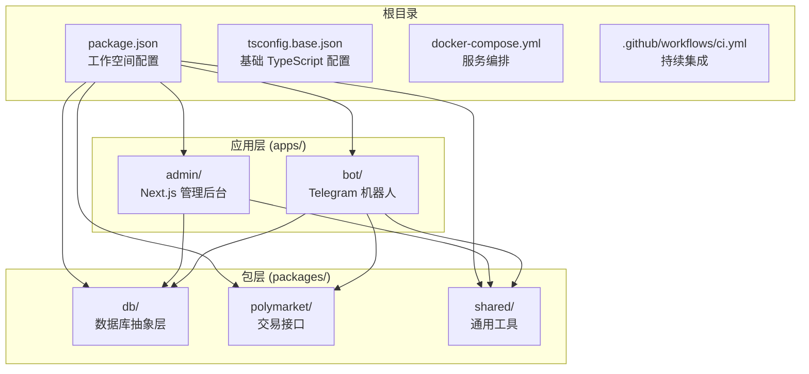
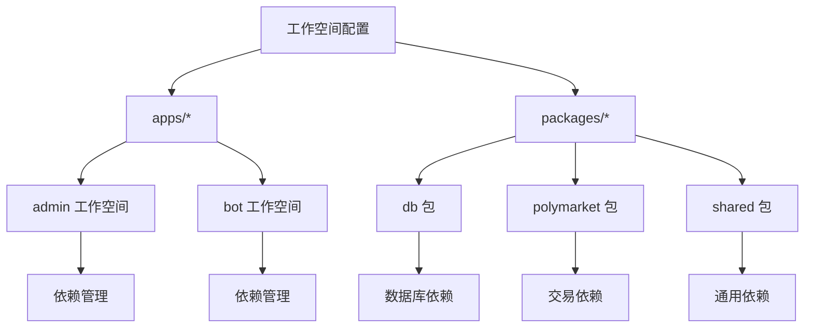
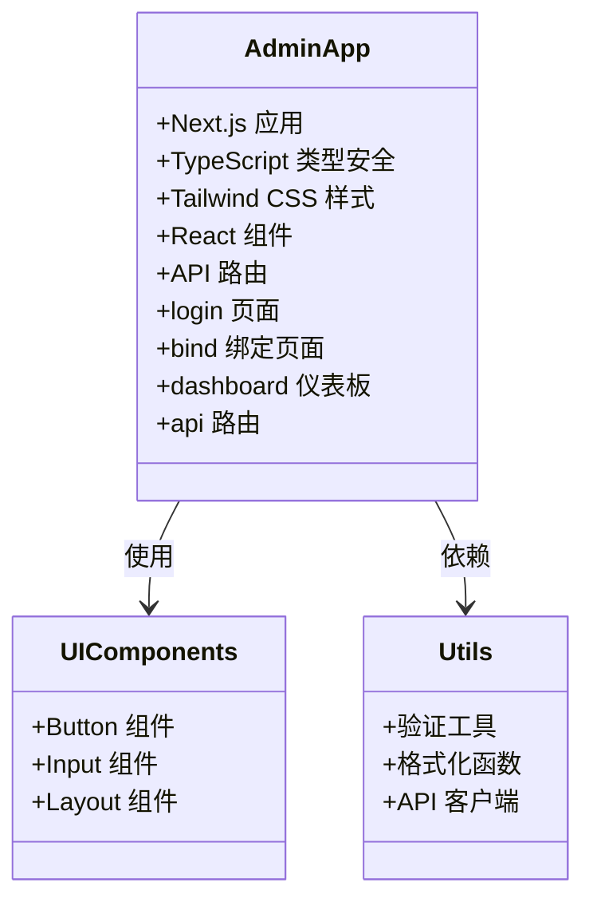
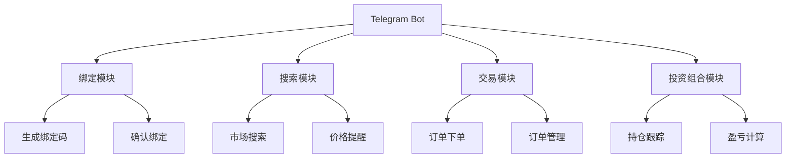
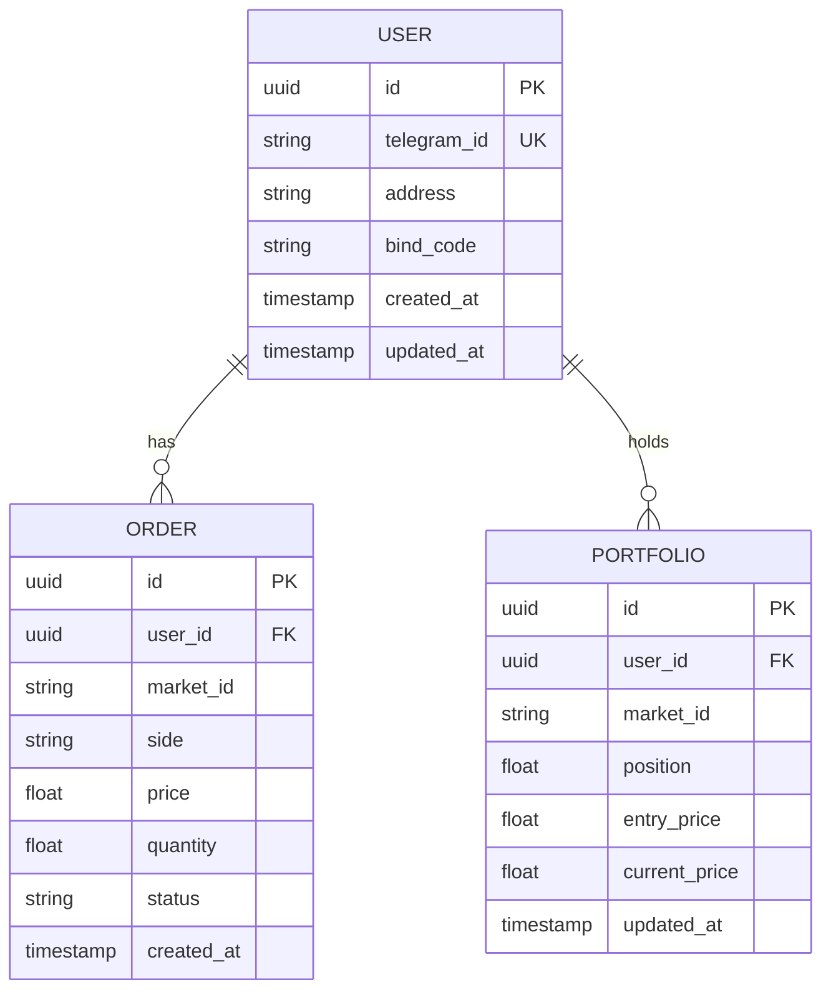
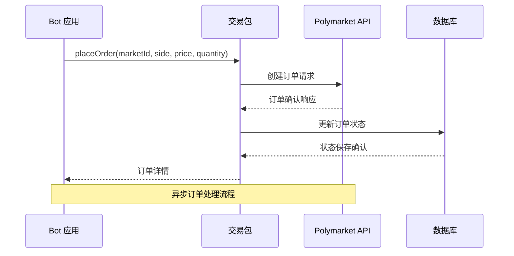
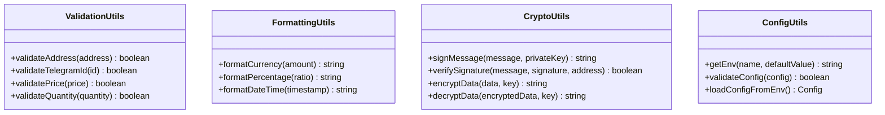
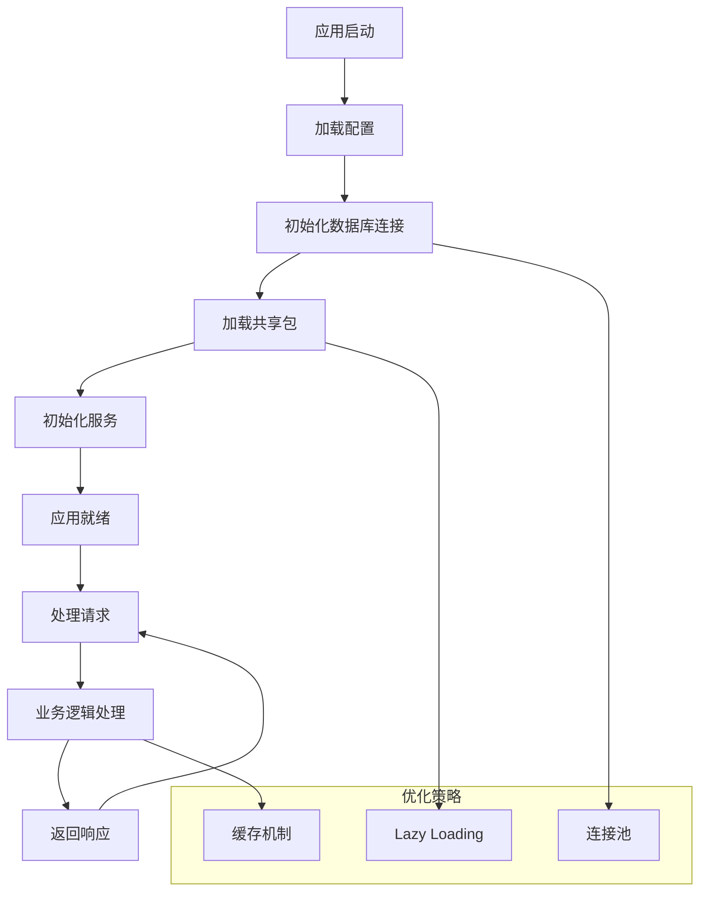
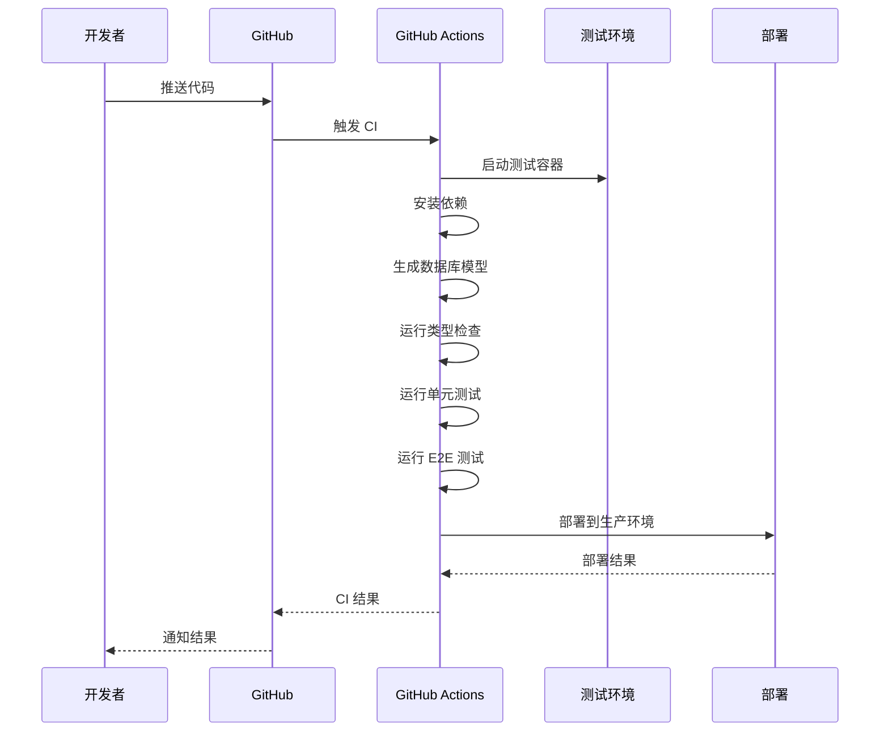

# Monorepo 架构设计

<cite>
**本文档引用的文件**
- [package.json](file://package.json)
- [tsconfig.base.json](file://tsconfig.base.json)
- [apps/admin/package.json](file://apps/admin/package.json)
- [apps/admin/tsconfig.json](file://apps/admin/tsconfig.json)
- [apps/bot/package.json](file://apps/bot/package.json)
- [apps/bot/tsconfig.json](file://apps/bot/tsconfig.json)
- [apps/bot/tsconfig.build.json](file://apps/bot/tsconfig.build.json)
- [packages/polymarket/package.json](file://packages/polymarket/package.json)
- [packages/polymarket/tsconfig.json](file://packages/polymarket/tsconfig.json)
- [packages/shared/package.json](file://packages/shared/package.json)
- [packages/shared/tsconfig.json](file://packages/shared/tsconfig.json)
- [packages/db/package.json](file://packages/db/package.json)
- [packages/db/tsconfig.json](file://packages/db/tsconfig.json)
- [.github/workflows/ci.yml](file://.github/workflows/ci.yml)
- [docker-compose.yml](file://docker-compose.yml)
- [README.md](file://README.md)
</cite>

## 目录
1. [简介](#简介)
2. [项目结构](#项目结构)
3. [核心组件](#核心组件)
4. [架构概览](#架构概览)
5. [详细组件分析](#详细组件分析)
6. [依赖关系分析](#依赖关系分析)
7. [性能考虑](#性能考虑)
8. [故障排除指南](#故障排除指南)
9. [结论](#结论)
10. [附录](#附录)

## 简介

CryptoPulse 项目采用 Monorepo 架构设计，通过统一的代码仓库管理多个相关应用和共享包。该架构的核心目标是：

- **代码复用**：通过共享包减少重复代码
- **依赖管理**：集中管理跨项目的依赖关系
- **开发效率**：统一的构建和测试流程
- **团队协作**：清晰的模块边界和职责分工

该项目包含两个主要应用：Admin 管理后台和 Telegram Bot 机器人，以及三个共享包：数据库抽象层、Polymarket 交易接口和通用工具。

## 项目结构

项目采用标准的 Monorepo 目录结构，主要分为以下几部分：



**图表来源**
- [package.json](file://package.json#L4-L7)
- [apps/admin/package.json](file://apps/admin/package.json#L13-L25)
- [apps/bot/package.json](file://apps/bot/package.json#L12-L19)

### 目录组织原则

**apps/** 目录用于存放独立的应用程序：
- **admin/**：基于 Next.js 的管理后台应用
- **bot/**：基于 Node.js 的 Telegram 机器人应用

**packages/** 目录用于存放可复用的包：
- **db/**：数据库访问层抽象
- **polymarket/**：Polymarket 交易所的交易接口封装
- **shared/**：通用工具函数和类型定义

**Section sources**
- [package.json](file://package.json#L4-L7)
- [README.md](file://README.md#L1-L65)

## 核心组件

### 工作空间配置

项目使用 npm workspaces 进行工作空间管理，配置位于根目录的 package.json 中：



**图表来源**
- [package.json](file://package.json#L4-L7)

### TypeScript 基础配置

所有包共享一个基础的 TypeScript 配置，确保一致的开发体验：

| 配置项 | 值 | 用途 |
|--------|-----|------|
| target | ES2022 | 现代 JavaScript 特性支持 |
| module | ESNext | 模块化开发 |
| moduleResolution | Bundler | 现代打包器兼容 |
| strict | true | 严格类型检查 |
| skipLibCheck | true | 提升编译速度 |
| noEmit | true | 仅进行类型检查 |

**Section sources**
- [tsconfig.base.json](file://tsconfig.base.json#L2-L13)

## 架构概览

项目采用分层架构设计，从下到上分别为数据层、业务逻辑层和应用层：

```mermaid
graph TB
subgraph "数据层"
Postgres[PostgreSQL 数据库]
Redis[Redis 缓存]
end
subgraph "业务逻辑层"
DBLayer[数据库访问层<br/>@cryptopulse/db]
TradeAPI[交易接口层<br/>@cryptopulse/polymarket]
SharedUtils[共享工具层<br/>@cryptopulse/shared]
end
subgraph "应用层"
AdminApp[Admin 管理后台<br/>Next.js]
BotApp[Telegram 机器人<br/>Node.js]
end
Postgres --> DBLayer
Redis --> DBLayer
DBLayer --> AdminApp
DBLayer --> BotApp
TradeAPI --> BotApp
SharedUtils --> AdminApp
SharedUtils --> BotApp
AdminApp --> TradeAPI
```

**图表来源**
- [apps/admin/package.json](file://apps/admin/package.json#L13-L25)
- [apps/bot/package.json](file://apps/bot/package.json#L12-L19)
- [packages/db/package.json](file://packages/db/package.json#L13-L14)

### 应用架构对比

| 特性 | Admin 应用 | Bot 应用 |
|------|------------|----------|
| 框架 | Next.js | Node.js |
| 运行时 | 浏览器/Node.js | Node.js |
| 路由 | App Router | 自定义 |
| 状态管理 | React Hooks | 内存状态 |
| 数据持久化 | Prisma ORM | Prisma ORM |
| 部署方式 | Static Export | 服务器部署 |

**Section sources**
- [apps/admin/package.json](file://apps/admin/package.json#L19-L20)
- [apps/bot/package.json](file://apps/bot/package.json#L5-L6)

## 详细组件分析

### Admin 管理后台

Admin 应用是一个基于 Next.js 的全栈管理界面，提供用户管理和交易监控功能。

#### 核心特性



**图表来源**
- [apps/admin/package.json](file://apps/admin/package.json#L13-L25)
- [apps/admin/components/ui/button.tsx](file://apps/admin/components/ui/button.tsx)
- [apps/admin/components/ui/input.tsx](file://apps/admin/components/ui/input.tsx)

#### 路由结构

| 路由 | 功能 | 描述 |
|------|------|------|
| / | 主页 | 应用入口点 |
| /admin | 管理页面 | 管理员功能入口 |
| /bind | 绑定页面 | 用户地址绑定 |
| /bind/success | 成功页面 | 绑定成功提示 |
| /api/bind/confirm | API 路由 | 绑定确认接口 |
| /api/bot/bind-code | API 路由 | 生成绑定码 |
| /api/trade/order | API 路由 | 下单接口 |
| /api/trade/orders | API 路由 | 订单查询 |
| /api/trade/portfolio | API 路由 | 投资组合查询 |

**Section sources**
- [apps/admin/app/page.tsx](file://apps/admin/app/page.tsx)
- [apps/admin/app/admin/page.tsx](file://apps/admin/app/admin/page.tsx)
- [apps/admin/app/bind/page.tsx](file://apps/admin/app/bind/page.tsx)

### Telegram 机器人

Bot 应用是一个基于 GrammY 框架的 Telegram 机器人，提供自动化交易功能。

#### 核心功能模块



**图表来源**
- [apps/bot/src/index.ts](file://apps/bot/src/index.ts)
- [apps/bot/src/bind.ts](file://apps/bot/src/bind.ts)
- [apps/bot/src/search.ts](file://apps/bot/src/search.ts)
- [apps/bot/src/trade.ts](file://apps/bot/src/trade.ts)
- [apps/bot/src/portfolio.ts](file://apps/bot/src/portfolio.ts)

#### 机器人命令

| 命令 | 功能 | 触发条件 |
|------|------|----------|
| /start | 启动机器人 | 用户首次对话 |
| /bind | 生成绑定链接 | 用户请求绑定 |
| /help | 显示帮助 | 用户需要指导 |
| /portfolio | 查看投资组合 | 用户查询持仓 |
| /orders | 查看订单 | 用户查询订单 |
| /search | 搜索市场 | 用户查找交易对 |

**Section sources**
- [apps/bot/src/bind.ts](file://apps/bot/src/bind.ts)
- [apps/bot/src/search.ts](file://apps/bot/src/search.ts)
- [apps/bot/src/trade.ts](file://apps/bot/src/trade.ts)

### 数据库包 (@cryptopulse/db)

数据库包提供了统一的数据库访问接口，封装了 Prisma ORM 的复杂性。

#### 数据模型设计



**图表来源**
- [packages/db/package.json](file://packages/db/package.json#L13-L14)

#### 核心功能

| 功能 | 方法 | 描述 |
|------|------|------|
| 用户管理 | createUser, getUser | 用户注册和查询 |
| 绑定管理 | createBind, getBindByCode | 绑定码生成和验证 |
| 订单管理 | createOrder, getOrders | 订单创建和查询 |
| 投资组合 | updatePortfolio, getPortfolio | 持仓更新和查询 |

**Section sources**
- [packages/db/package.json](file://packages/db/package.json#L8-L12)

### Polymarket 交易包 (@cryptopulse/polymarket)

交易包封装了 Polymarket 交易所的 API 接口，提供了简洁的交易接口。

#### 交易接口设计



**图表来源**
- [packages/polymarket/package.json](file://packages/polymarket/package.json#L11-L16)

#### 支持的功能

| 功能 | 方法 | 参数 | 返回值 |
|------|------|------|--------|
| 获取市场列表 | getMarkets | 无 | Market[] |
| 获取市场详情 | getMarket | marketId | Market |
| 下单 | placeOrder | marketId, side, price, quantity | Order |
| 查询订单 | getOrder | orderId | Order |
| 取消订单 | cancelOrder | orderId | boolean |

**Section sources**
- [packages/polymarket/package.json](file://packages/polymarket/package.json#L8-L10)

### 共享包 (@cryptopulse/shared)

共享包包含了所有应用共用的工具函数和类型定义。

#### 工具函数分类



**图表来源**
- [packages/shared/package.json](file://packages/shared/package.json#L11-L12)

**Section sources**
- [packages/shared/package.json](file://packages/shared/package.json#L8-L10)

## 依赖关系分析

### 依赖图谱

```mermaid
graph TB
subgraph "外部依赖"
Next[Next.js]
GrammY[GrammY]
Prisma[Prisma]
Viem[Viem]
Zod[Zod]
end
subgraph "内部包"
DB[@cryptopulse/db]
Polymarket[@cryptopulse/polymarket]
Shared[@cryptopulse/shared]
end
subgraph "应用"
Admin[Admin 应用]
Bot[Bot 应用]
end
Admin --> DB
Admin --> Shared
Bot --> DB
Bot --> Polymarket
Bot --> Shared
DB --> Prisma
Polymarket --> Viem
Admin --> Next
Bot --> GrammY
Shared --> Zod
```

**图表来源**
- [apps/admin/package.json](file://apps/admin/package.json#L13-L25)
- [apps/bot/package.json](file://apps/bot/package.json#L12-L19)
- [packages/db/package.json](file://packages/db/package.json#L13-L14)
- [packages/polymarket/package.json](file://packages/polymarket/package.json#L11-L16)
- [packages/shared/package.json](file://packages/shared/package.json#L11-L12)

### 依赖管理策略

项目采用严格的依赖管理策略：

1. **版本锁定**：所有包使用相同的版本号 (0.0.1)
2. **工作空间依赖**：应用通过工作空间名称引用内部包
3. **外部依赖分离**：第三方依赖单独管理
4. **类型安全**：所有依赖都包含相应的类型定义

**Section sources**
- [apps/admin/package.json](file://apps/admin/package.json#L14-L15)
- [apps/bot/package.json](file://apps/bot/package.json#L13-L14)
- [packages/db/package.json](file://packages/db/package.json#L13-L14)

## 性能考虑

### 编译优化

项目采用了多种编译优化策略：

| 优化项 | 实现方式 | 效果 |
|--------|----------|------|
| 模块解析 | NodeNext 模式 | 更快的模块解析 |
| 类型检查 | noEmit 配置 | 编译速度提升 |
| 缓存机制 | TypeScript 缓存 | 二次编译更快 |
| 并行构建 | 工作空间并行 | 整体构建时间缩短 |

### 运行时优化



**图表来源**
- [apps/admin/tsconfig.json](file://apps/admin/tsconfig.json#L3-L18)
- [apps/bot/tsconfig.build.json](file://apps/bot/tsconfig.build.json#L3-L7)

## 故障排除指南

### 常见问题及解决方案

#### 数据库连接问题

**症状**：应用启动时报数据库连接错误
**原因**：
- DATABASE_URL 环境变量未设置
- 数据库服务未启动
- Prisma 模型未生成

**解决方案**：
1. 检查 .env 文件配置
2. 启动 Docker 服务：`docker-compose up -d`
3. 生成 Prisma 模型：`npm -w packages/db run prisma:generate`

#### 类型检查错误

**症状**：npm run typecheck 报错
**原因**：
- 类型不匹配
- 缺少类型定义
- 配置不一致

**解决方案**：
1. 检查 tsconfig.base.json 配置
2. 确保所有包使用相同的 TypeScript 版本
3. 运行 `npm run typecheck` 检查具体错误

#### 依赖安装问题

**症状**：npm install 失败
**原因**：
- 网络问题导致 Prisma 下载失败
- Node.js 版本不兼容

**解决方案**：
1. 设置 Prisma 镜像：`$env:PRISMA_ENGINES_MIRROR='https://npmmirror.com/mirrors/prisma/'`
2. 升级 Node.js 到 20+
3. 清理缓存后重新安装

**Section sources**
- [README.md](file://README.md#L13-L18)
- [README.md](file://README.md#L28-L33)
- [README.md](file://README.md#L41-L57)

## 结论

CryptoPulse 项目的 Monorepo 架构设计体现了现代前端工程的最佳实践。通过合理的目录组织、清晰的依赖关系和统一的配置管理，实现了：

1. **高内聚低耦合**：每个包都有明确的职责边界
2. **代码复用最大化**：共享包减少了重复代码
3. **开发效率提升**：统一的工具链和配置
4. **团队协作便利**：清晰的模块划分和文档

该架构为未来的功能扩展和技术演进奠定了良好的基础，建议继续保持现有的组织原则和最佳实践。

## 附录

### 开发环境设置

```bash
# 克隆项目
git clone <repository-url>
cd cryptopulse

# 安装依赖
npm install

# 启动数据库服务
docker-compose up -d

# 初始化数据库
npm -w packages/db run prisma:generate
npx prisma migrate deploy --schema packages/db/prisma/schema.prisma

# 启动开发服务器
npm run dev:admin    # 管理后台
npm run dev:bot      # 机器人
```

### CI/CD 流程



**图表来源**
- [.github/workflows/ci.yml](file://.github/workflows/ci.yml#L35-L44)