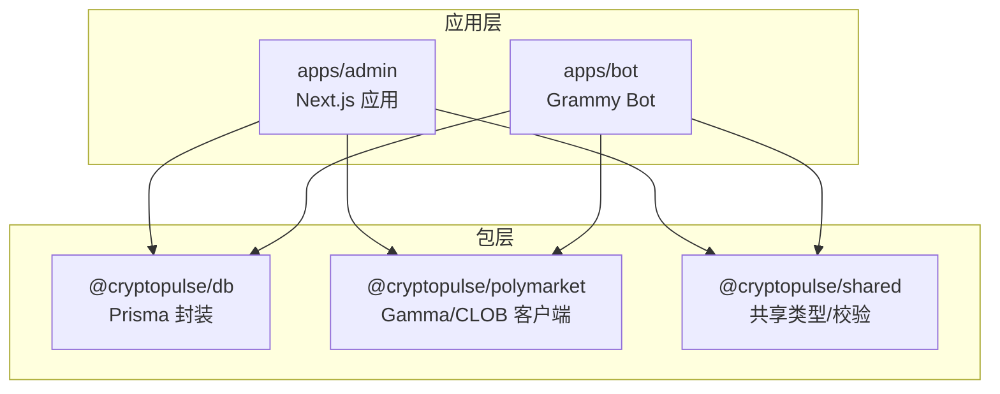
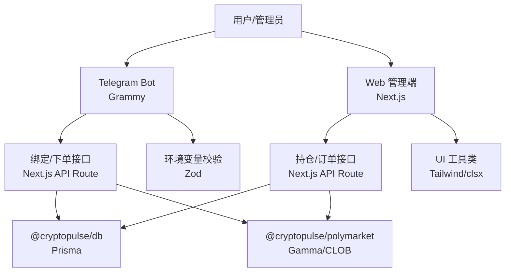
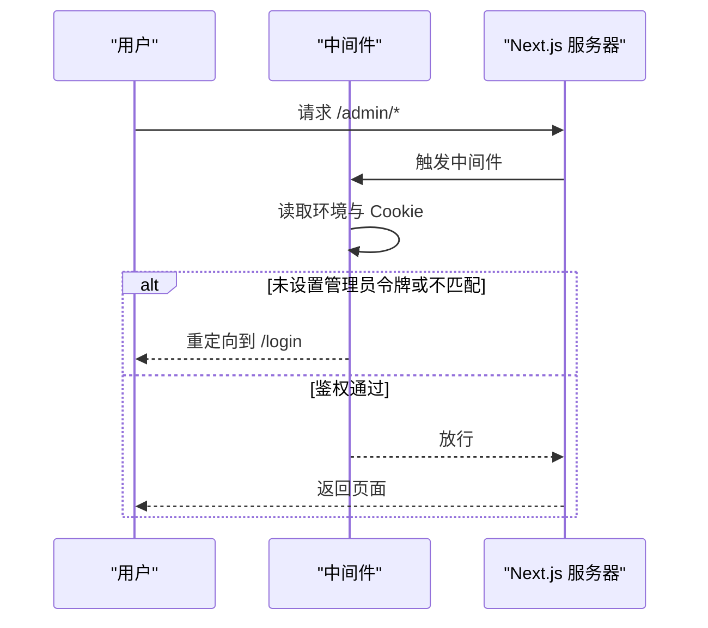
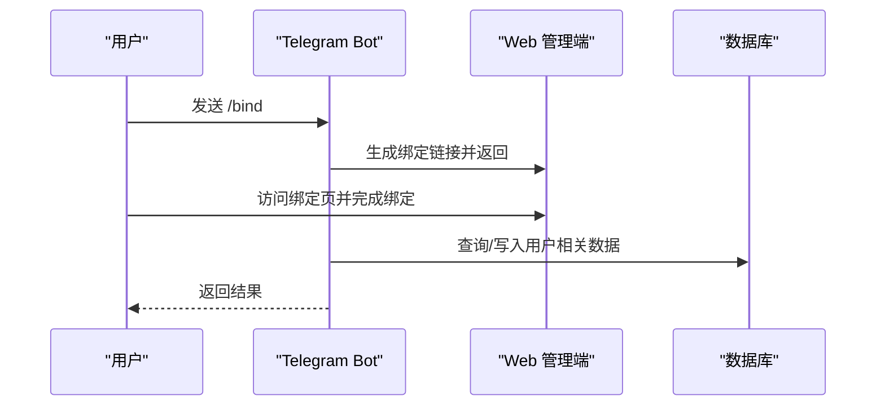
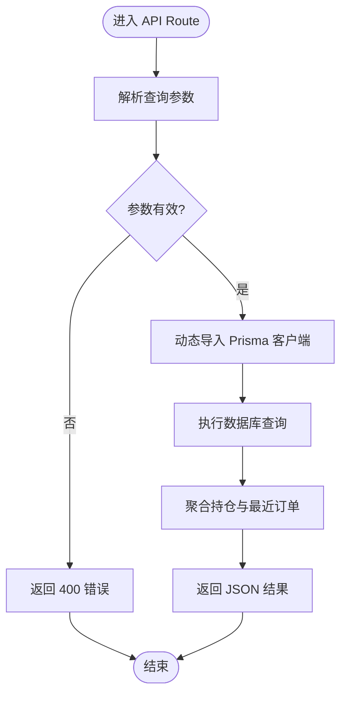
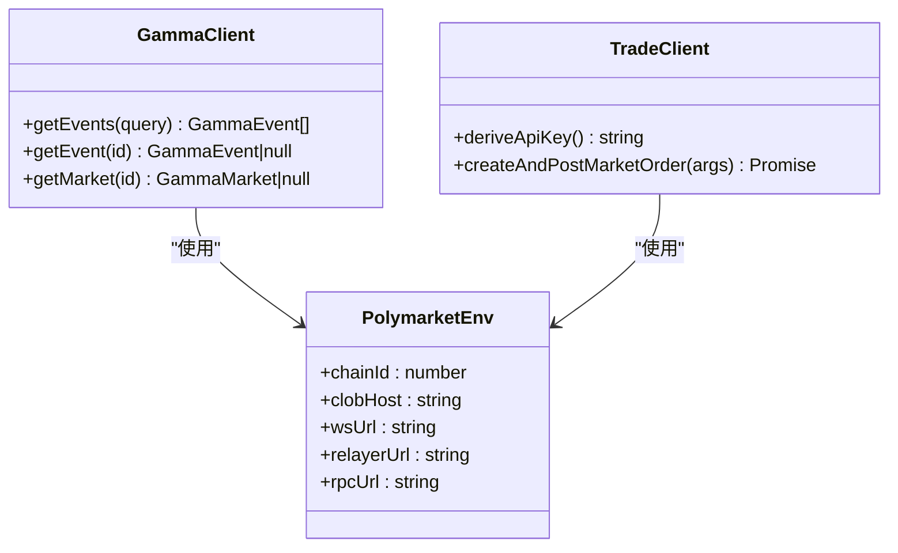
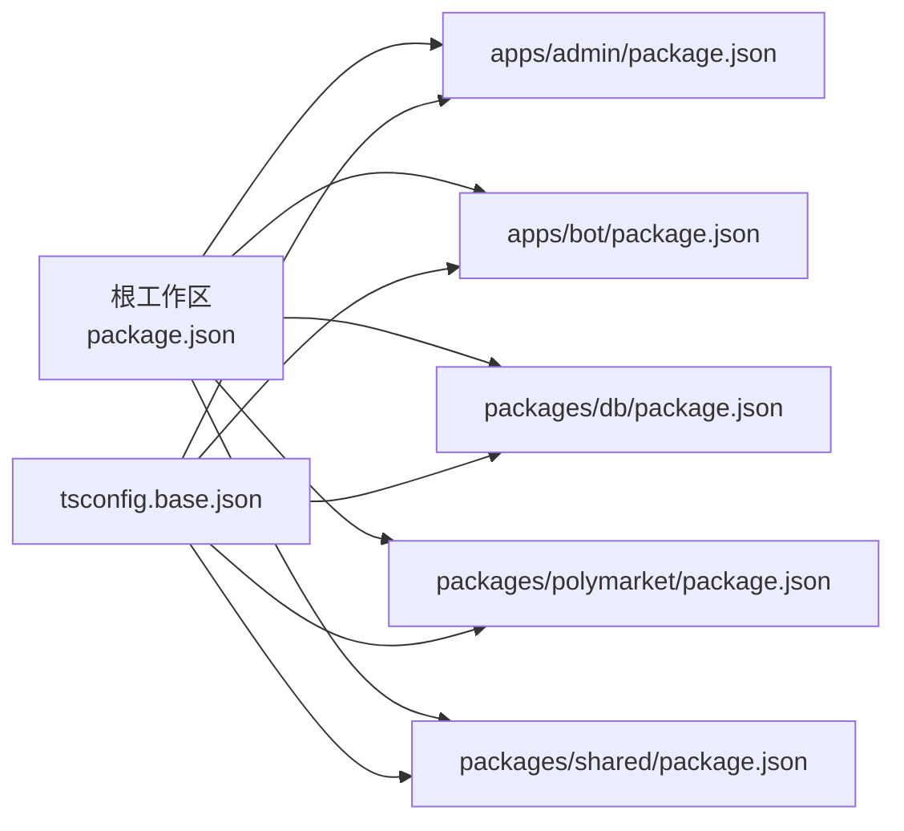

# 技术栈选型

<cite>
**本文引用的文件**
- [package.json](file://package.json)
- [apps/admin/package.json](file://apps/admin/package.json)
- [apps/admin/next.config.ts](file://apps/admin/next.config.ts)
- [apps/admin/middleware.ts](file://apps/admin/middleware.ts)
- [apps/admin/lib/utils.ts](file://apps/admin/lib/utils.ts)
- [apps/admin/app/api/trade/portfolio/route.ts](file://apps/admin/app/api/trade/portfolio/route.ts)
- [apps/bot/package.json](file://apps/bot/package.json)
- [apps/bot/src/index.ts](file://apps/bot/src/index.ts)
- [apps/bot/src/env.ts](file://apps/bot/src/env.ts)
- [packages/db/package.json](file://packages/db/package.json)
- [packages/db/src/index.ts](file://packages/db/src/index.ts)
- [packages/polymarket/package.json](file://packages/polymarket/package.json)
- [packages/polymarket/src/index.ts](file://packages/polymarket/src/index.ts)
- [packages/polymarket/src/gamma.ts](file://packages/polymarket/src/gamma.ts)
- [packages/polymarket/src/trade.ts](file://packages/polymarket/src/trade.ts)
- [packages/shared/package.json](file://packages/shared/package.json)
- [tsconfig.base.json](file://tsconfig.base.json)
</cite>

## 目录
1. [引言](#引言)
2. [项目结构](#项目结构)
3. [核心组件](#核心组件)
4. [架构总览](#架构总览)
5. [详细组件分析](#详细组件分析)
6. [依赖关系分析](#依赖关系分析)
7. [性能考量](#性能考量)
8. [故障排查指南](#故障排查指南)
9. [结论](#结论)
10. [附录](#附录)

## 引言
本文件面向 CryptoPulse 项目的“技术栈选型”，系统阐述前端（Next.js）、Telegram Bot（Grammy）、数据库访问（Prisma）、链上交互（Viem/Polymarket SDK）等核心组件的选型理由、版本与兼容性、性能特征、整体协同与架构适配，并提供对比分析与替代方案评估，帮助团队理解技术决策对可扩展性与长期维护的影响。

## 项目结构
项目采用多包工作区（monorepo）组织方式，包含两个应用与多个共享/业务包：
- 应用层
  - admin：基于 Next.js 的管理端 Web 应用
  - bot：基于 Grammy 的 Telegram Bot
- 包层
  - db：封装 Prisma 客户端与迁移脚本
  - polymarket：聚合 Polymarket 交易与 Gamma API 访问能力
  - shared：跨包共享的类型与校验工具

图表来源
- [apps/admin/package.json](file://apps/admin/package.json#L1-L42)
- [apps/bot/package.json](file://apps/bot/package.json#L1-L26)
- [packages/db/package.json](file://packages/db/package.json#L1-L22)
- [packages/polymarket/package.json](file://packages/polymarket/package.json#L1-L23)
- [packages/shared/package.json](file://packages/shared/package.json#L1-L19)

章节来源
- [package.json](file://package.json#L1-L18)
- [apps/admin/package.json](file://apps/admin/package.json#L1-L42)
- [apps/bot/package.json](file://apps/bot/package.json#L1-L26)
- [packages/db/package.json](file://packages/db/package.json#L1-L22)
- [packages/polymarket/package.json](file://packages/polymarket/package.json#L1-L23)
- [packages/shared/package.json](file://packages/shared/package.json#L1-L19)

## 核心组件
- Next.js（admin 应用）
  - 版本与特性：使用 Next.js 15.x，启用实验性服务端动作（Server Actions）以提升表单与数据写入体验；通过自定义 Webpack 配置优化开发体验。
  - 选型理由：成熟生态、SSR/ISR、App Router、TypeScript 友好、与 Tailwind/Turbo 组合完善。
- Grammy（Telegram Bot）
  - 版本与特性：使用 Grammy 1.35.x，提供命令、回调查询、内联键盘等能力，配合环境变量校验与错误捕获。
  - 选型理由：轻量、插件化、社区活跃、对 Telegram API 覆盖全面。
- Prisma（ORM）
  - 版本与特性：使用 Prisma 6.3.x，全局单例客户端、日志级别配置、独立包管理迁移与生成脚本。
  - 选型理由：类型安全、Schema-first、迁移工具完善、与 Next.js API Route 协同良好。
- Viem/Polymarket SDK（链上交互）
  - 版本与特性：Polymarket SDK 与 Viem 2.22.x 结合，提供 CLOB 客户端、签名钱包、Gamma API 客户端等。
  - 选型理由：模块化清晰、与 Polygon 主网适配良好、交易流程可测试性强。

章节来源
- [apps/admin/package.json](file://apps/admin/package.json#L13-L25)
- [apps/admin/next.config.ts](file://apps/admin/next.config.ts#L1-L30)
- [apps/bot/package.json](file://apps/bot/package.json#L12-L18)
- [apps/bot/src/index.ts](file://apps/bot/src/index.ts#L1-L156)
- [packages/db/package.json](file://packages/db/package.json#L10-L14)
- [packages/db/src/index.ts](file://packages/db/src/index.ts#L1-L13)
- [packages/polymarket/package.json](file://packages/polymarket/package.json#L11-L16)
- [packages/polymarket/src/trade.ts](file://packages/polymarket/src/trade.ts#L1-L29)
- [packages/polymarket/src/gamma.ts](file://packages/polymarket/src/gamma.ts#L116-L177)

## 架构总览
整体架构围绕“Bot + Web 管理端 + 共享/业务包 + 数据库”的分层设计展开。Bot 与 Web 均通过共享包与业务包调用 Polymarket 服务与数据库，形成统一的数据与业务边界。

图表来源
- [apps/bot/src/index.ts](file://apps/bot/src/index.ts#L1-L156)
- [apps/admin/app/api/trade/portfolio/route.ts](file://apps/admin/app/api/trade/portfolio/route.ts#L1-L80)
- [packages/db/src/index.ts](file://packages/db/src/index.ts#L1-L13)
- [packages/polymarket/src/gamma.ts](file://packages/polymarket/src/gamma.ts#L116-L177)
- [apps/admin/lib/utils.ts](file://apps/admin/lib/utils.ts#L1-L8)
- [apps/bot/src/env.ts](file://apps/bot/src/env.ts#L1-L14)

## 详细组件分析

### Next.js（admin 应用）
- 版本与配置要点
  - 使用 Next.js 15.x，启用实验性服务端动作（Server Actions），限制请求体大小以控制资源占用。
  - 自定义 Webpack 忽略列表，减少无关文件监听开销，提升开发体验。
- 安全与路由
  - 中间件对受保护路径进行鉴权，要求存在管理员令牌且与 Cookie 匹配，否则重定向至登录页。
- UI 工具
  - 使用 clsx/tailwind-merge 合并样式，保证样式一致性与体积控制。

图表来源
- [apps/admin/middleware.ts](file://apps/admin/middleware.ts#L1-L23)

章节来源
- [apps/admin/package.json](file://apps/admin/package.json#L13-L25)
- [apps/admin/next.config.ts](file://apps/admin/next.config.ts#L1-L30)
- [apps/admin/middleware.ts](file://apps/admin/middleware.ts#L1-L23)
- [apps/admin/lib/utils.ts](file://apps/admin/lib/utils.ts#L1-L8)

### Telegram Bot（Grammy）
- 功能与交互
  - 提供 /start、/search、/portfolio 等命令，支持内联键盘与回调查询，覆盖绑定、分类浏览、事件详情、下单、取消等场景。
  - 对异常进行集中捕获，避免进程崩溃。
- 环境与安全
  - 使用 Zod 校验环境变量，确保关键配置（如 Bot Token、Web 基础地址、API Token）存在且格式正确。
- 与 Web 管理端协作
  - Bot 通过 Web 端提供的绑定链接与接口完成用户身份绑定与后续操作。

图表来源
- [apps/bot/src/index.ts](file://apps/bot/src/index.ts#L57-L89)
- [apps/admin/app/api/trade/portfolio/route.ts](file://apps/admin/app/api/trade/portfolio/route.ts#L17-L78)

章节来源
- [apps/bot/package.json](file://apps/bot/package.json#L12-L18)
- [apps/bot/src/index.ts](file://apps/bot/src/index.ts#L1-L156)
- [apps/bot/src/env.ts](file://apps/bot/src/env.ts#L1-L14)

### 数据库访问（Prisma）
- 设计与实现
  - 在全局作用域创建 PrismaClient 单例，避免重复连接与内存泄漏；开启错误与警告日志以便问题定位。
  - 通过独立包管理迁移与生成，便于在不同环境复用。
- 在 Web 管理端的应用
  - API Route 中按需动态导入 Prisma 客户端，执行查询与聚合计算，返回结构化数据。

图表来源
- [apps/admin/app/api/trade/portfolio/route.ts](file://apps/admin/app/api/trade/portfolio/route.ts#L17-L78)
- [packages/db/src/index.ts](file://packages/db/src/index.ts#L1-L13)

章节来源
- [packages/db/package.json](file://packages/db/package.json#L10-L14)
- [packages/db/src/index.ts](file://packages/db/src/index.ts#L1-L13)
- [apps/admin/app/api/trade/portfolio/route.ts](file://apps/admin/app/api/trade/portfolio/route.ts#L1-L80)

### 链上交互（Polymarket SDK/Viem）
- 能力边界
  - Gamma API 客户端：封装事件/市场查询，支持分页与过滤。
  - CLOB 交易客户端：封装钱包签名、派生 API Key、市价单创建与提交。
- 与 Viem 的关系
  - Polymarket SDK 内部使用 Viem 与 @ethersproject/wallet 进行链上交互，提供更高层的抽象，便于 Bot/Web 复用。
- 兼容性与版本
  - Polymarket SDK 与 Viem 2.22.x 版本组合，适配 Polygon 主网与 CLOB 协议。

图表来源
- [packages/polymarket/src/gamma.ts](file://packages/polymarket/src/gamma.ts#L116-L177)
- [packages/polymarket/src/trade.ts](file://packages/polymarket/src/trade.ts#L5-L28)
- [packages/polymarket/src/index.ts](file://packages/polymarket/src/index.ts#L3-L10)

章节来源
- [packages/polymarket/package.json](file://packages/polymarket/package.json#L11-L16)
- [packages/polymarket/src/gamma.ts](file://packages/polymarket/src/gamma.ts#L1-L177)
- [packages/polymarket/src/trade.ts](file://packages/polymarket/src/trade.ts#L1-L29)
- [packages/polymarket/src/index.ts](file://packages/polymarket/src/index.ts#L1-L11)

## 依赖关系分析
- 工作区与包管理
  - 根级工作区统一管理 admin 与 bot 应用及 db、polymarket、shared 包，便于版本与脚本统一。
- 类型与编译
  - 基础 tsconfig 采用 ESNext 模块解析与 Bundler，严格模式与禁发，确保类型安全与打包一致性。
- 关键依赖版本与兼容性
  - Next.js 15.x 与 App Router 生态稳定，与 Tailwind、ESLint、TypeScript 协同良好。
  - Grammy 1.35.x 与 Telegram Bot API 兼容，回调查询与内联键盘支持完善。
  - Prisma 6.3.x 与 Prisma Client 兼容，迁移与生成脚本稳定。
  - Polymarket SDK 与 Viem 2.22.x 组合，适配 Polygon 主网与 CLOB 交易协议。

图表来源
- [package.json](file://package.json#L1-L18)
- [tsconfig.base.json](file://tsconfig.base.json#L1-L16)
- [apps/admin/package.json](file://apps/admin/package.json#L1-L42)
- [apps/bot/package.json](file://apps/bot/package.json#L1-L26)
- [packages/db/package.json](file://packages/db/package.json#L1-L22)
- [packages/polymarket/package.json](file://packages/polymarket/package.json#L1-L23)
- [packages/shared/package.json](file://packages/shared/package.json#L1-L19)

章节来源
- [package.json](file://package.json#L1-L18)
- [tsconfig.base.json](file://tsconfig.base.json#L1-L16)
- [apps/admin/package.json](file://apps/admin/package.json#L1-L42)
- [apps/bot/package.json](file://apps/bot/package.json#L1-L26)
- [packages/db/package.json](file://packages/db/package.json#L1-L22)
- [packages/polymarket/package.json](file://packages/polymarket/package.json#L1-L23)
- [packages/shared/package.json](file://packages/shared/package.json#L1-L19)

## 性能考量
- Next.js
  - SSR/ISR 与 App Router 减少首屏负载；服务端动作限制请求体大小，避免过大负载。
  - 自定义 Webpack 忽略列表降低开发时文件监控成本。
- Bot
  - 回调查询与内联键盘减少消息往返；集中错误捕获避免异常扩散。
- 数据库
  - Prisma 单例避免重复连接；API Route 中按需导入减少冷启动开销。
- 链上交互
  - Polymarket SDK 封装网络请求与签名流程，减少重复实现；Viem 与 @ethersproject/wallet 组合保证链上交互稳定性。

[本节为通用性能讨论，无需列出章节来源]

## 故障排查指南
- 环境变量缺失
  - Bot 侧使用 Zod 校验，若缺少必要字段会触发校验错误；检查 .env 文件与部署环境变量。
- 鉴权失败
  - Next.js 中间件要求管理员令牌与 Cookie 匹配；确认 ADMIN_TOKEN 与 Cookie 设置一致。
- 数据库不可用
  - API Route 在缺少 DATABASE_URL 或 Prisma 导入失败时返回 503/500；检查连接字符串与 Prisma 生成状态。
- Bot 异常
  - 统一错误捕获输出到日志；关注回调查询处理与网络请求状态。

章节来源
- [apps/bot/src/env.ts](file://apps/bot/src/env.ts#L1-L14)
- [apps/admin/middleware.ts](file://apps/admin/middleware.ts#L1-L23)
- [apps/admin/app/api/trade/portfolio/route.ts](file://apps/admin/app/api/trade/portfolio/route.ts#L24-L33)
- [apps/bot/src/index.ts](file://apps/bot/src/index.ts#L150-L152)

## 结论
该技术栈在功能完备性、类型安全、开发效率与生态成熟度方面具备显著优势。Next.js 与 Telegram Bot 的组合满足 Web 与即时通讯双入口需求；Prisma 提供可靠的数据库访问抽象；Polymarket SDK/Viem 则保障链上交互的稳定性与可维护性。整体架构清晰、包边界明确、版本选择合理，有利于系统的长期演进与扩展。

[本节为总结性内容，无需列出章节来源]

## 附录
- 替代方案评估（概念性说明）
  - 前端：SvelteKit、Nuxt、Remix 等均可替代 Next.js，但需权衡生态与团队熟悉度。
  - Bot：Telegraf、Telethon 等亦可实现，Grammy 在插件生态与 TypeScript 支持上更具优势。
  - ORM：TypeORM、Drizzle ORM 等可选，Prisma 在 Schema-first 与迁移工具上更成熟。
  - 链上交互：仅使用 Viem 或仅使用 Polymarket SDK 均可行，二者结合可获得更高层抽象与更强的可测试性。
- 版本与兼容性建议
  - 保持 Next.js、Grammy、Prisma、Polymarket SDK/Viem 的同步升级节奏，关注 Breaking Changes 与废弃 API。
  - 在 monorepo 内统一 TypeScript 版本与编译选项，确保包间兼容性。

[本节为概念性内容，无需列出章节来源]