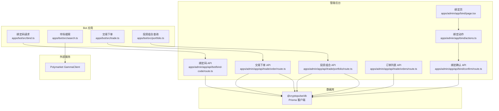
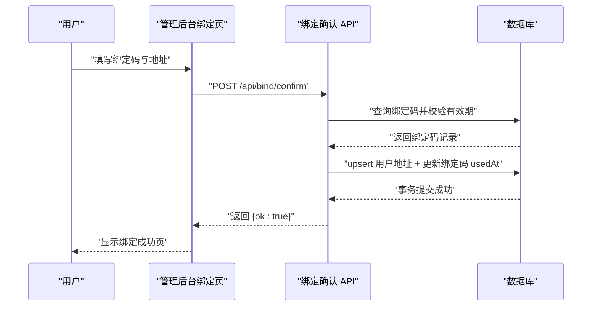
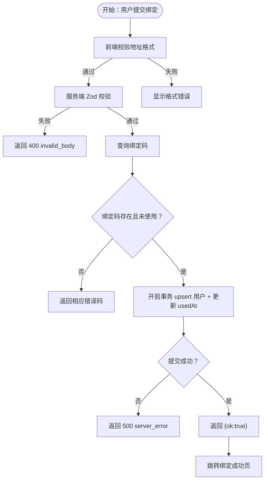
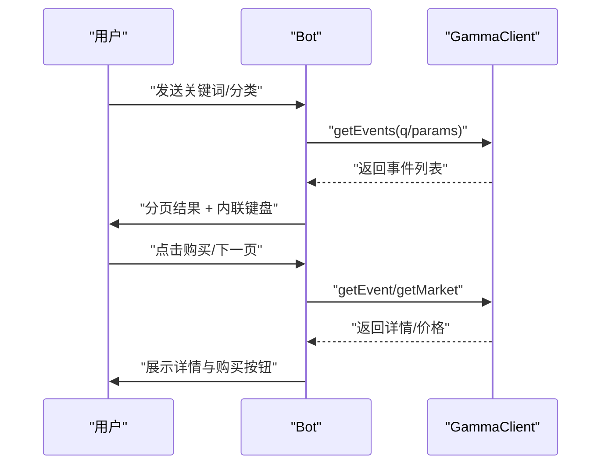
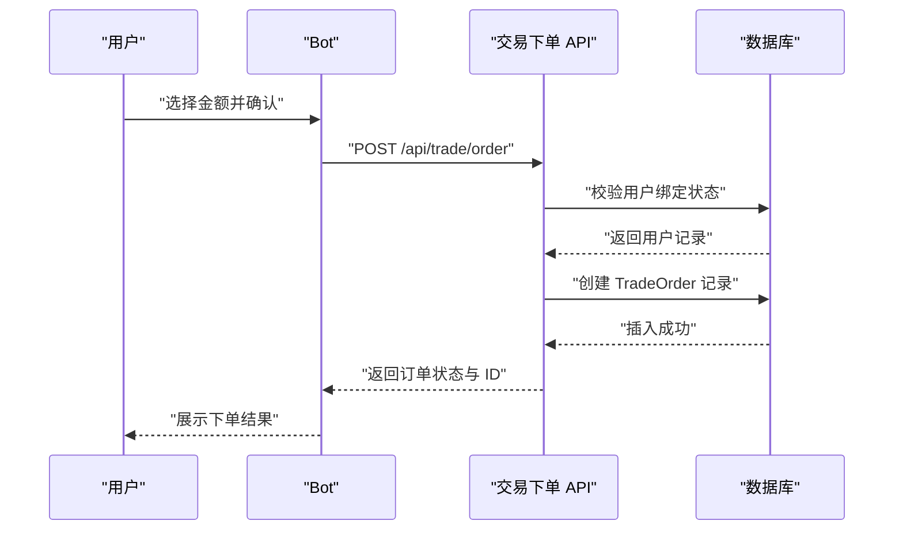
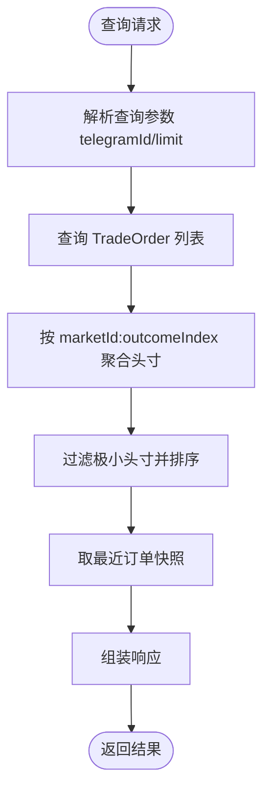
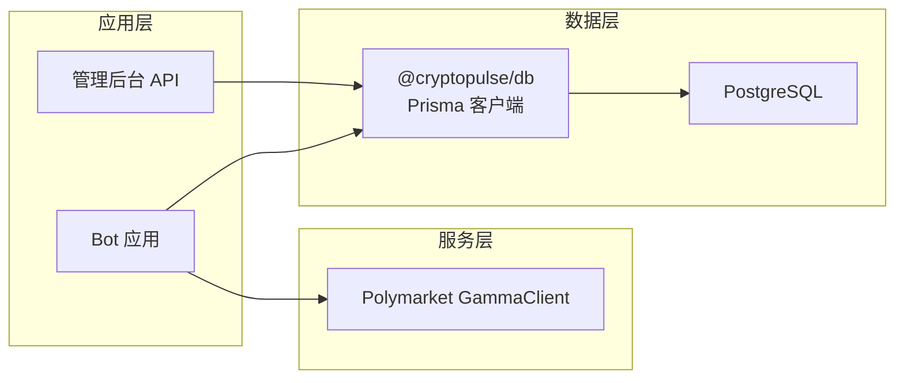

# 数据流架构

<cite>
**本文引用的文件**
- [README.md](file://README.md)
- [apps/admin/app/api/bot/bind-code/route.ts](file://apps/admin/app/api/bot/bind-code/route.ts)
- [apps/admin/app/api/bind/confirm/route.ts](file://apps/admin/app/api/bind/confirm/route.ts)
- [apps/admin/app/bind/actions.ts](file://apps/admin/app/bind/actions.ts)
- [apps/admin/app/bind/page.tsx](file://apps/admin/app/bind/page.tsx)
- [apps/admin/app/bind/bind-confirm-form.tsx](file://apps/admin/app/bind/bind-confirm-form.tsx)
- [apps/admin/app/bind/success/page.tsx](file://apps/admin/app/bind/success/page.tsx)
- [apps/admin/app/api/trade/order/route.ts](file://apps/admin/app/api/trade/order/route.ts)
- [apps/admin/app/api/trade/orders/route.ts](file://apps/admin/app/api/trade/orders/route.ts)
- [apps/admin/app/api/trade/portfolio/route.ts](file://apps/admin/app/api/trade/portfolio/route.ts)
- [apps/bot/src/bind.ts](file://apps/bot/src/bind.ts)
- [apps/bot/src/search.ts](file://apps/bot/src/search.ts)
- [apps/bot/src/trade.ts](file://apps/bot/src/trade.ts)
- [apps/bot/src/portfolio.ts](file://apps/bot/src/portfolio.ts)
- [packages/db/package.json](file://packages/db/package.json)
- [packages/polymarket/package.json](file://packages/polymarket/package.json)
- [test/bind-confirm.test.ts](file://test/bind-confirm.test.ts)
- [test/trade-order.test.ts](file://test/trade-order.test.ts)
</cite>

## 目录
1. [引言](#引言)
2. [项目结构](#项目结构)
3. [核心组件](#核心组件)
4. [架构总览](#架构总览)
5. [详细组件分析](#详细组件分析)
6. [依赖关系分析](#依赖关系分析)
7. [性能考量](#性能考量)
8. [故障排查指南](#故障排查指南)
9. [结论](#结论)
10. [附录](#附录)

## 引言
本文件面向 CryptoPulse 项目，聚焦于三大关键数据流路径：用户绑定流程、市场搜索流程、交易执行流程。文档从用户界面到 API 层，再到数据库层，逐层梳理数据传递机制，解释数据验证、转换与存储逻辑，并给出缓存策略与数据同步建议。同时，通过数据流图与状态转换图，帮助读者快速把握关键业务场景下的数据变化过程。

## 项目结构
项目采用多包工作区组织，包含管理后台应用、Telegram Bot 应用、Polymarket 客户端封装包以及数据库客户端包。核心数据流涉及以下模块：
- 管理后台（Next.js App Router）：负责用户绑定页面与交易相关 API。
- Telegram Bot（Grammy）：负责市场搜索、下单与仓位查询等交互。
- Polymarket 客户端封装：封装 GammaClient 与交易相关 SDK。
- 数据库客户端：基于 Prisma 提供统一的数据库访问能力。

图表来源
- [apps/admin/app/bind/page.tsx](file://apps/admin/app/bind/page.tsx#L30-L125)
- [apps/admin/app/bind/actions.ts](file://apps/admin/app/bind/actions.ts#L21-L88)
- [apps/admin/app/api/bind/confirm/route.ts](file://apps/admin/app/api/bind/confirm/route.ts#L21-L89)
- [apps/admin/app/api/bot/bind-code/route.ts](file://apps/admin/app/api/bot/bind-code/route.ts#L34-L102)
- [apps/admin/app/api/trade/order/route.ts](file://apps/admin/app/api/trade/order/route.ts#L16-L93)
- [apps/admin/app/api/trade/orders/route.ts](file://apps/admin/app/api/trade/orders/route.ts#L18-L72)
- [apps/admin/app/api/trade/portfolio/route.ts](file://apps/admin/app/api/trade/portfolio/route.ts#L17-L78)
- [apps/bot/src/bind.ts](file://apps/bot/src/bind.ts#L3-L30)
- [apps/bot/src/search.ts](file://apps/bot/src/search.ts#L27-L111)
- [apps/bot/src/trade.ts](file://apps/bot/src/trade.ts#L7-L118)
- [apps/bot/src/portfolio.ts](file://apps/bot/src/portfolio.ts#L4-L74)
- [packages/db/package.json](file://packages/db/package.json#L1-L22)
- [packages/polymarket/package.json](file://packages/polymarket/package.json#L1-L23)

章节来源
- [README.md](file://README.md#L1-L65)
- [packages/db/package.json](file://packages/db/package.json#L1-L22)
- [packages/polymarket/package.json](file://packages/polymarket/package.json#L1-L23)

## 核心组件
- 用户绑定组件
  - 管理后台绑定页与表单组件负责收集用户输入并触发绑定动作。
  - 绑定确认 API 对请求体进行严格校验，查询绑定码有效性，事务性地更新用户与绑定码状态。
- 市场搜索组件
  - Bot 侧封装 GammaClient，支持按关键词与分类检索市场，生成分页键盘与详情展示。
- 交易执行组件
  - Bot 发起下单请求，管理后台 API 校验授权与用户绑定状态，根据模式创建订单并返回结果。
- 投资组合组件
  - Bot 查询投资组合，管理后台聚合历史订单计算持仓与最近订单列表。

章节来源
- [apps/admin/app/bind/page.tsx](file://apps/admin/app/bind/page.tsx#L30-L125)
- [apps/admin/app/bind/bind-confirm-form.tsx](file://apps/admin/app/bind/bind-confirm-form.tsx#L18-L170)
- [apps/admin/app/bind/actions.ts](file://apps/admin/app/bind/actions.ts#L21-L88)
- [apps/admin/app/api/bind/confirm/route.ts](file://apps/admin/app/api/bind/confirm/route.ts#L21-L89)
- [apps/bot/src/search.ts](file://apps/bot/src/search.ts#L27-L111)
- [apps/bot/src/trade.ts](file://apps/bot/src/trade.ts#L7-L118)
- [apps/admin/app/api/trade/order/route.ts](file://apps/admin/app/api/trade/order/route.ts#L16-L93)
- [apps/admin/app/api/trade/portfolio/route.ts](file://apps/admin/app/api/trade/portfolio/route.ts#L17-L78)

## 架构总览
数据流自上而下分为三层：
- 表现层（用户界面）
  - 管理后台绑定页与表单、Bot 交互界面。
- API 层（Next.js API Routes）
  - 处理鉴权、参数校验、调用数据库与外部服务。
- 数据层（数据库与外部接口）
  - Prisma 客户端访问 PostgreSQL；GammaClient 访问 Polymarket 市场数据。

图表来源
- [apps/admin/app/bind/page.tsx](file://apps/admin/app/bind/page.tsx#L30-L125)
- [apps/admin/app/bind/bind-confirm-form.tsx](file://apps/admin/app/bind/bind-confirm-form.tsx#L18-L170)
- [apps/admin/app/bind/actions.ts](file://apps/admin/app/bind/actions.ts#L21-L88)
- [apps/admin/app/api/bind/confirm/route.ts](file://apps/admin/app/api/bind/confirm/route.ts#L21-L89)

## 详细组件分析

### 用户绑定流程
- 输入与校验
  - 前端表单对以太坊地址进行正则校验，支持留空表示解绑。
  - 服务端使用 Zod Schema 对请求体进行严格校验，确保字段类型与范围正确。
- 绑定码生命周期
  - 绑定码由 Bot 创建，有效期窗口内有效；一旦使用或过期，禁止重复使用。
- 事务性写入
  - 绑定确认 API 使用数据库事务，保证用户地址更新与绑定码使用标记的一致性。
- 错误处理
  - 针对数据库不可用、绑定码不存在/已使用/已过期、服务端异常等情况返回明确状态码与错误标识。

图表来源
- [apps/admin/app/bind/bind-confirm-form.tsx](file://apps/admin/app/bind/bind-confirm-form.tsx#L39-L53)
- [apps/admin/app/bind/actions.ts](file://apps/admin/app/bind/actions.ts#L21-L88)
- [apps/admin/app/api/bind/confirm/route.ts](file://apps/admin/app/api/bind/confirm/route.ts#L40-L83)
- [apps/admin/app/bind/success/page.tsx](file://apps/admin/app/bind/success/page.tsx#L5-L35)

章节来源
- [apps/admin/app/bind/page.tsx](file://apps/admin/app/bind/page.tsx#L30-L125)
- [apps/admin/app/bind/bind-confirm-form.tsx](file://apps/admin/app/bind/bind-confirm-form.tsx#L18-L170)
- [apps/admin/app/bind/actions.ts](file://apps/admin/app/bind/actions.ts#L21-L88)
- [apps/admin/app/api/bind/confirm/route.ts](file://apps/admin/app/api/bind/confirm/route.ts#L21-L89)
- [apps/bot/src/bind.ts](file://apps/bot/src/bind.ts#L3-L30)
- [test/bind-confirm.test.ts](file://test/bind-confirm.test.ts#L33-L83)

### 市场搜索流程
- 搜索入口
  - Bot 接收用户关键词或分类选择，调用 GammaClient 获取事件列表。
- 分页与渲染
  - 每页固定条数，生成内联键盘支持上下页切换；详情页展示价格与购买按钮。
- 错误处理
  - 捕获网络或解析异常，向用户反馈“搜索失败”。

图表来源
- [apps/bot/src/search.ts](file://apps/bot/src/search.ts#L27-L111)
- [apps/bot/src/search.ts](file://apps/bot/src/search.ts#L113-L156)

章节来源
- [apps/bot/src/search.ts](file://apps/bot/src/search.ts#L27-L233)

### 交易执行流程
- 下单发起
  - Bot 根据市场与选项生成金额选择键盘，用户确认后构造下单请求。
- 授权与校验
  - 管理后台 API 校验 Bearer Token 与请求体，检查用户是否已绑定 Polymarket 地址。
- 订单创建与模式控制
  - 根据 TRADE_MODE 决定订单状态（模拟模式下直接返回已成交状态）。
- 结果返回
  - 返回订单 ID、状态、均价与交易哈希等关键信息。

图表来源
- [apps/bot/src/trade.ts](file://apps/bot/src/trade.ts#L68-L118)
- [apps/admin/app/api/trade/order/route.ts](file://apps/admin/app/api/trade/order/route.ts#L16-L93)

章节来源
- [apps/bot/src/trade.ts](file://apps/bot/src/trade.ts#L7-L118)
- [apps/admin/app/api/trade/order/route.ts](file://apps/admin/app/api/trade/order/route.ts#L16-L93)
- [test/trade-order.test.ts](file://test/trade-order.test.ts#L50-L105)

### 投资组合与订单查询
- 订单查询
  - Bot 通过 API 查询指定用户的订单列表，支持分页限制。
- 投资组合聚合
  - 管理后台聚合历史订单，按市场与选项维度累加净头寸，过滤小量头寸并排序，同时返回最近订单快照。

图表来源
- [apps/admin/app/api/trade/orders/route.ts](file://apps/admin/app/api/trade/orders/route.ts#L18-L72)
- [apps/admin/app/api/trade/portfolio/route.ts](file://apps/admin/app/api/trade/portfolio/route.ts#L17-L78)
- [apps/bot/src/portfolio.ts](file://apps/bot/src/portfolio.ts#L4-L74)

章节来源
- [apps/admin/app/api/trade/orders/route.ts](file://apps/admin/app/api/trade/orders/route.ts#L18-L72)
- [apps/admin/app/api/trade/portfolio/route.ts](file://apps/admin/app/api/trade/portfolio/route.ts#L17-L78)
- [apps/bot/src/portfolio.ts](file://apps/bot/src/portfolio.ts#L4-L74)

## 依赖关系分析
- 包依赖
  - @cryptopulse/db：提供 Prisma 客户端与数据库访问。
  - @cryptopulse/polymarket：封装 Polymarket 相关客户端与签名工具。
- 外部依赖
  - Polymarket GammaClient：用于市场数据查询与详情获取。
  - Telegram Bot 框架（Grammy）：处理消息与内联键盘交互。
- 数据库模型
  - 用户表：存储 Telegram ID 与各类钱包地址。
  - 绑定码表：存储一次性验证码与过期时间。
  - 订单表：存储交易订单的状态、金额、方向与链上信息。

图表来源
- [packages/db/package.json](file://packages/db/package.json#L1-L22)
- [packages/polymarket/package.json](file://packages/polymarket/package.json#L1-L23)
- [apps/bot/src/search.ts](file://apps/bot/src/search.ts#L27-L111)
- [apps/admin/app/api/bind/confirm/route.ts](file://apps/admin/app/api/bind/confirm/route.ts#L26-L31)

章节来源
- [packages/db/package.json](file://packages/db/package.json#L1-L22)
- [packages/polymarket/package.json](file://packages/polymarket/package.json#L1-L23)

## 性能考量
- 请求体校验与早期返回
  - 在 API 层尽早进行 JSON 解析与 Zod 校验，避免无效请求进入数据库层。
- 事务一致性
  - 绑定确认使用事务，减少并发场景下的数据不一致风险。
- 模式化交易模式
  - 通过环境变量控制交易模式，便于在开发与测试阶段降低链上交互成本。
- 分页与聚合
  - 订单查询与投资组合聚合限制数量与排序，避免大结果集带来的内存与网络压力。

[本节为通用指导，无需列出具体文件来源]

## 故障排查指南
- 绑定流程
  - 若出现“绑定码不存在/已使用/已过期”，检查 Bot 是否正确创建绑定码并与管理后台数据库连接正常。
  - 若服务端错误，检查 DATABASE_URL 与 Prisma 客户端可用性。
- 交易流程
  - 若返回“未授权”，检查 BOT_API_TOKEN 设置与请求头 Bearer Token。
  - 若返回“用户未绑定”，检查用户是否已在管理后台完成绑定。
- 搜索与投资组合
  - 若搜索失败，检查 Polymarket GammaClient 可达性与网络超时。
  - 若投资组合为空，确认用户是否存在订单记录。

章节来源
- [apps/admin/app/api/bind/confirm/route.ts](file://apps/admin/app/api/bind/confirm/route.ts#L21-L89)
- [apps/admin/app/api/trade/order/route.ts](file://apps/admin/app/api/trade/order/route.ts#L16-L93)
- [apps/bot/src/search.ts](file://apps/bot/src/search.ts#L58-L61)
- [apps/bot/src/portfolio.ts](file://apps/bot/src/portfolio.ts#L22-L26)

## 结论
本架构文档梳理了 CryptoPulse 的三大核心数据流：用户绑定、市场搜索与交易执行。通过严格的输入校验、事务性写入与清晰的错误处理，系统在管理后台与 Bot 之间建立了稳定的数据通道。建议在生产环境中结合缓存与异步任务优化长耗时操作，并持续完善监控与日志体系以提升可观测性。

[本节为总结性内容，无需列出具体文件来源]

## 附录
- 关键环境变量
  - DATABASE_URL：数据库连接字符串。
  - BOT_API_TOKEN：Bot 侧交易与查询的鉴权令牌。
  - TRADE_MODE：交易模式（如 mock）。
  - NEXT_PUBLIC_BOT_USERNAME：Bot 用户名，用于引导用户返回 Bot。
- 测试参考
  - 绑定确认测试覆盖绑定码不存在、成功绑定与重复使用等场景。
  - 交易下单测试覆盖鉴权失败、未绑定用户与模拟模式下单等场景。

章节来源
- [test/bind-confirm.test.ts](file://test/bind-confirm.test.ts#L33-L112)
- [test/trade-order.test.ts](file://test/trade-order.test.ts#L50-L107)