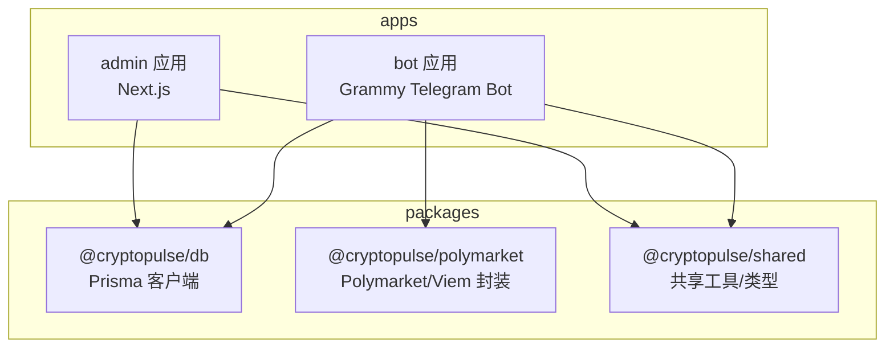
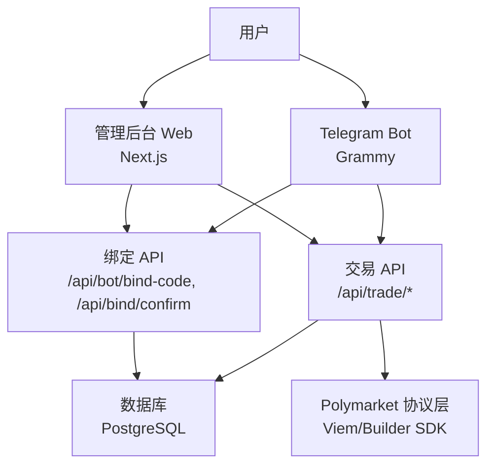
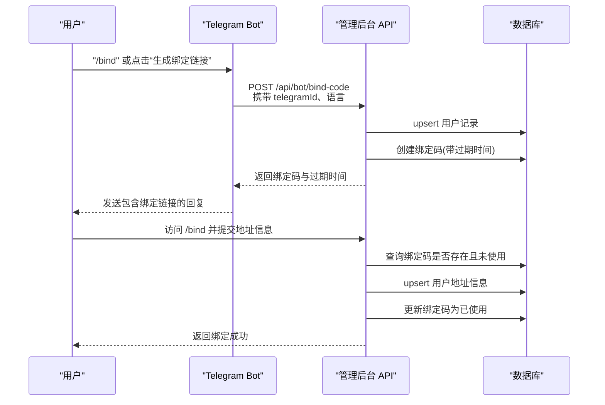
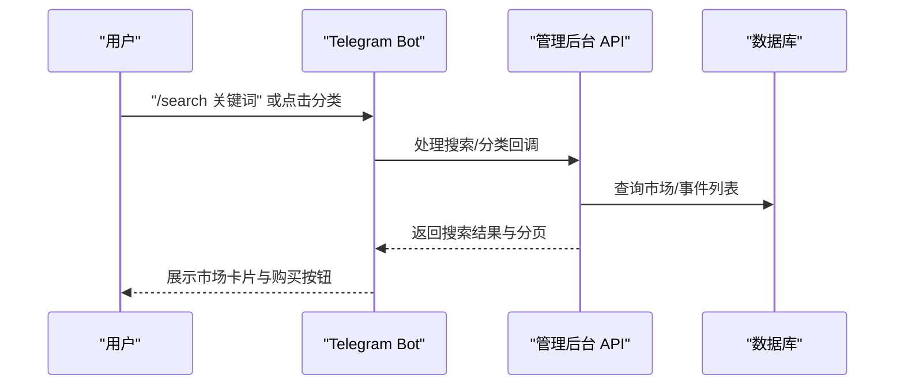
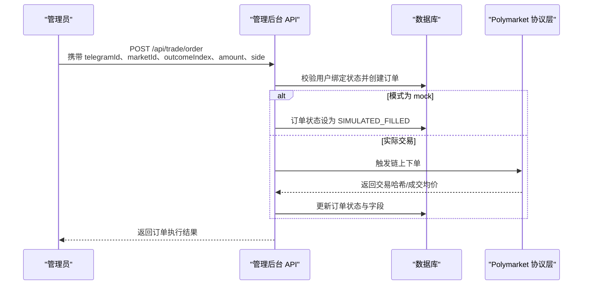
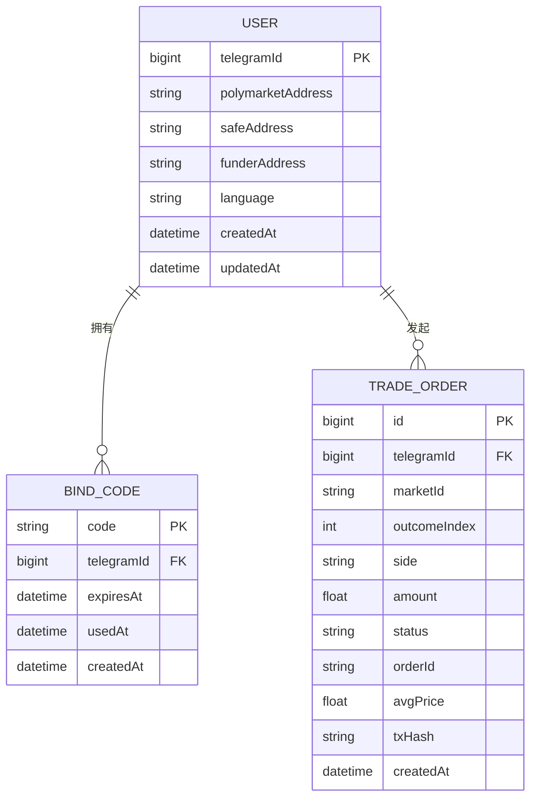
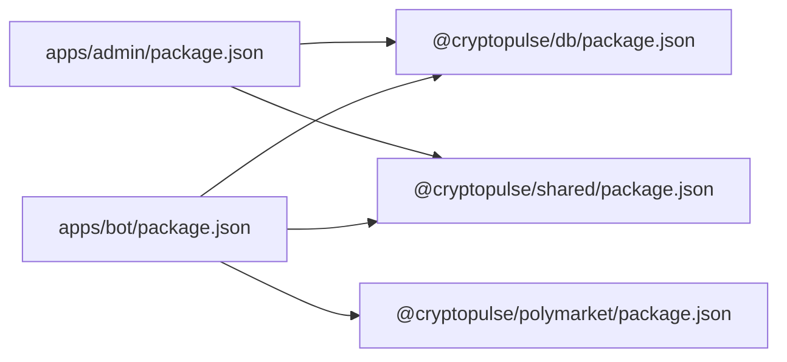

# 系统架构

<cite>
**本文引用的文件**
- [README.md](file://README.md)
- [package.json](file://package.json)
- [apps/admin/package.json](file://apps/admin/package.json)
- [apps/admin/next.config.ts](file://apps/admin/next.config.ts)
- [apps/admin/middleware.ts](file://apps/admin/middleware.ts)
- [apps/admin/app/api/bind/confirm/route.ts](file://apps/admin/app/api/bind/confirm/route.ts)
- [apps/admin/app/api/bot/bind-code/route.ts](file://apps/admin/app/api/bot/bind-code/route.ts)
- [apps/admin/app/api/trade/order/route.ts](file://apps/admin/app/api/trade/order/route.ts)
- [apps/admin/app/api/trade/orders/route.ts](file://apps/admin/app/api/trade/orders/route.ts)
- [apps/admin/app/api/trade/portfolio/route.ts](file://apps/admin/app/api/trade/portfolio/route.ts)
- [apps/bot/package.json](file://apps/bot/package.json)
- [apps/bot/src/index.ts](file://apps/bot/src/index.ts)
- [packages/db/package.json](file://packages/db/package.json)
- [packages/polymarket/package.json](file://packages/polymarket/package.json)
- [packages/shared/package.json](file://packages/shared/package.json)
</cite>

## 目录
1. [引言](#引言)
2. [项目结构](#项目结构)
3. [核心组件](#核心组件)
4. [架构总览](#架构总览)
5. [详细组件分析](#详细组件分析)
6. [依赖分析](#依赖分析)
7. [性能考量](#性能考量)
8. [故障排查指南](#故障排查指南)
9. [结论](#结论)
10. [附录](#附录)

## 引言
本文件面向 CryptoPulse 项目，系统化阐述其 Monorepo 架构设计与整体系统架构。项目采用工作区（workspaces）组织 apps/ 与 packages/ 两大目录，分别承载前端管理后台、Telegram 机器人与共享包。系统围绕“用户绑定—市场搜索—交易执行”的主业务流展开，结合数据库层与外部协议栈（Polymarket、Viem），形成前后端分离、模块解耦、可扩展的架构。

## 项目结构
- 工作区配置通过根级 package.json 的 workspaces 字段声明，统一管理 apps/* 与 packages/*。
- apps/admin：基于 Next.js 的前端管理后台，提供绑定确认、交易下单、订单查询、组合查询等接口。
- apps/bot：基于 Grammy 的 Telegram 机器人，负责用户交互、绑定码生成、市场搜索、交易下单与组合查询。
- packages/db：封装 Prisma 客户端与数据库 Schema，作为共享数据访问层。
- packages/polymarket：封装 Polymarket 协议交互与链上交易相关能力（含 Viem、Builder SDK 等）。
- packages/shared：存放跨应用共享的类型、校验规则与通用逻辑。

图表来源
- [package.json](file://package.json#L4-L7)
- [apps/admin/package.json](file://apps/admin/package.json#L13-L25)
- [apps/bot/package.json](file://apps/bot/package.json#L12-L19)
- [packages/db/package.json](file://packages/db/package.json#L6-L12)
- [packages/polymarket/package.json](file://packages/polymarket/package.json#L6-L11)
- [packages/shared/package.json](file://packages/shared/package.json#L6-L11)

章节来源
- [package.json](file://package.json#L4-L15)
- [apps/admin/package.json](file://apps/admin/package.json#L1-L42)
- [apps/bot/package.json](file://apps/bot/package.json#L1-L26)
- [packages/db/package.json](file://packages/db/package.json#L1-L22)
- [packages/polymarket/package.json](file://packages/polymarket/package.json#L1-L23)
- [packages/shared/package.json](file://packages/shared/package.json#L1-L19)

## 核心组件
- 前端管理后台（apps/admin）
  - Next.js 15，启用服务器动作体大小限制与打包编译优化。
  - 中间件保护 /admin 路由，支持 Bearer Token 鉴权。
  - 提供绑定确认、生成绑定码、交易下单、订单查询、组合查询等 API。
- Telegram 机器人（apps/bot）
  - 基于 Grammy，提供 /start、/bind、/search、/portfolio 等命令与内联回调查询处理。
  - 与管理后台协作完成绑定码下发与交易指令路由。
- 数据库层（packages/db）
  - Prisma 客户端封装，提供用户、绑定码、交易订单等模型访问。
- 协议与链上交互（packages/polymarket）
  - 封装 Polymarket CLOB、Builder Relayer/Signing SDK、Viem 等，支撑交易执行与链上交互。
- 共享包（packages/shared）
  - 提供跨应用的类型定义、Zod 校验等共享能力。

章节来源
- [apps/admin/next.config.ts](file://apps/admin/next.config.ts#L3-L26)
- [apps/admin/middleware.ts](file://apps/admin/middleware.ts#L3-L21)
- [apps/admin/app/api/bind/confirm/route.ts](file://apps/admin/app/api/bind/confirm/route.ts#L21-L89)
- [apps/admin/app/api/bot/bind-code/route.ts](file://apps/admin/app/api/bot/bind-code/route.ts#L34-L103)
- [apps/admin/app/api/trade/order/route.ts](file://apps/admin/app/api/trade/order/route.ts#L16-L93)
- [apps/admin/app/api/trade/orders/route.ts](file://apps/admin/app/api/trade/orders/route.ts#L18-L72)
- [apps/admin/app/api/trade/portfolio/route.ts](file://apps/admin/app/api/trade/portfolio/route.ts#L17-L78)
- [apps/bot/src/index.ts](file://apps/bot/src/index.ts#L9-L156)
- [packages/db/package.json](file://packages/db/package.json#L6-L12)
- [packages/polymarket/package.json](file://packages/polymarket/package.json#L11-L17)
- [packages/shared/package.json](file://packages/shared/package.json#L11-L12)

## 架构总览
系统边界清晰：前端管理后台与 Telegram 机器人通过 API 共享数据库层；机器人负责用户交互与触发，后台负责鉴权与数据持久化；协议交互由共享包封装，便于复用与替换。

图表来源
- [apps/admin/app/api/bot/bind-code/route.ts](file://apps/admin/app/api/bot/bind-code/route.ts#L34-L103)
- [apps/admin/app/api/bind/confirm/route.ts](file://apps/admin/app/api/bind/confirm/route.ts#L21-L89)
- [apps/admin/app/api/trade/order/route.ts](file://apps/admin/app/api/trade/order/route.ts#L16-L93)
- [apps/admin/app/api/trade/orders/route.ts](file://apps/admin/app/api/trade/orders/route.ts#L18-L72)
- [apps/admin/app/api/trade/portfolio/route.ts](file://apps/admin/app/api/trade/portfolio/route.ts#L17-L78)
- [apps/bot/src/index.ts](file://apps/bot/src/index.ts#L9-L156)
- [packages/polymarket/package.json](file://packages/polymarket/package.json#L11-L17)

## 详细组件分析

### 用户绑定流程（Bot → Web → DB）
该流程从 Telegram 机器人生成绑定码开始，经由 Web 端绑定页完成地址确认，最终写入用户信息并标记绑定码使用。

图表来源
- [apps/bot/src/index.ts](file://apps/bot/src/index.ts#L57-L91)
- [apps/admin/app/api/bot/bind-code/route.ts](file://apps/admin/app/api/bot/bind-code/route.ts#L34-L103)
- [apps/admin/app/api/bind/confirm/route.ts](file://apps/admin/app/api/bind/confirm/route.ts#L21-L89)

章节来源
- [apps/bot/src/index.ts](file://apps/bot/src/index.ts#L57-L91)
- [apps/admin/app/api/bot/bind-code/route.ts](file://apps/admin/app/api/bot/bind-code/route.ts#L34-L103)
- [apps/admin/app/api/bind/confirm/route.ts](file://apps/admin/app/api/bind/confirm/route.ts#L21-L89)

### 市场搜索流程（Bot → Web → DB）
机器人根据用户输入或分类选择，调用搜索逻辑并返回结果；Web 端提供搜索与事件详情入口，支持分页与回调交互。

图表来源
- [apps/bot/src/index.ts](file://apps/bot/src/index.ts#L45-L51)
- [apps/bot/src/index.ts](file://apps/bot/src/index.ts#L108-L122)

章节来源
- [apps/bot/src/index.ts](file://apps/bot/src/index.ts#L45-L51)
- [apps/bot/src/index.ts](file://apps/bot/src/index.ts#L108-L122)

### 交易执行流程（Web → DB → 协议层）
管理员通过 Web 端发起交易请求，后台进行鉴权与参数校验后，根据配置决定模拟或真实执行，并持久化订单状态。

图表来源
- [apps/admin/app/api/trade/order/route.ts](file://apps/admin/app/api/trade/order/route.ts#L16-L93)
- [packages/polymarket/package.json](file://packages/polymarket/package.json#L11-L17)

章节来源
- [apps/admin/app/api/trade/order/route.ts](file://apps/admin/app/api/trade/order/route.ts#L16-L93)
- [apps/admin/app/api/trade/orders/route.ts](file://apps/admin/app/api/trade/orders/route.ts#L18-L72)
- [apps/admin/app/api/trade/portfolio/route.ts](file://apps/admin/app/api/trade/portfolio/route.ts#L17-L78)
- [packages/polymarket/package.json](file://packages/polymarket/package.json#L11-L17)

### 数据模型与关系
以下 ER 图展示与交易流程相关的实体关系：用户、绑定码、交易订单。

图表来源
- [apps/admin/app/api/bot/bind-code/route.ts](file://apps/admin/app/api/bot/bind-code/route.ts#L72-L79)
- [apps/admin/app/api/bind/confirm/route.ts](file://apps/admin/app/api/bind/confirm/route.ts#L64-L83)
- [apps/admin/app/api/trade/order/route.ts](file://apps/admin/app/api/trade/order/route.ts#L65-L77)

章节来源
- [apps/admin/app/api/bot/bind-code/route.ts](file://apps/admin/app/api/bot/bind-code/route.ts#L72-L79)
- [apps/admin/app/api/bind/confirm/route.ts](file://apps/admin/app/api/bind/confirm/route.ts#L64-L83)
- [apps/admin/app/api/trade/order/route.ts](file://apps/admin/app/api/trade/order/route.ts#L65-L77)

## 依赖分析
- 工作区与构建
  - 根级 workspaces 统一管理子包与应用，简化安装与测试。
  - admin 应用通过 transpilePackages 将 @cryptopulse/db 与 @cryptopulse/shared 纳入编译范围，提升开发体验。
- 运行时与中间件
  - admin 应用中间件对 /admin 路由进行鉴权拦截，生产环境强制 Bearer Token，开发环境可绕过。
- 应用间依赖
  - admin 与 bot 均依赖 @cryptopulse/db 与 @cryptopulse/shared；bot 还依赖 @cryptopulse/polymarket。
  - polymarket 包依赖 viem、Polymarket 生态 SDK，用于链上交互与订单执行。

图表来源
- [apps/admin/package.json](file://apps/admin/package.json#L13-L25)
- [apps/bot/package.json](file://apps/bot/package.json#L12-L19)
- [packages/db/package.json](file://packages/db/package.json#L6-L12)
- [packages/polymarket/package.json](file://packages/polymarket/package.json#L6-L11)
- [packages/shared/package.json](file://packages/shared/package.json#L6-L11)

章节来源
- [apps/admin/next.config.ts](file://apps/admin/next.config.ts#L3-L26)
- [apps/admin/middleware.ts](file://apps/admin/middleware.ts#L3-L21)
- [apps/admin/package.json](file://apps/admin/package.json#L13-L25)
- [apps/bot/package.json](file://apps/bot/package.json#L12-L19)
- [packages/db/package.json](file://packages/db/package.json#L6-L12)
- [packages/polymarket/package.json](file://packages/polymarket/package.json#L6-L11)
- [packages/shared/package.json](file://packages/shared/package.json#L6-L11)

## 性能考量
- 编译与热更新
  - admin 应用通过 transpilePackages 与自定义 webpack watchOptions 忽略系统无关目录，减少不必要的监听与编译。
- API 体积与安全
  - 服务器动作体大小限制避免过大负载；中间件与 Bearer Token 降低未授权访问风险。
- 数据访问
  - 交易订单查询默认限制数量并按时间倒序，避免一次性拉取过多数据。
- 交易模式
  - 支持 mock 模式快速验证流程，生产模式下通过协议层执行链上交易，兼顾开发效率与真实业务闭环。

章节来源
- [apps/admin/next.config.ts](file://apps/admin/next.config.ts#L3-L26)
- [apps/admin/middleware.ts](file://apps/admin/middleware.ts#L3-L21)
- [apps/admin/app/api/trade/orders/route.ts](file://apps/admin/app/api/trade/orders/route.ts#L7-L10)
- [apps/admin/app/api/trade/order/route.ts](file://apps/admin/app/api/trade/order/route.ts#L61-L76)

## 故障排查指南
- 绑定流程
  - 绑定码不存在或已使用：检查 /api/bot/bind-code 是否正确创建，确认 /api/bind/confirm 的查询条件与过期时间。
  - 绑定码过期：确认生成时间与过期时间计算逻辑。
- 交易流程
  - 未绑定用户下单：确认用户是否已绑定钱包地址。
  - 未设置鉴权 Token：核对 BOT_API_TOKEN 与请求头 Authorization。
  - 数据库不可用：检查 DATABASE_URL 与 Prisma 可用性。
- 机器人异常
  - 捕获全局错误日志，定位回调查询与命令处理中的异常分支。

章节来源
- [apps/admin/app/api/bot/bind-code/route.ts](file://apps/admin/app/api/bot/bind-code/route.ts#L34-L103)
- [apps/admin/app/api/bind/confirm/route.ts](file://apps/admin/app/api/bind/confirm/route.ts#L48-L62)
- [apps/admin/app/api/trade/order/route.ts](file://apps/admin/app/api/trade/order/route.ts#L16-L23)
- [apps/admin/app/api/trade/order/route.ts](file://apps/admin/app/api/trade/order/route.ts#L55-L57)
- [apps/bot/src/index.ts](file://apps/bot/src/index.ts#L150-L152)

## 结论
本项目以 Monorepo 形式清晰划分前端、机器人与共享包，通过统一的工作区与共享包实现高内聚低耦合。管理后台与 Telegram 机器人通过 API 协同完成用户绑定、市场搜索与交易执行，数据库层提供稳定的数据持久化能力。技术选型上，Next.js 与 Grammy 提供现代化开发体验，Prisma 与 Viem/Polymarket SDK 保障数据与链上交互的可靠性。整体架构具备良好的可扩展性与可维护性，适合后续引入更多市场与功能模块。

## 附录
- 环境与部署
  - 本地开发与数据库初始化参考根 README 的安装与初始化说明。
- 运行方式
  - 管理后台：通过根脚本启动。
  - Telegram 机器人：设置 TELEGRAM_BOT_TOKEN 后启动。

章节来源
- [README.md](file://README.md#L15-L57)
- [package.json](file://package.json#L8-L14)