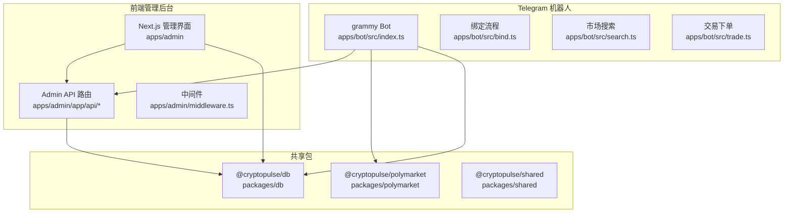
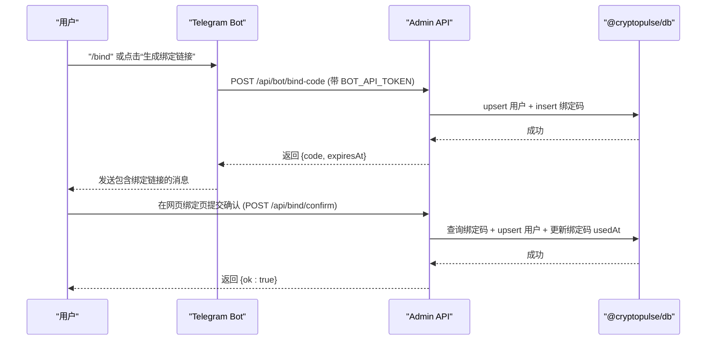
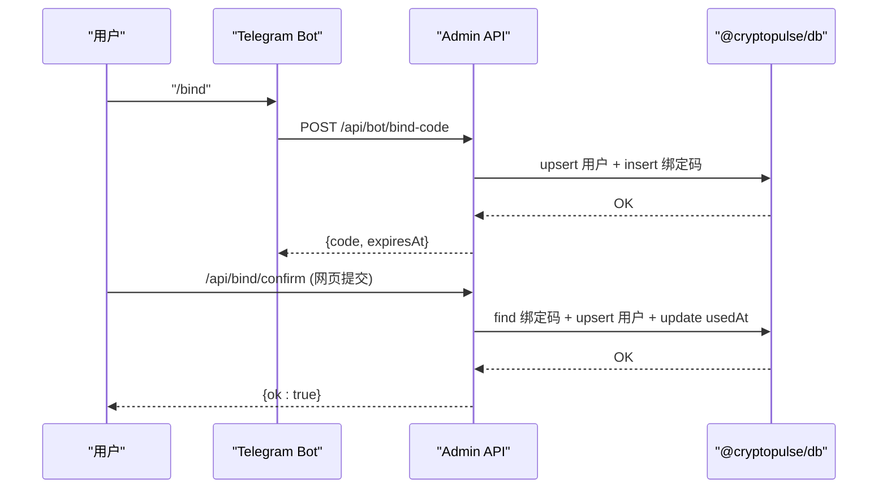
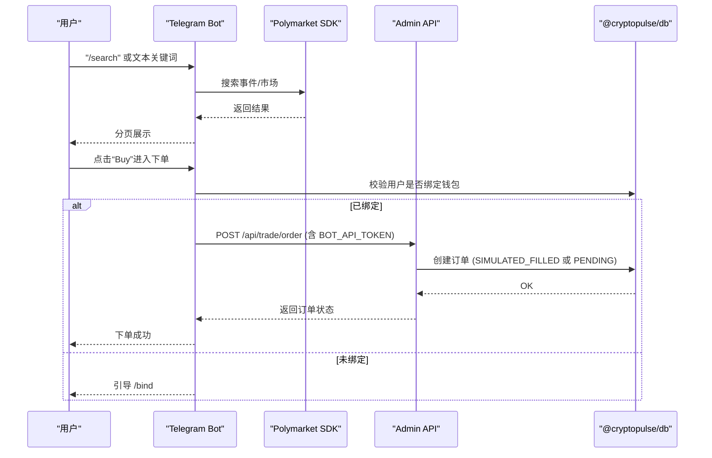
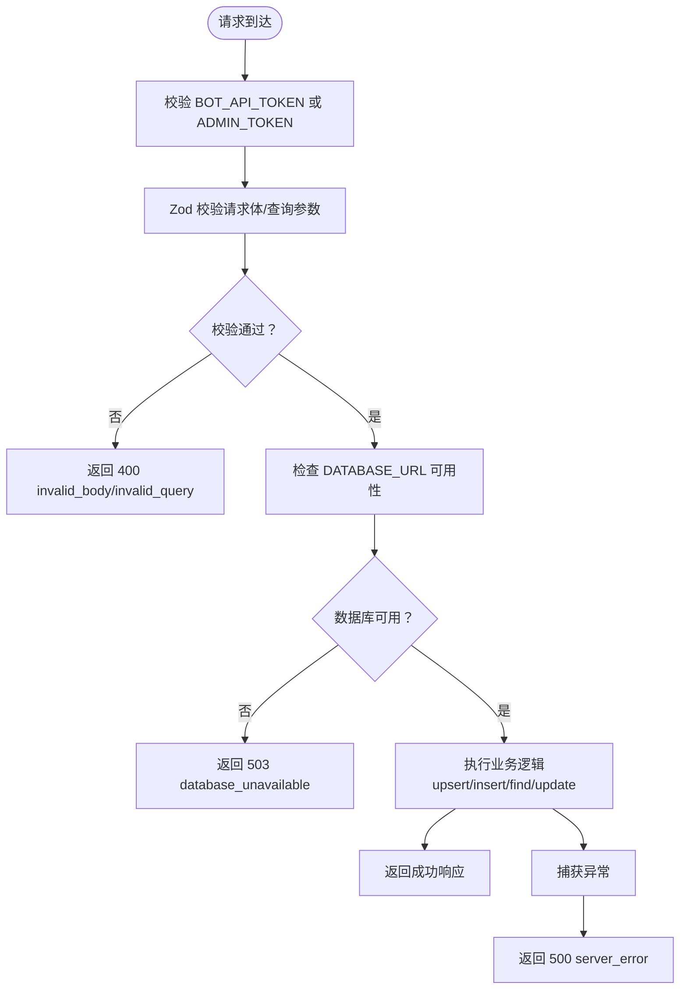
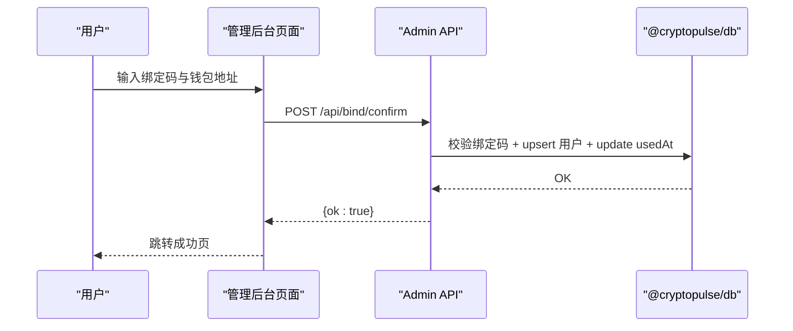
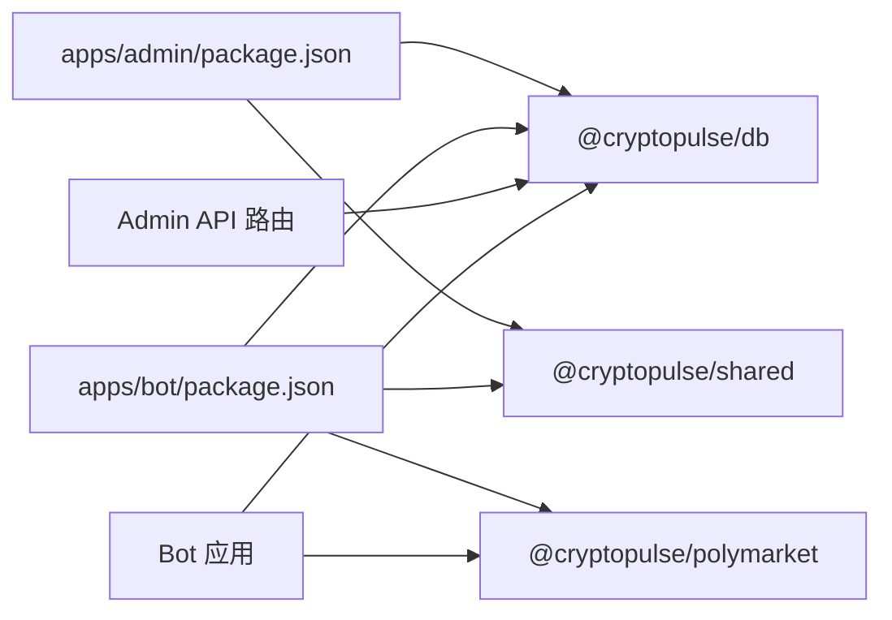

# 组件交互模式

<cite>
**本文引用的文件**
- [apps/admin/app/api/bot/bind-code/route.ts](file://apps/admin/app/api/bot/bind-code/route.ts)
- [apps/admin/app/api/bind/confirm/route.ts](file://apps/admin/app/api/bind/confirm/route.ts)
- [apps/admin/app/api/trade/order/route.ts](file://apps/admin/app/api/trade/order/route.ts)
- [apps/admin/app/api/trade/orders/route.ts](file://apps/admin/app/api/trade/orders/route.ts)
- [apps/admin/app/api/trade/portfolio/route.ts](file://apps/admin/app/api/trade/portfolio/route.ts)
- [apps/admin/middleware.ts](file://apps/admin/middleware.ts)
- [apps/admin/app/bind/actions.ts](file://apps/admin/app/bind/actions.ts)
- [apps/admin/app/bind/bind-confirm-form.tsx](file://apps/admin/app/bind/bind-confirm-form.tsx)
- [apps/admin/app/bind/success/page.tsx](file://apps/admin/app/bind/success/page.tsx)
- [apps/admin/package.json](file://apps/admin/package.json)
- [apps/admin/app/layout.tsx](file://apps/admin/app/layout.tsx)
- [apps/admin/app/page.tsx](file://apps/admin/app/page.tsx)
- [apps/bot/src/index.ts](file://apps/bot/src/index.ts)
- [apps/bot/src/bind.ts](file://apps/bot/src/bind.ts)
- [apps/bot/src/search.ts](file://apps/bot/src/search.ts)
- [apps/bot/src/trade.ts](file://apps/bot/src/trade.ts)
- [apps/bot/package.json](file://apps/bot/package.json)
- [packages/db/package.json](file://packages/db/package.json)
- [packages/polymarket/package.json](file://packages/polymarket/package.json)
- [packages/shared/package.json](file://packages/shared/package.json)
</cite>

## 目录
1. [简介](#简介)
2. [项目结构](#项目结构)
3. [核心组件](#核心组件)
4. [架构总览](#架构总览)
5. [详细组件分析](#详细组件分析)
6. [依赖关系分析](#依赖关系分析)
7. [性能考虑](#性能考虑)
8. [故障排查指南](#故障排查指南)
9. [结论](#结论)
10. [附录](#附录)

## 简介
本文件面向 CryptoPulse 项目，系统化梳理前端管理后台、Telegram 机器人、共享包与数据库层之间的交互关系与通信机制。重点覆盖以下场景：
- 用户绑定流程：从 Telegram Bot 触发，经 Admin API 生成绑定码，再到数据库写入；随后在网页端完成确认绑定，最终回写用户信息。
- 市场搜索与交易执行：Bot 通过 Polymarket SDK 搜索与展示市场，用户点击购买后由 Bot 调用 Admin API 提交订单，Admin API 校验用户绑定状态并持久化订单。
- API 层设计：路由设计、中间件与认证授权、请求校验与错误处理策略。

## 项目结构
项目采用多包（monorepo）组织方式，包含：
- apps/admin：Next.js 管理后台，提供绑定页面、交易查询与组合持仓视图，并通过中间件保护管理入口。
- apps/bot：基于 grammy 的 Telegram 机器人，负责用户交互、市场搜索、下单与回调处理。
- packages/db：数据库访问层（Prisma），被 Admin API 与 Bot 共同使用。
- packages/polymarket：Polymarket 市场数据客户端封装。
- packages/shared：共享工具与类型定义。

图表来源
- [apps/admin/app/api/bot/bind-code/route.ts](file://apps/admin/app/api/bot/bind-code/route.ts#L1-L105)
- [apps/admin/app/api/bind/confirm/route.ts](file://apps/admin/app/api/bind/confirm/route.ts#L1-L91)
- [apps/admin/app/api/trade/order/route.ts](file://apps/admin/app/api/trade/order/route.ts#L1-L94)
- [apps/admin/app/api/trade/orders/route.ts](file://apps/admin/app/api/trade/orders/route.ts#L1-L74)
- [apps/admin/app/api/trade/portfolio/route.ts](file://apps/admin/app/api/trade/portfolio/route.ts#L1-L80)
- [apps/admin/middleware.ts](file://apps/admin/middleware.ts#L1-L23)
- [apps/bot/src/index.ts](file://apps/bot/src/index.ts#L1-L156)
- [apps/bot/src/bind.ts](file://apps/bot/src/bind.ts#L1-L39)
- [apps/bot/src/search.ts](file://apps/bot/src/search.ts#L1-L233)
- [apps/bot/src/trade.ts](file://apps/bot/src/trade.ts#L1-L118)
- [packages/db/package.json](file://packages/db/package.json)
- [packages/polymarket/package.json](file://packages/polymarket/package.json)
- [packages/shared/package.json](file://packages/shared/package.json)

章节来源
- [apps/admin/package.json](file://apps/admin/package.json#L1-L42)
- [apps/bot/package.json](file://apps/bot/package.json#L1-L26)
- [packages/db/package.json](file://packages/db/package.json)
- [packages/polymarket/package.json](file://packages/polymarket/package.json)
- [packages/shared/package.json](file://packages/shared/package.json)

## 核心组件
- Telegram Bot：负责用户交互、市场搜索、下单确认与回调处理，向 Admin API 发起绑定码生成与订单提交请求。
- Admin API：提供绑定码生成、绑定确认、订单提交、订单列表查询、组合持仓查询等接口，统一进行鉴权、参数校验与错误处理。
- 管理后台 UI：Next.js 页面，提供绑定表单、提交动作与成功页，与 Admin API 协作完成绑定流程。
- 数据库层：通过 @cryptopulse/db 提供 Prisma 访问，存储用户、绑定码、交易订单等数据。
- Polymarket 客户端：封装 GammaClient，用于检索事件与市场数据，驱动 Bot 的搜索与详情展示。

章节来源
- [apps/admin/app/api/bot/bind-code/route.ts](file://apps/admin/app/api/bot/bind-code/route.ts#L1-L105)
- [apps/admin/app/api/bind/confirm/route.ts](file://apps/admin/app/api/bind/confirm/route.ts#L1-L91)
- [apps/admin/app/api/trade/order/route.ts](file://apps/admin/app/api/trade/order/route.ts#L1-L94)
- [apps/admin/app/api/trade/orders/route.ts](file://apps/admin/app/api/trade/orders/route.ts#L1-L74)
- [apps/admin/app/api/trade/portfolio/route.ts](file://apps/admin/app/api/trade/portfolio/route.ts#L1-L80)
- [apps/admin/app/bind/actions.ts](file://apps/admin/app/bind/actions.ts#L1-L90)
- [apps/admin/app/bind/bind-confirm-form.tsx](file://apps/admin/app/bind/bind-confirm-form.tsx#L1-L172)
- [apps/admin/app/bind/success/page.tsx](file://apps/admin/app/bind/success/page.tsx#L1-L38)
- [apps/bot/src/index.ts](file://apps/bot/src/index.ts#L1-L156)
- [apps/bot/src/bind.ts](file://apps/bot/src/bind.ts#L1-L39)
- [apps/bot/src/search.ts](file://apps/bot/src/search.ts#L1-L233)
- [apps/bot/src/trade.ts](file://apps/bot/src/trade.ts#L1-L118)

## 架构总览
整体交互遵循“Bot → Admin API → 数据库”的链路，Admin API 作为统一入口，集中处理鉴权、参数校验与业务逻辑；Bot 仅负责用户交互与调用 Admin API；数据库通过共享包提供一致访问。

图表来源
- [apps/bot/src/index.ts](file://apps/bot/src/index.ts#L57-L89)
- [apps/bot/src/bind.ts](file://apps/bot/src/bind.ts#L3-L30)
- [apps/admin/app/api/bot/bind-code/route.ts](file://apps/admin/app/api/bot/bind-code/route.ts#L34-L103)
- [apps/admin/app/api/bind/confirm/route.ts](file://apps/admin/app/api/bind/confirm/route.ts#L21-L89)

## 详细组件分析

### 绑定流程（Bot → Admin API → 数据库）
- Bot 侧触发：Bot 接收 /bind 或点击“生成绑定链接”，调用 Admin API 的绑定码接口，携带 BOT_API_TOKEN。
- Admin API 校验：校验 BOT_API_TOKEN、数据库可用性、请求体结构；upsert 用户记录，插入绑定码（带过期时间）。
- 网页确认：用户收到绑定链接，打开页面输入绑定码与钱包地址，提交至 Admin API 的绑定确认接口；接口校验绑定码有效性并更新用户信息与绑定码状态。
- 数据落库：事务保证用户与绑定码状态的一致性。

图表来源
- [apps/bot/src/bind.ts](file://apps/bot/src/bind.ts#L3-L30)
- [apps/admin/app/api/bot/bind-code/route.ts](file://apps/admin/app/api/bot/bind-code/route.ts#L34-L103)
- [apps/admin/app/api/bind/confirm/route.ts](file://apps/admin/app/api/bind/confirm/route.ts#L21-L89)

章节来源
- [apps/bot/src/index.ts](file://apps/bot/src/index.ts#L57-L89)
- [apps/bot/src/bind.ts](file://apps/bot/src/bind.ts#L1-L39)
- [apps/admin/app/api/bot/bind-code/route.ts](file://apps/admin/app/api/bot/bind-code/route.ts#L1-L105)
- [apps/admin/app/api/bind/confirm/route.ts](file://apps/admin/app/api/bind/confirm/route.ts#L1-L91)
- [apps/admin/app/bind/actions.ts](file://apps/admin/app/bind/actions.ts#L1-L90)
- [apps/admin/app/bind/bind-confirm-form.tsx](file://apps/admin/app/bind/bind-confirm-form.tsx#L1-L172)
- [apps/admin/app/bind/success/page.tsx](file://apps/admin/app/bind/success/page.tsx#L1-L38)

### 市场搜索与交易执行
- 市场搜索：Bot 通过 Polymarket SDK 搜索事件与市场，分页展示；用户点击进入详情或选择购买。
- 交易下单：Bot 校验用户是否已绑定钱包地址；若未绑定则引导绑定；若已绑定则发起订单提交请求至 Admin API。
- 订单处理：Admin API 校验 BOT_API_TOKEN、请求体、用户绑定状态，根据环境变量决定模拟或真实执行，创建订单并返回结果。

图表来源
- [apps/bot/src/search.ts](file://apps/bot/src/search.ts#L27-L111)
- [apps/bot/src/trade.ts](file://apps/bot/src/trade.ts#L7-L66)
- [apps/admin/app/api/trade/order/route.ts](file://apps/admin/app/api/trade/order/route.ts#L16-L93)

章节来源
- [apps/bot/src/search.ts](file://apps/bot/src/search.ts#L1-L233)
- [apps/bot/src/trade.ts](file://apps/bot/src/trade.ts#L1-L118)
- [apps/admin/app/api/trade/order/route.ts](file://apps/admin/app/api/trade/order/route.ts#L1-L94)

### API 层设计模式
- 路由设计：Admin API 采用 App Router 的函数式路由，按功能拆分为 bot/bind-code、bind/confirm、trade/order、trade/orders、trade/portfolio 等子路径。
- 中间件：管理后台使用自定义中间件对 /admin/* 路径进行登录态校验，通过环境变量 ADMIN_TOKEN 与 Cookie 比对控制访问。
- 鉴权与授权：Bot 相关接口要求 BOT_API_TOKEN，Admin API 对请求头 Authorization 进行解析与比对；网页端绑定流程通过数据库事务确保一致性。
- 请求校验：使用 Zod 对请求体与查询参数进行严格校验，统一返回错误码与状态码。
- 错误处理：对数据库不可用、JSON 解析失败、唯一约束冲突、过期/未找到/已使用等边界条件进行明确响应；服务端异常统一返回 500。

图表来源
- [apps/admin/app/api/bot/bind-code/route.ts](file://apps/admin/app/api/bot/bind-code/route.ts#L34-L103)
- [apps/admin/app/api/bind/confirm/route.ts](file://apps/admin/app/api/bind/confirm/route.ts#L21-L89)
- [apps/admin/app/api/trade/order/route.ts](file://apps/admin/app/api/trade/order/route.ts#L16-L93)
- [apps/admin/app/api/trade/orders/route.ts](file://apps/admin/app/api/trade/orders/route.ts#L18-L72)
- [apps/admin/app/api/trade/portfolio/route.ts](file://apps/admin/app/api/trade/portfolio/route.ts#L17-L79)
- [apps/admin/middleware.ts](file://apps/admin/middleware.ts#L3-L17)

章节来源
- [apps/admin/middleware.ts](file://apps/admin/middleware.ts#L1-L23)
- [apps/admin/app/api/bot/bind-code/route.ts](file://apps/admin/app/api/bot/bind-code/route.ts#L1-L105)
- [apps/admin/app/api/bind/confirm/route.ts](file://apps/admin/app/api/bind/confirm/route.ts#L1-L91)
- [apps/admin/app/api/trade/order/route.ts](file://apps/admin/app/api/trade/order/route.ts#L1-L94)
- [apps/admin/app/api/trade/orders/route.ts](file://apps/admin/app/api/trade/orders/route.ts#L1-L74)
- [apps/admin/app/api/trade/portfolio/route.ts](file://apps/admin/app/api/trade/portfolio/route.ts#L1-L80)

### 管理后台页面与绑定确认
- 绑定页：提供绑定码输入与钱包地址表单，前端使用 Zod 校验并在提交时通过服务器动作调用 Admin API 的绑定确认接口。
- 成功页：提示用户回到 Bot 并给出下一步操作指引。

图表来源
- [apps/admin/app/bind/actions.ts](file://apps/admin/app/bind/actions.ts#L21-L88)
- [apps/admin/app/bind/bind-confirm-form.tsx](file://apps/admin/app/bind/bind-confirm-form.tsx#L18-L172)
- [apps/admin/app/bind/success/page.tsx](file://apps/admin/app/bind/success/page.tsx#L5-L35)
- [apps/admin/app/api/bind/confirm/route.ts](file://apps/admin/app/api/bind/confirm/route.ts#L21-L89)

章节来源
- [apps/admin/app/bind/actions.ts](file://apps/admin/app/bind/actions.ts#L1-L90)
- [apps/admin/app/bind/bind-confirm-form.tsx](file://apps/admin/app/bind/bind-confirm-form.tsx#L1-L172)
- [apps/admin/app/bind/success/page.tsx](file://apps/admin/app/bind/success/page.tsx#L1-L38)

## 依赖关系分析
- Admin 应用依赖 @cryptopulse/db 与 @cryptopulse/shared，用于数据库访问与通用工具。
- Bot 应用依赖 @cryptopulse/db、@cryptopulse/polymarket、@cryptopulse/shared，用于数据库、市场数据与通用工具。
- Admin API 与 Bot 共享数据库访问能力，避免重复实现。

图表来源
- [apps/admin/package.json](file://apps/admin/package.json#L13-L25)
- [apps/bot/package.json](file://apps/bot/package.json#L12-L19)

章节来源
- [apps/admin/package.json](file://apps/admin/package.json#L1-L42)
- [apps/bot/package.json](file://apps/bot/package.json#L1-L26)

## 性能考虑
- 绑定码生成：在循环中尝试插入绑定码以规避唯一约束冲突，最多重试若干次，避免因并发导致失败。
- 订单创建：根据环境变量 TRADE_MODE 决定模拟或真实执行，便于测试与灰度发布。
- 分页与限制：搜索与查询接口限制每页数量，降低数据库压力与网络传输开销。
- 缓存与并发：Bot 侧对错误进行日志记录，避免重复请求造成资源浪费；Admin API 对数据库连接与事务进行合理使用。

## 故障排查指南
- 401 未授权：检查 BOT_API_TOKEN 或 ADMIN_TOKEN 是否正确配置，以及请求头 Authorization 是否包含正确的 Bearer Token。
- 400 参数错误：确认请求体与查询参数符合 Zod 校验规则，如地址格式、数值范围、必填项等。
- 404/410 绑定码问题：确认绑定码是否存在、是否已被使用、是否已过期。
- 500 服务器错误：查看 Admin API 与 Bot 的错误日志，定位数据库连接、导入模块或外部依赖异常。
- 数据库不可用：检查 DATABASE_URL 是否配置，Prisma 客户端是否可正常加载。

章节来源
- [apps/admin/app/api/bot/bind-code/route.ts](file://apps/admin/app/api/bot/bind-code/route.ts#L38-L44)
- [apps/admin/app/api/bind/confirm/route.ts](file://apps/admin/app/api/bind/confirm/route.ts#L52-L62)
- [apps/admin/app/api/trade/order/route.ts](file://apps/admin/app/api/trade/order/route.ts#L21-L23)
- [apps/admin/middleware.ts](file://apps/admin/middleware.ts#L11-L14)

## 结论
本项目通过清晰的职责划分与统一的 API 层，实现了 Bot、Admin UI、Admin API 与数据库之间的稳定协作。Bot 负责用户交互与调用，Admin API 负责鉴权、校验与业务编排，数据库通过共享包提供一致访问。绑定流程与交易执行均具备完善的错误处理与边界条件控制，适合在生产环境中持续演进与扩展。

## 附录
- 管理后台入口与布局：首页提供进入后台的入口，根布局设置站点元数据与基础样式。
  
章节来源
- [apps/admin/app/page.tsx](file://apps/admin/app/page.tsx#L1-L21)
- [apps/admin/app/layout.tsx](file://apps/admin/app/layout.tsx#L1-L24)