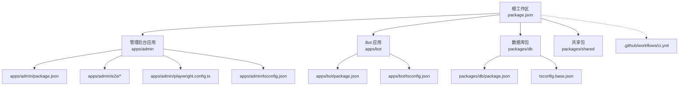
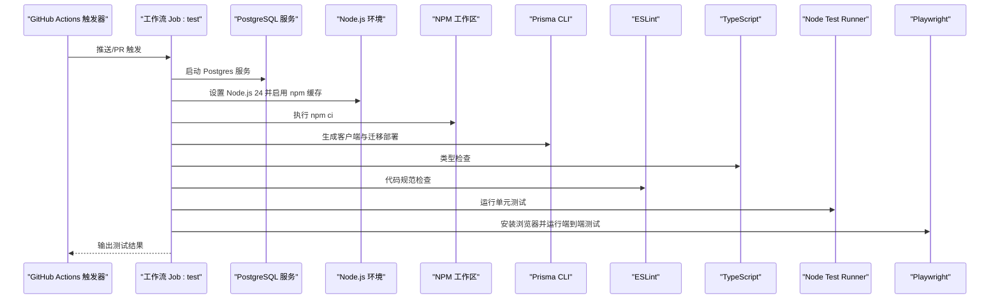
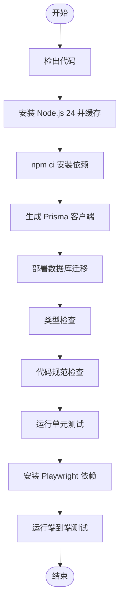
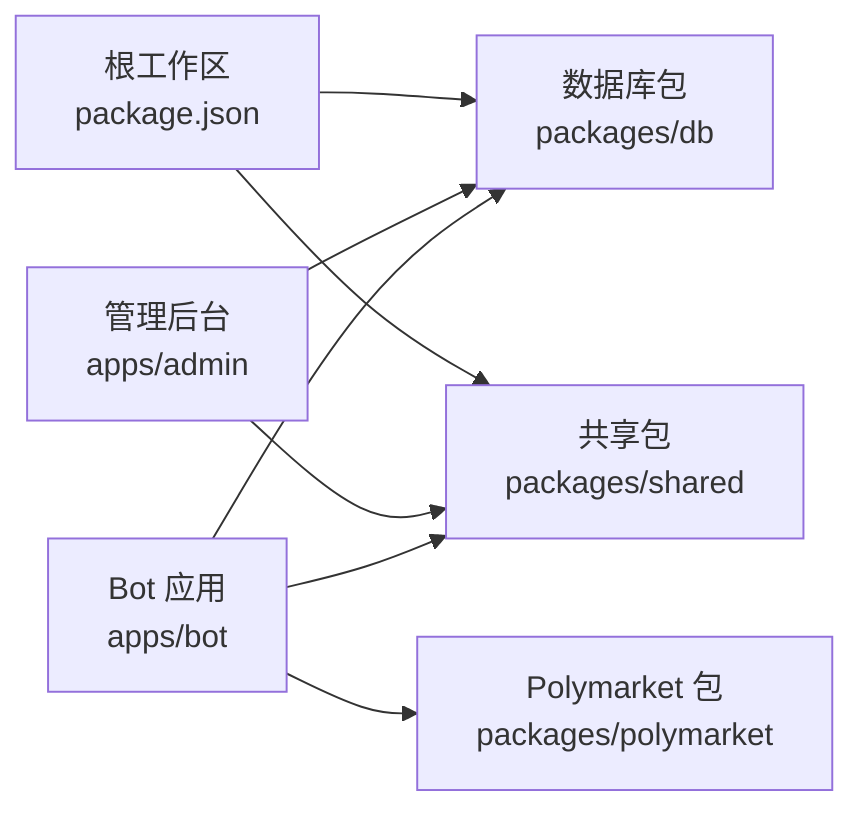

# CI/CD 流水线

<cite>
**本文引用的文件**
- [.github/workflows/ci.yml](file://.github/workflows/ci.yml)
- [package.json](file://package.json)
- [docker-compose.yml](file://docker-compose.yml)
- [apps/admin/package.json](file://apps/admin/package.json)
- [apps/admin/playwright.config.ts](file://apps/admin/playwright.config.ts)
- [apps/admin/tsconfig.json](file://apps/admin/tsconfig.json)
- [apps/admin/e2e/bind.e2e.spec.ts](file://apps/admin/e2e/bind.e2e.spec.ts)
- [apps/bot/package.json](file://apps/bot/package.json)
- [apps/bot/tsconfig.json](file://apps/bot/tsconfig.json)
- [packages/db/package.json](file://packages/db/package.json)
- [tsconfig.base.json](file://tsconfig.base.json)
- [README.md](file://README.md)
- [test/bind-code.test.ts](file://test/bind-code.test.ts)
- [test/admin-next-config.test.ts](file://test/admin-next-config.test.ts)
</cite>

## 目录
1. [简介](#简介)
2. [项目结构](#项目结构)
3. [核心组件](#核心组件)
4. [架构总览](#架构总览)
5. [详细组件分析](#详细组件分析)
6. [依赖关系分析](#依赖关系分析)
7. [性能考量](#性能考量)
8. [故障排查指南](#故障排查指南)
9. [结论](#结论)
10. [附录](#附录)

## 简介
本文件面向 CryptoPulse 项目的 CI/CD 流水线，基于仓库中现有的 GitHub Actions 工作流与工程化配置，系统性梳理从代码质量检查、单元测试到端到端测试的执行流程；说明自动化构建、依赖安装与打包策略；给出多环境部署建议（测试、预生产、生产）；补充版本标签与发布分支策略、回滚机制、安全与依赖漏洞检查、部署前后钩子、通知与审计日志、监控与性能指标收集以及故障自动恢复配置建议。

## 项目结构
本项目采用 monorepo 结构，根级通过工作区管理多个应用与共享包：
- 根工作区定义了统一的脚本与工作空间范围
- 应用层包含管理后台与 Telegram Bot
- 共享与数据库相关包位于 packages 目录
- 端到端测试位于管理后台应用内
- GitHub Actions 工作流位于 .github/workflows

图表来源
- [package.json](file://package.json#L1-L18)
- [apps/admin/package.json](file://apps/admin/package.json#L1-L42)
- [apps/admin/playwright.config.ts](file://apps/admin/playwright.config.ts#L1-L23)
- [apps/admin/e2e/bind.e2e.spec.ts](file://apps/admin/e2e/bind.e2e.spec.ts#L1-L74)
- [apps/bot/package.json](file://apps/bot/package.json#L1-L26)
- [packages/db/package.json](file://packages/db/package.json#L1-L22)
- [tsconfig.base.json](file://tsconfig.base.json#L1-L16)
- [.github/workflows/ci.yml](file://.github/workflows/ci.yml#L1-L46)

章节来源
- [package.json](file://package.json#L1-L18)
- [.github/workflows/ci.yml](file://.github/workflows/ci.yml#L1-L46)

## 核心组件
- GitHub Actions 工作流：负责在推送主分支与拉取请求时触发测试矩阵，包含服务依赖（PostgreSQL）、环境变量注入、依赖安装、类型检查、代码规范检查、单元测试与端到端测试。
- 管理后台应用：包含 Next.js 应用、Playwright 端到端测试配置与脚本。
- Bot 应用：包含 TypeScript 编译与运行脚本。
- 数据库包：封装 Prisma 客户端与迁移生成脚本。
- 类型系统：基于 tsconfig.base.json 的统一编译选项，确保跨包一致性。

章节来源
- [.github/workflows/ci.yml](file://.github/workflows/ci.yml#L1-L46)
- [apps/admin/package.json](file://apps/admin/package.json#L1-L42)
- [apps/admin/playwright.config.ts](file://apps/admin/playwright.config.ts#L1-L23)
- [apps/bot/package.json](file://apps/bot/package.json#L1-L26)
- [packages/db/package.json](file://packages/db/package.json#L1-L22)
- [tsconfig.base.json](file://tsconfig.base.json#L1-L16)

## 架构总览
下图展示了 CI 工作流在 GitHub Runner 上的执行路径，包括服务依赖、环境准备、依赖安装、数据库迁移、类型检查、代码规范、单元测试与端到端测试。

图表来源
- [.github/workflows/ci.yml](file://.github/workflows/ci.yml#L1-L46)
- [apps/admin/package.json](file://apps/admin/package.json#L1-L42)
- [apps/admin/playwright.config.ts](file://apps/admin/playwright.config.ts#L1-L23)
- [packages/db/package.json](file://packages/db/package.json#L1-L22)

## 详细组件分析

### GitHub Actions 工作流（ci.yml）
- 触发条件：主分支推送与所有拉取请求
- 运行环境：ubuntu-latest
- 服务依赖：PostgreSQL 16，健康检查与端口映射
- 环境变量：数据库连接串、Bot 认证令牌、端到端测试基础 URL
- 步骤顺序：
  1) 检出代码
  2) 安装 Node.js 24 并启用 npm 缓存
  3) 依赖安装（npm ci）
  4) 生成 Prisma 客户端
  5) 部署数据库迁移
  6) 类型检查
  7) 代码规范检查（管理后台）
  8) 单元测试（Node Test Runner）
  9) 安装 Playwright 依赖并运行 Chromium 端到端测试

图表来源
- [.github/workflows/ci.yml](file://.github/workflows/ci.yml#L1-L46)

章节来源
- [.github/workflows/ci.yml](file://.github/workflows/ci.yml#L1-L46)

### 管理后台应用（apps/admin）
- 脚本职责：
  - 开发：Next.js 开发服务器
  - 构建：Next.js 构建
  - 启动：Next.js 生产启动
  - 规范检查：ESLint
  - 类型检查：TypeScript
  - 端到端测试：先构建再运行 Playwright
- 端到端测试配置：
  - 测试目录、超时、断言超时
  - 基础 URL 来自环境变量
  - 保留失败时的 trace
  - Chromium 与 Chrome 两个项目
  - Web 服务命令、URL、复用现有服务、超时控制

章节来源
- [apps/admin/package.json](file://apps/admin/package.json#L1-L42)
- [apps/admin/playwright.config.ts](file://apps/admin/playwright.config.ts#L1-L23)

### Bot 应用（apps/bot）
- 脚本职责：
  - 开发：TSX 监视模式
  - 构建：TypeScript 编译（使用独立 tsconfig.build.json）
  - 运行：Node 启动（支持源码映射）
  - 类型检查：TypeScript
- 类型系统：继承根级 tsconfig.base.json，模块解析为 NodeNext

章节来源
- [apps/bot/package.json](file://apps/bot/package.json#L1-L26)
- [apps/bot/tsconfig.json](file://apps/bot/tsconfig.json#L1-L10)
- [tsconfig.base.json](file://tsconfig.base.json#L1-L16)

### 数据库包（packages/db）
- 脚本职责：
  - 类型检查：TypeScript
  - 生成 Prisma 客户端
  - 开发迁移（可选）
- 依赖：Prisma 客户端与 Prisma CLI

章节来源
- [packages/db/package.json](file://packages/db/package.json#L1-L22)

### 类型系统与配置（tsconfig.base.json）
- 统一编译目标与模块系统
- 严格模式与跳过库检查
- JSX 保留策略
- 供各包继承

章节来源
- [tsconfig.base.json](file://tsconfig.base.json#L1-L16)

### 单元测试与端到端测试
- 单元测试：
  - 使用 Node Test Runner（内置测试框架）
  - 示例测试覆盖管理后台配置与绑定码 API 行为
- 端到端测试：
  - Playwright 测试套件，包含绑定流程场景
  - 依赖本地数据库地址校验，避免非本地环境误测

章节来源
- [test/admin-next-config.test.ts](file://test/admin-next-config.test.ts#L1-L20)
- [test/bind-code.test.ts](file://test/bind-code.test.ts#L1-L88)
- [apps/admin/e2e/bind.e2e.spec.ts](file://apps/admin/e2e/bind.e2e.spec.ts#L1-L74)

## 依赖关系分析
- 工作区聚合：根 package.json 声明工作区，统一脚本与依赖安装
- 应用间依赖：管理后台依赖数据库与共享包；Bot 依赖数据库与 Polymarket 相关包
- 服务依赖：CI 中使用 PostgreSQL 作为数据库服务；本地开发使用 docker-compose 提供 Postgres 与 Redis

图表来源
- [package.json](file://package.json#L1-L18)
- [apps/admin/package.json](file://apps/admin/package.json#L1-L42)
- [apps/bot/package.json](file://apps/bot/package.json#L1-L26)
- [packages/db/package.json](file://packages/db/package.json#L1-L22)

章节来源
- [package.json](file://package.json#L1-L18)
- [apps/admin/package.json](file://apps/admin/package.json#L1-L42)
- [apps/bot/package.json](file://apps/bot/package.json#L1-L26)
- [packages/db/package.json](file://packages/db/package.json#L1-L22)

## 性能考量
- 依赖安装缓存：在工作流中启用 npm 缓存以减少安装时间
- 服务健康检查：PostgreSQL 服务配置健康检查参数，提升稳定性
- 端到端测试并发：Playwright 支持多项目并行，可在 CI 中扩展
- 类型检查与规范检查：在测试前执行，尽早暴露问题，减少后续失败成本

章节来源
- [.github/workflows/ci.yml](file://.github/workflows/ci.yml#L1-L46)
- [apps/admin/playwright.config.ts](file://apps/admin/playwright.config.ts#L1-L23)

## 故障排查指南
- 数据库连接失败
  - 确认 DATABASE_URL 环境变量正确指向 PostgreSQL
  - 检查 CI 中服务健康检查是否通过
- 端到端测试失败
  - 确认 E2E_BASE_URL 指向正确的管理后台地址
  - 查看 Playwright trace 与日志定位问题
- 本地开发与 CI 环境差异
  - 参考 README 的环境变量与 Prisma 初始化步骤
  - 本地使用 docker-compose 提供 Postgres 与 Redis
- 单元测试跳过
  - 当检测到非本地数据库地址时，测试会跳过，属于预期行为

章节来源
- [.github/workflows/ci.yml](file://.github/workflows/ci.yml#L1-L46)
- [apps/admin/playwright.config.ts](file://apps/admin/playwright.config.ts#L1-L23)
- [apps/admin/e2e/bind.e2e.spec.ts](file://apps/admin/e2e/bind.e2e.spec.ts#L1-L74)
- [README.md](file://README.md#L1-L65)

## 结论
当前仓库已具备完善的 CI 基础：工作流覆盖类型检查、代码规范、单元测试与端到端测试，并通过服务依赖保障数据库可用性。建议在此基础上扩展多环境部署、版本与发布策略、安全与漏洞扫描、监控与告警、回滚与审计等能力，以形成完整的交付闭环。

## 附录

### 多环境部署策略（建议）
- 测试环境
  - 自动化：PR 合并至测试分支触发部署
  - 配置：独立数据库与缓存实例
  - 回滚：支持一键回滚至上一个稳定版本
- 预生产环境
  - 触发：主分支合并或手动批准
  - 流程：自动化部署 + 关键功能回归测试
- 生产环境
  - 触发：打标签或手动批准
  - 流程：蓝绿/金丝雀发布 + 健康检查 + 自动回滚

### 版本标签与发布分支策略（建议）
- 分支策略：主分支保护，特性分支开发，PR 合并至测试分支
- 标签策略：语义化版本标签（vX.Y.Z），CI 自动记录发布产物
- 回滚机制：基于容器镜像或静态资源版本号快速回滚

### 安全与依赖漏洞检查（建议）
- 依赖扫描：使用 npm audit 或 Snyk/Dependabot
- 代码扫描：Secrets 扫描与许可证合规检查
- 容器镜像：镜像扫描与基线加固

### 部署前后钩子、通知与审计（建议）
- 钩子：部署前迁移、部署后缓存清理
- 通知：Slack/邮件通知部署状态与失败告警
- 审计：记录部署人、版本、时间、变更摘要

### 监控与性能指标（建议）
- 指标：应用响应时间、错误率、数据库查询耗时
- 告警：阈值告警与趋势异常检测
- 自动恢复：探活失败自动重启与灰度回滚