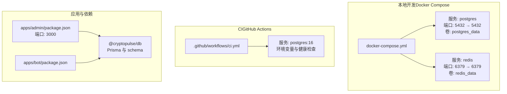
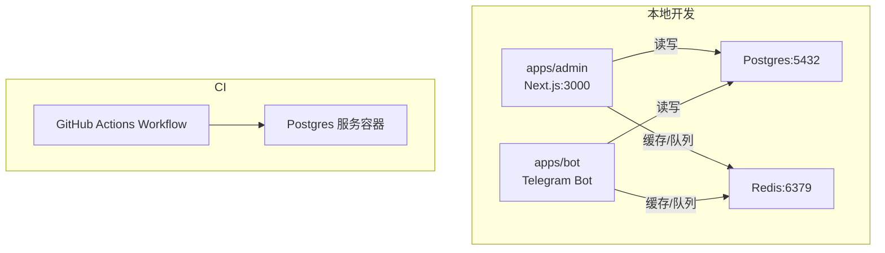
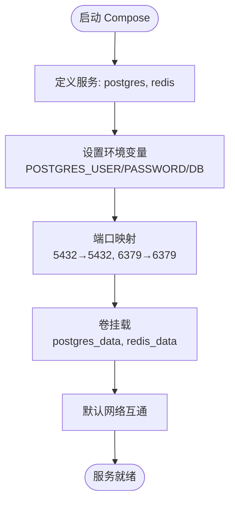
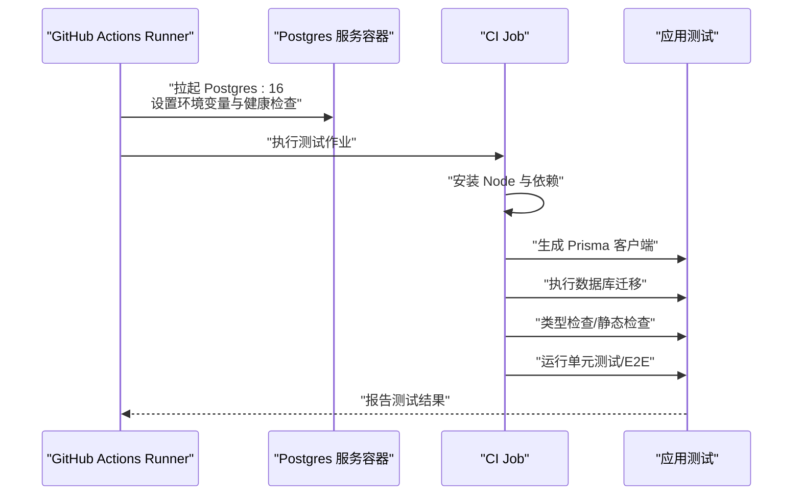
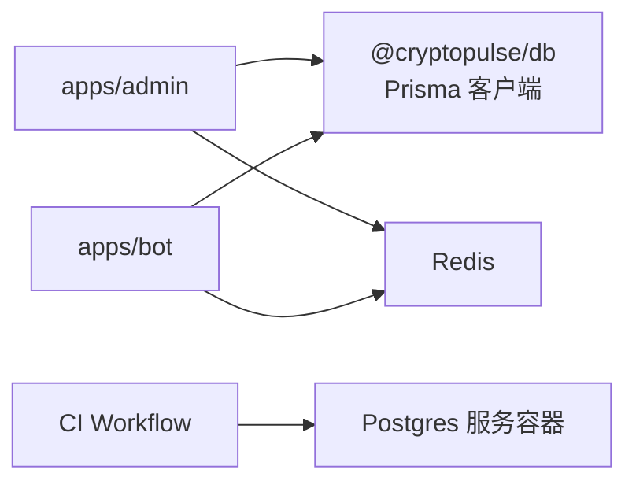

# 容器化配置

<cite>
**本文引用的文件**
- [docker-compose.yml](file://docker-compose.yml)
- [.github/workflows/ci.yml](file://.github/workflows/ci.yml)
- [.env.example](file://.env.example)
- [package.json](file://package.json)
- [specs/cryptopulse/design.md](file://specs/cryptopulse/design.md)
- [apps/admin/package.json](file://apps/admin/package.json)
- [apps/admin/next.config.ts](file://apps/admin/next.config.ts)
- [apps/admin/middleware.ts](file://apps/admin/middleware.ts)
- [apps/bot/package.json](file://apps/bot/package.json)
- [apps/bot/src/env.ts](file://apps/bot/src/env.ts)
- [packages/db/package.json](file://packages/db/package.json)
- [packages/db/prisma/schema.prisma](file://packages/db/prisma/schema.prisma)
</cite>

## 目录
1. [简介](#简介)
2. [项目结构](#项目结构)
3. [核心组件](#核心组件)
4. [架构总览](#架构总览)
5. [详细组件分析](#详细组件分析)
6. [依赖分析](#依赖分析)
7. [性能考虑](#性能考虑)
8. [故障排除指南](#故障排除指南)
9. [结论](#结论)
10. [附录](#附录)

## 简介
本文件面向 CryptoPulse 项目，系统化梳理其容器化与编排配置，重点覆盖以下方面：
- Docker Compose 编排文件的结构、服务定义、网络与卷挂载策略
- 服务镜像选择、环境变量传递与端口映射
- 容器间通信机制、健康检查与重启策略
- Kubernetes 部署清单的配置思路与最佳实践
- CI/CD 流水线中的容器构建与测试策略
- 安全配置、资源限制与监控集成建议
- 调试技巧与常见问题排查

## 项目结构
CryptoPulse 采用 monorepo 结构，包含多个应用与共享包。容器化层面，当前仓库提供了基础的本地开发编排（Postgres + Redis），并通过 GitHub Actions 在 CI 中以服务容器方式启动 Postgres 用于测试。

图表来源
- [docker-compose.yml](file://docker-compose.yml#L1-L24)
- [.github/workflows/ci.yml](file://.github/workflows/ci.yml#L1-L46)
- [apps/admin/package.json](file://apps/admin/package.json#L1-L42)
- [apps/bot/package.json](file://apps/bot/package.json#L1-L26)
- [packages/db/package.json](file://packages/db/package.json#L1-L22)

章节来源
- [docker-compose.yml](file://docker-compose.yml#L1-L24)
- [.github/workflows/ci.yml](file://.github/workflows/ci.yml#L1-L46)
- [package.json](file://package.json#L1-L18)

## 核心组件
- 数据库服务（Postgres）
  - 镜像版本：postgres:16
  - 端口映射：主机 5432 → 容器 5432
  - 环境变量：数据库用户、密码、数据库名
  - 卷挂载：持久化数据目录
- 缓存服务（Redis）
  - 镜像版本：redis:7
  - 端口映射：主机 6379 → 容器 6439
  - 卷挂载：持久化数据目录
- 应用服务（Next.js 管理后台）
  - 端口：3000
  - 依赖：monorepo 工作区脚本与 Prisma
- 应用服务（Telegram Bot）
  - 端口：未在编排中暴露（本地开发）
  - 依赖：Prisma、Polymarket SDK、Telegram SDK

章节来源
- [docker-compose.yml](file://docker-compose.yml#L1-L24)
- [apps/admin/package.json](file://apps/admin/package.json#L1-L42)
- [apps/bot/package.json](file://apps/bot/package.json#L1-L26)
- [packages/db/package.json](file://packages/db/package.json#L1-L22)

## 架构总览
下图展示了本地开发与 CI 的容器化视图，以及应用与数据库/缓存之间的关系。

图表来源
- [docker-compose.yml](file://docker-compose.yml#L1-L24)
- [.github/workflows/ci.yml](file://.github/workflows/ci.yml#L1-L46)
- [apps/admin/package.json](file://apps/admin/package.json#L1-L42)
- [apps/bot/package.json](file://apps/bot/package.json#L1-L26)

## 详细组件分析

### Docker Compose 服务定义与网络/卷
- 服务定义
  - postgres：指定镜像、环境变量、端口映射、卷挂载
  - redis：指定镜像、端口映射、卷挂载
- 网络
  - 默认网络由 Compose 创建，服务之间可通过服务名互访
- 卷
  - 使用命名卷（postgres_data、redis_data）确保数据持久化

图表来源
- [docker-compose.yml](file://docker-compose.yml#L1-L24)

章节来源
- [docker-compose.yml](file://docker-compose.yml#L1-L24)

### 环境变量与端口映射策略
- 环境变量
  - .env.example 提供了开发期的 DATABASE_URL、REDIS_URL、Bot/Telegram 相关变量
  - CI 中通过环境变量注入 DATABASE_URL，指向本地 Postgres 服务容器
- 端口映射
  - 本地开发：数据库与缓存端口均映射到宿主，便于本地工具访问
  - 应用端口（Next.js 3000）在 Compose 中未暴露，适合本地开发使用

章节来源
- [.env.example](file://.env.example#L1-L43)
- [.github/workflows/ci.yml](file://.github/workflows/ci.yml#L25-L28)
- [docker-compose.yml](file://docker-compose.yml#L8-L18)

### 容器间通信机制
- 服务名作为主机名：应用通过服务名访问数据库与缓存
- 端口约定：数据库 5432、缓存 6379
- 本地开发与 CI 的差异：CI 使用 localhost:5432 访问服务容器内的 Postgres

章节来源
- [docker-compose.yml](file://docker-compose.yml#L1-L24)
- [.github/workflows/ci.yml](file://.github/workflows/ci.yml#L25-L28)

### 健康检查与重启策略
- Compose 文件未定义健康检查与重启策略
- CI 中为 Postgres 服务容器配置了健康检查命令与间隔、超时、重试次数
- 建议在生产编排中补充健康检查与合理的重启策略，以提升可用性

章节来源
- [.github/workflows/ci.yml](file://.github/workflows/ci.yml#L20-L24)

### Kubernetes 部署清单配置示例与最佳实践
说明：本节为概念性指导，不直接对应具体源文件。

- Deployment
  - 为 Next.js 管理后台与 Bot 各自创建独立 Deployment
  - 使用 ConfigMap 注入环境变量（如 DATABASE_URL、REDIS_URL、Bot/Telegram 相关）
- Service
  - 为数据库与缓存分别创建 ClusterIP Service，供应用通过服务名访问
  - 管理后台可暴露 Ingress/LoadBalancer 以对外提供服务
- PersistentVolumeClaim
  - 为数据库与缓存配置 PVC，确保数据持久化
- Health Checks
  - 在 PodSpec 中添加 livenessProbe/readinessProbe，参考 CI 中的健康检查策略
- Secrets
  - 将敏感变量（如 Bot API Token、Admin Token、Builder 凭据）放入 Secret
- Sidecar/InitContainer
  - 如需数据库迁移，可使用 initContainer 或 sidecar 执行迁移脚本
- 资源限制
  - 为各容器设置 requests/limits，避免资源争抢
- 监控与日志
  - 集成结构化日志与 Sentry（可选），采集 Pod 指标并设置告警

### CI/CD 流水线中的容器构建与测试
- 触发条件：推送到 main 分支或发起 Pull Request
- 作业：test
  - 服务容器：Postgres（镜像 16），设置用户、密码、数据库名，暴露端口，配置健康检查
  - 环境变量：DATABASE_URL 指向服务容器，Bot API Token、E2E 基础地址等
  - 步骤：检出代码、安装 Node.js、安装依赖、生成 Prisma 客户端、执行迁移、类型检查、Linter、单元测试、安装 Playwright 依赖并运行 E2E 测试

图表来源
- [.github/workflows/ci.yml](file://.github/workflows/ci.yml#L1-L46)

章节来源
- [.github/workflows/ci.yml](file://.github/workflows/ci.yml#L1-L46)

### 容器安全配置、资源限制与监控集成
- 安全配置
  - 敏感变量通过环境变量注入，不在代码或日志中泄露
  - 管理后台通过中间件与 Cookie Token 保护
  - Bot 与 Admin API 使用独立 Token 鉴权
- 资源限制
  - 建议在 K8s 中为各容器设置 CPU/内存 requests/limits
- 监控集成
  - 可选集成 Sentry 与结构化日志（pino），采集指标并设置告警

章节来源
- [apps/admin/middleware.ts](file://apps/admin/middleware.ts#L1-L23)
- [specs/cryptopulse/design.md](file://specs/cryptopulse/design.md#L146-L153)

## 依赖分析
- 应用与数据库/缓存
  - 管理后台与 Bot 均通过 Prisma 访问 PostgreSQL
  - 管理后台与 Bot 均通过 Redis 进行缓存与队列
- Monorepo 工作区
  - 顶层工作区脚本统一管理开发与构建流程
- CI 与本地开发一致性
  - CI 使用服务容器模拟数据库与缓存，保证测试环境一致

图表来源
- [apps/admin/package.json](file://apps/admin/package.json#L1-L42)
- [apps/bot/package.json](file://apps/bot/package.json#L1-L26)
- [packages/db/package.json](file://packages/db/package.json#L1-L22)
- [.github/workflows/ci.yml](file://.github/workflows/ci.yml#L1-L46)

章节来源
- [apps/admin/package.json](file://apps/admin/package.json#L1-L42)
- [apps/bot/package.json](file://apps/bot/package.json#L1-L26)
- [packages/db/package.json](file://packages/db/package.json#L1-L22)
- [.github/workflows/ci.yml](file://.github/workflows/ci.yml#L1-L46)

## 性能考虑
- 数据库与缓存分离：降低耦合，便于水平扩展
- 本地开发端口映射：便于调试，但生产环境应避免不必要的端口暴露
- CI 健康检查：缩短服务就绪时间，提高流水线稳定性
- 资源配额：在 K8s 中为各容器设置合理资源限制，避免资源争抢

## 故障排除指南
- 数据库连接失败
  - 检查 DATABASE_URL 与容器网络连通性
  - 确认 CI 中服务容器健康检查是否通过
- 端口冲突
  - 本地开发时确认宿主机端口占用情况
- 环境变量缺失
  - 确认 .env.example 中的关键变量已在运行环境中正确注入
- 管理后台无法登录
  - 检查 ADMIN_TOKEN 与 Cookie Token 是否匹配
- Bot 无法访问 API
  - 确认 BOT_API_TOKEN 与 API 路由鉴权逻辑

章节来源
- [.env.example](file://.env.example#L1-L43)
- [apps/admin/middleware.ts](file://apps/admin/middleware.ts#L1-L23)
- [apps/bot/src/env.ts](file://apps/bot/src/env.ts#L1-L14)

## 结论
本文件基于现有仓库内容，系统梳理了 CryptoPulse 的容器化现状与最佳实践建议。当前仓库提供了基础的本地开发编排与 CI 服务容器配置，建议在生产部署中补充健康检查、重启策略、资源限制与监控集成，并采用 K8s 清单实现分容器部署与共享 DB/Redis 的架构。

## 附录
- 环境变量清单（摘自示例文件）
  - NODE_ENV、DATABASE_URL、REDIS_URL、TELEGRAM_BOT_TOKEN、BOT_API_TOKEN、ADMIN_TOKEN、Polymarket 相关变量、Builder 凭据、Sentry DSN
- 应用端口
  - 管理后台：3000
  - Bot：本地开发，未在编排中暴露
- 数据库与缓存端口
  - PostgreSQL：5432
  - Redis：6379

章节来源
- [.env.example](file://.env.example#L1-L43)
- [apps/admin/package.json](file://apps/admin/package.json#L1-L42)
- [docker-compose.yml](file://docker-compose.yml#L8-L18)