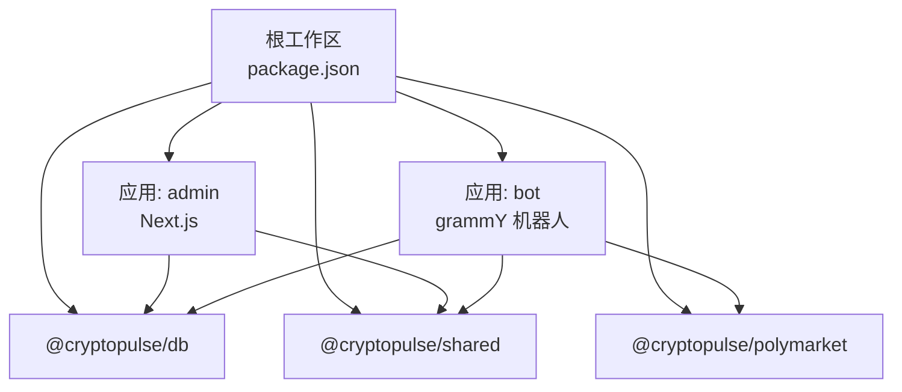
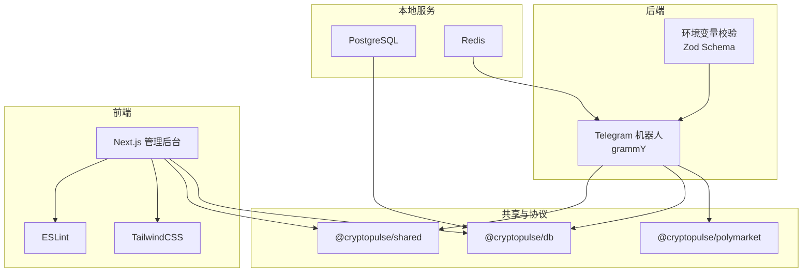
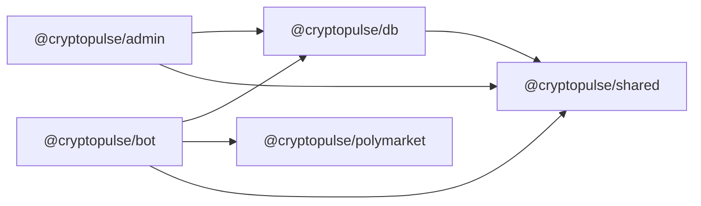

# 开发环境配置

<cite>
**本文档引用的文件**
- [package.json](file://package.json)
- [tsconfig.base.json](file://tsconfig.base.json)
- [.env.example](file://.env.example)
- [docker-compose.yml](file://docker-compose.yml)
- [apps/admin/package.json](file://apps/admin/package.json)
- [apps/bot/package.json](file://apps/bot/package.json)
- [apps/admin/tsconfig.json](file://apps/admin/tsconfig.json)
- [apps/bot/tsconfig.json](file://apps/bot/tsconfig.json)
- [apps/admin/next.config.ts](file://apps/admin/next.config.ts)
- [apps/admin/tailwind.config.ts](file://apps/admin/tailwind.config.ts)
- [apps/bot/src/env.ts](file://apps/bot/src/env.ts)
- [apps/admin/middleware.ts](file://apps/admin/middleware.ts)
- [packages/db/package.json](file://packages/db/package.json)
- [packages/polymarket/package.json](file://packages/polymarket/package.json)
- [packages/shared/package.json](file://packages/shared/package.json)
- [apps/admin/playwright.config.ts](file://apps/admin/playwright.config.ts)
- [apps/admin/eslint.config.mjs](file://apps/admin/eslint.config.mjs)
- [apps/admin/postcss.config.mjs](file://apps/admin/postcss.config.mjs)
</cite>

## 目录
1. [简介](#简介)
2. [项目结构](#项目结构)
3. [核心组件](#核心组件)
4. [架构概览](#架构概览)
5. [详细组件分析](#详细组件分析)
6. [依赖分析](#依赖分析)
7. [性能考虑](#性能考虑)
8. [故障排除指南](#故障排除指南)
9. [结论](#结论)
10. [附录](#附录)

## 简介
本文件面向 CryptoPulse 项目的开发者，提供完整的开发环境配置指南。内容涵盖 Node.js 版本要求、TypeScript 基础配置、monorepo 工作空间与包管理策略、环境变量配置（数据库、Telegram、Polymarket 等）、本地开发服务器启动流程、调试与热重载设置，以及常见问题排查方法。

## 项目结构
该项目采用基于工作区（workspaces）的 monorepo 架构，主要由以下部分组成：
- 根级工作区配置：定义工作区范围与顶层脚本
- 应用层：
  - admin：基于 Next.js 的管理后台应用
  - bot：基于 grammY 的 Telegram 机器人
- 包层（共享模块）：
  - db：数据库与 Prisma 客户端
  - polymarket：Polymarket 协议交互封装
  - shared：通用类型与工具

**图表来源**
- [package.json](file://package.json#L1-L18)
- [apps/admin/package.json](file://apps/admin/package.json#L1-L42)
- [apps/bot/package.json](file://apps/bot/package.json#L1-L26)
- [packages/db/package.json](file://packages/db/package.json#L1-L22)
- [packages/polymarket/package.json](file://packages/polymarket/package.json#L1-L23)
- [packages/shared/package.json](file://packages/shared/package.json#L1-L19)

**章节来源**
- [package.json](file://package.json#L1-L18)

## 核心组件
本节概述开发环境的关键基础设施与配置要点：

- Node.js 与包管理器
  - 使用 npm 工作区（workspace）进行统一管理
  - 顶层脚本通过 `npm -w <workspace>` 指定工作区执行命令
  - 支持在各应用与包内独立运行开发、构建、类型检查与测试

- TypeScript 基础配置
  - 全局基础配置位于根目录，统一编译选项与严格模式
  - 各应用与包可继承基础配置，并按需扩展

- Docker Compose 服务
  - 提供 PostgreSQL 与 Redis 本地开发数据库与缓存服务
  - 默认端口映射便于本地访问

- 环境变量模板
  - 提供完整示例，包含核心、数据库/缓存、Telegram、Admin、Polymarket、Builder、钱包接入与可观测性等分组

**章节来源**
- [package.json](file://package.json#L1-L18)
- [tsconfig.base.json](file://tsconfig.base.json#L1-L16)
- [docker-compose.yml](file://docker-compose.yml#L1-L24)
- [.env.example](file://.env.example#L1-L43)

## 架构概览
开发环境整体由以下组件构成：
- 数据与缓存：PostgreSQL 与 Redis（Docker）
- 后端应用：Telegram 机器人（Node.js + grammY）
- 前端应用：Next.js 管理后台（React + TailwindCSS）
- 共享与协议：数据库客户端、Polymarket SDK、通用工具
- 开发工具链：TypeScript、ESLint、TailwindCSS、Playwright

**图表来源**
- [docker-compose.yml](file://docker-compose.yml#L1-L24)
- [apps/bot/src/env.ts](file://apps/bot/src/env.ts#L1-L14)
- [apps/admin/package.json](file://apps/admin/package.json#L1-L42)
- [apps/bot/package.json](file://apps/bot/package.json#L1-L26)
- [packages/db/package.json](file://packages/db/package.json#L1-L22)
- [packages/polymarket/package.json](file://packages/polymarket/package.json#L1-L23)
- [packages/shared/package.json](file://packages/shared/package.json#L1-L19)

## 详细组件分析

### Node.js 与工作区配置
- 工作区范围：apps/* 与 packages/*
- 顶层脚本：
  - 开发：dev:admin、dev:bot
  - 构建：build:admin
  - 类型检查：typecheck（跨工作区）
  - 测试：test（使用 tsx 导入）

- 应用与包的独立脚本：
  - admin：dev/build/start/lint/typecheck/test:e2e
  - bot：dev/start/build/typecheck
  - db：prisma generate/migrate

**章节来源**
- [package.json](file://package.json#L1-L18)
- [apps/admin/package.json](file://apps/admin/package.json#L1-L42)
- [apps/bot/package.json](file://apps/bot/package.json#L1-L26)
- [packages/db/package.json](file://packages/db/package.json#L1-L22)

### TypeScript 配置体系
- 基础配置（tsconfig.base.json）
  - 目标版本：ES2022
  - 模块解析：Bundler（用于前端）
  - 严格模式启用，跳过库检查，禁止输出 JS
  - JSX 保留，支持 JSON 模块与隔离模块

- 应用与包的继承与扩展
  - admin：继承基础配置，启用 Next 插件、路径映射、允许 JS、增量编译、esModuleInterop
  - bot：继承基础配置，指定 NodeNext 模块与解析策略

**章节来源**
- [tsconfig.base.json](file://tsconfig.base.json#L1-L16)
- [apps/admin/tsconfig.json](file://apps/admin/tsconfig.json#L1-L28)
- [apps/bot/tsconfig.json](file://apps/bot/tsconfig.json#L1-L10)

### 环境变量配置
- 核心：NODE_ENV
- 数据库与缓存：DATABASE_URL、REDIS_URL
- Telegram：TELEGRAM_BOT_TOKEN、BOT_API_TOKEN、TELEGRAM_TEST_GROUP_ID、API_BASE_URL、WEB_BASE_URL
- Admin：ADMIN_TOKEN
- Polymarket：POLYMARKET_CHAIN_ID、POLYMARKET_CLOB_HOST、POLYMARKET_WS_URL、POLYMARKET_RELAYER_URL、POLYMARKET_RPC_URL
- Builder（服务端）：POLY_BUILDER_API_KEY、POLY_BUILDER_SECRET、POLY_BUILDER_PASSPHRASE
- Builder 签名：SIGNING_TOKEN
- 钱包接入：Privy 或 Magic Link（二选一）
- 可观测性：SENTRY_DSN

- 环境变量校验（bot）
  - 使用 Zod Schema 对必要变量进行运行时校验，确保 Telegram 机器人与 API 基础地址有效

**章节来源**
- [.env.example](file://.env.example#L1-L43)
- [apps/bot/src/env.ts](file://apps/bot/src/env.ts#L1-L14)

### Docker Compose 服务
- PostgreSQL
  - 镜像：postgres:16
  - 端口：5432:5432
  - 数据卷：postgres_data
- Redis
  - 镜像：redis:7
  - 端口：6379:6379
  - 数据卷：redis_data

**章节来源**
- [docker-compose.yml](file://docker-compose.yml#L1-L24)

### Next.js 管理后台（admin）
- 开发与构建
  - 开发：next dev -p 3000
  - 构建：next build
  - 运行：next start -p 3000
  - 类型检查：tsc -p tsconfig.json --noEmit
  - E2E 测试：npm run build && playwright test

- 关键配置
  - 转译共享包：transpilePackages 包含 @cryptopulse/db 与 @cryptopulse/shared
  - 实验性配置：serverActions.bodySizeLimit 设置为 2MB
  - Webpack：忽略系统临时文件以优化监听性能
  - Tailwind：content 路径覆盖 app 与 components
  - ESLint：使用 Next.js 平台规则集
  - PostCSS：启用 TailwindCSS 与 Autoprefixer
  - Playwright：webServer 复用现有进程，超时时间较长

- 中间件
  - 管理后台路由保护：读取 ADMIN_TOKEN 与 Cookie 中的 admin_token，非生产环境且未配置 ADMIN_TOKEN 时放行；否则重定向到登录页

**章节来源**
- [apps/admin/package.json](file://apps/admin/package.json#L1-L42)
- [apps/admin/next.config.ts](file://apps/admin/next.config.ts#L1-L30)
- [apps/admin/tailwind.config.ts](file://apps/admin/tailwind.config.ts#L1-L14)
- [apps/admin/eslint.config.mjs](file://apps/admin/eslint.config.mjs#L1-L13)
- [apps/admin/postcss.config.mjs](file://apps/admin/postcss.config.mjs#L1-L8)
- [apps/admin/playwright.config.ts](file://apps/admin/playwright.config.ts#L1-L23)
- [apps/admin/middleware.ts](file://apps/admin/middleware.ts#L1-L23)

### Telegram 机器人（bot）
- 开发与构建
  - 开发：tsx watch src/index.ts
  - 构建：tsc -p tsconfig.build.json
  - 运行：node --enable-source-maps dist/index.js
  - 类型检查：tsc -p tsconfig.json --noEmit

- 依赖与职责
  - @cryptopulse/db、@cryptopulse/polymarket、@cryptopulse/shared
  - dotenv：加载 .env 文件
  - grammY：Telegram 机器人框架
  - zod：环境变量校验

- 环境变量校验
  - 必填：TELEGRAM_BOT_TOKEN、API_BASE_URL、WEB_BASE_URL
  - 可选：BOT_API_TOKEN、DATABASE_URL、REDIS_URL

**章节来源**
- [apps/bot/package.json](file://apps/bot/package.json#L1-L26)
- [apps/bot/src/env.ts](file://apps/bot/src/env.ts#L1-L14)

### 共享与协议包
- @cryptopulse/db
  - 主入口：src/index.ts
  - 类型：src/index.ts
  - 脚本：typecheck、prisma generate、prisma migrate
  - 依赖：@prisma/client

- @cryptopulse/polymarket
  - 主入口：src/index.ts
  - 依赖：@ethersproject/wallet、@polymarket/builder-relayer-client、@polymarket/builder-signing-sdk、@polymarket/clob-client、viem

- @cryptopulse/shared
  - 主入口：src/index.ts
  - 依赖：zod

**章节来源**
- [packages/db/package.json](file://packages/db/package.json#L1-L22)
- [packages/polymarket/package.json](file://packages/polymarket/package.json#L1-L23)
- [packages/shared/package.json](file://packages/shared/package.json#L1-L19)

## 依赖分析
- 工作区耦合关系
  - admin 依赖 @cryptopulse/db 与 @cryptopulse/shared
  - bot 依赖 @cryptopulse/db、@cryptopulse/polymarket、@cryptopulse/shared
  - db 作为数据层被上层应用复用
  - polymarket 为协议层，被 bot 使用
  - shared 提供通用类型与工具

**图表来源**
- [apps/admin/package.json](file://apps/admin/package.json#L1-L42)
- [apps/bot/package.json](file://apps/bot/package.json#L1-L26)
- [packages/db/package.json](file://packages/db/package.json#L1-L22)
- [packages/polymarket/package.json](file://packages/polymarket/package.json#L1-L23)
- [packages/shared/package.json](file://packages/shared/package.json#L1-L19)

**章节来源**
- [apps/admin/package.json](file://apps/admin/package.json#L1-L42)
- [apps/bot/package.json](file://apps/bot/package.json#L1-L26)
- [packages/db/package.json](file://packages/db/package.json#L1-L22)
- [packages/polymarket/package.json](file://packages/polymarket/package.json#L1-L23)
- [packages/shared/package.json](file://packages/shared/package.json#L1-L19)

## 性能考虑
- 监听优化（admin）
  - 在 Webpack 中忽略系统临时文件，减少不必要的重新编译
- 缓存与数据库
  - 使用 Redis 作为缓存层，降低数据库压力
  - Prisma 客户端按需生成，避免冗余查询
- 构建与打包
  - Next.js 使用增量编译与转译共享包，提升开发体验
  - bot 使用 NodeNext 模块解析，配合 tsx watch 实现快速热重载

[本节为通用指导，无需列出具体文件来源]

## 故障排除指南
- 环境变量缺失或格式错误
  - 症状：Telegram 机器人启动失败或运行时抛出校验错误
  - 排查：检查 .env 是否包含必需变量，确认值格式（如 URL、整数）正确
  - 参考：bot 的环境变量校验逻辑
- 数据库连接失败
  - 症状：Prisma 报错或应用无法连接数据库
  - 排查：确认 Docker Compose 正常运行，PostgreSQL 服务可达，DATABASE_URL 正确
- Redis 连接异常
  - 症状：缓存相关功能不可用
  - 排查：确认 Redis 服务已启动，REDIS_URL 可达
- Next.js 热重载缓慢
  - 症状：修改文件后等待时间过长
  - 排查：确认已忽略系统临时文件，检查磁盘 IO 与杀毒软件影响
- E2E 测试失败
  - 症状：Playwright 测试超时或页面无法加载
  - 排查：确认 admin 应用已启动并监听 3000 端口，E2E_BASE_URL 配置正确

**章节来源**
- [apps/bot/src/env.ts](file://apps/bot/src/env.ts#L1-L14)
- [docker-compose.yml](file://docker-compose.yml#L1-L24)
- [apps/admin/next.config.ts](file://apps/admin/next.config.ts#L1-L30)
- [apps/admin/playwright.config.ts](file://apps/admin/playwright.config.ts#L1-L23)

## 结论
本开发环境配置文档提供了从工作区到应用与包的全栈开发指南。遵循本文档的步骤，您可以快速搭建并运行 CryptoPulse 的前后端服务，同时利用 TypeScript、ESLint、TailwindCSS、Playwright 等工具链提升开发效率与质量。

[本节为总结性内容，无需列出具体文件来源]

## 附录

### 本地开发服务器启动指南
- 启动数据库与缓存
  - 使用 Docker Compose 启动 PostgreSQL 与 Redis
  - 端口映射：5432（PostgreSQL）、6379（Redis）
- 配置环境变量
  - 复制 .env.example 为 .env，并填写所有必需字段
- 启动后端 Telegram 机器人
  - 在根目录执行：npm run dev:bot
- 启动前端管理后台
  - 在根目录执行：npm run dev:admin
- 访问应用
  - 管理后台：http://localhost:3000
  - Telegram 机器人：通过 Telegram 客户端与机器人交互

**章节来源**
- [docker-compose.yml](file://docker-compose.yml#L1-L24)
- [.env.example](file://.env.example#L1-L43)
- [package.json](file://package.json#L1-L18)

### 调试配置与热重载
- bot
  - 开发模式：tsx watch 自动重启
  - 源码映射：运行时启用 source maps
- admin
  - 开发模式：Next.js 内置热重载
  - 转译共享包：加速共享模块更新
  - 忽略系统文件：减少监听开销

**章节来源**
- [apps/bot/package.json](file://apps/bot/package.json#L1-L26)
- [apps/admin/package.json](file://apps/admin/package.json#L1-L42)
- [apps/admin/next.config.ts](file://apps/admin/next.config.ts#L1-L30)

### 开发工具链配置
- TypeScript
  - 基础配置：tsconfig.base.json
  - 应用扩展：admin、bot 继承并扩展
- ESLint
  - 规则集：next/core-web-vitals 与 next/typescript
- TailwindCSS
  - 配置：content 覆盖 app 与 components
  - 构建：PostCSS 集成 TailwindCSS 与 Autoprefixer
- Playwright
  - 测试：e2e 目录，chromium 与 chrome 项目
  - webServer：复用现有进程，超时时间较长

**章节来源**
- [tsconfig.base.json](file://tsconfig.base.json#L1-L16)
- [apps/admin/tsconfig.json](file://apps/admin/tsconfig.json#L1-L28)
- [apps/admin/eslint.config.mjs](file://apps/admin/eslint.config.mjs#L1-L13)
- [apps/admin/tailwind.config.ts](file://apps/admin/tailwind.config.ts#L1-L14)
- [apps/admin/postcss.config.mjs](file://apps/admin/postcss.config.mjs#L1-L8)
- [apps/admin/playwright.config.ts](file://apps/admin/playwright.config.ts#L1-L23)