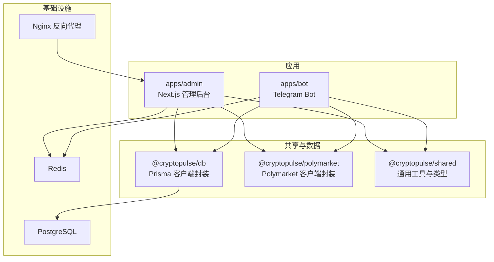
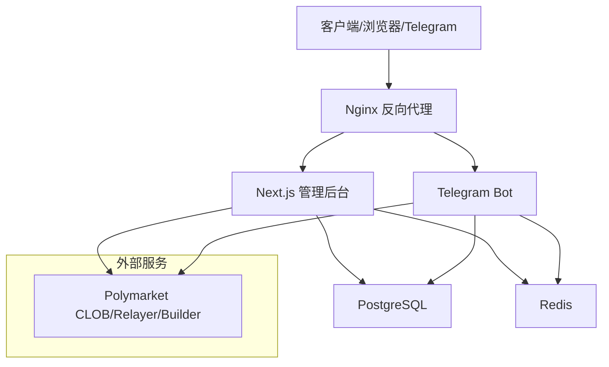
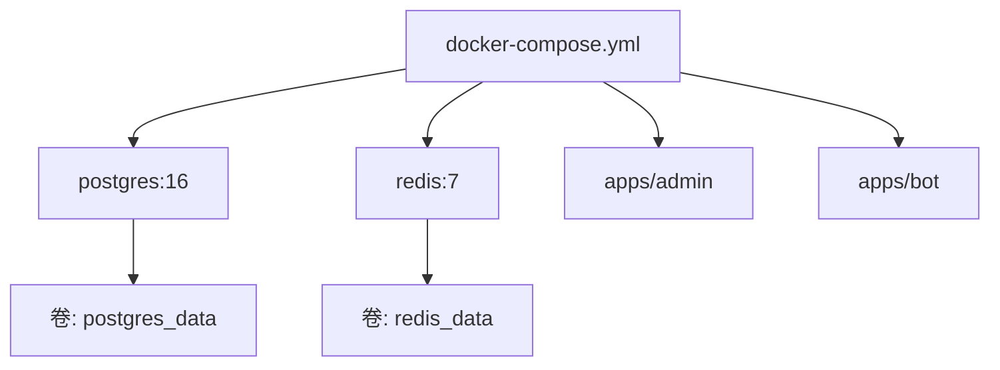
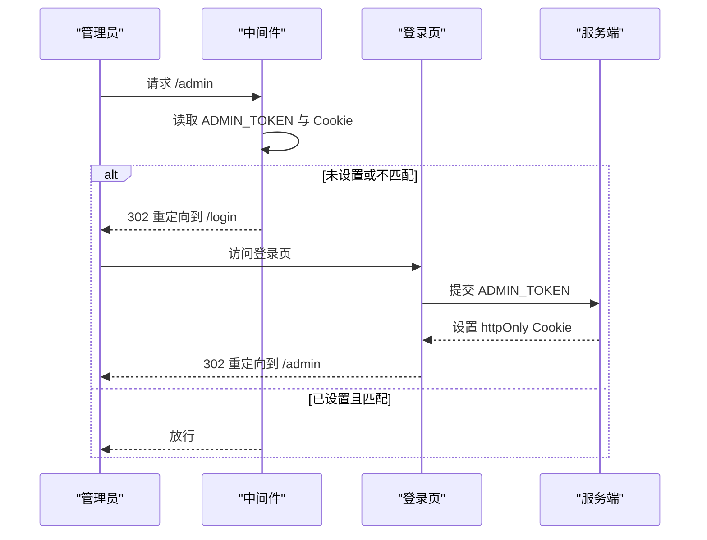
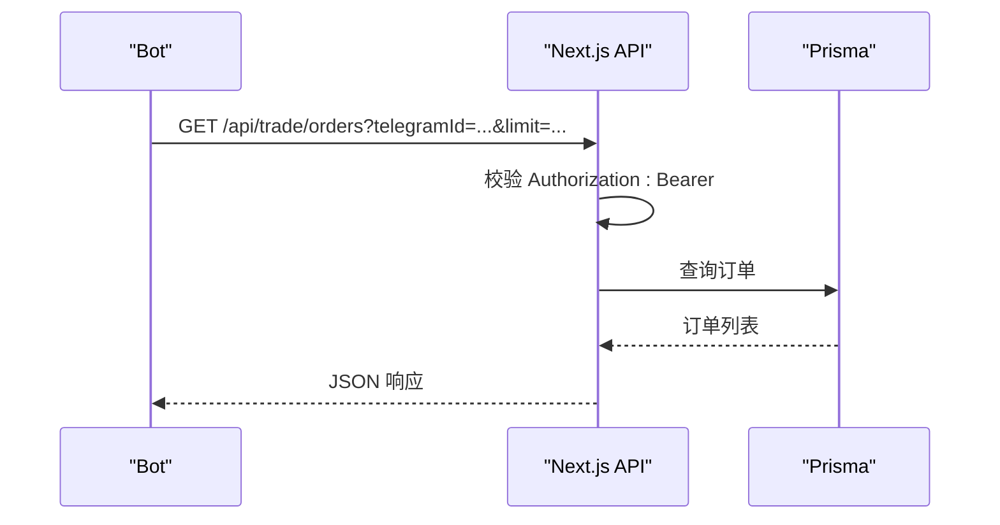
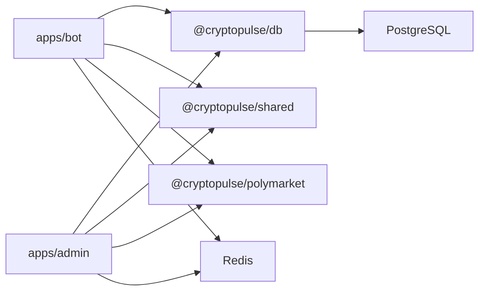

# 生产环境部署

<cite>
**本文引用的文件**
- [docker-compose.yml](file://docker-compose.yml)
- [package.json](file://package.json)
- [README.md](file://README.md)
- [.env.example](file://.env.example)
- [ops-checklist.md](file://specs/cryptopulse/ops-checklist.md)
- [design.md](file://specs/cryptopulse/design.md)
- [requirements.md](file://specs/cryptopulse/requirements.md)
- [xuqiu.md](file://xuqiu.md)
- [apps/admin/package.json](file://apps/admin/package.json)
- [apps/bot/package.json](file://apps/bot/package.json)
- [packages/db/package.json](file://packages/db/package.json)
- [apps/admin/next.config.ts](file://apps/admin/next.config.ts)
- [apps/admin/middleware.ts](file://apps/admin/middleware.ts)
- [apps/admin/app/login/actions.ts](file://apps/admin/app/login/actions.ts)
- [apps/admin/app/api/trade/orders/route.ts](file://apps/admin/app/api/trade/orders/route.ts)
- [packages/db/src/index.ts](file://packages/db/src/index.ts)
</cite>

## 目录
1. [简介](#简介)
2. [项目结构](#项目结构)
3. [核心组件](#核心组件)
4. [架构总览](#架构总览)
5. [详细组件分析](#详细组件分析)
6. [依赖关系分析](#依赖关系分析)
7. [性能考虑](#性能考虑)
8. [故障排查指南](#故障排查指南)
9. [结论](#结论)
10. [附录](#附录)

## 简介
本文件面向 CryptoPulse 项目的生产环境部署，提供从硬件与操作系统要求、网络与域名配置，到容器化与反向代理、数据库与缓存、进程管理、监控与日志、负载均衡与高可用、灾难恢复、性能优化与安全加固的完整指导。文档严格基于仓库现有配置与设计说明，确保可落地、可验证。

## 项目结构
项目采用 Monorepo 结构，包含管理员后台应用、Telegram Bot 应用、数据库与 Polymarket SDK 封装、共享工具与类型定义。根目录提供工作区脚本与 Docker Compose 配置，便于本地与生产环境的一致化部署。

图示来源
- [docker-compose.yml](file://docker-compose.yml#L1-L24)
- [apps/admin/package.json](file://apps/admin/package.json#L1-L42)
- [apps/bot/package.json](file://apps/bot/package.json#L1-L26)
- [packages/db/package.json](file://packages/db/package.json#L1-L22)

章节来源
- [package.json](file://package.json#L1-L18)
- [docker-compose.yml](file://docker-compose.yml#L1-L24)

## 核心组件
- 管理后台（Next.js）：提供管理员登录、推送管理、统计查询、归因核验等能力，受中间件保护。
- Telegram Bot：负责用户交互、绑定流程、市场搜索、下单与通知。
- 数据库（PostgreSQL）：业务数据存储，使用 Prisma 管理迁移与访问。
- 缓存/队列（Redis）：行情缓存、定时任务、告警与复制交易队列。
- 反向代理（Nginx）：统一入口、域名解析、SSL 终止与静态资源服务。
- 进程管理：PM2 或容器编排（Docker/Railway/Render/阿里云）。

章节来源
- [design.md](file://specs/cryptopulse/design.md#L24-L47)
- [apps/admin/middleware.ts](file://apps/admin/middleware.ts#L1-L23)
- [packages/db/src/index.ts](file://packages/db/src/index.ts#L1-L12)

## 架构总览
生产环境建议将 Next.js 与 Bot 分容器部署，共享数据库与缓存。Nginx 作为统一入口，负责 SSL 终止、静态资源与请求转发。数据库与缓存通过独立服务或托管实例提供高可用与备份能力。

图示来源
- [design.md](file://specs/cryptopulse/design.md#L162-L167)
- [docker-compose.yml](file://docker-compose.yml#L1-L24)

## 详细组件分析

### 硬件与操作系统要求
- 运行时与语言
  - Node.js 20+（开发与生产均适用）
  - PostgreSQL 14+（本地或远程）
  - Redis 6+（本地或远程）
- 操作系统兼容性
  - Linux（推荐 Ubuntu/CentOS）用于生产服务器
  - Windows/macOS 仅用于开发与 CI
- 资源建议（按 QPS 与并发估算）
  - 管理后台：2 核 4GiB，SSD 存储
  - Bot：2 核 2GiB，SSD 存储
  - 数据库：4 核 8GiB+，SSD，预留 20% 空间
  - 缓存：2 核 2GiB，SSD
- 网络
  - 出站访问：Polymarket CLOB/Relayer/Builder 服务
  - 防火墙：仅开放 80/443/22（运维）端口，内网访问数据库与缓存

章节来源
- [README.md](file://README.md#L7-L9)

### 网络与域名配置
- 域名解析
  - 管理后台域名指向 Nginx 外网 IP
  - Bot webhook 与回调域名指向 Nginx
- Nginx 配置要点
  - HTTPS 终止：使用 Let’s Encrypt 或商业证书
  - 反向代理：/admin → Next.js，/api → Next.js，/bot → Bot（或独立端口）
  - 静态资源：开启 gzip/缓存头
  - 安全头：HSTS、CSP、X-Frame-Options
- 端口规划
  - 80/443：Nginx
  - 3000：Next.js（仅内网或经 Nginx 转发）
  - 3001：Bot（可选独立端口）

章节来源
- [design.md](file://specs/cryptopulse/design.md#L162-L167)

### Docker 容器化部署
- 本地 Compose
  - Postgres 16 + Redis 7 + 应用容器（admin/bot）
  - 数据卷：postgres_data、redis_data
- 生产建议
  - 使用独立数据库与缓存服务（托管或高可用集群）
  - Next.js 与 Bot 分容器部署，共享 DB/Redis
  - 使用环境变量注入 DATABASE_URL、REDIS_URL、ADMIN_TOKEN、SIGNING_TOKEN 等
  - 为每个服务配置健康检查与重启策略

图示来源
- [docker-compose.yml](file://docker-compose.yml#L1-L24)

章节来源
- [docker-compose.yml](file://docker-compose.yml#L1-L24)
- [design.md](file://specs/cryptopulse/design.md#L162-L167)

### 管理后台（Next.js）安全与鉴权
- 管理员口令保护
  - 通过环境变量 ADMIN_TOKEN 控制后台访问
  - 中间件拦截 /admin 路由，校验 Cookie 中的 admin_token
  - 登录页仅在未设置 ADMIN_TOKEN 时提示开发环境特性
- API 鉴权
  - Bot 与内部 API 使用 Bearer Token（BOT_API_TOKEN、SIGNING_TOKEN）鉴权
  - 服务端内部签名端点仅在服务端调用，不暴露给前端

图示来源
- [apps/admin/middleware.ts](file://apps/admin/middleware.ts#L1-L23)
- [apps/admin/app/login/actions.ts](file://apps/admin/app/login/actions.ts#L1-L28)

章节来源
- [apps/admin/middleware.ts](file://apps/admin/middleware.ts#L1-L23)
- [apps/admin/app/login/actions.ts](file://apps/admin/app/login/actions.ts#L1-L28)
- [README.md](file://README.md#L50-L51)

### Bot 与 API 鉴权
- Bot → API
  - 使用 Bearer: BOT_API_TOKEN 鉴权
  - 例如：/api/trade/orders 仅允许 Bot 调用
- 内部签名端点
  - 仅服务端可调用，使用 SIGNING_TOKEN 鉴权
  - 用于生成 Builder Attribution Headers

图示来源
- [apps/admin/app/api/trade/orders/route.ts](file://apps/admin/app/api/trade/orders/route.ts#L1-L44)

章节来源
- [apps/admin/app/api/trade/orders/route.ts](file://apps/admin/app/api/trade/orders/route.ts#L1-L44)
- [design.md](file://specs/cryptopulse/design.md#L139-L145)

### 数据库与缓存
- 数据库
  - 使用 Prisma 管理 schema 与迁移
  - 生产环境建议使用托管 PostgreSQL 或高可用集群
- 缓存
  - Redis 用于行情缓存、定时任务、告警与复制交易队列
  - 生产环境建议使用 Redis 集群或托管服务

章节来源
- [packages/db/package.json](file://packages/db/package.json#L8-L12)
- [packages/db/src/index.ts](file://packages/db/src/index.ts#L1-L12)
- [docker-compose.yml](file://docker-compose.yml#L1-L24)

### 进程管理（PM2 与容器）
- PM2（单机）
  - 管理后台：pm2 start --name admin npm -- start -p 3000
  - Bot：pm2 start --name bot npm -- start
  - 配置：ecosystem.config.js（日志、重启策略、环境变量）
- 容器编排
  - 使用 Docker Compose 或平台（Railway/Render/阿里云）进行多容器部署
  - 建议将 Next.js 与 Bot 分容器，共享 DB/Redis

章节来源
- [apps/admin/package.json](file://apps/admin/package.json#L5-L12)
- [apps/bot/package.json](file://apps/bot/package.json#L6-L11)
- [design.md](file://specs/cryptopulse/design.md#L162-L167)

### 监控、日志与可观测性
- 日志
  - 结构化日志（建议 pino）
  - 敏感信息不落盘（Builder Key/Secret/Passphrase、Admin Token、Signing Token）
- 监控
  - Sentry（可选）用于错误上报
  - 关键指标：QPS、P95 延迟、数据库连接数、Redis 命中率、Relayer 失败率
- 告警
  - 交易失败率、WebSocket 断线/重连、归因成功率下降

章节来源
- [design.md](file://specs/cryptopulse/design.md#L18-L18)
- [ops-checklist.md](file://specs/cryptopulse/ops-checklist.md#L39-L48)

### 备份策略
- 数据库
  - 定时逻辑备份（pg_dump/pg_basebackup）
  - 备份保留周期与异地存储
- 缓存
  - Redis RDB/AOF 持久化策略
  - 定期快照与校验
- 配置与密钥
  - 环境变量与密钥管理（不纳入代码仓库）
  - 备份恢复演练

章节来源
- [ops-checklist.md](file://specs/cryptopulse/ops-checklist.md#L1-L48)

### 负载均衡与高可用
- 负载均衡
  - Nginx/HAProxy/云 LB 前置，健康检查
  - Next.js 与 Bot 多实例横向扩展
- 数据高可用
  - PostgreSQL 主从/集群
  - Redis Sentinel/Cluster
- 灾难恢复
  - RTO/RPO 目标明确
  - 灾备演练与切换流程

章节来源
- [design.md](file://specs/cryptopulse/design.md#L162-L167)

### 性能优化与资源限制
- 缓存与索引
  - Redis 缓存热点数据（市场列表、订单簿）
  - 数据库索引优化（常用查询字段）
- 连接池
  - Prisma 连接池大小与超时
  - Redis 连接池与命令批处理
- 网络与 I/O
  - 启用 gzip/HTTP/2
  - CDN 加速静态资源
- 资源限制
  - Docker/容器编排设置 CPU/内存限制
  - PM2 进程数与内存阈值

章节来源
- [requirements.md](file://specs/cryptopulse/requirements.md#L119-L132)
- [apps/admin/next.config.ts](file://apps/admin/next.config.ts#L1-L30)

### 安全加固
- 传输安全
  - TLS 1.3，禁用弱密码套件
  - HSTS、CSP、X-Frame-Options
- 访问控制
  - ADMIN_TOKEN 强口令，定期轮换
  - Bot API 与 Signing Token 仅服务端可见
- 输入与调用
  - 所有 API 使用 Zod 校验
  - 对上游接口实现退避重试与限流
- 密钥与日志
  - 环境变量注入，不落盘
  - 结构化日志脱敏

章节来源
- [design.md](file://specs/cryptopulse/design.md#L146-L154)
- [requirements.md](file://specs/cryptopulse/requirements.md#L123-L132)

## 依赖关系分析
- 应用依赖
  - admin 依赖 db、shared、polymarket
  - bot 依赖 db、shared、polymarket
- 数据流
  - Bot 与 Admin 通过 Next.js API 交互数据库与缓存
  - 交易链路：Admin/Bot → Next.js → Polymarket CLOB/Relayer/Builder

图示来源
- [apps/admin/package.json](file://apps/admin/package.json#L13-L25)
- [apps/bot/package.json](file://apps/bot/package.json#L12-L19)
- [packages/db/package.json](file://packages/db/package.json#L13-L15)

章节来源
- [apps/admin/package.json](file://apps/admin/package.json#L13-L25)
- [apps/bot/package.json](file://apps/bot/package.json#L12-L19)
- [packages/db/package.json](file://packages/db/package.json#L13-L15)

## 性能考虑
- 响应时间目标
  - 搜索首屏 ≤1s，下单确认反馈 ≤3s
- 缓存策略
  - Redis 缓存市场详情与订单簿，结合 WebSocket/轮询降级
- 数据库优化
  - 合理索引、连接池、慢查询日志
- 网络优化
  - 压缩、CDN、就近接入

章节来源
- [requirements.md](file://specs/cryptopulse/requirements.md#L125-L126)

## 故障排查指南
- 常见问题定位
  - 401 未授权：检查 Bearer Token 与 ADMIN_TOKEN
  - 503 数据库不可用：检查 DATABASE_URL 与连接池
  - WebSocket 断线：检查网络与断线重连策略
- 日志与监控
  - 查看 Next.js 与 Bot 进程日志
  - 监控 Relayer 失败率与归因成功率
- 回滚与恢复
  - 基于备份快速恢复
  - 环境变量回滚与配置检查

章节来源
- [apps/admin/app/api/trade/orders/route.ts](file://apps/admin/app/api/trade/orders/route.ts#L18-L27)
- [ops-checklist.md](file://specs/cryptopulse/ops-checklist.md#L39-L48)

## 结论
本部署文档基于仓库现有配置与设计，提供了生产环境的硬件、网络、容器化、反向代理、进程管理、监控日志、备份与高可用、性能优化与安全加固的完整方案。建议在上线前完成环境变量核对、端到端交易闭环验证与每日/每周监控机制建立。

## 附录

### 环境变量清单（生产）
- 核心
  - NODE_ENV=production
- 数据库与缓存
  - DATABASE_URL=postgresql://...（生产数据库）
  - REDIS_URL=redis://...
- Telegram
  - TELEGRAM_BOT_TOKEN=...
  - BOT_API_TOKEN=...
  - TELEGRAM_TEST_GROUP_ID=...
  - API_BASE_URL=https://your-domain.com
  - WEB_BASE_URL=https://your-domain.com
- 管理后台
  - ADMIN_TOKEN=（强口令）
- Polymarket
  - POLYMARKET_CHAIN_ID=137
  - POLYMARKET_CLOB_HOST=https://clob.polymarket.com
  - POLYMARKET_WS_URL=wss://ws-subscriptions-clob.polymarket.com
  - POLYMARKET_RELAYER_URL=https://relayer-v2.polymarket.com/
  - POLYMARKET_RPC_URL=（可选）
- Builder（服务端）
  - POLY_BUILDER_API_KEY=...
  - POLY_BUILDER_SECRET=...
  - POLY_BUILDER_PASSPHRASE=...
  - SIGNING_TOKEN=（仅服务端）
- 钱包接入
  - PRIVY_APP_ID=（可选）
  - PRIVY_APP_SECRET=（可选）
  - MAGIC_PUBLISHABLE_KEY=（可选）
  - MAGIC_SECRET_KEY=（可选）
- 可观测性
  - SENTRY_DSN=（可选）

章节来源
- [.env.example](file://.env.example#L1-L43)
- [README.md](file://README.md#L20-L33)