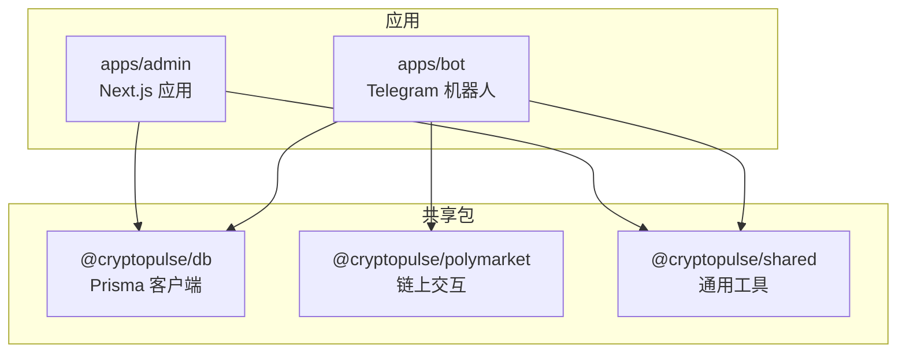
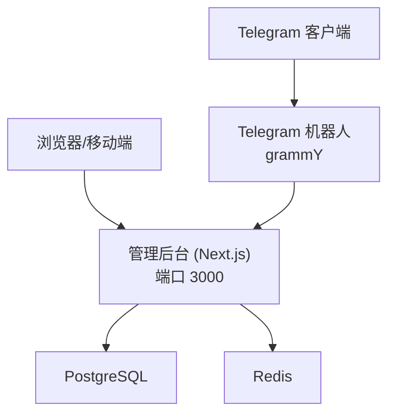
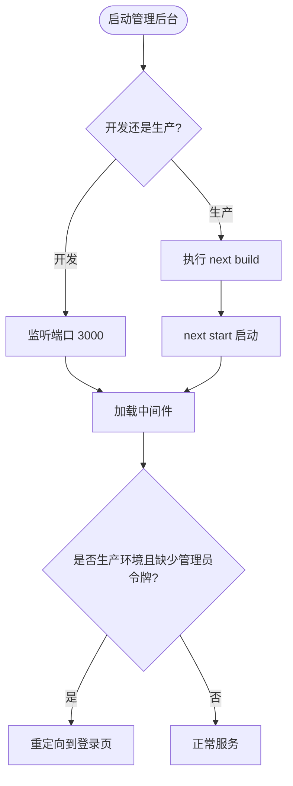
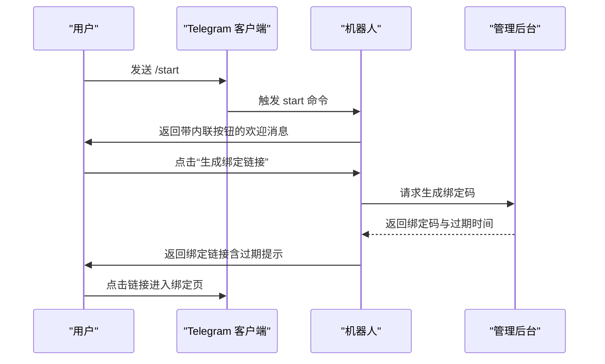
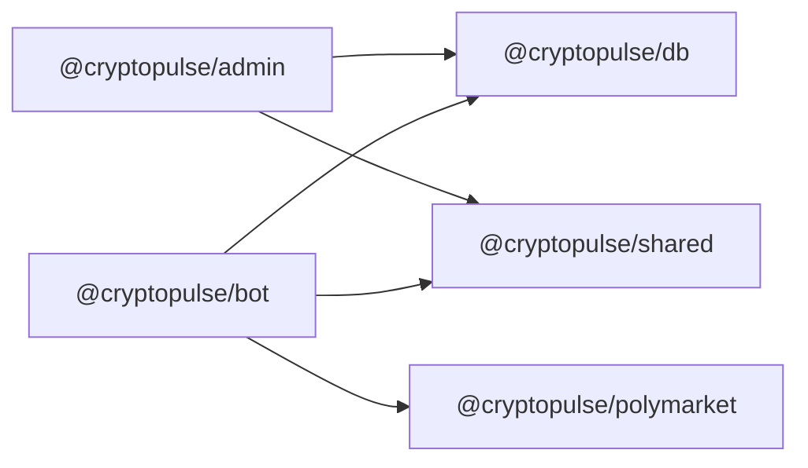

# 部署配置

<cite>
**本文引用的文件**
- [README.md](file://README.md)
- [.env.example](file://.env.example)
- [docker-compose.yml](file://docker-compose.yml)
- [package.json](file://package.json)
- [apps/admin/package.json](file://apps/admin/package.json)
- [apps/admin/next.config.ts](file://apps/admin/next.config.ts)
- [apps/admin/tailwind.config.ts](file://apps/admin/tailwind.config.ts)
- [apps/admin/postcss.config.mjs](file://apps/admin/postcss.config.mjs)
- [apps/admin/tsconfig.json](file://apps/admin/tsconfig.json)
- [apps/admin/middleware.ts](file://apps/admin/middleware.ts)
- [apps/admin/lib/utils.ts](file://apps/admin/lib/utils.ts)
- [apps/bot/package.json](file://apps/bot/package.json)
- [apps/bot/tsconfig.json](file://apps/bot/tsconfig.json)
- [apps/bot/tsconfig.build.json](file://apps/bot/tsconfig.build.json)
- [apps/bot/src/env.ts](file://apps/bot/src/env.ts)
- [apps/bot/src/index.ts](file://apps/bot/src/index.ts)
- [packages/db/package.json](file://packages/db/package.json)
- [packages/polymarket/package.json](file://packages/polymarket/package.json)
</cite>

## 目录
1. [简介](#简介)
2. [项目结构](#项目结构)
3. [核心组件](#核心组件)
4. [架构总览](#架构总览)
5. [详细组件分析](#详细组件分析)
6. [依赖关系分析](#依赖关系分析)
7. [性能考虑](#性能考虑)
8. [故障排除指南](#故障排除指南)
9. [结论](#结论)
10. [附录](#附录)

## 简介
本文件面向 CryptoPulse 项目的部署与运维团队，提供从开发到生产的完整部署配置说明。内容覆盖环境变量、依赖安装、构建与打包、Docker 容器化与编排、Next.js 应用的构建优化与服务器配置、Telegram 机器人部署与 Webhook 要求、SSL 证书、监控与日志、性能调优、CI/CD 流程与自动化发布策略，以及常见问题排查。

## 项目结构
该项目采用多包工作区（monorepo）组织方式，包含两个主要应用与若干共享包：
- apps/admin：基于 Next.js 的管理后台
- apps/bot：基于 Telegram SDK 的机器人
- packages/db：数据库与 Prisma 客户端
- packages/polymarket：Polymarket 交互相关能力
- packages/shared：通用工具与类型定义

图表来源
- [apps/admin/package.json](file://apps/admin/package.json#L1-L42)
- [apps/bot/package.json](file://apps/bot/package.json#L1-L26)
- [packages/db/package.json](file://packages/db/package.json#L1-L22)
- [packages/polymarket/package.json](file://packages/polymarket/package.json#L1-L23)

章节来源
- [package.json](file://package.json#L1-L18)
- [apps/admin/package.json](file://apps/admin/package.json#L1-L42)
- [apps/bot/package.json](file://apps/bot/package.json#L1-L26)
- [packages/db/package.json](file://packages/db/package.json#L1-L22)
- [packages/polymarket/package.json](file://packages/polymarket/package.json#L1-L23)

## 核心组件
- 管理后台（Next.js）
  - 开发端口：3000
  - 中间件用于保护 /admin 路由
  - 构建配置启用实验性 serverActions 体限制与自定义 webpack 忽略项
- 机器人（Telegram）
  - 基于 grammY，命令与内联键盘驱动交互
  - 运行时通过环境变量注入 Telegram Token、API 基础地址等
- 数据层
  - Prisma 客户端与迁移脚本
  - 支持本地或远程 PostgreSQL 与 Redis
- 多包工作区
  - 通过根目录 workspaces 管理各子包依赖与脚本

章节来源
- [apps/admin/package.json](file://apps/admin/package.json#L1-L42)
- [apps/admin/next.config.ts](file://apps/admin/next.config.ts#L1-L30)
- [apps/admin/middleware.ts](file://apps/admin/middleware.ts#L1-L23)
- [apps/bot/src/index.ts](file://apps/bot/src/index.ts#L1-L156)
- [apps/bot/src/env.ts](file://apps/bot/src/env.ts#L1-L14)
- [packages/db/package.json](file://packages/db/package.json#L1-L22)

## 架构总览
下图展示了部署层面的系统组成与交互关系：管理后台负责用户认证与业务操作，机器人作为外部入口与用户交互并将请求转发至管理后台；数据与缓存通过 PostgreSQL 与 Redis 提供持久化与会话能力；容器编排通过 docker-compose 提供本地开发与测试环境。

图表来源
- [apps/admin/package.json](file://apps/admin/package.json#L1-L42)
- [apps/bot/src/index.ts](file://apps/bot/src/index.ts#L1-L156)
- [docker-compose.yml](file://docker-compose.yml#L1-L24)

## 详细组件分析

### 管理后台（Next.js）部署配置
- 端口与启动
  - 开发：端口 3000
  - 生产：通过构建产物启动
- 中间件安全
  - 仅在生产环境强制校验管理员令牌；开发环境默认放行
- 构建优化
  - 实验性 serverActions 体大小限制
  - 自定义 webpack 忽略项以减少无关文件监听
- 样式与类型
  - Tailwind CSS 与 PostCSS 工作流
  - TypeScript 基于 base 配置扩展

图表来源
- [apps/admin/package.json](file://apps/admin/package.json#L1-L42)
- [apps/admin/next.config.ts](file://apps/admin/next.config.ts#L1-L30)
- [apps/admin/middleware.ts](file://apps/admin/middleware.ts#L1-L23)

章节来源
- [apps/admin/package.json](file://apps/admin/package.json#L1-L42)
- [apps/admin/next.config.ts](file://apps/admin/next.config.ts#L1-L30)
- [apps/admin/tailwind.config.ts](file://apps/admin/tailwind.config.ts#L1-L14)
- [apps/admin/postcss.config.mjs](file://apps/admin/postcss.config.mjs#L1-L8)
- [apps/admin/tsconfig.json](file://apps/admin/tsconfig.json#L1-L28)
- [apps/admin/middleware.ts](file://apps/admin/middleware.ts#L1-L23)

### 机器人（Telegram）部署配置
- 运行模式
  - 开发：热重载运行
  - 生产：构建产物启动
- 环境变量
  - 必填：Telegram Bot Token、API 基础地址、Web 基础地址
  - 可选：Bot API Token、数据库与缓存连接串
- 功能要点
  - 命令与内联键盘交互
  - 通过回调查询与内联按钮驱动下单、搜索、持仓等流程
  - 错误捕获与日志输出

图表来源
- [apps/bot/src/index.ts](file://apps/bot/src/index.ts#L1-L156)
- [apps/bot/src/env.ts](file://apps/bot/src/env.ts#L1-L14)

章节来源
- [apps/bot/package.json](file://apps/bot/package.json#L1-L26)
- [apps/bot/tsconfig.json](file://apps/bot/tsconfig.json#L1-L10)
- [apps/bot/tsconfig.build.json](file://apps/bot/tsconfig.build.json#L1-L10)
- [apps/bot/src/env.ts](file://apps/bot/src/env.ts#L1-L14)
- [apps/bot/src/index.ts](file://apps/bot/src/index.ts#L1-L156)

### 数据与缓存（PostgreSQL 与 Redis）
- 本地开发
  - 通过 docker-compose 提供 PostgreSQL 与 Redis 服务
  - 默认端口映射与命名卷持久化
- 生产环境
  - 通过环境变量指向外部数据库与缓存实例
  - 建议使用只读账号与最小权限原则

章节来源
- [docker-compose.yml](file://docker-compose.yml#L1-L24)
- [.env.example](file://.env.example#L1-L43)
- [packages/db/package.json](file://packages/db/package.json#L1-L22)

### 环境变量与配置模板
- 核心环境变量
  - NODE_ENV、DATABASE_URL、REDIS_URL
  - TELEGRAM_BOT_TOKEN、BOT_API_TOKEN、TELEGRAM_TEST_GROUP_ID、API_BASE_URL、WEB_BASE_URL
  - ADMIN_TOKEN（生产环境必填）
  - Polymarket 相关链 ID、主机、WS、Relayer、RPC
  - Builder 与签名相关密钥
  - Privy 或 Magic Link 登录凭据
  - 可观测性（可选）：SENTRY_DSN
- 配置模板建议
  - 开发：本地端口 3000，本地数据库与缓存
  - 生产：HTTPS、反向代理、独立域名、只读数据库账号、TLS 证书、健康检查端点

章节来源
- [.env.example](file://.env.example#L1-L43)
- [README.md](file://README.md#L1-L65)

### 构建与打包
- 管理后台
  - 使用 Next.js 内置构建与启动脚本
  - 类型检查与 Lint
- 机器人
  - TypeScript 编译为 NodeNext 模块
  - 生成 source map 便于调试
- 工作区脚本
  - 根目录统一管理开发、构建、测试与类型检查

章节来源
- [apps/admin/package.json](file://apps/admin/package.json#L1-L42)
- [apps/bot/package.json](file://apps/bot/package.json#L1-L26)
- [apps/bot/tsconfig.build.json](file://apps/bot/tsconfig.build.json#L1-L10)
- [package.json](file://package.json#L1-L18)

### 容器化与编排
- 本地开发
  - 使用 docker-compose 启动 PostgreSQL 与 Redis
  - 端口映射与卷持久化
- 生产部署
  - 建议使用容器编排平台（如 Kubernetes 或云厂商托管编排）
  - 将管理后台与机器人分别容器化，暴露必要端口
  - 使用环境变量注入数据库与缓存连接串
  - 为数据库与缓存设置健康检查与自动重启策略

章节来源
- [docker-compose.yml](file://docker-compose.yml#L1-L24)

### 服务器与网络配置
- 管理后台
  - Next.js 默认服务器即可满足开发需求
  - 生产建议前置 Nginx/Apache 反向代理，开启 HTTPS
- 机器人
  - Telegram Webhook 需要 HTTPS 与有效证书
  - 建议将 Webhook 地址与 API 基础地址配置为同一域名，避免跨域问题
- 网络与安全
  - 限制数据库与缓存访问白名单
  - 使用独立子网与防火墙规则

章节来源
- [apps/admin/package.json](file://apps/admin/package.json#L1-L42)
- [apps/bot/src/env.ts](file://apps/bot/src/env.ts#L1-L14)

### 监控、日志与可观测性
- 日志
  - 机器人全局错误捕获输出到标准错误
  - 建议集中收集容器日志并保留轮转策略
- 可观测性
  - 可选 SENTRY_DSN，接入错误追踪
  - 为管理后台与机器人添加健康检查端点
- 性能指标
  - 监控数据库连接池与缓存命中率
  - 监控机器人并发与响应延迟

章节来源
- [apps/bot/src/index.ts](file://apps/bot/src/index.ts#L150-L156)
- [.env.example](file://.env.example#L41-L43)

### CI/CD 流程与自动化发布
- 建议流程
  - 代码推送触发 Lint、类型检查与单元测试
  - 通过 Prisma 生成客户端与迁移，验证数据库变更
  - 构建 Next.js 与机器人产物，进行 E2E 测试
  - 推送镜像至私有仓库，编排平台拉取并滚动更新
- 版本发布策略
  - 语义化版本号管理
  - 分支策略：主分支保护、特性分支合并前审查
- 安全
  - 密钥与敏感变量通过 CI 系统注入
  - 镜像扫描与漏洞检测

章节来源
- [README.md](file://README.md#L1-L65)
- [packages/db/package.json](file://packages/db/package.json#L1-L22)

## 依赖关系分析
- 包依赖
  - 管理后台依赖数据库与共享包
  - 机器人依赖数据库、Polymarket 交互与共享包
- 运行时依赖
  - Node.js 20+、PostgreSQL 14+、Redis 6+

图表来源
- [apps/admin/package.json](file://apps/admin/package.json#L13-L24)
- [apps/bot/package.json](file://apps/bot/package.json#L12-L18)
- [packages/db/package.json](file://packages/db/package.json#L13-L14)
- [packages/polymarket/package.json](file://packages/polymarket/package.json#L11-L16)

章节来源
- [apps/admin/package.json](file://apps/admin/package.json#L1-L42)
- [apps/bot/package.json](file://apps/bot/package.json#L1-L26)
- [packages/db/package.json](file://packages/db/package.json#L1-L22)
- [packages/polymarket/package.json](file://packages/polymarket/package.json#L1-L23)

## 性能考虑
- 数据库
  - 使用连接池与只读副本（如适用）
  - 为热点表建立索引，定期分析统计信息
- 缓存
  - 合理设置 TTL 与预热策略
  - 对频繁查询结果进行缓存
- 应用
  - Next.js 构建产物压缩与静态资源优化
  - 机器人并发控制与超时设置
- 网络
  - CDN 加速静态资源
  - TLS 协议与证书优化

## 故障排除指南
- 环境变量缺失
  - 症状：启动时报错或功能异常
  - 处理：核对 .env 文件，确保必填项齐全
- 数据库连接失败
  - 症状：迁移或运行时报数据库错误
  - 处理：确认 DATABASE_URL、网络连通性与账号权限
- 机器人无法接收 Webhook
  - 症状：Telegram 不推送消息
  - 处理：确认 HTTPS 与证书有效性、Web 基础地址与 API 基础地址一致
- 管理后台登录受限
  - 症状：生产环境访问 /admin 被重定向到登录页
  - 处理：设置 ADMIN_TOKEN 并正确配置 Cookie

章节来源
- [.env.example](file://.env.example#L1-L43)
- [apps/admin/middleware.ts](file://apps/admin/middleware.ts#L1-L23)
- [apps/bot/src/env.ts](file://apps/bot/src/env.ts#L1-L14)
- [apps/bot/src/index.ts](file://apps/bot/src/index.ts#L150-L156)

## 结论
本部署配置文档提供了从开发到生产的端到端指引。通过明确的环境变量、容器化编排、Next.js 构建优化、机器人 Webhook 与 SSL 要求、监控与日志、性能调优以及 CI/CD 流程，可确保 CryptoPulse 项目在不同环境中稳定运行。建议结合实际业务规模与合规要求进一步细化安全与高可用策略。

## 附录
- 开发环境快速开始
  - 安装依赖与 Prisma 引擎镜像（如需要）
  - 复制并填充 .env.example
  - 启动数据库与缓存（docker-compose）
  - 启动管理后台与机器人
- 生产环境建议
  - 使用 HTTPS 与有效证书
  - 反向代理与 WAF
  - 数据库与缓存高可用
  - 完整的备份与回滚策略

章节来源
- [README.md](file://README.md#L1-L65)
- [docker-compose.yml](file://docker-compose.yml#L1-L24)
- [package.json](file://package.json#L1-L18)