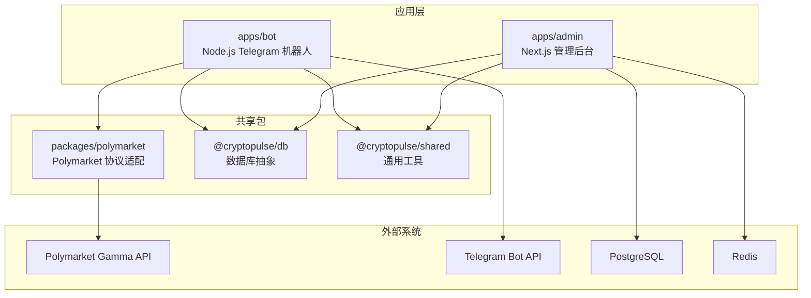
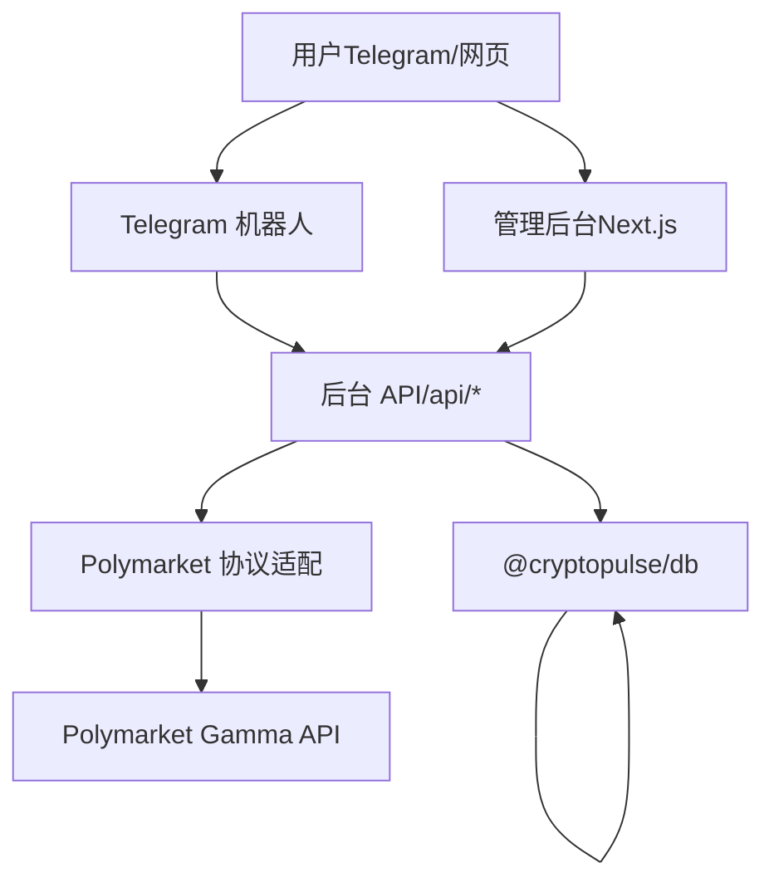
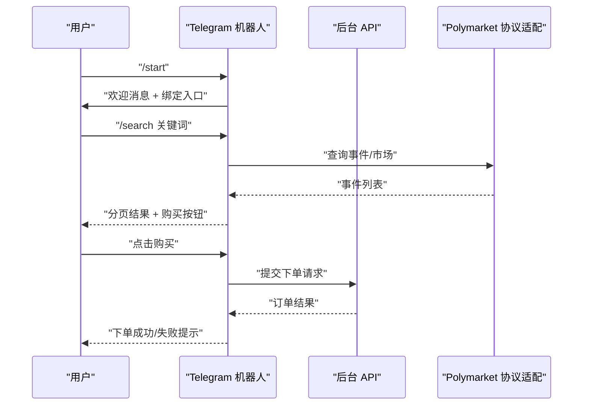
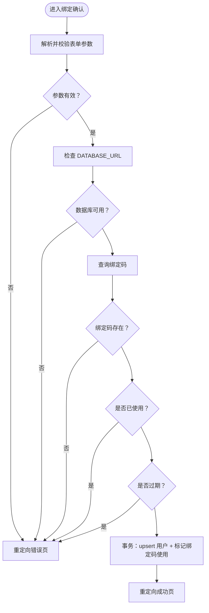
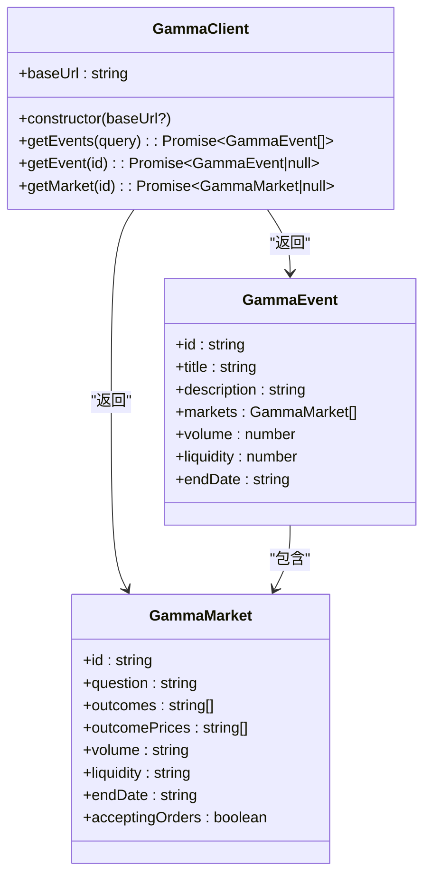
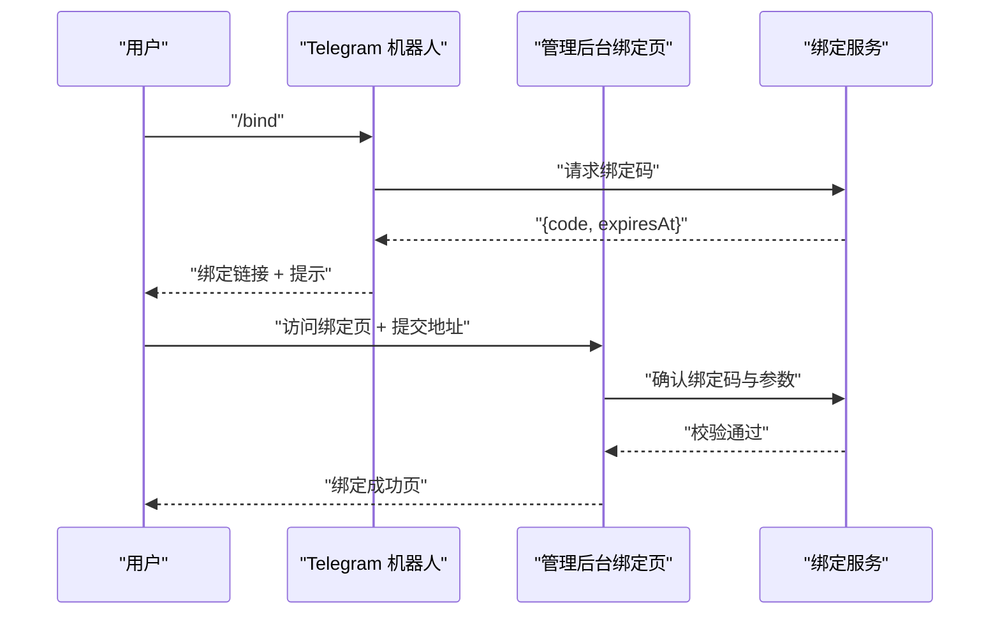
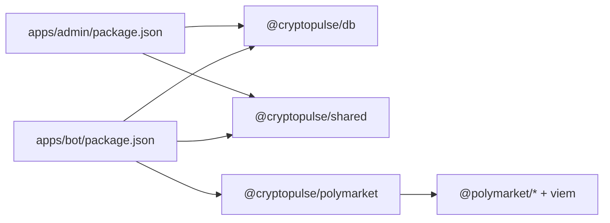

# 项目概述

<cite>
**本文档引用的文件**
- [README.md](file://README.md)
- [package.json](file://package.json)
- [apps/admin/package.json](file://apps/admin/package.json)
- [apps/bot/package.json](file://apps/bot/package.json)
- [packages/polymarket/package.json](file://packages/polymarket/package.json)
- [apps/admin/app/page.tsx](file://apps/admin/app/page.tsx)
- [apps/admin/app/admin/page.tsx](file://apps/admin/app/admin/page.tsx)
- [apps/admin/app/bind/actions.ts](file://apps/admin/app/bind/actions.ts)
- [apps/bot/src/index.ts](file://apps/bot/src/index.ts)
- [apps/bot/src/bind.ts](file://apps/bot/src/bind.ts)
- [apps/bot/src/search.ts](file://apps/bot/src/search.ts)
- [apps/bot/src/trade.ts](file://apps/bot/src/trade.ts)
- [packages/polymarket/src/index.ts](file://packages/polymarket/src/index.ts)
- [packages/polymarket/src/gamma.ts](file://packages/polymarket/src/gamma.ts)
- [specs/cryptopulse/requirements.md](file://specs/cryptopulse/requirements.md)
</cite>

## 目录
1. [引言](#引言)
2. [项目结构](#项目结构)
3. [核心组件](#核心组件)
4. [架构总览](#架构总览)
5. [详细组件分析](#详细组件分析)
6. [依赖关系分析](#依赖关系分析)
7. [性能考虑](#性能考虑)
8. [故障排除指南](#故障排除指南)
9. [结论](#结论)

## 引言
CryptoPulse 预测机器人是一个基于 Telegram 的加密货币预测市场交易入口平台，旨在为用户提供便捷的市场发现、交易下单与仓位管理能力。项目采用 Monorepo 架构，将管理后台（Next.js）与 Telegram 机器人（Node.js）统一组织，通过共享包实现跨应用的功能复用与一致性。

项目围绕以下核心目标展开：
- 提供 Polymarket 交易入口，支持搜索、浏览、下单与仓位管理
- 通过绑定流程将 Telegram 用户与 Polymarket 交易身份关联
- 保障交易归因与 Gas-Free 体验（通过 Polymarket Relayer + Safe/Proxy 钱包）
- 提供管理员后台用于推送、用户与密钥管理、统计与黑名单治理

业务价值与目标用户群体：
- 目标用户：Telegram 频道用户、预测市场交易者、需要快速入场/出场的量化与趋势交易者
- 技术优势：一体化的 Monorepo 设计、模块化的共享包、清晰的职责边界、可扩展的通知与自动化能力

## 项目结构
项目采用工作区（workspaces）组织，核心目录与职责如下：
- apps/admin：Next.js 管理后台，提供用户统计、推送配置、黑名单治理等功能
- apps/bot：Node.js Telegram 机器人，负责用户交互、市场搜索、下单与绑定流程
- packages/polymarket：Polymarket 协议适配层，封装 Gamma API 与交易相关能力
- packages/db、packages/shared：数据库与通用工具包（在当前最小实现中，绑定与交易流程已具备基础集成）
- specs/cryptopulse：需求与设计文档，定义产品范围与验收标准

图示来源
- [package.json](file://package.json#L1-L18)
- [apps/admin/package.json](file://apps/admin/package.json#L1-L42)
- [apps/bot/package.json](file://apps/bot/package.json#L1-L26)
- [packages/polymarket/package.json](file://packages/polymarket/package.json#L1-L23)

章节来源
- [package.json](file://package.json#L1-L18)
- [README.md](file://README.md#L1-L65)

## 核心组件
- 管理后台（Next.js）
  - 提供管理员登录、用户统计、推送配置与黑名单治理
  - 通过数据库查询用户数量与黑名单状态，展示概览信息
- Telegram 机器人（Node.js）
  - 支持 /start 欢迎消息、绑定入口、市场搜索与分类浏览
  - 提供下单确认与订单提交流程，调用后台 API 完成交易
- Polymarket 协议适配（packages/polymarket）
  - 封装 Gamma API，提供事件与市场查询能力
  - 暴露 Polymarket 环境配置类型，便于后续扩展交易逻辑
- 绑定流程
  - 机器人生成绑定码并提供网页绑定入口
  - 管理后台校验绑定码、过期时间与重复使用情况，完成用户身份关联

章节来源
- [apps/admin/app/admin/page.tsx](file://apps/admin/app/admin/page.tsx#L1-L47)
- [apps/admin/app/page.tsx](file://apps/admin/app/page.tsx#L1-L21)
- [apps/bot/src/index.ts](file://apps/bot/src/index.ts#L1-L156)
- [apps/bot/src/bind.ts](file://apps/bot/src/bind.ts#L1-L39)
- [apps/bot/src/search.ts](file://apps/bot/src/search.ts#L1-L233)
- [apps/bot/src/trade.ts](file://apps/bot/src/trade.ts#L1-L118)
- [packages/polymarket/src/index.ts](file://packages/polymarket/src/index.ts#L1-L11)
- [packages/polymarket/src/gamma.ts](file://packages/polymarket/src/gamma.ts#L1-L177)
- [apps/admin/app/bind/actions.ts](file://apps/admin/app/bind/actions.ts#L1-L90)

## 架构总览
系统采用“前端（管理后台）+ 机器人 + 共享协议适配 + 数据存储”的分层设计。机器人与管理后台均通过共享包访问 Polymarket 协议与数据库，保证行为一致性与可维护性。

图示来源
- [apps/bot/src/index.ts](file://apps/bot/src/index.ts#L1-L156)
- [apps/bot/src/bind.ts](file://apps/bot/src/bind.ts#L1-L39)
- [apps/bot/src/trade.ts](file://apps/bot/src/trade.ts#L1-L118)
- [apps/admin/app/bind/actions.ts](file://apps/admin/app/bind/actions.ts#L1-L90)
- [packages/polymarket/src/gamma.ts](file://packages/polymarket/src/gamma.ts#L1-L177)

## 详细组件分析

### 组件 A：Telegram 机器人（命令与交互）
- 功能要点
  - /start 欢迎消息与绑定入口（Inline Keyboard）
  - 关键词搜索与分类浏览（支持分页）
  - 市场详情展示与购买按钮
  - 下单确认与订单提交（调用后台 API）
- 控制流
  - 命令解析 → 业务处理 → 结果反馈（消息/键盘）
  - 回调查询（callbackQuery）驱动分页与购买流程
- 错误处理
  - 对 API 失败、绑定缺失、数据库不可用等情况进行降级提示

图示来源
- [apps/bot/src/index.ts](file://apps/bot/src/index.ts#L1-L156)
- [apps/bot/src/search.ts](file://apps/bot/src/search.ts#L1-L233)
- [apps/bot/src/trade.ts](file://apps/bot/src/trade.ts#L1-L118)
- [packages/polymarket/src/gamma.ts](file://packages/polymarket/src/gamma.ts#L1-L177)

章节来源
- [apps/bot/src/index.ts](file://apps/bot/src/index.ts#L1-L156)
- [apps/bot/src/search.ts](file://apps/bot/src/search.ts#L1-L233)
- [apps/bot/src/trade.ts](file://apps/bot/src/trade.ts#L1-L118)

### 组件 B：管理后台（用户统计与绑定确认）
- 功能要点
  - 登录后展示用户总数与黑名单数量
  - 绑定确认页面：校验绑定码、过期时间与重复使用
  - 事务性写入：用户信息 upsert 与绑定码标记使用
- 数据流
  - 表单提交 → 参数校验（Zod）→ 数据库事务 → 重定向成功页

图示来源
- [apps/admin/app/bind/actions.ts](file://apps/admin/app/bind/actions.ts#L1-L90)

章节来源
- [apps/admin/app/admin/page.tsx](file://apps/admin/app/admin/page.tsx#L1-L47)
- [apps/admin/app/bind/actions.ts](file://apps/admin/app/bind/actions.ts#L1-L90)

### 组件 C：Polymarket 协议适配（Gamma API）
- 功能要点
  - 事件与市场查询（支持分页、排序、过滤）
  - 类型定义：事件、市场、标签、奖励等
- 复杂度分析
  - 查询方法为 O(1) 网络请求，受上游 API 限制
  - 建议在应用层增加缓存与错误重试策略

图示来源
- [packages/polymarket/src/gamma.ts](file://packages/polymarket/src/gamma.ts#L1-L177)
- [packages/polymarket/src/index.ts](file://packages/polymarket/src/index.ts#L1-L11)

章节来源
- [packages/polymarket/src/gamma.ts](file://packages/polymarket/src/gamma.ts#L1-L177)
- [packages/polymarket/src/index.ts](file://packages/polymarket/src/index.ts#L1-L11)

### 组件 D：绑定流程（机器人 ↔ 管理后台）
- 流程说明
  - 机器人生成绑定码并提供网页绑定入口
  - 用户在绑定页输入地址信息并提交
  - 管理后台校验绑定码与有效性，完成用户身份关联
- 关键点
  - 绑定码过期时间与一次性使用
  - 服务器端严格校验与事务写入

图示来源
- [apps/bot/src/bind.ts](file://apps/bot/src/bind.ts#L1-L39)
- [apps/admin/app/bind/actions.ts](file://apps/admin/app/bind/actions.ts#L1-L90)

章节来源
- [apps/bot/src/bind.ts](file://apps/bot/src/bind.ts#L1-L39)
- [apps/admin/app/bind/actions.ts](file://apps/admin/app/bind/actions.ts#L1-L90)
- [README.md](file://README.md#L59-L65)

## 依赖关系分析
- 应用间依赖
  - apps/admin 依赖 @cryptopulse/db 与 @cryptopulse/shared
  - apps/bot 依赖 @cryptopulse/polymarket、@cryptopulse/db、@cryptopulse/shared
  - packages/polymarket 依赖 @polymarket/* 与 viem
- 工作区脚本
  - 通过 workspaces 统一管理开发与构建脚本，支持并行任务

图示来源
- [apps/admin/package.json](file://apps/admin/package.json#L1-L42)
- [apps/bot/package.json](file://apps/bot/package.json#L1-L26)
- [packages/polymarket/package.json](file://packages/polymarket/package.json#L1-L23)

章节来源
- [apps/admin/package.json](file://apps/admin/package.json#L1-L42)
- [apps/bot/package.json](file://apps/bot/package.json#L1-L26)
- [packages/polymarket/package.json](file://packages/polymarket/package.json#L1-L23)
- [package.json](file://package.json#L1-L18)

## 性能考虑
- 响应时间目标
  - 搜索首屏：1 秒内（可通过缓存与预取优化）
  - 下单确认反馈：3 秒内（实际成交异步回执）
- 限流与退避
  - 检测上游限流时自动退避重试，并对用户友好提示
- 缓存与并发
  - 对 Gamma API 结果进行短期缓存，减少重复请求
  - 并发控制与队列化处理，避免瞬时峰值

## 故障排除指南
- 绑定失败
  - 检查绑定码是否过期或已被使用
  - 确认 DATABASE_URL 是否正确配置
  - 查看管理后台绑定页的错误参数提示
- 交易失败
  - 确认用户已完成绑定且拥有 Polymarket 地址
  - 检查 BOT_API_TOKEN 与 API_BASE_URL 配置
  - 观察后台 API 返回的错误信息并重试
- 数据库问题
  - 确认 Prisma 引擎可用与迁移已部署
  - 检查连接字符串与网络可达性

章节来源
- [apps/admin/app/bind/actions.ts](file://apps/admin/app/bind/actions.ts#L1-L90)
- [apps/bot/src/trade.ts](file://apps/bot/src/trade.ts#L1-L118)
- [README.md](file://README.md#L20-L40)

## 结论
CryptoPulse 预测机器人通过 Monorepo 架构实现了管理后台与 Telegram 机器人的高效协同，结合 Polymarket 协议适配与清晰的绑定流程，为用户提供了从市场发现到交易下单的一体化体验。项目在可扩展性、可维护性与用户体验方面具备良好基础，适合进一步扩展复制交易、AI 辅助与多语言支持等高级特性。