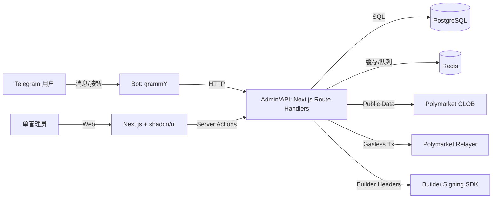

# 技术方案设计

## 目标

- 一套可快速上线、可扩展的现代化架构，覆盖 Telegram Bot、管理员后台、Web Dashboard、通知与自动化、复制交易与 AI 助手。
- 交易侧满足：CLOB 下单 + Builder Attribution Headers + Relayer gas-free（Safe/Proxy）路径。
- 单管理员模型：用环境变量口令/令牌保护管理入口与高权限 API。

## 技术栈与选型

- **语言/运行时**：TypeScript（Node.js）
- **Bot**：grammY（Telegram Bot API）
- **后台/仪表盘**：Next.js（App Router）+ shadcn/ui + Tailwind CSS
- **服务端 API**：Next.js Route Handlers（内部服务 API）+ Server Actions（后台操作）
- **数据库**：PostgreSQL（业务数据）
- **缓存/队列**：Redis（行情缓存、定时任务、告警与复制交易队列）
- **ORM**：Prisma
- **监控**：Sentry（可选）、结构化日志（pino）
- **Polymarket SDK**：
  - `@polymarket/clob-client`（行情、订单簿、下单）
  - `@polymarket/builder-signing-sdk`（Builder Attribution Headers）
  - `@polymarket/builder-relayer-client`（gas-free onchain/钱包操作）

## 仓库结构（建议单仓多应用）

- `apps/admin`：Next.js 管理员后台 + Web Dashboard
- `apps/bot`：Telegram Bot 进程
- `packages/db`：Prisma schema 与 DB 访问封装
- `packages/polymarket`：CLOB/Relayer/Attribution 统一封装
- `packages/shared`：类型、校验、通用工具、消息模板（中英双语）

## 核心数据流

## 身份与绑定设计

### 用户侧（Telegram）

- 主键：`telegram_id`
- 绑定记录：`polymarket_address`（EOA）、`safe_address`（可选）、`funder_address`（Safe/Proxy funder，可选）
- 绑定方式（实现路径，按优先级）：
  1. 嵌入式钱包优先：Privy + Safe 或 Magic Link + Safe（优先复用官方 Telegram 示例），尽量实现“点一下完成绑定”的体验。
  2. 兜底方案：Bot 生成一次性 `bind_code`（短有效期）→ 用户打开 Web 绑定页 → 钱包签名绑定消息（包含 bind_code 与过期时间）→ 服务端验证签名并写入绑定信息。

该设计避免把用户私钥/助记词暴露给服务端，并能在无 Privy 的情况下先跑通闭环；后续可在不改 DB 的情况下接入 Privy/MagicLink + Safe。

### 管理员（单管理员）

- 使用一个环境变量 `ADMIN_TOKEN` 作为后台登录口令或 API Bearer Token。
- 后台页面采用中间件拦截 + 服务端校验。
- 所有高权限接口（密钥签名、黑名单、全量推送、配置修改）都要求 `ADMIN_TOKEN`。

## Polymarket 集成设计

### CLOB Client（行情/交易）

- 统一在 `packages/polymarket` 内创建客户端工厂：
  - public client：仅行情、市场列表、订单簿
  - trading client：需要用户 signer + 用户 API creds + signatureType（Safe/Proxy）+ funderAddress
  - builder attribution：在 trading client 初始化时传入 `BuilderConfig`（remote signing 或 local creds）

### Builder Attribution Headers（归因）

方案选型：**remote signing（推荐）**

- Next.js 提供一个内部签名端点 `POST /api/polymarket/sign`
- 端点只在服务端运行，通过 `BuilderConfig(remoteBuilderConfig)` 为 CLOB/Relayer 提供签名能力
- 端点使用 `SIGNING_TOKEN` 鉴权（由服务端调用，不暴露给浏览器与 Bot 用户）

### Relayer（gas-free）

- 通过 `@polymarket/builder-relayer-client` 统一封装：
  - Safe/Proxy 交易类型可配置（默认 Safe）
  - Onchain 操作（approve、split/merge/redeem、钱包部署/检查）走 relayer
- 交易执行路径：
  - 下单（CLOB）需要 builder attribution headers
  - onchain 操作（approve、CTF 操作、钱包相关）走 relayer
  - 首次交易需要显式处理 Safe/Proxy 钱包准备：下单前检查 `safe_address`，缺失则先通过 relayer 部署/初始化并给出进度回执

## 实时数据（WebSocket 优先）

- 在 `packages/polymarket` 提供订阅模块，优先使用官方 CLOB WebSocket 订阅（市场详情、订单簿、价格与订单状态等）。
- 订阅模块需包含断线重连、指数退避与心跳/超时处理，避免长连接抖动导致详情页“卡死”。
- 在 WebSocket 不可用或降级时，使用可配置的轮询 + Redis 缓存。

## 业务功能模块映射

- 绑定：`users` + `auth_bind_codes`
- 市场发现：CLOB public endpoints + Redis 缓存（关键词与分类）
- 市场详情：订单簿 + 价格 + 统计（WebSocket 订阅优先，降级轮询；Redis 做缓存与合并）
- 下单：orders + trades（写库）+ attribution 验证任务（队列）
- 仓位/订单：从 CLOB/链上聚合 + 本地缓存表（positions_cache）
- 通知：alerts（价格/成交/结算）+ cron worker
- 推送：admin_push_jobs + bot 广播
- 复制交易：copy_trade_configs + copy_trade_jobs（队列执行；事件来源优先从管理员后台手动发布复制信号，后续再扩展轮询/分析等自动触发）
- AI 助手：ai_requests + ai_outputs（可插拔 Provider，默认可先做模板化摘要）
- 双语：消息模板与 UI 文案 i18n

## 数据库设计（Prisma 概览）

最小表集合（字段按实现细化）：

- `User`：telegramId、language、polymarketAddress、safeAddress、createdAt、updatedAt、isBanned
- `BindCode`：code、telegramId、expiresAt、usedAt
- `Alert`：telegramId、type、condition、isActive、createdAt
- `PushJob`：createdBy、payload、status、createdAt、sentAt
- `Order`：telegramId、marketId、tokenId、side、price、size、status、txHash、createdAt
- `TradeAttributionCheck`：orderId、status、detail、checkedAt
- `PositionCache`：telegramId、marketId、outcome、size、avgPrice、pnl、updatedAt
- `CopyTradeConfig`：telegramId、leaderType、leaderRef、ratio、maxNotional、status
- `CopyTradeEvent`：configId、source、payload、status、createdAt
- `AiOutput`：telegramId、marketId、prompt、output、createdAt

## API 设计（内部）

- Bot → API（Bearer: `BOT_API_TOKEN`）
  - `POST /api/bot/bind-code` 生成绑定码
  - `GET /api/markets/search?q=...`
  - `GET /api/markets/:id`
  - `POST /api/orders` 下单（市价/限价）
  - `GET /api/portfolio` 仓位/订单
  - `POST /api/ctf/split|merge|redeem`
  - `POST /api/alerts` 创建/更新提醒

- Admin UI → Server Actions（后台操作）
  - 配置（仅保存非敏感配置；敏感只通过环境变量）
  - 推送创建、黑名单管理、统计查询、归因成功率与失败明细

- Signing（仅服务端）
  - `POST /api/polymarket/sign`（Bearer: `SIGNING_TOKEN`）

## 安全性

- Builder Key/Secret/Passphrase 只通过环境变量提供，不写入 DB，不出现在前端 bundle，不写日志。
- Bot Token、DB、Redis、Signing Token、Admin Token 统一使用环境变量。
- 对外接口分级鉴权：Bot API Token、Admin Token、Signing Token 各自隔离。
- 输入校验：所有 API 统一用 schema 校验（zod）。
- 速率限制：对 CLOB/Relayer 调用实现退避重试；对 Bot 用户操作进行节流（Redis）。
- Unverified 阶段对 relayer/交易次数受限：对用户下单与后台批量任务提供友好提示，并支持快速切换到 Verified 配置。

## 测试策略

- 单元测试：核心服务层（下单参数校验、消息模板、风控规则、copy trade 规则）。
- 集成测试：API 路由（mock Polymarket 客户端）。
- E2E（可选）：后台主要路径（登录、推送、黑名单、统计）。
- E2E（Bot，可选）：基于测试群进行端到端流程测试（绑定→下单→回执→归因验证）。

## 部署方案（Docker）

- `docker-compose`：Postgres + Redis + apps（admin + bot）
- 生产环境：支持 Railway/Render/阿里云；Next.js 与 Bot 分容器部署；共享同一 DB/Redis。

